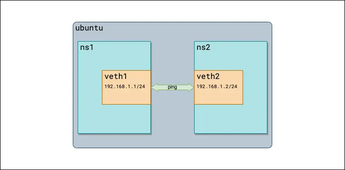

## K8s Component Overview

| Component          | Networking 관점에서 볼 것                          |
| ------------------ | -------------------------------------------- |
| API Server         | 네트워크 설정/상태의 API endpoint                     |
| Scheduler          | Pod가 어느 Node에 배치될지 결정                        |
| Controller Manager | desired state 유지                             |
| Kubelet            | **Pod 생성 과정에서 CNI를 호출하는 주체**                 |
| Container Runtime  | container/pod sandbox 생성                     |
| kube-proxy         | Service → Pod traffic에 필요한 datapath rule 구성  |
| CNI                | **Pod network interface / IP / route 등을 구성** |


**Container가 host와 다른 IP를 가지고 통신할 수 있는 이유는?** 
=> 별도의 network namespace가 있기 때문
=> 그럼 Network namespace가 뭐냐


## Network Namespace

- Network Namespace란?
-> Linux Network Namespace(netns)는 프로세스가 사용하는 네트워크 환경을 격리하는 Linux 기능

Network Namespace가 분리되면 각 namespace는 독립적인 네트워크 리소스를 가지게 됨.
=> 같은 Linux host에서 실행되는 프로세스라도 서로 다른 Network Namespace에 있다면 서로 다른 네트워크 환경을 사용하는 것처럼 동작 가능

왜 CNI를 공부하기 위해 필요한가?
```
CNI는 Pod에 네트워크를 연결하기 위해 Pod의 Network Namespace에 interface, IP, route 등을 구성한다.
따라서 Network Namespace가 무엇이고 무엇이 격리되는지를 이해해야 CNI가 어떤 작업을 수행하는지 이해할 수 있다.
```

- namespace마다 무엇이 독립되는가?
    - interface : ns마다 서로 다른 interface 가질 수 있음.
    -> 이름이 같아도(e.g. eth0) 서로 다른 Netns에 존재하는 별개의 interface.
    - IP address : 각 ns에 독립적으로 ip 할당
    - routing table : ns마다 별도의 routing table
    -> 그래서 같은 destination에 대해서도 ns에 따라 어떤 interface를 통해 packet을 보낼지가 달라질 수 있음
    - iptables/netfilter state 일부

```
Pod 생성
   ↓
Pod Network Namespace 생성
   ↓
CNI
   ├── interface 생성
   ├── IP 할당
   └── route 설정
```
"Pod에 IP를 붙인다"는 말은 단순히 Kubernetes 객체에 IP 주소 문자열을 넣는 것이 아니라, 실제 Linux Network Namespace의 networking configuration을 구성하는 과정 

- process와 network namespace 관계
: 프로세스는 특정 Network Namespace에 속하고, 그 프로세스가 사용하는 network interface, routing table 등의 네트워크 리소스는 해당 namespace의 것을 사용

=> 따라서 container 안의 process는 host의 eth0를 직접 사용하는 것이 아니라 자신이 속한 Network Namespace의 interface를 사용


```
Pod
 └── Container Process
          │
          ▼
    Pod Network Namespace
          │
         eth0
```
CNI는 이 Pod Network Namespace에 network interface와 IP configuration을 만들어주게 됨


- host network namespace와 container/pod network namespace

CNI 공부에서는 그냥 Host = Kubernetes Node라고 생각해도 큰 문제는 없지만, 조금 더 정확히는
Host Network Namespace = 해당 Kubernetes Node의 기본 Linux Network Namespace

    - Host Network Namespace → Node의 기본 Linux network namespace
    - Pod Network Namespace → Pod이 사용하는 별도의 network namespace
그런데 왜 굳이 둘로 나누나?
-> Node와 Pod이 서로 다른 network environment를 가지게 하기 위해서
-> 둘은 서로 다른 namespace이기 때문에 **같은 Node 안에 있어도 서로 다른 eth0**를 가지고 있다고 하면, CNI가 이 둘을 연결해준다...

왜 연결해 줘야 되는거지?? 둘을 연결해 줌으로써 외부 트래픽과 cluster inside traffic을 연결해서 cluster inside의 traffic 관리를 cni가 맡고,
각 interface routing 연결을 잘 해주기 위해서...?

-> CNI가 Host와 Pod를 연결해주는 이유는 Pod가 외부와 통신할 수 있도록 Pod의 network namespace를 Node의 네트워크 datapath에 편입시키기 위해서

Pod의 eth0와 Host의 eth0는 서로 다른 interface고, Pod의 routing table도 Host의 routing table과 다른데, 
이렇게만 만들어 놓으면 Pod 입장에서는 Node의 네트워크나 다른 Pod, 외부 네트워크로 packet을 보낼 경로가 없는 것과 마찬가지다
그래서 CNI가 연결을 만들어줌
어떻게?
Pod ns 와 Host ns 사이에 network link를 만들어서
==>>> 그거의 대표적인 방법이 veth pair임


## veth Pair?
"Pod Network Namespace를 어떻게 Node의 networking과 연결할 것인가?"
=> veth pair
=> Virtual Ethernet Device
veth는 항상 pair로 생성되며, 한쪽 interface로 들어간 packet은 다른 쪽 interface로 전달
물리적인 Ethernet cable과 비슷한 역할을 하는 virtual network cable이라고 생각하면 이해하기 쉽다.


왜 CNI를 공부하기 위해 필요한가?
```
일반적인 Kubernetes Pod networking에서 Pod의 eth0는 veth pair를 통해 Host Network Namespace와 연결된다.
CNI가 Pod와 Node를 연결하는 기본적인 방법을 이해하기 위해 veth의 동작 원리를 알아야 한다.
```

```
Host Network Namespace
       │
   veth-host
       │
       │
       │ veth pair
       │
       │
    veth-pod
       │
Pod Network Namespace
```
두 interface는 하나의 pair로 동작하며, 한쪽 interface로 전송된 packet은 다른 쪽 interface에서 수신된다

특징 : 각 끝을 서로 다른 Network Namespace에 배치할 수 있다는 것
Linux 공식 문서에서도 veth의 대표적인 사용 사례로 서로 다른 network namespace 간 통신을 제시함


각 namespace는 원래 서로 독립된 network stack을 가지고 있지만, veth pair를 연결함으로써 두 namespace 사이에 network path가 생긴다.

=> 이 구조 덕분에

일반적인 container networking에서는 veth pair의 한쪽을 **Pod Network Namespace에 배치하고, 다른 한쪽을 Host Network Namespace에 배치**할 수 있다.
=> 여기서 중요한 점은 Pod의 eth0 자체가 Host의 eth0와 연결되는 것이 아니라, Pod namespace의 interface와 Host namespace의 interface가 veth pair를 통해 연결된다는 것... 
=> 그러면 veth pair 같은 방식 없으면 연결 못하나?
==>> 유일한 방법은 아니긴 한데, 독립되어있는 net ns를 연결하려면 이런 방식이 필요한거임.
===>>> 그러면 왜 veth를 주로 쓰나? 다른 연결 방법은 뭐가 있나?

| 방법              | 핵심 역할                                  | 일반적인 Pod networking에서 |
| --------------- | -------------------------------------- | --------------------- |
| **veth pair**   | Namespace ↔ Host 연결                    | ⭐⭐⭐⭐⭐ 매우 흔함           |
| **macvlan**     | 하나의 NIC에서 여러 virtual interface 생성      | 특정 환경에서 사용            |
| **ipvlan**      | 하나의 NIC를 공유하면서 여러 virtual interface 제공 | 특정 환경에서 사용            |
| **SR-IOV**      | NIC의 VF를 Pod에 직접 할당                    | 고성능/5G CNF 등          |
| **hostNetwork** | Namespace 분리 자체를 하지 않음                 | 특수한 경우                |
| **tap/tun**     | virtual L2/L3 interface 제공             | 일반적인 Pod 연결 방식은 아님    |

이게 네트워크를 구성하는 방식에 따라 다름.
macvlan과 SR-IOV는 더 깊이 파보고 싶으니 추후에...

Ref for veth pair : https://medium.com/@amazingandyyy/introduction-to-network-namespaces-and-virtual-ethernet-veth-devices-304e0c02d084


