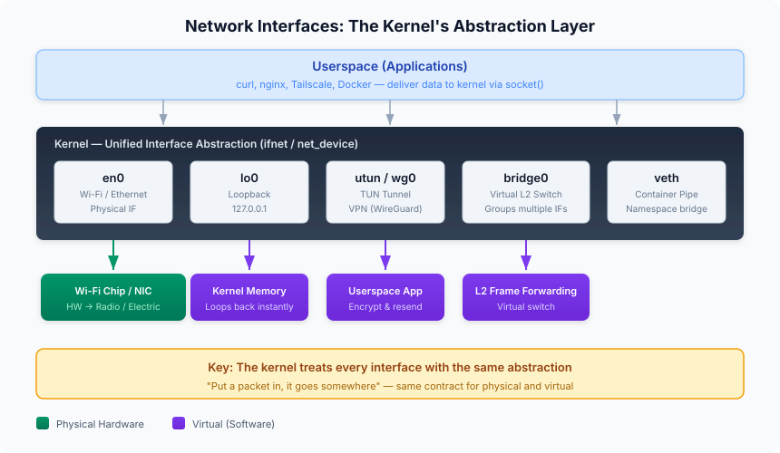
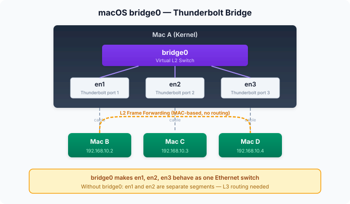
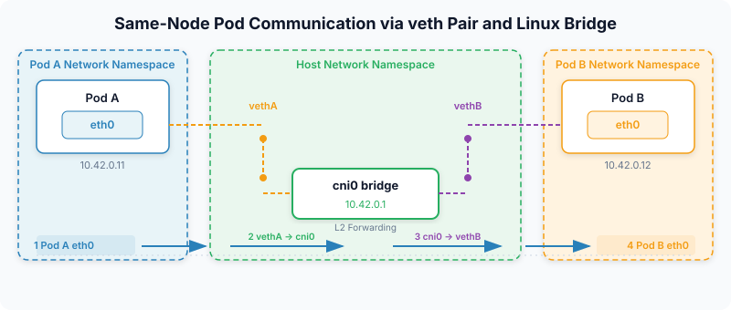
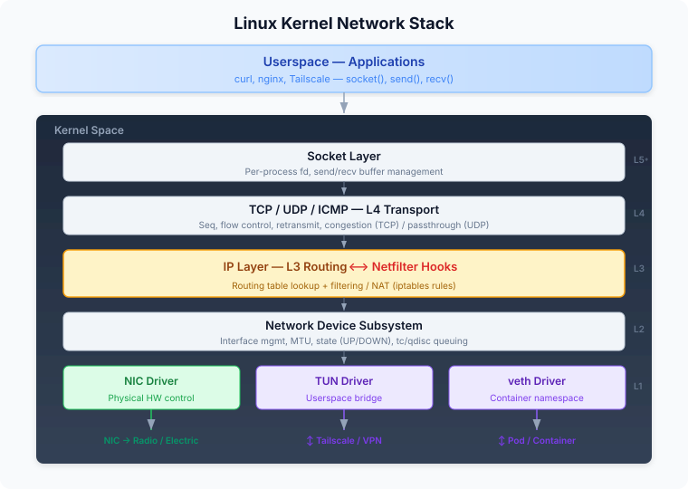
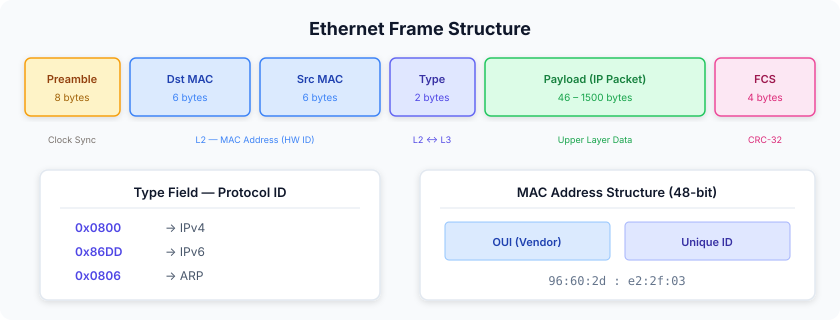
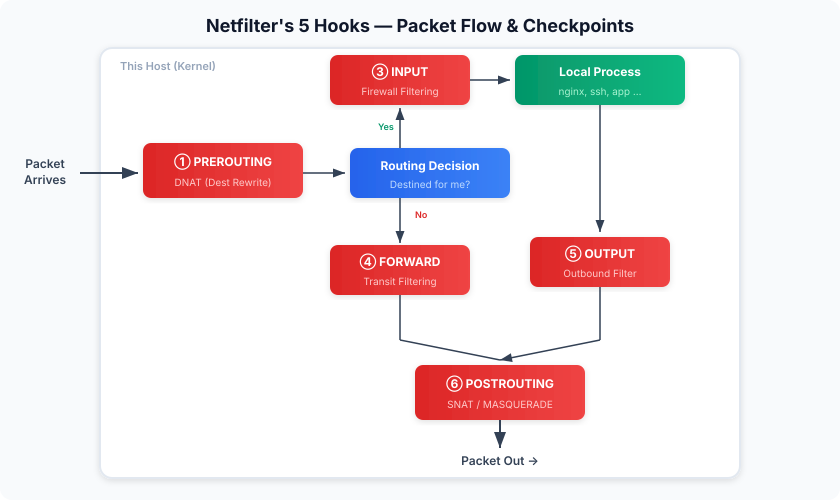
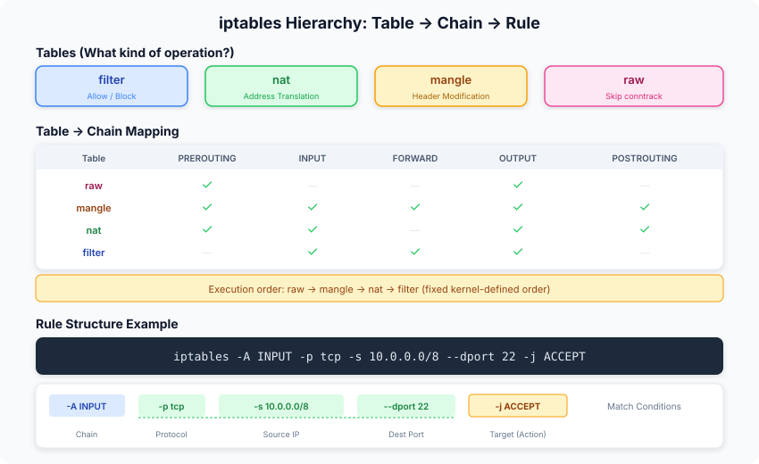

# Week 1. Kubernetes & Linux Networking Overview

`kubectl get pod -o wide`를 치면 Pod마다 IP가 하나씩 찍힌다. 그런데 그 IP는 정확히 **어디에** 붙어 있는 걸까. 노드에서 `ip addr`을 쳐봐도 그 주소는 보이지 않는다. etcd에 저장된 문자열일 뿐이라면 통신이 될 리가 없는데, 실제로 Pod끼리는 그 주소로 잘 통신한다.

이번 주의 목표는 이 질문에 답하는 것이다. Pod IP가 실체를 갖는 자리가 Linux 커널 어디인지, 그리고 그 자리에서 출발한 패킷이 옆 Pod까지 도달하기 위해 어떤 커널 기능들을 차례로 거치는지를 따라간다.

CNI 구현체나 Service, 오버레이 네트워크는 Week 2 이후의 주제다. 여기서는 **그 아래에 깔려 있는 Linux 기능**만 본다.

---

## 컴포넌트 — 네트워크는 누가 만드는가

쿠버네티스 컴포넌트를 네트워크 관점으로만 보면, 역할이 두 부류로 갈린다. **어디에 둘지 결정하는 쪽**과 **실제로 연결하는 쪽**이다.

| 컴포넌트 | 네트워크에서 맡는 일 | 부류 |
|---|---|---|
| API Server | 네트워크 관련 오브젝트의 단일 입출구 | 결정 |
| Scheduler | Pod가 어느 노드에 뜰지 확정 | 결정 |
| Controller Manager | 선언한 상태와 현재 상태의 차이를 메움 | 결정 |
| Kubelet | 노드 위에서 Pod 생성을 지휘, 네트워크는 위임 | 연결 |
| Container Runtime | sandbox를 만들어 격리 환경을 확보 | 연결 |
| CNI | 인터페이스·IP·라우트를 실제로 구성 | 연결 |
| kube-proxy | Service 트래픽용 datapath 규칙을 노드에 배치 | 연결 |

여기서 눈여겨볼 지점은 **kubelet이 네트워크를 직접 만들지 않는다**는 것이다. kubelet은 런타임에게 sandbox를 요청하고, 네트워크 구성은 CNI 플러그인에게 넘긴다. 쿠버네티스가 네트워크 구현을 자기 안에 두지 않고 외부 규격에 맡겼다는 뜻이고, 그래서 Flannel을 쓰든 Cilium을 쓰든 위쪽 컴포넌트는 바뀌지 않는다.

그렇다면 그 CNI는 무엇을 만들길래 컨테이너가 노드와 다른 IP를 가질 수 있는가. 출발점은 **네트워크 네임스페이스**(Network Namespace)다.

---

## Network Namespace — Pod IP가 실제로 존재하는 곳

컨테이너가 호스트와 다른 IP를 쓸 수 있는 이유는 단순하다. 애초에 **다른 네트워크 환경을 보고 있기 때문**이다.

네트워크 네임스페이스는 프로세스가 사용하는 네트워크 환경을 통째로 격리하는 커널 기능이다. 같은 호스트에서 도는 프로세스라도 소속 네임스페이스가 다르면 서로 다른 머신에 있는 것처럼 동작한다.

무엇이 격리되는지를 정리하면 이렇다.

| 격리되는 것 | 의미 |
|---|---|
| 인터페이스 | 이름이 같아도 별개다. Pod의 `eth0`와 노드의 `eth0`는 완전히 다른 장치 |
| IP 주소 | 네임스페이스마다 독립적으로 할당 |
| 라우팅 테이블 | 같은 목적지라도 어느 인터페이스로 나갈지가 달라짐 |
| iptables 규칙 | 네임스페이스별로 별도의 룰셋과 conntrack 테이블 |
| 소켓/포트 공간 | 서로 다른 네임스페이스면 같은 포트를 동시에 열 수 있음 |

앞의 질문에 대한 답이 여기서 나온다. "Pod에 IP를 붙인다"는 말은 오브젝트 필드에 문자열을 채우는 일이 아니라, **Pod 전용 네트워크 네임스페이스 안에 인터페이스를 만들고 거기에 주소와 경로를 설정하는 일**이다. 노드에서 `ip addr`에 Pod IP가 안 보이는 이유도 같다. 그 주소는 다른 네임스페이스에 있다.

프로세스는 자기가 속한 네임스페이스의 자원만 쓴다. 컨테이너 안의 프로세스가 노드의 물리 NIC를 직접 건드리지 못하는 것도 권한 문제가 아니라 **애초에 그 인터페이스가 보이지 않기 때문**이다.

### 네임스페이스는 pause 컨테이너가 붙잡고 있다

Pod 하나에 컨테이너가 여러 개여도 네트워크 네임스페이스는 하나다. 런타임이 **pause 컨테이너**를 먼저 띄워 네임스페이스를 확보하고, 애플리케이션 컨테이너들이 거기에 합류하는 구조다.

이 구조에서 두 가지가 따라온다. 애플리케이션 컨테이너가 재시작해도 네임스페이스는 pause가 붙들고 있으므로 **Pod IP가 유지된다.** 그리고 같은 Pod 안의 컨테이너끼리 `localhost`로 통신되는 건 같은 loopback을 공유하기 때문이다.

### 노드의 네임스페이스와 Pod의 네임스페이스

정확히 말하면 호스트 네트워크 네임스페이스는 해당 노드의 기본 네임스페이스다. Pod는 그것과 별개인 자기 네임스페이스를 갖는다.

문제는 격리가 성공한 직후의 상태다. Pod에는 인터페이스도 있고 IP도 있지만, **바깥으로 나가는 길이 하나도 없다.** 라우팅 테이블도 노드의 것과 별개라 어디로 보내야 할지조차 모른다. 격리만 해두면 Pod는 완벽하게 고립된 섬이 된다.

그래서 CNI가 하는 다음 일은 이 섬을 노드의 네트워크 경로에 다시 편입시키는 것이다. 서로 다른 네임스페이스 사이에 링크를 놓아야 하는데, 그 대표적인 수단이 **veth**다.

---

## veth — 격리한 것을 다시 잇는 가상 케이블

네임스페이스를 나눴으니 이제 이어야 한다. 그런데 서로 다른 네임스페이스는 커널 안에서 완전히 분리된 스택이라, 한쪽에서 다른 쪽으로 프레임을 보낼 통로를 따로 만들어줘야 한다.

이게 가능한 이유는 커널이 말하는 "인터페이스"가 물리 하드웨어를 전제하지 않기 때문이다. 커널 입장에서 물리 NIC든 loopback이든 터널이든, **패킷을 넣으면 어딘가로 나간다**는 동일한 계약을 지키면 전부 같은 인터페이스다.



**veth**(Virtual Ethernet Device)는 이 추상화를 이용해 만든 가상 랜선이다. 항상 두 개가 한 쌍으로 생성되고, 한쪽에 넣은 패킷이 반대쪽에서 그대로 나온다. 물리 케이블의 양 끝을 생각하면 된다.

veth의 결정적인 성질은 **양 끝을 서로 다른 네임스페이스에 둘 수 있다**는 것이다. 한쪽 끝은 Pod 네임스페이스 안에 두고 `eth0`라는 이름을 붙이고, 다른 쪽 끝은 호스트 네임스페이스에 남겨둔다. 이 순간 고립돼 있던 두 스택 사이에 경로가 생긴다.

여기서 혼동하기 쉬운 지점이 있다. 연결되는 건 **Pod의 `eth0`와 노드의 `eth0`가 아니다.** Pod 네임스페이스에 있는 veth 한쪽 끝과, 호스트 네임스페이스에 남은 veth 다른 쪽 끝이 짝을 이룰 뿐이다. 노드의 물리 NIC까지 가려면 호스트 쪽에서 라우팅을 한 번 더 거쳐야 한다.

Pod와 노드를 잇는 방법이 veth뿐인 건 아니다. macvlan이나 SR-IOV처럼 물리 NIC를 직접 나눠 쓰는 방식도 있다. 그럼에도 veth가 사실상 기본값이 된 데는 이유가 있다.

- 물리 NIC의 종류나 드라이버에 의존하지 않는다. 클라우드든 베어메탈이든 똑같이 동작한다
- 한쪽 끝이 호스트 네임스페이스에 남으므로, **노드의 라우팅·iptables·tc를 그대로 태울 수 있다.** NetworkPolicy나 트래픽 제어가 걸릴 지점이 자연스럽게 생긴다
- 물리 NIC를 공유하는 방식은 컨테이너와 호스트 사이의 통신에 제약이 생기는 경우가 있다

물리 NIC를 직접 나눠 쓰는 방식들은 Week 6에서 따로 다룬다.

---

## Bridge — 케이블을 여러 개 꽂을 스위치

veth 한 쌍으로 Pod 하나를 노드에 연결했다. 그런데 노드에 Pod가 스무 개면 veth도 스무 쌍이 되고, 호스트 네임스페이스에는 veth 끝이 스무 개 떠 있게 된다. **이것들끼리는 아무 관계가 없다.** 케이블만 스무 개 꽂혀 있고 정작 꽂을 스위치가 없는 상태다.

**브릿지**(Bridge)가 그 스위치다. 여러 인터페이스를 하나의 L2 브로드캐스트 도메인으로 묶는 커널 안의 소프트웨어 스위치로, 장비 없이 커널이 같은 일을 한다.

컨테이너와 무관한 개념이라는 걸 보여주는 예가 macOS의 `bridge0`다. Thunderbolt 포트 `en1`, `en2`, `en3`을 하나로 묶으면 거기 연결된 Mac들이 같은 이더넷 스위치에 꽂힌 것처럼 동작한다.



쿠버네티스에서 벌어지는 일도 규모만 다를 뿐 똑같다. Flannel 같은 브릿지 계열 CNI는 노드마다 `cni0` 브릿지를 만들고 그 노드의 모든 veth 호스트쪽 끝을 여기에 꽂는다.

브릿지가 하는 일은 실제 스위치와 같다. 어느 포트로 어떤 출발지 MAC이 들어왔는지 학습해서 **FDB**(Forwarding Database)에 적어두고, 목적지 MAC이 테이블에 있으면 해당 포트로만 보낸다. 모르면 들어온 포트를 뺀 전체로 뿌린다.

한 가지 더 있다. `cni0`에는 보통 `10.42.0.1/24` 같은 IP가 붙어 있는데, 이건 브릿지가 단순 L2 스위치를 넘어 **Pod들의 기본 게이트웨이 역할**까지 하기 때문이다. 목적지에 따라 처리가 갈린다.

- 같은 노드의 Pod로 갈 때는 게이트웨이를 거치지 않고 L2로 바로 전달된다
- 그 외 목적지는 Pod의 default route가 `10.42.0.1`을 가리키므로, 프레임이 브릿지에 도착한 뒤 **호스트의 L3 스택으로 올라간다.** 노드의 라우팅과 netfilter가 개입하는 시작점이다



모든 CNI가 브릿지를 쓰지는 않는다. Calico는 브릿지 없이 veth마다 호스트 라우트를 만들어 L3로 처리하고, Cilium은 eBPF로 목적지 veth에 직접 넘긴다. 이 차이는 Week 3~5의 주제다.

---

## 커널 네트워크 스택 — 패킷이 내려가는 층

여기까지가 인터페이스를 어떻게 배치하고 잇는가의 이야기였다면, 이제 그 인터페이스로 나가기까지 패킷이 커널 안에서 무엇을 거치는지를 볼 차례다.

애플리케이션은 NIC를 직접 만질 수 없다. 하드웨어는 커널만 제어할 수 있고, 여러 앱이 동시에 네트워크를 쓰므로 누군가 중재해야 한다. 그래서 앱은 소켓으로 커널에 데이터를 넘기고, 커널이 층을 내려가며 헤더를 붙여 NIC까지 보낸다.



층마다 데이터를 부르는 이름이 다르다.

| 계층 | 단위 | 붙는 헤더 |
|---|---|---|
| L4 Transport | 세그먼트(Segment) | TCP/UDP 헤더 — 포트 |
| L3 Network | 패킷(Packet) | IP 헤더 — IP 주소 |
| L2 Data Link | 프레임(Frame) | Ethernet 헤더 — MAC 주소, 그리고 FCS |



IP 패킷은 프레임의 페이로드로 들어간다. 즉 "어느 IP로 보낸다"는 정보는 페이로드 안에 봉인돼 있고, **지금 이 구간에서 물리적으로 누구에게 던질지는 프레임 헤더의 MAC이 정한다.** IP 주소만으로는 프레임 헤더를 채울 수 없다는 뜻이고, 뒤에서 ARP가 필요해지는 이유가 여기 있다.

### MTU와 MSS

**MTU**(Maximum Transmission Unit)는 L2가 한 번에 실어나를 수 있는 최대 크기로 보통 1500바이트다. TCP는 여기서 IP 헤더와 TCP 헤더를 뺀 만큼을 한 번에 보내는데 이게 **MSS**(Maximum Segment Size)이고, 표준 환경에서 1460바이트가 된다.

Pod 네트워크에서 이 숫자가 중요해지는 건 오버레이 때문이다. CNI가 터널을 쓰면 원본 패킷 바깥에 헤더가 더 붙고, 그만큼 **Pod의 `eth0` MTU가 1500보다 작게 잡힌다.** 이 값이 어긋나면 작은 패킷은 멀쩡한데 큰 패킷만 조용히 사라지는 증상이 나온다. 방식별 오버헤드 계산은 Week 4에서 다룬다.

### 스택 전체가 네임스페이스 단위로 격리된다

네임스페이스가 격리하는 건 결국 이 스택 전체다. Pod 안에서 `ip route`를 친 결과와 노드에서 친 결과가 다른 것, Pod 안에서 `iptables -L`이 비어 있는 것 모두 같은 이유다. 디버깅할 때 **지금 어느 네임스페이스에서 보고 있는가**를 놓치면 엉뚱한 결론을 내리기 쉽다.

---

## 라우팅과 ARP — "어디로"와 "누구에게"

패킷이 IP 계층에 도달하면 커널이 가장 먼저 하는 일이 라우팅 테이블 조회다. 목적지 IP를 보고 **가장 구체적으로 일치하는 경로**를 고르는데, prefix가 긴 쪽이 이기는 이 방식을 **Longest Prefix Match**(LPM)라고 한다.

| 항목 | 의미 |
|---|---|
| Destination | 목적지 네트워크, CIDR 표기 |
| Gateway (via) | 다음 홉. 직접 연결이면 비어 있음 |
| Device (dev) | 나갈 인터페이스 |
| Scope | link면 로컬 서브넷, global이면 원격 |
| Metric | 같은 목적지에 여러 경로가 있을 때의 우선순위 |

Pod 안의 라우팅 테이블을 보면 놀랄 만큼 짧다.

```bash
# Pod 안에서
$ ip route
default via 10.42.0.1 dev eth0
10.42.0.0/24 dev eth0 scope link
```

같은 노드의 Pod 대역은 게이트웨이 없이 직접 나가고, 나머지는 전부 `cni0`로 던진다. 두 줄이 전부다. **Pod는 클러스터가 몇 개 노드로 이뤄졌는지, 다른 Pod가 어디 있는지 전혀 모른다.** 판단은 전부 호스트로 넘어간다.

노드 쪽은 사정이 다르다.

```bash
# 노드에서
$ ip route
default via 192.168.1.1 dev eth0
10.42.0.0/24 dev cni0 proto kernel scope link
192.168.1.0/24 dev eth0 proto kernel scope link
```

CNI가 하는 일의 큰 축이 바로 이 테이블을 채우는 것이다. 다른 노드의 Pod 대역을 여기에 어떻게 등록하느냐가 CNI마다 갈리는 지점이고, 그게 Week 4의 오버레이와 언더레이 논의로 이어진다.

### ARP — 주소는 알지만 상대를 모른다

라우팅 테이블이 "다음 홉은 `10.42.0.1`, 나갈 곳은 `eth0`"까지 정해줬다. 그런데 프레임을 만들려면 그 다음 홉의 **MAC 주소**가 있어야 한다. IP만으로는 L2 헤더를 채울 수 없다.

**ARP**(Address Resolution Protocol)가 이 간극을 메운다. "이 IP 쓰는 사람 MAC 좀"을 브로드캐스트로 묻고 해당 호스트가 유니캐스트로 답한다. 결과는 이웃 테이블에 캐시된다.

```bash
$ ip neigh show
10.42.0.1 dev eth0 lladdr 3a:2b:1c:00:00:01 REACHABLE
```

기억해둘 점은 **MAC이 같은 L2 세그먼트 안에서만 유효하다**는 것이다. 라우터를 넘을 때마다 MAC은 다음 홉의 것으로 교체된다. IP는 끝까지 그대로고 MAC은 구간마다 갈아끼워진다.

같은 노드의 Pod끼리라면 ARP도 평범하게 돈다. Pod A가 Pod B의 MAC을 물으면 `cni0`가 뿌리고 Pod B가 답한다. 결국 **Pod 사이의 통신도 특별할 것 없는 L2 통신**이라는 얘기다.

정리하면 패킷 하나를 내보내는 데 필요한 매핑이 두 단계다.

```
목적지 IP    ──(라우팅 테이블)──▶  나갈 인터페이스 + 다음 홉 IP
다음 홉 IP   ──(ARP / neigh)───▶  MAC 주소
```

---

## Netfilter와 iptables — "보내도 되는가"

라우팅이 "어디로 보낼까"를 정했다면, **Netfilter**는 "보내도 되는가, 고쳐서 보낼까"를 정한다.

| 구분 | 라우팅 테이블 | Netfilter |
|---|---|---|
| 질문 | 어디로 보낼까 | 보내도 될까, 바꿀까 |
| 판단 근거 | 목적지 IP | 출발지·목적지 IP, 포트, 프로토콜, 연결 상태 |
| 결과 | 경로 선택 | 허용·차단·주소변환·헤더수정 |

둘은 별개 시스템이지만 얽혀 있다. Netfilter가 목적지를 바꾸면 라우팅 결과가 달라지고, 라우팅 결과에 따라 거치는 훅이 달라진다.

iptables는 커널의 Netfilter에 규칙을 등록하는 유저스페이스 도구일 뿐이다. 실제 처리는 커널이 하고, 명령을 실행한 프로세스가 끝나도 규칙은 커널에 남는다.

### 다섯 개의 훅

커널은 패킷이 들어오면 하나를 먼저 묻는다. **이 패킷의 최종 목적지가 나인가.** 답에 따라 경로가 갈리고, 훅은 그 경로 위 요소요소에 박혀 있다.



| 훅 | 위치 | 왜 하필 거기인가 |
|---|---|---|
| PREROUTING | 도착 직후, 라우팅 판단 전 | 목적지를 바꿔서 라우팅 결과에 영향을 줘야 하니까 |
| INPUT | 로컬 프로세스로 올라가기 직전 | 프로세스에 닿기 전에 막아야 하니까 |
| FORWARD | 이 호스트를 경유하는 패킷 | 남의 패킷을 무조건 통과시킬 순 없으니까 |
| OUTPUT | 로컬에서 만든 패킷이 내려온 직후 | 나가면 안 될 트래픽을 잡아야 하니까 |
| POSTROUTING | NIC로 나가기 직전 | 판단이 다 끝난 뒤에 출발지를 바꿔야 하니까 |

Pod 네트워킹에서 특히 중요한 건 **FORWARD**다. 노드는 Pod들의 패킷을 대신 전달하는 라우터 노릇을 하므로, `net.ipv4.ip_forward`가 꺼져 있으면 Pod 간 통신이 아예 성립하지 않는다.

### 테이블, 체인, 규칙

iptables는 **테이블**(Table), **체인**(Chain), **규칙**(Rule)의 3단 구조를 갖는다.



| 테이블 | 하는 일 |
|---|---|
| filter | 허용과 차단 |
| nat | 출발지·목적지 주소 변환 |
| mangle | TTL, TOS, MARK 같은 헤더 필드 수정 |
| raw | conntrack 추적에서 제외 |

한 훅에서 여러 테이블의 체인이 **raw → mangle → nat → filter** 순서로 돌고, 각 체인 안에서는 규칙을 위에서 아래로 훑다가 종료 타겟에 걸리면 거기서 끝난다.

### conntrack

nat 규칙은 **연결의 첫 패킷에만** 적용된다. 그 뒤로는 **conntrack**(연결 추적)이 같은 변환을 알아서 이어간다.

이게 없으면 주소 변환은 성립하지 않는다. 나갈 때 바꾼 주소를 들어오는 응답에서 되돌려야 하는데, 그 대응 관계를 기억하는 게 conntrack이다. 쿠버네티스 Service가 동작하는 전제도 여기에 있고, 자세한 건 Week 2에서 본다.

### iptables 규칙도 네임스페이스를 탄다

앞서 네임스페이스가 iptables와 conntrack까지 격리한다고 했다. 그래서 Pod 안에서 `iptables -L`을 쳐도 호스트 규칙은 보이지 않고, 반대로 Pod 네임스페이스 안에 심긴 규칙은 노드에서 아무리 뒤져도 안 나온다. `nsenter`로 들어가야 보인다.

---

## 하나로 이어보기

지금까지 본 조각들을 한 줄로 꿰어본다.

### 같은 노드의 Pod A → Pod B

```
Pod A eth0 ─▶ vethA ─▶ cni0 ─▶ vethB ─▶ Pod B eth0
```

1. **라우팅** — Pod A의 `10.42.0.0/24 dev eth0 scope link`에 걸린다. 게이트웨이 없이 직접 전달
2. **ARP** — Pod B의 MAC을 모르면 브릿지가 뿌리고 Pod B가 답한다. 결과는 이웃 테이블에 캐시
3. **프레임 생성** — Pod A의 `eth0`에서 프레임이 만들어져 veth 쌍을 타고 호스트 쪽 `vethA`로 나온다
4. **브릿지 포워딩** — `cni0`가 FDB를 보고 `vethB`로만 보낸다
5. **수신** — `vethB`를 통해 Pod B의 `eth0`에 도착

캡슐화도 L3 라우팅도 없다. **순수한 L2 스위칭**이고, 이번 주에 본 커널 기능만으로 전부 설명된다.

### Pod A → 외부 인터넷

```
Pod A ─▶ cni0 ─▶ [호스트 라우팅: default via 192.168.1.1] ─▶ [POSTROUTING: MASQUERADE] ─▶ eth0
```

Pod의 라우팅 테이블에서 로컬 서브넷에 걸리지 않으니 default route로 `cni0`까지 가고, 호스트에서 다시 default route를 타 물리 NIC로 향한다.

여기서 netfilter가 개입한다. 외부 인터넷은 Pod 대역으로 돌아오는 길을 모르므로, 그대로 내보내면 응답이 영영 오지 않는다. 그래서 나가는 길목에서 출발지를 **노드 IP로 바꾼다**(MASQUERADE). 정리하면 **클러스터 안에서는 NAT가 없고, 밖으로 나갈 때만 NAT가 붙는다.**

다른 노드의 Pod로 가는 경로와 Service를 거치는 경로는 이 위에 각각 터널과 DNAT이 얹히는 형태다. 각각 Week 4와 Week 2에서 다룬다.

---

## 이번 주에 확인한 것

| 쿠버네티스에서 이렇게 보이는 것 | 실제로는 Linux의 이것 |
|---|---|
| Pod가 자기 IP를 갖는다 | Network Namespace |
| Pod가 노드에 연결된다 | veth pair |
| 같은 노드의 Pod끼리 통신한다 | Linux Bridge (`cni0`) |
| Pod가 어디로 나갈지 정해진다 | 네임스페이스별 라우팅 테이블 |
| 다음 홉을 찾는다 | ARP / 이웃 테이블 |
| Pod의 패킷이 노드를 통과한다 | `ip_forward`와 netfilter FORWARD |
| Pod가 인터넷에 나간다 | nat POSTROUTING의 MASQUERADE |

결국 **쿠버네티스는 네트워크를 새로 만들지 않았다.** 커널에 이미 있던 기능들을 조합하고, 그 조합을 자동으로 수행할 규격과 컨트롤러를 얹었을 뿐이다. 그래서 CNI를 이해한다는 건 "이 구현체는 커널의 어떤 기능을 어떤 방식으로 엮었는가"를 읽어내는 일에 가깝다.

---

## 확인용 명령어

```bash
# 네임스페이스
lsns -t net                                # 시스템의 netns 목록
nsenter -t <PID> -n ip addr                # 특정 프로세스의 netns에서 확인

# veth와 브릿지
ip link show type veth
ethtool -S <veth> | grep peer_ifindex      # 짝이 되는 인터페이스 찾기
ip link show master cni0                   # cni0에 꽂힌 인터페이스
bridge fdb show br cni0                    # 브릿지 MAC 학습 테이블

# 라우팅과 ARP
ip route show
ip route get 10.42.0.12                    # 특정 목적지의 실제 경로 계산
ip neigh show

# netfilter
iptables -t nat -L -n -v
iptables -L FORWARD -n -v
conntrack -L
sysctl net.ipv4.ip_forward

# Pod 내부에서
kubectl exec <pod> -- ip addr
kubectl exec <pod> -- ip route
kubectl exec <pod> -- ip link show eth0    # MTU 확인

# 패킷 추적
tcpdump -i cni0 -nn
tcpdump -i <veth> -nn
```

---

## 남은 질문

1. Pod의 라우팅 테이블은 default route와 로컬 서브넷 두 줄뿐이다. 그렇다면 **Pod 입장에서 "다른 노드의 Pod"와 "인터넷의 서버"는 구분되지 않는 것 아닌가.** 둘 다 default route로 나가는데 실제 분기는 어느 시점에 일어나는가.
2. 브릿지는 목적지 MAC을 모르면 전체 포트로 뿌린다. **노드 하나에 Pod가 수백 개면 이 플러딩이 부담이 되지 않나.** Calico가 브릿지를 쓰지 않고 L3로 처리하는 선택이 이것과 관련이 있는가.
3. Pod 안에서 `iptables -L`은 비어 있다. 그렇다면 **Pod로 드나드는 트래픽을 통제하는 규칙은 정확히 어느 네임스페이스에 존재하는가.** 호스트의 FORWARD 체인인가.

---

## 마치며

이번 주에 확인한 건 결국 하나다. Pod IP는 오브젝트에 적힌 문자열이 아니라 **커널 안 특정 네임스페이스에 실재하는 설정**이고, Pod 통신은 네임스페이스·veth·브릿지·라우팅·ARP·netfilter라는 오래된 리눅스 기능들이 순서대로 동작한 결과라는 것이다.

가장 인상 깊었던 건 Pod의 라우팅 테이블이 두 줄뿐이라는 사실이었다. 처음엔 너무 단순해서 뭔가 빠진 줄 알았는데, 오히려 **복잡한 판단을 전부 호스트로 밀어낸 설계**라고 보는 게 맞았다. Pod는 아무것도 모른 채 게이트웨이로 던지기만 하면 되고, 그래서 CNI 구현체가 바뀌어도 Pod 안은 그대로다. 추상화가 어디서 끊기는지가 눈에 들어온 지점이었다.

다음 주에는 이 기반 위에서 kubelet과 CRI, CNI가 실제로 어떤 순서로 호출되는지, 그리고 Pod IP가 누구에 의해 결정되는지를 따라갈 예정이다.

---

## 참고 자료

- `network_namespaces(7)`, `veth(4)`, `bridge(8)` man page
- [Kubernetes — Cluster Networking](https://kubernetes.io/docs/concepts/cluster-administration/networking/)
- [Kubernetes — Network Plugins](https://kubernetes.io/docs/concepts/extend-kubernetes/compute-storage-net/network-plugins/)
- [Linux Netfilter — Packet Flow](https://www.netfilter.org/documentation/)
- 직접 정리한 글 — [OS 네트워크 내부 구조: 인터페이스부터 Netfilter까지](https://marsboy02.github.io/ko/posts/linux-network-internals/)
- 직접 정리한 글 — [쿠버네티스 네트워크의 본질: CNI, VXLAN, 그리고 Pod는 어떻게 통신하는가](https://marsboy02.github.io/ko/posts/kubernetes-cni-networking/)
