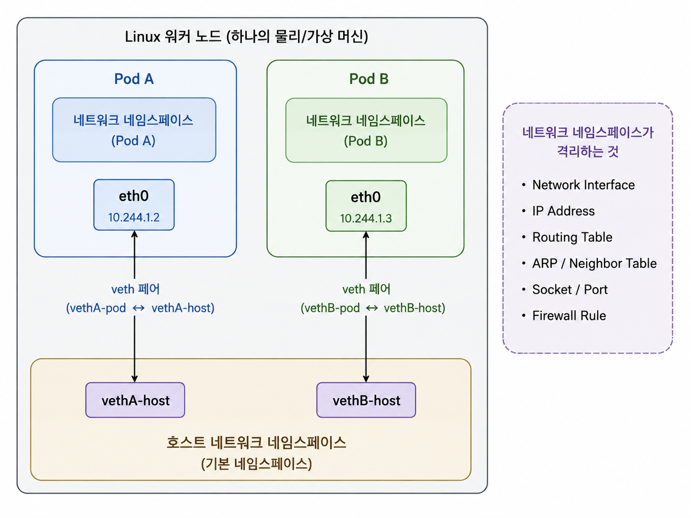
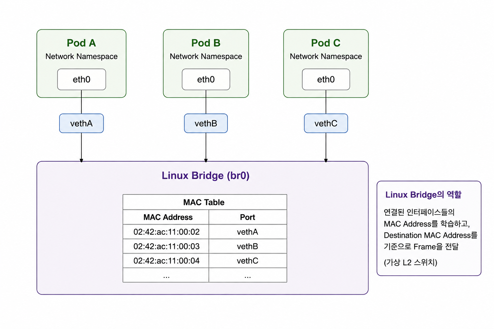
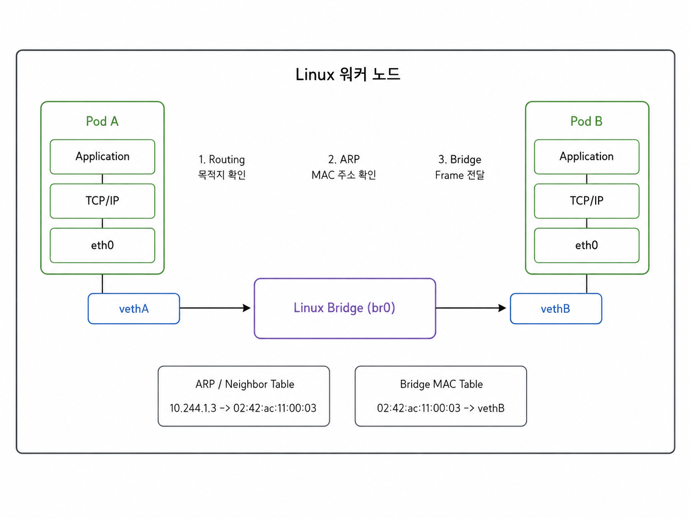

# Week 1. Kubernetes & Linux Networking Overview

## 1. 이번 주 학습 목표

Kubernetes의 기본 컴포넌트를 살펴보고, Pod 네트워크가 Linux의 어떤 네트워크 기능을 기반으로 동작하는지 이해한다.

Network Namespace, veth pair, Linux Bridge, Routing, ARP, Netfilter/iptables의 역할을 살펴보고, 최종적으로 하나의 Pod에서 발생한 패킷이 다른 Pod까지 전달되는 흐름을 연결해본다.

---

## 2. Kubernetes Component Overview

Kubernetes Cluster는 크게 **Control Plane과 Worker Node**로 구성된다.

### Control Plane Components

| Component | 역할 |
|---|---|
| `kube-apiserver` | Kubernetes API를 제공하는 중심 컴포넌트 |
| `etcd` | Cluster 상태 데이터를 저장하는 Key-Value Store |
| `kube-scheduler` | 새로 생성된 Pod를 실행할 Node 결정 |
| `kube-controller-manager` | 현재 상태가 원하는 상태와 일치하도록 Controller 실행 |

### Node Components

| Component | 역할 |
|---|---|
| `kubelet` | Node에서 Pod와 Container가 정상적으로 실행되도록 관리 |
| `kube-proxy` | Service 구현을 위한 Node Network Rule 관리 |
| `Container Runtime` | 실제 Container 실행 |

`kube-proxy`는 이름과 달리 모든 패킷을 직접 받아 중계하는 일반적인 Proxy와는 다르며, 구현 방식에 따라 Node의 Network Rule을 구성하여 Service Traffic이 Backend Pod로 전달되도록 한다.

---

## 3. Network Namespace

Network Namespace는 **하나의 Linux Kernel 안에서 독립적인 네트워크 환경을 구성할 수 있도록 네트워크 스택을 격리하는 기능**이다.

각 Network Namespace는 독립적으로 다음과 같은 네트워크 자원을 가질 수 있다.

- Network Interface
- IP Address
- Routing Table
- ARP / Neighbor Table
- localhost

따라서 하나의 Linux Host 안에서도 서로 독립된 네트워크 환경을 여러 개 만들 수 있다.

Kubernetes에서는 일반적으로 각각의 Pod가 별도의 Network Namespace를 사용하기 때문에 같은 Worker Node에서 실행되는 Pod라도 자신만의 IP, Network Interface, localhost 등을 가질 수 있다.

---

## 4. veth pair

Network Namespace는 네트워크 환경을 격리하지만 다른 Namespace나 Host Network와 자동으로 연결해주지는 않는다.

이때 서로 다른 네트워크 공간을 연결하는 방법 중 하나가 **veth pair(Virtual Ethernet Pair)**이다.

veth pair는 두 개의 가상 Network Interface가 한 쌍으로 구성되며, 한쪽 Interface로 들어간 패킷은 반대쪽 Interface로 전달된다.

일반 네트워크의 **Ethernet Cable 양 끝**과 비슷하게 생각할 수 있다.

Kubernetes Pod에서는 일반적으로 veth pair의 한쪽이 Pod의 Network Namespace에 위치하고 `eth0`으로 보이며, 반대쪽은 Host Network Namespace에 존재한다.

veth 자체는 패킷의 경로를 결정하지 않고 **두 네트워크 지점을 연결하는 통로** 역할을 한다.

---

## 5. Linux Bridge

Linux Bridge는 **Linux 내부에서 동작하는 소프트웨어 기반 L2 Switch**라고 볼 수 있다.

여러 Network Interface를 연결하고 Destination MAC Address를 기준으로 Ethernet Frame을 전달한다.

일반 네트워크와 비교하면 다음과 같이 생각할 수 있다.

| 일반 네트워크 | Linux |
|---|---|
| Ethernet Cable | veth pair |
| L2 Switch | Linux Bridge |

Linux Bridge는 일반 L2 Switch와 마찬가지로 연결된 Interface의 MAC Address를 학습하고, 목적지 MAC Address에 따라 Frame을 전달한다.

단, 모든 Kubernetes 네트워크가 반드시 Linux Bridge 기반으로 구성되는 것은 아니다.

---

## 6. Routing

Routing은 **목적지 IP Address를 기준으로 패킷을 어느 경로로 전달할지 결정하는 과정**이다.

Linux 역시 일반 Router처럼 Routing Table을 가지고 있으며, 목적지 IP와 Routing Table을 비교하여 패킷의 다음 경로를 결정한다.

### 같은 Subnet

목적지가 같은 Subnet에 있다면 직접 연결된 Network라고 판단한다.

이후 목적지의 MAC Address를 알아낸 뒤 직접 Frame을 전달할 수 있다.

### 다른 Subnet

목적지가 다른 Subnet이라면 Routing Table을 통해 Gateway 또는 Next Hop을 결정한다.

이때 Ethernet Frame의 목적지 MAC Address는 최종 목적지 장비가 아니라 **Next Hop의 MAC Address**가 된다.

### Bridge와 Routing 비교

| 구분 | Bridge | Routing |
|---|---|---|
| 계층 | L2 | L3 |
| 판단 기준 | MAC Address | IP Address |
| 역할 | L2 Network 내 Frame 전달 | 목적지 Network로 가는 경로 결정 |

같은 Node에 있는 Pod끼리도 네트워크 구성 방식에 따라 Routing이 사용될 수 있다.

---

## 7. ARP

ARP(Address Resolution Protocol)는 IPv4 환경에서 **IP Address에 대응하는 MAC Address를 알아내기 위한 프로토콜**이다.

송신자가 목적지 IP는 알고 있지만 MAC Address를 모른다면 ARP Request를 Broadcast한다.

해당 IP를 사용하는 장비가 자신의 MAC Address를 응답하면 송신자는 해당 정보를 ARP / Neighbor Table에 저장하여 사용할 수 있다.

ARP / Neighbor Table은 다음과 같은 정보를 가진다.

`IP Address → MAC Address`

반면 Bridge MAC Table은 다음과 같은 정보를 가진다.

`MAC Address → Port / Interface`

즉,

- **ARP** : 해당 IP가 어떤 MAC Address를 사용하는지 확인
- **Bridge** : 해당 MAC Address가 어느 Interface에 연결되어 있는지 판단

하는 역할이다.

각 Network Namespace는 독립적인 Neighbor Table을 가질 수 있다.

---

## 8. Netfilter / iptables

### Netfilter

Netfilter는 **Linux Kernel 내부에서 네트워크 패킷 처리 과정에 규칙을 적용할 수 있도록 제공하는 프레임워크**이다.

대표적으로 다음과 같은 기능에 활용된다.

- Packet Filtering
- NAT
- Port Forwarding

### iptables

iptables는 **Netfilter에 패킷 처리 규칙을 설정하기 위한 사용자 공간 도구**이다.

개념적으로는 다음과 같이 이해할 수 있다.

`사용자 → iptables → Netfilter에 규칙 설정 → Linux Kernel이 실제 패킷 처리`

따라서 `iptables = 방화벽`이라기보다, 방화벽이나 NAT 등의 동작을 구현하기 위한 **패킷 처리 규칙을 설정하는 도구**라고 이해하는 것이 더 정확하다.

### Routing Table과의 차이

- **Routing Table** : 패킷을 어디로 보낼 것인가?
- **Netfilter / iptables** : 패킷을 어떻게 처리할 것인가?

---

## 9. TCP/IP Stack에서 각 요소의 위치

TCP/IP Stack은 Application에서 만들어진 데이터가 네트워크를 통해 전달될 수 있도록 계층별로 처리하는 구조이다.

기본 흐름은 다음과 같다.

`Application → TCP / UDP → IP → Ethernet → Network Interface`

이번 주 학습한 요소들을 연결하면 다음과 같다.

| 요소 | 주요 역할 |
|---|---|
| TCP / UDP | L4 데이터 전송 |
| IP | L3 Addressing |
| Routing | L3 경로 결정 |
| ARP | IP에 대응하는 MAC Address 확인 |
| Linux Bridge | L2 Frame 전달 |
| veth | 가상 Network Interface 연결 |
| Network Namespace | Network Stack 격리 |
| Netfilter | 패킷 처리 과정에 규칙 적용 |

Network Namespace나 Netfilter처럼 특정 OSI Layer 하나에만 대응하지 않는 Linux 기능도 있다.

---

## 10. 전체 Packet Flow

같은 Worker Node에 존재하고 Linux Bridge를 통해 연결된 두 Pod의 통신을 단순화하면 다음과 같다.

`Pod A → TCP/IP Stack → eth0 → veth pair → Host Network → Linux Bridge → veth pair → eth0 → Pod B`

Pod A는 먼저 Routing Table을 통해 목적지로 가는 경로를 판단한다.

같은 L2 Network에 있고 목적지 MAC Address를 모른다면 ARP를 통해 MAC Address를 확인한다.

이후 Ethernet Frame은 Pod의 `eth0`과 veth pair를 통해 Host Network로 전달된다.

Linux Bridge는 Destination MAC Address를 기준으로 목적지 Pod와 연결된 Interface를 찾아 Frame을 전달하고, 반대쪽 veth를 통해 Pod B의 Network Namespace로 전달된다.

위 흐름은 Linux Bridge를 사용하는 단순한 예이며, 실제 Kubernetes 환경에서는 사용하는 네트워크 구현 방식에 따라 Packet Flow가 달라질 수 있다.

---

## 11. 일반 네트워크와 Linux 네트워크 비교

이번 주에 학습한 Linux Networking 요소를 일반적인 물리 네트워크와 비교하면 다음과 같다.

| 일반 네트워크 | Linux Networking | 역할 |
|---|---|---|
| 독립된 Host의 Network Stack | Network Namespace | 네트워크 환경 격리 |
| NIC | `eth0`, veth 등의 Interface | 네트워크 연결 지점 |
| Ethernet Cable | veth pair | 두 Interface 연결 |
| L2 Switch | Linux Bridge | MAC 기반 Frame 전달 |
| Router / Routing Table | Linux Routing Table | IP 기반 경로 결정 |
| ARP Table | Neighbor Table | IP → MAC 정보 관리 |
| Firewall / NAT 장비 | Netfilter / iptables | Packet Filtering 및 변환 |

Linux는 물리 네트워크 장비가 수행하던 여러 네트워크 기능을 Kernel과 Virtual Network Interface를 이용해 소프트웨어로 구현할 수 있다.

---

## 12. 학습하면서 생긴 질문

### Q1. Pod A에서 `localhost:8080`으로 서비스가 실행 중일 때, 같은 Node의 Pod B에서 `localhost:8080`으로 접근하면 어디에 접속할까?

### Q2. Pod A와 Pod B가 같은 Node에 있어도 Routing이 필요한 경우가 있을까?

---

## 13. 참고 자료

- https://gornoba.github.io/devops/kubernetes/networking/network-namespaces
- https://soeun2537.tistory.com/145