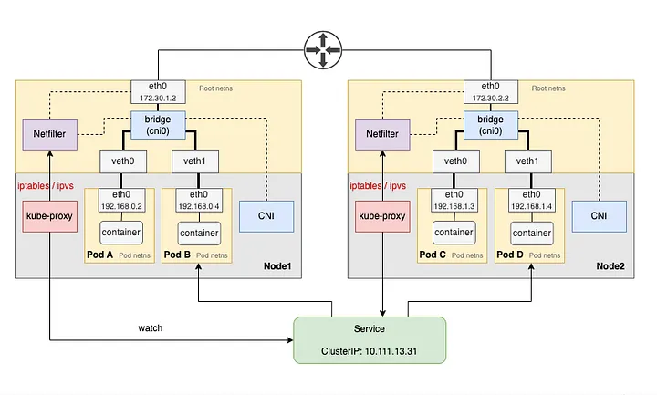

## CNI flow BUT kube-proxy 특성에 초점 & CNI랑 이름 비슷한 친구들 알아보기



``` 
Node1 컴포넌트 구분
├── eth0 172.30.1.2
├── bridge (cni0)
├── veth0
├── veth1
├── kube-proxy
├── CNI
└── Netfilter
```
CNI와 kube-proxy가 실제 packet을 계속 받아서 처리하는 것이 아님.

kube-proxy는 packet forwarding process라기보다 
**Linux networking datapath에 Service 관련 규칙을 구성**하는 역할

해당 글도 kube-proxy가 Service/Endpoints를 감시하고 
iptables/IPVS를 통해 Netfilter를 구성한다고 설명


실제 패킷이 이동할 때마다:
CNI → packet → CNI → packet → CNI
이런 식으로 CNI plugin process를 거치는 게 아님.

=> Linux kernel이 CNI가 만들어놓은 network configuration을 이용해서 packet을 처리

### Kube-proxy

kube-proxy is typically deployed as a DaemonSet to ensure each worker node has a running pod. It connects to the kube-apiserver, listens for Service objects (and related Endpoints or EndpointSlices), and then configures the node’s Netfilter using either iptables or ipvs.

왜 보통 daemonset으로 배포되지?
=> 각 node의 네트워크 datapath를 설정해야 하는 컴포넌트 라서...
데몬셋이 각 Node에 특정 Pod를 하나씩 실행하도록 보장하는 리소스니까... 일반적으로 노드당 하나씩 실행되어야 한다는 요구조건에 맞음


만약에 service가 
Service
ClusterIP: 10.111.13.31
Backend:
  192.168.0.2
  192.168.1.4
이런식이면 kube-proxy가 자기 노드에 service -> pod로 가는 규칙을 구성하는 역할

 
만약에 노드 2개인데 node2에만 있으면?
kube-proxy없는 노드에서 service ip를 backend pod ip로 변환할 규칙을 만들어줄 컴포넌트가 없음

#### kube-proxy pod이 패킷을 직접 프록시하는 거 아님
프록시라는 이름에 혼돈이 올 수 있지만
pod -> kube-proxy pod -> backend pod 모든 패킷이 이런식으로 거치는 거 X

```
                    kube-proxy
                        │
                        │ rule 설정
                        ▼
Pod ──► veth ──► Netfilter ──► Backend Pod
                    │
                    │
              Linux Kernel
```
- Service/Endpoint 정보를 보고 Linux kernel의 packet-processing rules를 구성하는 역할

#### kube-proxy limitation

1) Rule 관리
iptables 모드에서는 Service와 Endpoint가 많아질수록 관련 rule이 많아짐

Service 1 ──┐
Service 2 ──┤
Service 3 ──┤
   ...      ├──► 많은 iptables rules
Service N ──┘

패킷이 Service IP로 들어오면 Netfilter가 해당 rule들을 평가해야 하므로 규모가 커질수록 rule processing overhead가 증가할 수 있음

-->> 단, "iptables는 무조건 느리다"라고 쓰는 건 아니고 실제 성능은 rule 구조, 커널, 트래픽 패턴 등에 따라 변동

2) Service / Endpoint 변경 시 rule 동기화
Kubernetes에서는 Service나 EndpointSlice가 계속 변할 수 있음

```
Pod 생성/삭제
    ↓
EndpointSlice 변경
    ↓
kube-proxy 감지
    ↓
iptables/IPVS configuration 업데이트
```

특히 큰 클러스터에서는 이런 datapath rule synchronization 비용이 문제가 될 수 있다...

질문... 실제 규모 큰 클러스터에서는 이런 configuration 을 얼마나 주기적으로 synchronization 하는지?? 

3) Linux Netfilter 의존성
kube-proxy | iptables/IPVS | Netfilter | Linux Kernel

이 계층에 문제가 생기면 service networking에 영향이 감
=>>> 그래서 eBPF 기반 CNI가 등장

eBPF를 이용해 Service load-balancing / forwarding을 kernel datapath에서 직접 수행
CNI가 kube-proxy의 Service forwarding 기능까지 제공하면 kube-proxy를 별도로 실행하지 않는 kube-proxy replacement mode를 사용할 수 있게됨...

#### 그러면 꼭 데몬셋으로 배포되어야 하는 다른 CNI 관련 컴포넌트는 어떤게  있는가?

| Component          | 보통 DaemonSet? | Node마다 필요한 이유                                 |
| ------------------ | ------------- | --------------------------------------------- |
| **CNI plugin**     | O             | 각 Node의 Pod networking을 구성                    |
| **CNI node agent** | O             | 각 Node의 networking/datapath 관리                |
| **kube-proxy**     | O             | 각 Node의 Service datapath rule 구성              |
| **Cilium agent**   | O             | 각 Node에서 eBPF datapath 구성/관리                  |
| **Calico node**    | O             | 각 Node에서 Pod networking, routing, policy 등 담당 |
| **Flannel**        | O             | 각 Node의 overlay/network datapath 구성           |
| **Multus**         | O             | 각 Node에서 추가 network attachment 처리             |
다만 CNI마다 구조가 달라서 모든 컴포넌트가 반드시 같은 형태의 DaemonSet으로 존재하는 것은 아님

### CSI / CBI 는 뭔가?

- CRI: Kubernetes ↔ Container Runtime 사이의 표준 인터페이스
- CNI: Container/Pod ↔ Network
- CSI: Pod ↔ Storage -> CNI의 Storage버전
- CCM: Kubernetes ↔ Cloud Provider API : Kubernetes 공식 문서에서는 CCM을 cloud-specific control logic을 담당하고 cloud provider API와 Kubernetes를 연결하는 control-plane component로 설명

```
                    Kubernetes
                         │
        ┌────────────────┼────────────────┐
        │                │                │
       CRI              CNI              CSI
        │                │                │
 Container Runtime    Pod Network      Persistent Storage
        │                │                │
   containerd        Calico / Cilium    EBS CSI / EFS CSI
   CRI-O             AWS VPC CNI        Azure Disk CSI
        │                │                │
        └────────────────┼────────────────┘
                         │
                    Cloud Provider
                         │
                        CCM
                         │
              Cloud API / Infrastructure
                         │
          ┌──────────────┼──────────────┐
       Compute        Network         Load Balancer
       Storage        Routes          Cloud LB
```

그러면 걔네는 클라우드에선 어떤 서비스로 활용되고 있는가?

| 인터페이스   | Kubernetes에서 하는 일            | Cloud에서 연결되는 것                     | 대표 예시                            |
| ------- | ---------------------------- | ---------------------------------- | -------------------------------- |
| **CRI** | Container 실행                 | VM/Node에서 container runtime        | containerd, CRI-O                |
| **CNI** | Pod Networking               | Cloud VPC / subnet / route / ENI 등 | AWS VPC CNI, Azure CNI           |
| **CSI** | Persistent Storage           | Cloud Block/File Storage           | EBS CSI, EFS CSI, Azure Disk CSI |
| **CCM** | Cloud-specific control logic | Cloud API, LB, route, node 정보      | AWS/GCP/Azure cloud integration  |


#### CNI
- AWS EKS example

```
Kubernetes Pod
      │
      ▼
AWS VPC CNI
      │
      ▼
AWS VPC
      │
 ┌────┴─────┐
ENI       Subnet
```
즉 Kubernetes의 Pod networking을 AWS VPC networking과 연결하는 역할을 한다.
CNI = AWS VPC 자체가 아님

CNI는 Kubernetes networking과 underlying network infrastructure를 연결하는 plugin/interface이고, AWS VPC CNI 같은 구현체가 AWS의 네트워크 자원을 활용하는 것

CNI 공식 문서도 CNI의 목적을 container execution과 network plugin 사이의 공통 interface를 정의해 네트워크 계층을 pluggable하게 만드는 것으로 설명


---
Ref:
- https://dilipkumar.medium.com/kubernetes-cri-vs-cni-vs-csi-vs-ccm-378140d75f5b
- https://medium.com/@rifewang/kubernetes-how-kube-proxy-and-cni-work-together-1255d273f291
