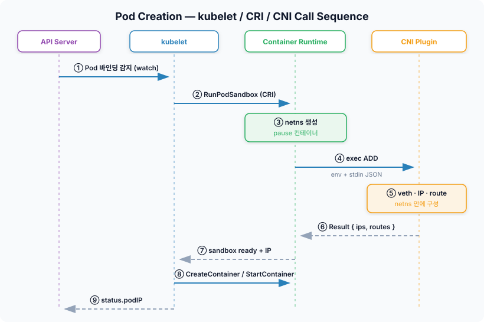
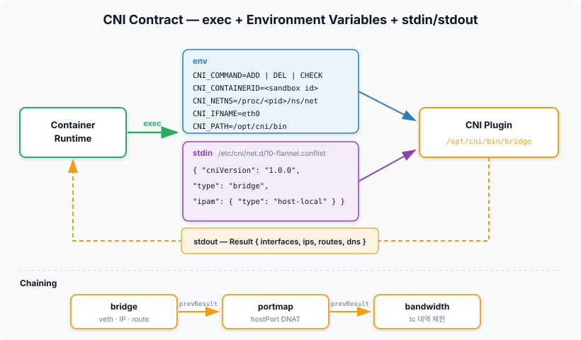
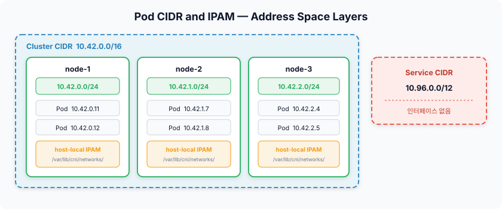
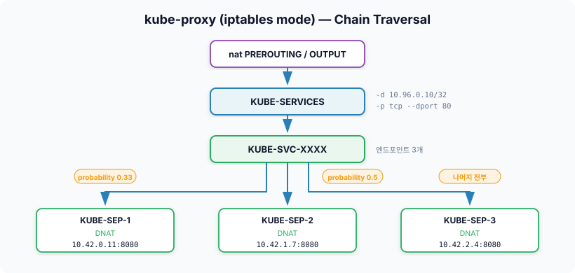
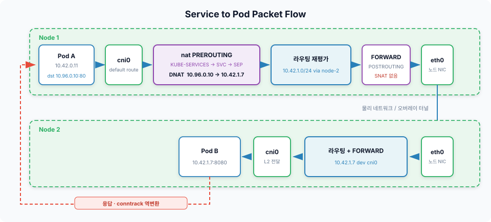

# Week 2. Kubernetes Networking & CNI Fundamentals

`kubectl get svc`를 치면 ClusterIP가 하나 찍힌다. 그런데 그 주소로 `ping`을 보내면 답이 없다. 노드에서 `ip addr`을 뒤져도, Pod 안에서 뒤져도 그 IP를 가진 인터페이스는 없다. 어디에도 붙어 있지 않은 주소인데 `curl`은 멀쩡히 된다.

지난 주에는 Pod IP가 어디에 실재하는지를 확인했다. 네임스페이스 안 인터페이스에 실제로 설정된 값이었다. ClusterIP는 그렇지 않다. **실체가 없는데도 동작한다.**

이번 주의 질문은 두 개다. **Pod IP는 누가 정하는가**, 그리고 **실체 없는 ClusterIP가 어떻게 실제 Pod까지 도달하는가.** 앞의 질문은 kubelet에서 CNI까지 내려가는 호출 사슬을 따라가면 답이 나오고, 뒤의 질문은 kube-proxy가 노드에 심어둔 규칙을 읽으면 답이 나온다.

CNI 구현체별 차이와 노드 사이를 실제로 건너가는 방식은 Week 3 이후의 주제다. 여기서는 **구현체가 무엇이든 공통으로 성립하는 뼈대**만 본다.

---

## 네트워킹 모델 — 규격은 요구사항만 적어뒀다

쿠버네티스는 네트워크를 어떻게 만들지 정해두지 않았다. 대신 **무엇을 만족해야 하는지**만 적어뒀다.

| 요구사항 | 내용 |
|---|---|
| Pod마다 고유 IP | 모든 Pod은 클러스터 전체에서 유일한 IP를 하나 갖는다 |
| Pod 간 NAT 없음 | 어느 노드에 있든 Pod은 서로의 IP로 직접 통신한다 |
| 노드 에이전트 접근 | 노드의 kubelet 등은 그 노드의 Pod과 통신할 수 있다 |
| 보이는 IP가 실제 IP | Pod이 자기 IP라고 믿는 주소를 상대도 같은 주소로 본다 |

마지막 항목이 이 모델의 핵심이다. NAT가 끼면 Pod이 스스로 인식하는 IP와 상대가 보는 IP가 달라진다. 그러면 애플리케이션이 자기 주소를 다른 컴포넌트에 알려주는 흔한 패턴이 전부 깨진다. 서비스 디스커버리든 리다이렉트든 클러스터링이든 마찬가지다. **"내가 아는 내 주소를 그대로 말하면 된다"** 는 전제를 지키려고 NAT를 걷어낸 것이다.

포트도 마찬가지다. IP가 Pod마다 따로 있으니 포트 공간도 Pod마다 따로다. 같은 노드에서 nginx 컨테이너 열 개가 전부 80번을 열어도 충돌하지 않는다. Docker에서 익숙했던 포트 매핑이 쿠버네티스에서 잘 안 보이는 이유가 여기 있다.

문제는 이 요구사항이 **어떻게 달성되는지는 하나도 적혀 있지 않다**는 것이다. 비워둔 그 자리가 CNI다. 그래서 이번 주에 볼 것은 "쿠버네티스가 네트워크를 만드는 법"이 아니라 **"쿠버네티스가 네트워크 만들기를 누구에게 어떻게 넘기는가"** 다.

---

## Pod가 뜨기까지 — kubelet, CRI, CNI의 호출 순서

Pod에 IP가 붙는 순간을 정확히 짚으려면 Pod 생성 과정을 순서대로 봐야 한다. 스케줄러가 노드를 정한 다음부터다.



1. **kubelet이 감지한다.** 스케줄러가 `spec.nodeName`을 채우면 kubelet이 watch로 알아챈다
2. **kubelet이 sandbox를 요청한다.** 컨테이너 런타임에게 CRI의 `RunPodSandbox`를 호출한다
3. **런타임이 네임스페이스를 만든다.** 네트워크 네임스페이스를 만들고 pause 컨테이너를 띄워 붙잡아 둔다
4. **런타임이 CNI를 호출한다.** 네임스페이스 경로를 넘기며 `ADD`를 실행한다
5. **CNI가 네트워크를 구성한다.** veth를 만들고 IP를 할당하고 라우트를 심는다. 지난 주에 본 그 작업들이다
6. **CNI가 결과를 돌려준다.** 할당한 IP와 라우트를 stdout으로 반환한다
7. **sandbox가 준비된다.** 런타임이 kubelet에게 준비 완료를 알린다
8. **컨테이너가 뜬다.** 그제야 애플리케이션 컨테이너가 만들어지고 시작된다
9. **IP가 보고된다.** kubelet이 `status.podIP`를 API 서버에 올린다

### 왜 이 순서인가

네트워크가 컨테이너보다 먼저 준비되는 건 우연이 아니다. 애플리케이션이 시작하자마자 소켓을 여는데 그때 인터페이스도 IP도 없으면 바인딩이 실패한다. **네트워크를 먼저 깔고 그 위에 프로세스를 올린다**는 순서는 지켜져야 한다.

pause 컨테이너가 먼저 뜨는 이유도 같은 맥락이다. 애플리케이션 컨테이너가 죽고 다시 떠도 네임스페이스는 pause가 붙들고 있으니 IP가 유지된다. 지난 주에 본 그 구조가 여기서 순서로 드러난다.

### 혼동하기 쉬운 지점 — CNI를 호출하는 건 kubelet이 아니다

`kubelet`이 네트워크를 관리한다고 생각하기 쉬운데, 위 순서에서 CNI를 실행하는 주체는 **컨테이너 런타임**이다. kubelet은 CRI 인터페이스 너머로 "sandbox 하나 만들어줘"라고 말할 뿐이고, 네임스페이스를 아는 것도 CNI 설정 파일을 읽는 것도 런타임이다.

과거 dockershim 시절에는 kubelet이 직접 CNI를 호출했다. dockershim이 제거되면서 그 책임이 런타임으로 넘어갔고, 지금 `/etc/cni/net.d`를 읽는 것은 containerd나 CRI-O다. 그래서 **CNI 설정을 고쳤을 때 재시작해야 하는 것도 kubelet이 아니라 런타임**이다. 디버깅할 때 로그를 잘못된 곳에서 찾기 쉬운 지점이다.

### 그래서 Pod IP는 누가 정하는가

9번 단계를 다시 보자. kubelet은 IP를 **결정하지 않고 보고한다.** API 서버도 마찬가지로 받아 적을 뿐이다. 실제로 IP를 고른 것은 5번 단계, 노드 위에서 실행된 IPAM 플러그인이다.

**결정은 아래에서 일어나고 위로 보고된다.** `kubectl get pod -o wide`에 찍히는 IP는 원본이 아니라 사본이다. 이 방향이 뒤에서 볼 ClusterIP와 정반대라는 점이 이번 주에 가장 기억에 남는 대비였다.

### 예외 하나

`hostNetwork: true`인 Pod은 이 과정 전체를 건너뛴다. 별도 네임스페이스를 만들지 않고 호스트 네임스페이스를 그대로 쓰므로 CNI가 호출되지 않고, `podIP`는 그냥 노드 IP가 된다. kube-proxy나 CNI 데몬처럼 노드 네트워크를 직접 만져야 하는 컴포넌트가 이 방식을 쓴다.

---

## CNI 규격 — 놀랄 만큼 얇은 계약

CNI는 라이브러리도 아니고 데몬도 아니다. **실행 파일을 하나 실행하는 규약**이다.



계약의 내용은 이게 전부다.

| 요소 | 내용 |
|---|---|
| 플러그인 | `/opt/cni/bin/` 아래의 실행 파일 |
| 설정 | `/etc/cni/net.d/*.conflist` — 사전순 첫 파일이 선택된다 |
| 동작 지정 | 환경변수 `CNI_COMMAND` = `ADD` / `DEL` / `CHECK` |
| 컨텍스트 | `CNI_CONTAINERID`, `CNI_NETNS`, `CNI_IFNAME`, `CNI_ARGS`, `CNI_PATH` |
| 입력 | stdin으로 네트워크 설정 JSON |
| 출력 | stdout으로 Result JSON — 인터페이스, IP, 라우트, DNS |
| 실패 | 0이 아닌 종료 코드 + stderr에 에러 JSON |

`CNI_NETNS`에는 `/proc/<pid>/ns/net` 같은 경로가 들어온다. 플러그인은 이 경로로 네임스페이스에 진입해서 작업한다. 지난 주에 `nsenter`로 하던 일을 프로그램이 하는 것뿐이다.

### ADD가 실제로 하는 일

`bridge` 플러그인 기준으로 `ADD` 한 번에 벌어지는 일을 풀어보면 지난 주 내용과 정확히 겹친다.

1. 호스트 네임스페이스에 `cni0` 브릿지가 없으면 만든다
2. veth 쌍을 만들어 한쪽을 컨테이너 네임스페이스로 옮기고 `eth0`로 이름을 바꾼다
3. IPAM을 호출해 IP를 받아온다
4. 컨테이너 쪽 `eth0`에 IP를 붙이고 default route를 브릿지 주소로 건다
5. 호스트 쪽 veth를 브릿지에 꽂는다
6. 결과를 JSON으로 출력한다

**Week 1에서 손으로 따라가던 절차가 그대로 코드가 된 것**이다. CNI가 특별한 마법을 부리는 게 아니라, 리눅스 네트워크 설정을 정해진 순서로 자동화한 실행 파일이라는 게 규격을 보면 분명해진다.

### 체이닝

`conflist`의 `plugins` 배열에 여러 플러그인을 나열하면 순서대로 호출된다. 앞 플러그인의 Result가 뒤 플러그인의 `prevResult`로 전달되므로, 뒤쪽은 앞에서 만든 인터페이스를 알고 작업할 수 있다.

| 플러그인 | 역할 |
|---|---|
| `bridge` / `ptp` / `macvlan` | 인터페이스를 만드는 메인 플러그인 |
| `host-local` / `dhcp` / `static` | IPAM — IP를 고른다 |
| `portmap` | `hostPort` 를 위한 DNAT 규칙 |
| `bandwidth` | tc로 대역폭 제한 |
| `tuning` | sysctl, MAC, promisc 등 조정 |
| `firewall` | 기본 허용 규칙 |

`DEL`은 역순으로 호출된다. 만든 순서의 반대로 정리해야 의존 관계가 꼬이지 않기 때문이다.

### 왜 하필 실행 파일인가

데몬이나 gRPC 서비스로 만들 수도 있었을 텐데 굳이 exec 모델을 택한 데는 이유가 있다.

- **언어를 가리지 않는다.** stdin/stdout과 종료 코드만 지키면 무엇으로 짜든 상관없다
- **쿠버네티스 릴리스와 독립적이다.** 플러그인 바이너리만 갈아끼우면 되고 컨트롤 플레인은 건드리지 않는다
- **크래시가 격리된다.** 플러그인이 죽어도 프로세스 하나가 죽는 것이고 런타임은 종료 코드로 알아챈다

대신 비용도 있다. Pod 하나 만들 때마다 프로세스를 새로 띄우므로 대량 생성 시 오버헤드가 붙고, 호출 간에 상태를 유지할 수 없어 **상태를 전부 파일이나 외부 저장소에 둬야 한다.** 다음 절의 IPAM이 파일시스템을 쓰는 것도 이 제약 때문이다.

---

## IP는 누가 정하는가 — Pod CIDR과 IPAM

Pod IP가 노드에서 정해진다는 건 확인했다. 그렇다면 노드는 어떤 범위 안에서 고르는가.



주소 공간은 세 층으로 나뉘고, 층마다 결정하는 주체가 다르다. 그림 오른쪽에 따로 떨어져 있는 Service CIDR은 같은 클러스터의 주소지만 성격이 전혀 다르다. 뒤에서 따로 본다.

| 층 | 예시 | 누가 정하는가 |
|---|---|---|
| Cluster CIDR | `10.42.0.0/16` | 관리자가 설치 시점에 지정 |
| Node podCIDR | `10.42.0.0/24` | NodeIPAMController가 노드마다 잘라서 배정 |
| Pod IP | `10.42.0.11` | 노드 위 IPAM 플러그인이 ADD 시점에 확정 |

`kube-controller-manager`에 `--allocate-node-cidrs=true`와 `--cluster-cidr`가 켜져 있으면, 노드가 클러스터에 조인할 때 컨트롤러가 겹치지 않는 서브넷을 하나 떼어 `node.spec.podCIDR`에 기록한다.

```bash
kubectl get nodes -o custom-columns='NODE:.metadata.name,CIDR:.spec.podCIDR'
```

### 잘라두는 것 자체가 설계다

여기서 중요한 건 **노드마다 대역이 미리 겹치지 않게 나뉘어 있다**는 사실이다. 그 덕분에 노드 위 IPAM은 자기 대역 안에서만 고르면 되고, **다른 노드와 조율할 필요가 전혀 없다.**

`host-local` IPAM이 그래서 이렇게 단순하다. 할당한 IP마다 `/var/lib/cni/networks/<network>/<ip>` 파일을 하나 만들고 그 안에 컨테이너 ID를 적어둔다. 파일이 있으면 사용 중, 없으면 비어 있음. **파일시스템이 그대로 할당 대장**이다. 분산 락도 합의 프로토콜도 없다.

IP 할당처럼 전역 유일성이 필요한 일이 이렇게 싸게 끝나는 건, 유일성 보장을 **주소 공간을 미리 쪼개는 것으로 옮겨놨기** 때문이다. 노드가 수천 개여도 할당 비용이 늘지 않는다.

### 대역 계산

이 구조에는 대신 상한이 따라온다.

```
Cluster CIDR /16 + node-cidr-mask-size /24
  → 노드 최대 256개
  → 노드당 Pod 최대 254개 (네트워크·게이트웨이 주소 제외)
```

kubelet의 기본 `maxPods`가 110이니 `/24`면 여유가 있다. 하지만 노드를 300대까지 늘릴 계획이라면 `/16` 클러스터 CIDR로는 부족하다. **이 값들은 클러스터 생성 시점에 정해지고 나중에 바꾸기가 매우 어렵다.** 설치할 때 한 번 계산해 두고 넘어가는 게 낫다.

### 구현체마다 IPAM은 다르다

`host-local`은 가장 단순한 형태고, 실제 CNI들은 각자 다른 방식을 쓴다.

| 방식 | 특징 |
|---|---|
| `host-local` | 노드 로컬 파일. 단순하고 빠르지만 노드 대역이 고정된다 |
| Calico IPAM | IP 블록 단위로 CRD에 기록. 노드 간 블록 재분배가 가능하다 |
| Cilium (cluster-pool) | Operator가 CRD로 노드별 풀을 관리. 동적 확장 가능 |
| AWS VPC CNI | Pod IP가 VPC의 실제 IP. ENI에 보조 IP를 붙여 할당한다 |

마지막 방식은 성격이 아예 다르다. Pod IP가 클러스터 내부 주소가 아니라 **VPC에서 라우팅되는 진짜 주소**라 오버레이가 필요 없는 대신, 서브넷 IP 고갈이 바로 Pod 스케줄 실패로 이어진다. 어느 쪽이든 트레이드오프가 있고, 이 비교는 Week 3~4의 주제다.

### IP 누수

`ADD`로 할당한 IP는 `DEL`로 반납된다. 그런데 **DEL이 호출되지 못하면 파일이 남는다.** 노드가 갑자기 죽거나, 런타임이 크래시하거나, 플러그인이 에러를 내는 경우다.

증상은 이렇게 나타난다. Pod 수는 얼마 안 되는데 새 Pod이 `failed to allocate for range 0: no IP addresses available in range`로 뜨지 않는다. `/var/lib/cni/networks/`를 열어보면 이미 없어진 컨테이너의 파일들이 쌓여 있다. 이 디렉터리와 실제 Pod 목록을 대조하는 것이 조사 시작점이다.

---

## Service — 어디에도 없는 IP

여기까지가 Pod IP다. 이제 처음의 질문으로 돌아간다.

Pod IP는 실체가 있지만 **오래 살지 못한다.** Pod은 재시작하면 IP가 바뀌고, 스케일링하면 개수도 바뀐다. 클라이언트가 Pod IP를 직접 알고 있어야 한다면 매번 다시 찾아야 한다. Service는 이 문제를 **변하지 않는 주소 하나**로 덮는다.

### Pod IP와 정반대 방향으로 결정된다

앞에서 Pod IP는 아래에서 정해져 위로 보고된다고 했다. ClusterIP는 반대다.

| | Pod IP | ClusterIP |
|---|---|---|
| 누가 정하나 | 노드의 IPAM 플러그인 | API 서버의 할당기 |
| 언제 | Pod이 노드에 배치된 뒤 | Service 오브젝트 생성 시점 |
| 실체 | 네임스페이스 안 인터페이스에 실제로 붙음 | 어느 인터페이스에도 없음 |
| etcd의 값 | 결과를 받아 적은 사본 | 원본 |
| 수명 | Pod과 함께 사라짐 | Service가 살아 있는 한 불변 |
| 전파 방향 | 노드 → API 서버 | API 서버 → 모든 노드 |

ClusterIP는 Service CIDR(`--service-cluster-ip-range`, 흔히 `10.96.0.0/12`)에서 API 서버가 골라 오브젝트에 박아 넣는다. 그 순간부터 그 주소는 etcd에 존재하지만 **어떤 커널의 어떤 인터페이스에도 존재하지 않는다.**

그래서 `ping`이 안 된다. ARP를 물어도 답할 주체가 없고, 라우팅 테이블에 Service CIDR 경로도 없다. 이 주소는 통신 상대가 아니라 **iptables 규칙의 매칭 조건으로만 존재한다.** 처음의 질문에 대한 답이 이것이다.

> 다만 kube-proxy IPVS 모드는 예외다. 이 모드는 `kube-ipvs0`라는 더미 인터페이스를 만들고 ClusterIP들을 거기에 붙인다. 그래서 IPVS 모드에서는 `ip addr`에 ClusterIP가 보인다. "어디에도 없다"는 iptables 모드 기준의 이야기다.

### Service는 정의, EndpointSlice가 실제 목록

Service 오브젝트에는 `selector`와 포트만 적혀 있다. **어느 Pod으로 보낼지는 Service에 들어 있지 않다.**

그 목록은 EndpointSlice 컨트롤러가 만든다. selector에 맞고 Ready 상태인 Pod의 IP를 모아 EndpointSlice 오브젝트에 적는다.

```bash
kubectl get endpointslices -l kubernetes.io/service-name=my-svc -o yaml
```

과거에는 Endpoints 오브젝트 하나에 전부 담았는데, 엔드포인트가 수천 개인 서비스에서 Pod 하나만 바뀌어도 그 거대한 오브젝트 전체가 다시 전파됐다. EndpointSlice는 기본 100개 단위로 쪼개서 **변경된 조각만 전파되게** 한 것이다.

여기서 readiness가 왜 네트워크 문제인지가 드러난다. readinessProbe가 실패하면 EndpointSlice에서 그 Pod이 빠지고, kube-proxy가 그걸 보고 노드의 규칙에서 해당 엔드포인트를 지운다. **readiness는 헬스체크 표시가 아니라 라우팅 대상 목록을 직접 조작하는 스위치**다.

### kube-proxy는 패킷을 보지 않는다

이름 때문에 오해하기 쉬운데, kube-proxy는 트래픽을 중계하지 않는다. 하는 일은 이것뿐이다.

1. API 서버에서 Service와 EndpointSlice를 watch한다
2. 변경이 생기면 **노드의 커널에 규칙을 다시 쓴다**
3. 끝

패킷을 실제로 처리하는 건 커널의 netfilter다. kube-proxy가 죽어도 이미 심어둔 규칙은 커널에 남아 있으므로 **기존 서비스 통신은 계속 된다.** 다만 그 시점부터 새 Service나 Pod 변경이 반영되지 않아, 없어진 Pod으로 보내는 규칙이 남는다. 이게 kube-proxy 장애의 전형적인 증상이다. 전부 끊기는 게 아니라 **일부만 조용히 실패한다.**

지난 주에 "iptables는 커널에 규칙을 등록하는 유저스페이스 도구일 뿐"이라고 정리했는데, kube-proxy도 정확히 그 위치에 있다.

---

## kube-proxy iptables 모드 — 체인 따라가기

그럼 kube-proxy가 심는 규칙이 실제로 어떻게 생겼는지 본다.



nat 테이블의 `PREROUTING`과 `OUTPUT`에서 `KUBE-SERVICES`로 점프하는 것이 시작이다. 두 훅 모두에 거는 이유는 지난 주에 본 그대로다. 다른 Pod에서 온 패킷은 `PREROUTING`으로 들어오고, 노드 자신이 만든 패킷은 `OUTPUT`으로 내려온다.

```
nat PREROUTING / OUTPUT
  └─ KUBE-SERVICES              모든 Service의 진입점
      └─ (-d 10.96.0.10/32 -p tcp --dport 80)
          └─ KUBE-SVC-XXXX      Service 하나에 체인 하나
              ├─ probability 0.333 → KUBE-SEP-1  → DNAT 10.42.0.11:8080
              ├─ probability 0.5   → KUBE-SEP-2  → DNAT 10.42.1.7:8080
              └─ (나머지)          → KUBE-SEP-3  → DNAT 10.42.2.4:8080
```

### 확률이 왜 저렇게 생겼나

`0.333`, `0.5`, `1`이라는 값이 이상해 보이지만 순차 평가를 생각하면 자연스럽다. 규칙은 위에서 아래로 훑고, 걸리면 거기서 끝난다.

```
첫 번째 규칙:  1/3 확률로 선택           → 33.3%
두 번째 규칙:  남은 2/3 중 1/2로 선택    → 33.3%
세 번째 규칙:  남은 것 전부              → 33.3%
```

즉 `statistic mode random probability` 값은 **남은 후보 중에서의 확률**이다. 이렇게 해야 결과적으로 균등해진다.

그리고 이건 엄밀히 말해 로드밸런싱이 아니다. **연결 단위 랜덤 선택**일 뿐이고, 백엔드의 부하나 응답 속도를 전혀 보지 않는다. 커넥션 수가 적을 때 한쪽으로 쏠릴 수 있고, 커넥션을 오래 유지하는 gRPC 같은 프로토콜에서는 처음 붙은 Pod에 계속 물려 있게 된다. 이 경우 Pod을 늘려도 트래픽이 재분배되지 않는다.

### 첫 패킷만 이 길을 간다

DNAT는 연결의 **첫 패킷에만** 적용된다. 그 뒤로는 conntrack이 같은 변환을 이어간다. 지난 주에 예고했던 지점이 바로 여기다.

conntrack이 없으면 이 구조는 성립하지 않는다. Pod B가 응답을 보낼 때 출발지는 자기 IP인데, Pod A는 ClusterIP로 보냈으므로 그 IP에서 오는 응답을 기다린다. 주소가 다르면 **요청한 적 없는 패킷**이라 커널이 버린다. conntrack이 흐름을 기억하고 있다가 응답의 출발지를 ClusterIP로 되돌려 놓기 때문에 통신이 성립한다.

그래서 conntrack 테이블이 차면 서비스 통신이 광범위하게 깨진다. `nf_conntrack: table full, dropping packet`이 로그에 뜨면 이 경우다.

### MASQUERADE가 필요한 자리

`KUBE-MARK-MASQ`와 `KUBE-POSTROUTING`이라는 체인도 함께 심긴다. 클러스터 내부 통신에는 NAT를 쓰지 않는 게 원칙인데, 그럼에도 출발지를 바꿔야 하는 경우가 있다.

- **hairpin** — Pod이 자기가 속한 Service로 접속해서 자기 자신으로 DNAT되는 경우. 출발지와 목적지가 같아지면 패킷이 정상 처리되지 않는다
- **NodePort로 들어온 외부 트래픽** — 다른 노드의 Pod으로 전달할 때 출발지를 그대로 두면, 응답이 클라이언트에게 직접 가버려서 conntrack 역변환을 건너뛴다. 클라이언트는 자기가 보낸 곳이 아닌 IP에서 온 응답이라 버린다

두 번째가 `externalTrafficPolicy` 옵션의 배경이다.

| 값 | 동작 | 대가 |
|---|---|---|
| `Cluster` (기본) | 모든 노드의 모든 엔드포인트로 분산 | SNAT 때문에 **클라이언트 IP가 사라진다** |
| `Local` | 그 노드에 있는 엔드포인트로만 전달 | 클라이언트 IP는 보존되지만 노드별 Pod 수에 따라 분포가 기울 수 있다 |

접근 로그에 클라이언트 IP 대신 노드 IP만 찍히는 문제는 대개 여기서 온다.

### 규칙 개수가 늘어나는 문제

이 구조는 단순하지만 규칙 수가 **서비스 수 × 엔드포인트 수**에 비례해 늘어난다. netfilter의 체인은 선형 스캔이라 규칙이 수만 개가 되면 패킷당 매칭 비용이 눈에 띄게 커지고, 룰셋 갱신 비용도 함께 커진다.

서비스가 수천 개 이상인 클러스터에서 이게 실제 병목이 된다. 그래서 나온 것이 IPVS 모드와 eBPF 기반 대체다.

---

## Service → Pod 패킷 흐름 추적

지금까지 본 조각을 하나로 꿰어본다. Pod A(node-1)가 ClusterIP `10.96.0.10:80`으로 요청을 보내고, 백엔드 Pod B가 node-2에 있는 경우다.



**0. DNS 조회.** Pod은 `my-svc.default.svc.cluster.local`을 물어 ClusterIP를 얻는다. 그런데 CoreDNS도 Service다. 그럼 CoreDNS 주소는 어떻게 아는가. kubelet이 Pod을 만들 때 `/etc/resolv.conf`에 클러스터 DNS의 ClusterIP를 **직접 써넣어 준다.** 닭과 달걀이 되지 않는 건 이 한 줄 덕분이고, DNS 질의 자체도 아래와 똑같이 DNAT를 탄다.

**1. Pod A의 라우팅.** `10.96.0.10`은 Pod의 로컬 서브넷에 없으니 default route로 `cni0`에 넘어간다. Pod은 여기까지만 판단한다. 지난 주에 확인한 "Pod의 라우팅 테이블은 두 줄뿐"이 그대로 적용된다.

**2. 호스트 스택 진입.** 브릿지에 도착한 프레임이 호스트의 L3 스택으로 올라가고 `PREROUTING`을 만난다.

**3. DNAT.** `KUBE-SERVICES` → `KUBE-SVC-XXXX` → `KUBE-SEP-2`를 거쳐 목적지가 `10.96.0.10:80`에서 `10.42.1.7:8080`으로 바뀐다. **로드밸런싱 판단이 여기서 끝난다.**

**4. 라우팅 재평가.** 목적지가 바뀌었으니 커널이 라우팅을 다시 조회한다. 이제 목적지는 node-2의 podCIDR에 속하고, 호스트 라우팅 테이블에는 그 대역으로 가는 경로가 있다. (그 경로를 누가 심었는지가 Week 3~4의 주제다.)

**5. FORWARD와 POSTROUTING.** 이 패킷은 노드 자신이 목적지가 아니므로 `FORWARD`를 탄다. 클러스터 내부 통신이라 SNAT는 걸리지 않고 출발지는 Pod A의 IP 그대로 나간다. 노드 사이 구간을 물리 네트워크로 그냥 보낼지 터널로 감쌀지는 CNI 구현에 따라 갈리는데, 그건 Week 4의 주제다.

**6. node-2 도착.** node-2 입장에서 이 패킷의 목적지는 **평범한 Pod IP**다. Service였다는 사실을 알 필요도 없고 알 수도 없다. 라우팅해서 `cni0`을 거쳐 Pod B에 넣으면 끝이다.

**7. 응답과 역변환.** Pod B는 출발지를 자기 IP로 해서 응답한다. node-1에 도착하면 conntrack이 이 흐름을 찾아 출발지를 `10.96.0.10`으로 되돌린다. **Pod A는 끝까지 ClusterIP와 통신했다고 믿는다.**

### 여기서 드러나는 두 가지

첫째, **로드밸런싱은 출발지 노드에서 끝난다.** 중앙 로드밸런서가 없다. 모든 노드가 전체 Service 규칙을 갖고 있고 각자 자기가 보낸 트래픽을 스스로 분배한다. 이게 kube-proxy를 DaemonSet으로 모든 노드에 돌리는 이유이고, 동시에 노드가 늘수록 각 노드가 들고 있어야 할 규칙도 그대로 복제된다는 뜻이다.

둘째, **Service는 출발지에서만 의미를 갖는다.** 4번 이후로 이 패킷은 그냥 Pod-to-Pod 통신이다. 지난 주에 본 것 위에 DNAT 한 겹이 얹혔을 뿐이라는 게 여기서 확인된다.

### 지난 주에 남긴 질문 두 개

> **Pod 입장에서 "다른 노드의 Pod"과 "인터넷의 서버"는 구분되지 않는 것 아닌가. 분기는 어느 시점에 일어나는가.**

구분되지 않는 게 맞다. Pod은 둘 다 default route로 던진다. **분기는 4번 단계, 호스트의 라우팅 테이블에서 일어난다.** 호스트에는 다른 노드의 podCIDR로 가는 경로가 심겨 있어서 목적지가 거기에 걸리면 클러스터 내부 경로를 타고 NAT 없이 나가고, 어디에도 안 걸리면 default route를 타면서 `POSTROUTING`에서 MASQUERADE가 붙는다. Pod에서 밀어낸 판단이 호스트의 LPM 한 번으로 정리되는 구조다.

> **Pod으로 드나드는 트래픽을 통제하는 규칙은 어느 네임스페이스에 있는가.**

**호스트 네임스페이스다.** 이번 주에 본 `KUBE-*` 체인은 전부 호스트 쪽에 있고, Pod 안에서 `iptables -L`을 쳐도 여전히 비어 있다. veth의 한쪽 끝을 호스트에 남겨두는 설계가 여기서 값을 한다. 모든 Pod 트래픽이 호스트 스택을 지나가므로 **통제 지점을 전부 호스트에 모아둘 수 있다.** NetworkPolicy도 같은 자리에 구현되는데, CNI별로 커스텀 체인을 쓰거나(Calico의 `cali-*`) eBPF 훅을 쓰거나(Cilium) 방식이 갈린다. Week 4~5의 주제다.

---

## 다른 모드 — IPVS와 eBPF

iptables 모드의 한계가 분명해지면서 대안이 나왔다. 지금 시점에서 셋을 비교하면 이렇다.

| | iptables | IPVS | eBPF (Cilium kube-proxy replacement) |
|---|---|---|---|
| 자료구조 | 체인의 선형 규칙 목록 | 커널 해시 테이블 | eBPF map (해시) |
| 조회 비용 | 서비스 수에 비례 | 사실상 상수 | 사실상 상수 |
| LB 알고리즘 | 랜덤만 | rr, wrr, lc, sh 등 선택 가능 | Maglev 등 |
| ClusterIP의 실체 | 없음 | `kube-ipvs0` 더미에 바인딩 | 없음 (eBPF map 조회) |
| 훅 위치 | netfilter | netfilter (INPUT 계열) | TC / XDP — 스택 앞단 |
| 별도 의존 | 없음 | `ipset`, IPVS 커널 모듈 | 최신 커널 |
| 관측성 | 규칙을 읽어야 함 | `ipvsadm` | Hubble 등 전용 도구 |

성격 차이를 한 줄로 요약하면 이렇다. **IPVS는 같은 netfilter 안에서 자료구조만 바꾼 것**이고, **eBPF는 netfilter를 거치기 전에 처리를 끝내는 것**이다. 그래서 eBPF 방식은 kube-proxy 자체를 없앨 수 있고, 그만큼 커널 버전 요구사항이 붙는다.

여기에 최근에는 nftables 모드가 더해졌다. iptables의 선형 스캔 문제를 nftables의 자료구조로 해결하면서 netfilter 계열에 머무르는 절충안이다.

각 방식의 datapath는 Week 4~5에서 자세히 본다.

---

## 이번 주에 확인한 것

| 쿠버네티스에서 이렇게 보이는 것 | 실제로는 |
|---|---|
| Pod에 IP가 붙는다 | 런타임이 CNI 실행 파일을 `ADD`로 호출한 결과 |
| `status.podIP`에 값이 있다 | 노드에서 정해진 값을 kubelet이 보고한 사본 |
| Pod마다 IP가 겹치지 않는다 | 노드별 podCIDR을 미리 쪼개서 조율을 없앤 것 |
| CNI를 갈아끼울 수 있다 | 계약이 실행 파일 + 환경변수 + stdin/stdout뿐이라서 |
| Service에 고정 IP가 있다 | API 서버가 Service CIDR에서 할당한, 실체 없는 주소 |
| Service가 Pod을 찾아준다 | EndpointSlice 컨트롤러가 Ready Pod 목록을 유지 |
| 트래픽이 분산된다 | `KUBE-SVC` 체인의 확률 기반 순차 평가 |
| ClusterIP로 통신이 된다 | nat 테이블의 DNAT + conntrack 역변환 |
| kube-proxy가 프록시한다 | 프록시하지 않는다. 커널에 규칙만 쓴다 |

이번 주에 가장 인상 깊었던 대비는 **결정의 방향**이었다. Pod IP는 노드에서 정해져 위로 보고되고, ClusterIP는 API 서버에서 정해져 모든 노드로 복제된다. 같은 클러스터의 두 주소 체계가 정반대로 흐른다.

그리고 그 방향이 각각 합리적이다. Pod IP는 노드가 아니면 알 수 없는 정보(네임스페이스, 실제 인터페이스)에 묶여 있으니 아래에서 정해야 하고, ClusterIP는 클러스터 전체에서 유일해야 하니 위에서 정해야 한다. **결정을 그 정보를 가진 쪽에 두는 것**이 이 설계의 일관된 원칙으로 보였다.

---

## 확인용 명령어

```bash
# CNI 설정과 플러그인
ls /etc/cni/net.d/                          # 사전순 첫 파일이 쓰인다
cat /etc/cni/net.d/*.conflist
ls /opt/cni/bin/

# IPAM 할당 현황
kubectl get nodes -o custom-columns='NODE:.metadata.name,CIDR:.spec.podCIDR'
ls /var/lib/cni/networks/                   # 네트워크 이름
ls /var/lib/cni/networks/<network>/ | wc -l # 할당된 IP 수 — 실제 Pod 수와 대조

# Service와 엔드포인트
kubectl get svc <name> -o wide
kubectl get endpointslices -l kubernetes.io/service-name=<name>
kubectl get endpointslices <name> -o yaml   # ready 상태까지 확인

# kube-proxy가 심은 규칙
iptables -t nat -L KUBE-SERVICES -n --line-numbers
iptables -t nat -L KUBE-SVC-XXXX -n -v      # 확률 분기 확인
iptables -t nat -L KUBE-POSTROUTING -n -v
iptables-save -t nat | grep <clusterIP>     # 특정 서비스 규칙만 추출

# conntrack — DNAT가 실제로 걸렸는지
conntrack -L -d <clusterIP>
conntrack -L | grep <podIP>
sysctl net.netfilter.nf_conntrack_count net.netfilter.nf_conntrack_max

# kube-proxy 모드 확인
kubectl -n kube-system get cm kube-proxy -o yaml | grep mode
ipvsadm -Ln                                 # IPVS 모드일 때

# Pod 쪽에서
kubectl exec <pod> -- cat /etc/resolv.conf  # kubelet이 써준 DNS
kubectl exec <pod> -- ip route              # 여전히 두 줄
kubectl exec <pod> -- getent hosts <svc>    # ClusterIP 해석 확인

# 흐름 추적
tcpdump -i any -nn host <clusterIP>         # 대개 안 잡힌다 — DNAT가 먼저다
tcpdump -i cni0 -nn host <podIP>
```

`tcpdump`로 ClusterIP를 잡으려다 아무것도 안 나오는 경험을 하게 되는데, 이유가 이번 주 내용 그 자체다. **DNAT가 인터페이스에 나가기 전에 끝나므로 와이어에는 ClusterIP가 실려 다니지 않는다.**

---

## 남은 질문

1. CNI `ADD`는 노드 안에 인터페이스와 로컬 라우트를 만든다. 그런데 **"다른 노드의 podCIDR로 가는 경로"는 누가 언제 심는가.** ADD 시점에는 그 노드에 아직 Pod이 없을 수도 있고, 애초에 CNI 바이너리는 단발성 실행이라 다른 노드를 watch할 수도 없다. `flanneld`나 `calico-node` 같은 데몬과 CNI 바이너리의 분업이 정확히 어디서 갈리는가.
2. `host-local`은 노드 로컬 파일로 끝난다. 그런데 AWS VPC CNI처럼 IP가 VPC에서 오면 할당이 노드 안에서 완결되지 않는다. **이 경우 IPAM은 어디까지 커지고, 노드가 갑자기 죽었을 때 붙잡고 있던 IP는 누가 회수하는가.**
3. DNAT는 출발지 노드의 `PREROUTING`에서 일어난다. 그렇다면 **NetworkPolicy는 어느 IP를 기준으로 평가되는가.** DNAT 전의 ClusterIP인가, 후의 Pod IP인가. 훅 순서를 생각하면 어느 쪽이어야 말이 되는가.

---

## 마치며

이번 주에 확인한 건 **쿠버네티스가 네트워크를 만들지 않는다**는 사실이었다. 만드는 방법을 규정하는 대신 요구사항만 적어두고, 실제 구성은 실행 파일 하나를 호출하는 얇은 계약으로 넘겼다. Service도 마찬가지다. 새로운 통신 방식을 만든 게 아니라 **커널의 DNAT와 conntrack 위에 이름을 하나 붙인 것**에 가깝다.

가장 놀랐던 건 CNI 규격이 너무 얇다는 점이었다. 환경변수와 stdin/stdout, 그리고 종료 코드. 처음엔 이렇게 단순한 계약으로 Flannel부터 Cilium까지 감당이 되나 싶었는데, 오히려 얇기 때문에 구현체가 자유로울 수 있다는 게 규격을 읽고 나서 이해됐다. 계약이 두꺼웠다면 eBPF로 datapath를 통째로 바꾸는 구현은 나오기 어려웠을 것이다.

지난 주에 "Pod은 아무것도 모른 채 게이트웨이로 던지기만 한다"고 정리했는데, 이번 주에 보니 그 무지가 한 층 더 깊었다. Pod은 자기 IP를 누가 정했는지도 모르고, ClusterIP가 실제로는 존재하지 않는다는 것도 모르고, 응답의 출발지가 도중에 바뀌었다는 것도 모른다. **모르게 만드는 것이 이 시스템이 하는 일의 대부분**이었다.

다음 주에는 이 계약을 실제로 구현한 쪽을 본다. CNI 플러그인이 어떤 종류로 나뉘는지, 그리고 남은 질문 1번 — 노드 사이의 경로는 누가 심는지를 따라갈 예정이다.

---

## 참고 자료

- [Kubernetes — Cluster Networking](https://kubernetes.io/docs/concepts/cluster-administration/networking/)
- [Kubernetes — Service](https://kubernetes.io/docs/concepts/services-networking/service/)
- [Kubernetes — Virtual IPs and Service Proxies](https://kubernetes.io/docs/reference/networking/virtual-ips/)
- [Kubernetes — EndpointSlices](https://kubernetes.io/docs/concepts/services-networking/endpoint-slices/)
- [Kubernetes — Container Runtime Interface (CRI)](https://kubernetes.io/docs/concepts/architecture/cri/)
- [containernetworking/cni — SPEC.md](https://github.com/containernetworking/cni/blob/main/SPEC.md)
- [containernetworking/plugins — bridge, host-local](https://github.com/containernetworking/plugins)
- 직접 정리한 글 — [쿠버네티스 네트워크의 본질: CNI, VXLAN, 그리고 Pod는 어떻게 통신하는가](https://marsboy02.github.io/ko/posts/kubernetes-cni-networking/)
