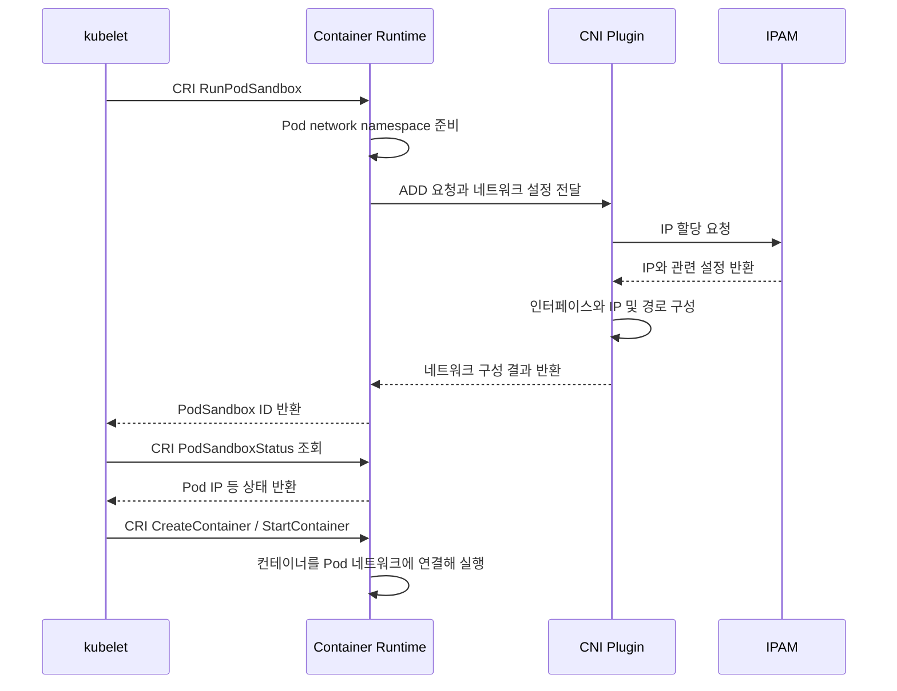

# week2

# Week 2. Kubernetes Networking & CNI Fundamentals

> Pod가 생성되어 IP를 할당받는 과정과, Service로 보낸 요청이 실제 Pod에 도착하는 과정을 연결해서 이해
> 

## 1. Kubernetes Networking Model

Kubernetes는 Pod가 어떤 방식으로 연결되어야 하는지에 대한 **네트워크 모델**을 정의한다. 실제 인터페이스와 전달 경로는 컨테이너 런타임과 네트워크 구현체가 구성함

- **Pod마다 클러스터 내에서 고유한 IP를 갖는다.** 기본 네트워크에서는 주소 체계별로 IP를 할당받으므로, dual-stack Pod는 IPv4와 IPv6 주소를 함께 가질 수 있다.
- **같은 Pod의 컨테이너들은 network namespace를 공유한다.** IP, 인터페이스, 포트 공간을 공유하며 `localhost`로 통신할 수 있다.
- **Pod는 다른 노드의 Pod와도 Pod IP로 직접 통신할 수 있어야 한다.** 기본 모델은 이 통신을 위해 NAT나 프록시를 요구하지 않는다.
- **노드의 에이전트는 해당 노드의 Pod와 통신할 수 있어야 한다.** kubelet의 상태 확인 등이 여기에 해당한다.

예를 들어 같은 Pod의 컨테이너 두 개가 모두 동일한 IP의 TCP 8080 포트에 바인딩하려 하면 충돌한다. 반면 서로 다른 Pod는 각자의 IP가 있으므로 같은 포트 번호를 사용할 수 있다.

여기서 **Pod 간 통신에 NAT가 필요 없다 와 Kubernetes에서 NAT를 사용하지 않는다 는 다른 말**이다. Pod IP로 직접 보내는 트래픽과 달리, Service 접근에는 DNAT(목적지 주소 변환)가 사용될 수 있고 외부 통신에는 SNAT(출발지 주소 변환)가 사용될 수 있다. 또한 NetworkPolicy 등으로 의도적으로 제한한 통신까지 허용해야 한다는 뜻은 아니다.

## 2. 컴포넌트별 역할

먼저 **네트워크를 준비하는 과정**과 **준비된 경로로 패킷을 전달하는 과정**을 구분하면 이해하기 쉽다.

| 구성 요소 | 주요 역할 |
| --- | --- |
| kubelet | 자기 노드에 배치된 Pod를 확인하고, 런타임에 Pod sandbox와 컨테이너 생성·실행을 요청 |
| CRI | Container Runtime Interface. kubelet과 컨테이너 런타임 사이의 표준 API. 주로 gRPC로 통신 |
| 컨테이너 런타임 | containerd, CRI-O 등이 해당. 
Pod의 실행 환경을 준비하고 CNI를 호출해 네트워크를 연결 |
| CNI | Container Network Interface. 런타임이 네트워크 플러그인을 호출하는 규약. 플러그인은 인터페이스, IP 설정, 경로 등을 구성 |
| IPAM | IP Address Management. 주소 풀에서 사용할 IP를 선택하고 할당·반환 상태를 관리 |
| Service / EndpointSlice | Service는 접근할 주소와 포트를 정의하고, EndpointSlice는 실제 백엔드 주소·포트·상태 정보를 담음 |
| kube-proxy | Service와 EndpointSlice를 감시하고, Service 트래픽을 백엔드로 전달할 규칙을 노드에 설정 |
| CoreDNS | 일반적인 클러스터에서 Service 이름을 IP로 해석하는 DNS 기능을 제공 |
| Linux 커널 | 구성된 인터페이스, 라우팅, netfilter 규칙 등에 따라 패킷을 처리 |

CRI는 컨테이너 실행 요청의 인터페이스이고, CNI는 네트워크 연결을 요청하는 인터페이스

## 3. Pod 생성과 CNI 호출 흐름

### 3.1 kubelet → 런타임 → CNI

스케줄러가 Pod를 실행할 노드를 결정하면, 해당 노드의 kubelet이 Pod 정보를 확인한다. 이후 일반적인 Linux 런타임에서는 다음 순서로 네트워크를 준비한다.



위 그림은 주요 호출 관계를 나타낸 개념도 
실제로는 이미지 준비, 상태 조회, 재시도 등이 추가되며, 상태 조회 시점과 내부 세부 순서는 런타임에 따라 달라질 수 있다. kubelet은 런타임에서 얻은 Pod IP 등을 API 서버의 Pod 상태에 반영한다.

핵심은 **kubelet이 직접 IP를 골라주는 것이 아니라, 런타임이 호출한 네트워크 구현의 IPAM 기능이 할당을 처리한다**는 점이다. 현재의 일반적인 CRI 구성에서 CNI를 직접 관리·호출하는 주체는 런타임이다.

### 3.2 Pod sandbox와 CNI가 주고받는 정보

Pod sandbox는 컨테이너들이 함께 사용할 격리 환경이다. 전통적인 Linux 구현에서는 `pause` 컨테이너를 이용해 Pod의 namespace를 유지한다. Pod 안의 애플리케이션 컨테이너들은 이 network namespace에 참여하므로, 각 컨테이너가 별도의 기본 Pod IP를 받는 구조가 아니다.

런타임은 CNI 플러그인에 JSON 설정을 표준 입력으로 전달하고, 다음과 같은 환경변수를 함께 제공한다.

| 항목 | 의미 |
| --- | --- |
| `CNI_COMMAND` | 수행할 작업. 생성 시 `ADD`, 연결 해제 시 `DEL` 등이 사용된다. |
| `CNI_CONTAINERID` | 해당 네트워크 연결을 식별하는 런타임의 ID. Kubernetes에서는 보통 Pod sandbox와 연관된다. |
| `CNI_NETNS` | 이미 준비된 network namespace의 경로. |
| `CNI_IFNAME` | Pod 내부에 구성할 인터페이스 이름. 보통 `eth0`이다. |

Pod 네트워크를 해제할 때는 `DEL`을 통해 인터페이스와 IP 할당 등을 정리한다. **같은 sandbox 안의 애플리케이션 컨테이너만 재시작한다면 Pod 네트워크를 매번 새로 만들 필요는 없다.** Pod나 sandbox가 다시 만들어지면 IP는 달라질 수 있다.

### 3.3 CNI가 필요한 이유와 책임 범위

CNI가 있어 런타임은 Calico, Cilium 등 각 구현의 내부 방식을 모두 알지 않아도 공통 규약으로 네트워크 연결을 요청할 수 있다. 다만 **CNI 규격 자체가 VXLAN, BGP, NetworkPolicy, Service 구현까지 하나로 정하는 것은 아니다.**

실제 네트워크 제품에는 CNI 실행 파일 외에 노드 에이전트와 컨트롤러 등이 포함될 수 있다. 이들이 경로와 정책을 계속 갱신하고, 패킷은 구성된 데이터 경로에서 처리된다. 따라서 “패킷마다 CNI 실행 파일을 호출한다”는 이해는 부정확하다.

일반적인 CNI 기반 클러스터에서 플러그인이나 설정이 없으면 기본 Pod 네트워크를 준비할 수 없어 sandbox 생성이 실패하거나 Pod 실행이 지연될 수 있다. `hostNetwork: true`인 Pod는 노드 네트워크를 공유하는 별도 경우다.

## 4. Pod Network, Pod CIDR, IPAM

### 4.1 어떤 주소인지 먼저 구분하기

아래 주소는 개념 설명을 위한 예시이며, 특정 클러스터의 기본값이 아니다.

| 용어 | 의미 | 예시 |
| --- | --- | --- |
| Node IP | 노드 자체의 네트워크 주소 | Node A: `192.168.10.11` |
| Pod Network | Pod들 사이의 통신을 제공하는 네트워크 전체 | 라우팅 또는 overlay로 구현한 클러스터 네트워크 |
| 클러스터 Pod CIDR | Pod 주소로 사용할 전체 범위를 표현한 CIDR | `10.244.0.0/16` |
| 노드별 Pod CIDR | 특정 노드의 Pod에 사용할 수 있도록 나눈 주소 범위 | Node A: `10.244.1.0/24`, Node B: `10.244.2.0/24` |
| Pod IP | 실제 Pod 인터페이스에 설정된 주소 | `10.244.1.10` |
| Service CIDR / ClusterIP | Service 가상 IP의 할당 범위 / 개별 Service 주소 | `10.96.0.0/12` / `10.96.0.100` |

**Pod CIDR은 주소 범위이고, IPAM은 그 범위를 사용해 주소를 관리하는 기능**이다. 또한 ClusterIP는 Pod에 할당된 IP가 아니며, Service 주소 할당은 Pod IPAM과 별도로 처리된다.

### 4.2 노드에 CIDR을 배정하는 일과 Pod에 IP를 할당하는 일

노드별 Pod CIDR을 사용하는 구성에서는 보통 두 단계로 나뉜다.

1. **노드별 주소 범위 배정:** kube-controller-manager의 노드 IPAM 컨트롤러가 클러스터 범위를 나누어 `Node.spec.podCIDR` / `podCIDRs`에 기록한다. 이 방식은 `-allocate-node-cidrs` 등의 설정에 따라 사용된다.
2. **개별 Pod IP 할당:** CNI가 사용하는 IPAM 기능이 해당 범위에서 사용할 주소를 선택하고, 네트워크 플러그인이 Pod 인터페이스에 설정한다.

`host-local` IPAM은 할당 상태를 노드의 로컬 파일로 관리한다. 따라서 **자기 노드 안에서의 중복을 방지**하며, 클러스터 전체에서 중복되지 않게 하려면 노드별 할당 범위를 서로 겹치지 않게 관리해야 한다.

다만 모든 CNI가 `Node.spec.podCIDR`에 의존하는 것은 아니다.

| 구현 예시 | 주소 할당 방식 |
| --- | --- |
| `host-local` 기반 구성 | 노드에 주어진 주소 범위에서 로컬 상태를 바탕으로 IP를 할당한다. |
| Calico IPAM | Calico의 IPPool과 주소 블록을 관리한다. Kubernetes의 노드 CIDR 할당을 그대로 사용하는 방식과 다르다. |
| AWS VPC CNI | EC2 노드의 ENI 등을 활용해 VPC의 사설 주소를 Pod에 할당한다. |

따라서 **“Pod IP는 항상 노드에 미리 배정된 `/24`에서 나온다”**고 일반화하면 안 된다. 실제 주소 부족 문제를 분석할 때도 노드별 CIDR, CNI의 IPPool, VPC 서브넷 등 해당 IPAM이 사용하는 자원을 확인해야 한다.

## 5. Pod → Pod 통신과 Linux 네트워크

IP를 할당받았다는 사실만으로 다른 Pod까지 도달할 수 있는 것은 아니다. **Pod와 노드를 연결하는 인터페이스, 목적지까지의 경로, 필요한 정책**이 함께 준비되어야 한다.

| Linux 구성 요소 | Pod 네트워크에서 이해할 역할 |
| --- | --- |
| network namespace | Pod가 독립적으로 사용할 인터페이스·주소·라우팅 테이블 등의 네트워크 공간. Kubernetes의 Namespace 리소스와는 다른 개념이다. |
| veth pair | 양쪽 끝이 연결된 가상 인터페이스 쌍. 흔히 한쪽을 Pod 내부에, 다른 쪽을 노드에 둔다. |
| Linux bridge | 같은 노드의 여러 veth를 연결하는 가상 L2 스위치. 사용하는 CNI 구성에서 등장한다. |
| routing | 목적지 IP에 따라 다음 홉과 출력 인터페이스를 결정한다. |
| netfilter | 커널의 패킷 처리 지점에서 필터링과 NAT 등을 적용하는 프레임워크. iptables 등으로 규칙을 설정한다. |

bridge 플러그인을 사용하는 예에서는 Pod의 `eth0`와 노드 측 veth가 한 쌍이며, 노드 측 인터페이스를 bridge에 연결한다. 그러나 **모든 CNI에 `cni0` bridge가 존재하거나, 모든 Pod 트래픽이 bridge를 거치는 것은 아니다.**

통신 범위에 따라 경로를 구분할 수 있다.

| 통신 범위 | 기본적인 흐름 |
| --- | --- |
| 같은 Pod의 컨테이너 사이 | 공유 network namespace 안에서 `localhost`로 통신한다. |
| 같은 노드의 서로 다른 Pod 사이 | Pod 인터페이스에서 노드의 bridge 또는 라우팅 경로를 거쳐 상대 Pod로 전달한다. |
| 다른 노드의 Pod 사이 | 출발 노드가 목적 Pod로 가는 경로를 선택해 다른 노드로 보내고, 도착 노드가 대상 Pod로 전달한다. |

노드 간 통신에는 대표적으로 다음 방식이 있다.

- **직접 라우팅:** Pod IP를 목적지로 유지한 채 전달한다. 이를 위해 노드와 기반 네트워크에 적절한 경로가 있어야 한다. BGP는 이러한 경로를 배포하는 데 사용할 수 있다.
- **Overlay:** VXLAN이나 IP-in-IP 등으로 원래 패킷을 감싸서 노드 사이에 전달한다. 도착 노드는 캡슐화를 해제하고 내부 Pod 패킷을 전달한다.

Overlay에서 내부 패킷의 주소는 `Pod A → Pod B`, 외부 IP 헤더의 주소는 터널 종단인 `Node A → Node B`가 될 수 있다. **캡슐화는 원래 Pod IP를 다른 주소로 바꾸는 NAT와 다른 동작**이다. 추가 헤더가 생기므로 MTU도 확인할 필요가 있다.

## 6. kube-proxy와 Service → Pod Packet Flow

### 6.1 Service가 백엔드를 연결하는 방식

Pod는 교체되면서 IP가 바뀔 수 있다. Service는 백엔드 Pod가 바뀌어도 클라이언트가 사용할 주소와 포트를 안정적으로 제공한다.

```yaml
apiVersion: v1
kind: Service
metadata:
name: web
namespace: cni-week2
spec:
type: ClusterIP
selector:
app: web
ports:
-name: http
protocol: TCP
port:8080
targetPort:80
```

이 Service는 같은 Kubernetes Namespace 안에서 `app: web` 레이블을 가진 Pod를 선택하고, **Service의 8080 포트를 백엔드의 80 포트에 연결**한다. `targetPort`를 설정해도 애플리케이션이 자동으로 해당 포트에서 실행되지는 않는다.

컨트롤러는 선택된 Pod 정보를 EndpointSlice에 반영한다. EndpointSlice에는 IP, 포트, `ready` 등의 상태가 있으며, 일반적인 Service 트래픽은 준비된 엔드포인트로 전달된다. 종료 중 엔드포인트 처리나 `publishNotReadyAddresses` 같은 설정에는 예외가 있다.

Service는 Deployment의 이름이나 `replicas` 값을 직접 참조하지 않는다. 따라서 **Deployment가 Pod를 유지하는 역할과, Service가 레이블로 백엔드를 선택하는 역할은 분리되어 있다.**

### 6.2 kube-proxy가 하는 일

kube-proxy는 API 서버에서 Service와 EndpointSlice 변화를 감시하고, 자신의 노드에 전달 규칙을 반영한다. **iptables 모드의 일반적인 Service 트래픽은 kube-proxy 프로세스를 통과하지 않고, kube-proxy가 설정한 커널 규칙에 의해 처리된다.**

| Linux kube-proxy 모드 | 처리 방식 |
| --- | --- |
| `iptables` | Service와 엔드포인트에 대응하는 netfilter 규칙을 설정한다. |
| `nftables` | nftables API로 Service 전달 규칙을 설정한다. 사용 가능 여부는 Kubernetes·커널·네트워크 구성에 따라 확인한다. |
| `ipvs` | 커널 IPVS를 사용하는 방식. Kubernetes 1.35부터 deprecated 상태이므로 오래된 자료를 읽을 때 버전을 확인한다. |

일반 ClusterIP는 Service용 가상 주소다. iptables 모드에서는 보통 이 IP에 바인딩된 별도의 서버 프로세스나 인터페이스가 없어도 규칙으로 트래픽을 처리할 수 있다. 다른 구현에서는 가상 인터페이스를 사용할 수 있으므로, VIP가 표현되는 방식까지 동일하다고 가정하지 않는다.

### 6.3 하나의 TCP 연결 추적하기

다음은 **다른 노드의 백엔드가 선택되고, 출발지 SNAT가 필요 없는 일반적인 클러스터 내부 통신**의 예시다.

| 대상 | 주소 |
| --- | --- |
| Client Pod / Node A | `10.244.1.10` / `192.168.10.11` |
| Service | `10.96.0.100:8080` |
| 선택된 Backend Pod / Node B | `10.244.2.20:80` / `192.168.10.12` |

**① Service 이름을 조회한다.**

클라이언트가 `web.cni-week2.svc.cluster.local`을 조회하면, 일반 ClusterIP Service의 DNS 응답에는 `10.96.0.100`이 들어간다. 여기서는 클러스터 도메인이 `cluster.local`이라고 가정한다. DNS 조회는 백엔드 HTTP 요청과 별도의 통신이며, HTTP 패킷이 CoreDNS를 경유하는 것은 아니다.

**② Service 주소를 목적지로 패킷을 보낸다.**

클라이언트가 `10.96.0.100:8080`으로 TCP 연결을 시작한다. 일반적인 veth 구성에서는 패킷이 Pod의 인터페이스를 통해 Node A의 네트워크 경로로 들어온다.

**③ 출발 노드에서 백엔드를 선택하고 DNAT한다.**

Node A의 커널이 kube-proxy가 설정한 규칙을 적용한다. 일반적인 Pod 발신 iptables 경로에서는 `PREROUTING`에서 Service에 해당하는 규칙을 거쳐 목적지를 `10.244.2.20:80`으로 변경한다. 노드 자체의 프로세스에서 시작한 연결은 `OUTPUT` 경로를 사용할 수 있다.

**④ 바뀐 목적지 IP로 라우팅한다.**

이후에는 Backend Pod IP까지 도달하는 일이 필요하다. 네트워크 구현이 준비한 직접 라우팅 또는 overlay 경로를 통해 Node B에 도착하고, 최종적으로 Backend Pod의 80 포트로 전달된다. 같은 노드의 백엔드가 선택되면 노드 간 전송은 생략된다.

**⑤ 응답에는 연결에 대응하는 역변환이 적용된다.**

Backend Pod는 Client Pod로 응답한다. 이 예시에서는 응답이 Node A로 돌아오며, conntrack이 관리하는 NAT 매핑에 따라 출발지 주소·포트가 Service 주소·포트로 역변환된다. 클라이언트는 자신이 연결한 Service에서 응답을 받은 것으로 인식한다.

| 관찰 위치 | 출발지 | 목적지 |
| --- | --- | --- |
| 요청: DNAT 전 | `10.244.1.10:55000` | `10.96.0.100:8080` |
| 요청: DNAT 후 | `10.244.1.10:55000` | `10.244.2.20:80` |
| 응답: 역변환 전 | `10.244.2.20:80` | `10.244.1.10:55000` |
| 응답: 역변환 후 | `10.96.0.100:8080` | `10.244.1.10:55000` |

`55000`은 예시 클라이언트 포트다. Overlay를 사용한다면 위 표는 내부 IP 패킷을 나타낸다.

conntrack은 연결 상태와 NAT 매핑을 추적한다. **같은 TCP 연결의 패킷마다 백엔드를 새로 선택하는 것이 아니다.** 새로운 연결에서 백엔드를 선택하고, 이후 패킷은 기존 연결의 매핑을 따른다. 따라서 HTTP keep-alive로 연결을 재사용하면 HTTP 요청이 여러 번이어도 같은 Pod가 처리할 수 있다.

또한 이 예시를 모든 경로에 적용하면 안 된다. 자기 자신이 Service 백엔드로 선택되는 hairpin 통신, 외부 유입, masquerade 설정 등에 따라 SNAT 여부가 달라질 수 있다.

### 6.4 Cilium에서는 무엇이 달라질까?

Cilium의 kube-proxy replacement를 사용하면 eBPF 기반 구현이 Service의 백엔드 선택과 전달을 담당할 수 있다. 구성에 따라 `connect()` 같은 소켓 호출 시점에 백엔드가 선택되므로, **항상 “Pod 패킷 생성 → 노드 iptables DNAT” 순서로 관찰되는 것은 아니다.**

이때 kube-proxy 프로세스가 없어도 Service 기능은 존재한다. 또한 eBPF는 커널 안에서 프로그램을 실행하는 기술이므로, “Cilium은 커널을 우회해 모든 패킷을 userspace에서 처리한다”는 설명은 정확하지 않다.

## 참고 자료

---

[Kubernetes — Services, Load Balancing, and Networking](https://kubernetes.io/docs/concepts/services-networking/)↩︎

[Kubernetes — Pods: Pod networking](https://kubernetes.io/docs/concepts/workloads/pods/#pod-networking)↩︎

[Kubernetes — Virtual IPs and Service Proxies](https://kubernetes.io/docs/reference/networking/virtual-ips/)↩︎

[Kubernetes — Container Runtime Interface](https://kubernetes.io/docs/concepts/containers/cri/)↩︎

[Kubernetes — Network Plugins](https://kubernetes.io/docs/concepts/extend-kubernetes/compute-storage-net/network-plugins/)↩︎

[Kubernetes — Node API: NodeSpec](https://kubernetes.io/docs/reference/kubernetes-api/core/node-v1/)↩︎

[Kubernetes — Service](https://kubernetes.io/docs/concepts/services-networking/service/)↩︎

[Kubernetes — kube-controller-manager](https://kubernetes.io/docs/reference/command-line-tools-reference/kube-controller-manager/)↩︎

[Calico — Get started with IP address management](https://docs.tigera.io/calico/latest/networking/ipam/get-started-ip-addresses)↩︎

[Amazon EKS — Assign IPs to Pods with the Amazon VPC CNI](https://docs.aws.amazon.com/eks/latest/userguide/managing-vpc-cni.html)↩︎

[CNI — bridge plugin](https://www.cni.dev/plugins/current/main/bridge/)↩︎

[Calico — Overlay networking](https://docs.tigera.io/calico/latest/networking/configuring/vxlan-ipip)↩︎
