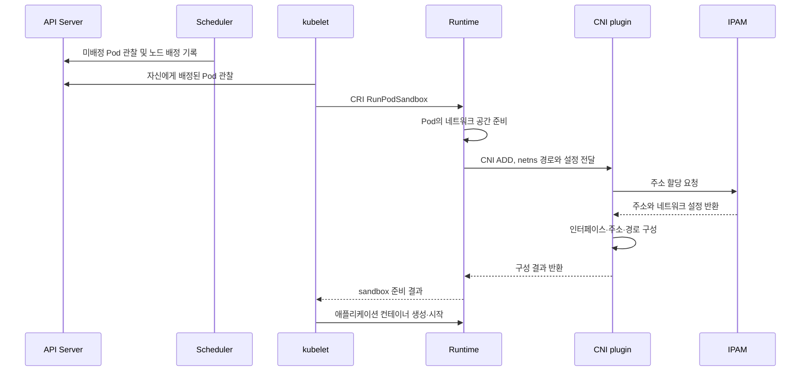

# W2. Kubernetes Networking &amp; CNI Fundamentals

## 1. W1에서 이어지는 질문

W1에서는 네트워크 공간을 나누고 잇는 Linux 기능들을 확인했으니, W2에서는 **그걸 무엇이 만들어주는지**, 그리고 **Pod가 바뀌어도 클라이언트가 같은 주소로 접속하려면 뭐가 더 필요한지** 확인하는 데 집중해보려 합니다.


## 2. Kubernetes 네트워크 모델 ≠ 구현

Kubernetes는 Pod마다 클러스터 안에서 쓸 IP를 하나씩 주고, 정책으로 막지 않는 한 Pod끼리 그 IP로 통신되게 하라고 요구함. Pod가 다른 노드에 있다고 해서 애플리케이션이 Node IP랑 포트 번호를 따로 알아야 하는 구조를 피하기 위함.

같은 Pod 안에 있는 컨테이너들은 IP랑 포트를 같이 쓰기 때문에 localhost로 통신 가능. 

참고자료: [Kubernetes 네트워크 모델](https://kubernetes.io/docs/concepts/services-networking/)

이 모델이 없다면 클라이언트가 노드별 포트 매핑 등을 전부 알고 있어야 함. Pod를 그냥 하나의 종단으로 보게 해주니까 애플리케이션 쪽을 단순하게 유지. 대신 주소를 나눠주고 노드끼리 닿게 만드는 건 인프라의 역할. 실제로 구현하는 방법은 라우팅을 쓰는 것도 있고 터널(overlay)을 쓰는 방법도 존재.


## 3. 책임 역할


| 대상                                   | 종류                      | 역할                      |
| ------------------------------------ | ----------------------- | ----------------------- |
| Pod                                  | Kubernetes 객체           | 같이 띄울 컨테이너를 적어둔 것       |
| kubelet                              | 노드 에이전트                 | 자기 노드에 배정된 Pod를 띄우라고 시킴 |
| CRI(Container Runtime Interface)     | kubelet과 런타임 사이의 규격     | sandbox랑 컨테이너 작업을 주고받음  |
| containerd 등                         | 런타임                     | sandbox랑 컨테이너를 실제로 띄움   |
| Pod sandbox                          | 런타임이 만드는 실행 환경          | Pod 컨테이너들이 같이 쓸 기반      |
| CNI                                  | 네트워크 플러그인 규격            | 연결을 추가하고 지우는 호출 방식      |
| CNI Plugin                           | 규격대로 만든 프로그램            | 인터페이스, 주소, 경로를 만들어줌     |
| IPAM(IP Address Management)          | 주소 관리                   | 주소를 주고 회수하고 겹치지 않게 함    |
| CIDR(Classless Inter-Domain Routing) | 주소 범위 표기법               | prefix로 네트워크 범위를 적음     |
| Service / EndpointSlice              | Kubernetes 객체           | 접근 지점 / 뒤에 있는 백엔드 목록    |
| kube-proxy                           | Service를 실제로 만들어주는 에이전트 | 노드에 전달 규칙을 넣음           |
| NetworkPolicy                        | Kubernetes 객체           | 허용할 통신을 적어둔 것           |


### kubelet와 CRI, 런타임 구분 이유

CRI 같은 규격이 없으면 kubelet이 런타임마다 다른 방식을 다 알아야 함. 규격을 하나 두면 kubelet은 띄워달라는 요청만 하면 됨. 대신 문제가 생겼을 때 kubelet 로그만 보면 안 되고 런타임 쪽도 확인 필요.

### CNI 구분 이유

CNI 설정이 없거나 실패하면 Pod의 네트워크 준비가 안 돼서 컨테이너가 아예 못 뜰 수 있음. 네트워크를 어떻게 만들지는 런타임이 아니라 플러그인이 정하게 나눠둔 것. 그래서 설정 파일이랑 플러그인 바이너리, 주소 상태를 따로 관리해야 함.


## 4. Pod가 네트워크를 얻는 과정



kubelet이 CRI로 런타임에 요청 -&gt; 이번 containerd 구성에서는 런타임이 CNI를 호출.

CNI는 Pod를 만들 때 한 번 실행되고 끝남. 그 다음부터는 그때 만들어둔 인터페이스랑 경로를 보고 커널이 패킷을 송신.


## 5. Address 할당 주체와 지점

### 5.1 Pod의 공유 네트워크 공간

같은 Pod 안의 컨테이너들은 네트워크 공간을 공유하기 때문에 sidecar랑 주 컨테이너가 localhost로 통신 가능. 대신 같은 포트를 두 컨테이너가 쓰려고 하면 충돌.

### 5.2 IPAM

주소를 나눠주고 겹치지 않게 관리해주는 부분. 연결을 만드는 일이랑 주소를 주는 일을 따로 떼어놨기 때문에 주소 관리 방식만 바꿀 수도 있음. 할당해둔 상태랑 실제 쓰는 상태가 안 맞으면 주소가 남거나 모자람.

### 5.3 CIDR과 Pod CIDR

노드마다 범위를 나눠주면 경로를 노드 단위로 하나만 적으면 돼서 편함. 대신 노드마다 안 쓰는 주소가 남을 수 있고 처음에 잡은 크기 때문에 나중에 늘리기 어려울 수 있으니 유의. Pod CIDR과 Service CIDR은 서로 다른 주소 공간!


## 6. Pod IP만 있으면 왜 부족한가

Pod가 새로 뜨면 IP가 변동될 수 있음. 클라이언트가 그걸 매번 따라다닐 수는 없으니 **Service가 고정된 접근 지점을 주고, EndpointSlice가 지금 살아 있는 백엔드를 리스트업.**

### Service

Service는 API 객체. ClusterIP Service는 그 객체가 살아 있는 동안 IP랑 포트 변동 없음. 그래서 클라이언트는 뒤에 Pod가 몇 개인지, 어느 Pod가 죽었는지 몰라도 됨. 단, Service를 지웠다가 다시 만들면 같은 IP가 나온다는 보장은 X.

참고자료: [Service 문서](https://kubernetes.io/docs/concepts/services-networking/service/index.html)

### EndpointSlice

Service 뒤에 붙는 주소랑 포트, 준비 상태를 나눠서 저장해둔 목록. 목록이 커져도 한 덩어리를 통째로 갱신하지 않아도 됨.

selector에 걸리는 Pod라고 다 트래픽을 받는 건 아님. readiness가 통과해야 목록에 들어감. EndpointSlice는 목록일 뿐이고 패킷이 여기를 지나가는 건 아님.

 참고자료: [EndpointSlice 문서](https://kubernetes.io/docs/concepts/services-networking/endpoint-slices/).

### kube-proxy

Service랑 EndpointSlice가 바뀌는 걸 보고 노드에 전달 규칙을 넣어줌. 실제 패킷을 옮기는 건 kube-proxy가 아니라 커널. API가 바뀌고 규칙에 반영되기까지는 시간이 좀 걸림.


## 7. Service → Pod 패킷 흐름

### 규칙이 준비되는 흐름

```text
Pod의 label/IP/준비 상태 + Service selector
    → EndpointSlice controller가 목록 갱신
    → kube-proxy가 Service·EndpointSlice 변경 관찰
    → 노드에 전달 규칙 구성
```


## 8. 주소 관리와 통신 정책을 혼동하지 않기

NetworkPolicy는 어떤 통신을 허용할지 적어두는 객체. IPAM은 주소를 나눠주는 기능이고 CIDR은 주소 범위를 적는 표기법. 각자의 역할이 다름.

IP를 받았다고 통신이 알아서 제한되지 않으므로, 허용 조건은 따로 적어줘야 함. 다만 NetworkPolicy 객체를 만든다고 항상 적용되는 건 아니고 이걸 실제로 적용해주는 네트워크 구현이 있어야 함.


## 9. 질문

1. CNI 설정이 실패하면 Pod가 만들어지는 어느 단계에서 막히는지?
2. Pod IP는 되는데 ClusterIP가 안 되면 뭐부터 확인해야 하는지?
3. 규칙을 넣는 일이랑 패킷을 옮기는 일은 각각 무엇이 맡는지?