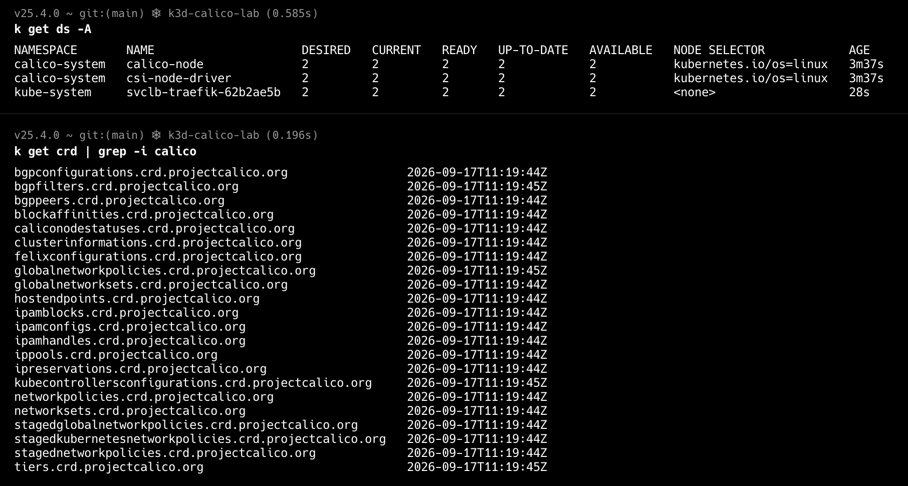

## CNI Overview 

### CNI가 해결하는 문제 다시 정리

Pod가 생성될 때 다음과 같은 작업이 필요
- Pod Network Namespace에 Network Interface 연결
- IP Address 할당
- 기본 Gateway 및 Route 구성
- 필요한 Network Namespace / Host Network 설정
- Pod 삭제 시 네트워크 자원 정리
-> CNI는 이러한 작업을 컨테이너 런타임이 사용할 수 있도록 표준화

### Comparison of Popular CNIs
| Plugin | Type | Key Features |
| --- | --- | --- |
| Flannel | L3 Overlay | Simple IPv4 overlay, minimal policy |
| Weave Net | L2 Overlay | Encryption, built-in network policies |
| Calico | BGP Routing | Scalable, advanced security policies |
| Cilium | eBPF-Powered | Fine-grained policies, service mesh |


### Interface Plugin
| Plugin        | 하는 일                                        | 분류               |
| ------------- | ------------------------------------------- | ---------------- |
| `bridge`      | bridge를 만들고 container interface를 bridge에 연결 | Interface / Main |
| `ptp`         | veth pair 생성                                | Interface / Main |
| `macvlan`     | host interface를 기반으로 macvlan interface 생성   | Interface / Main |
| `ipvlan`      | host interface를 기반으로 ipvlan interface 생성    | Interface / Main |
| `vlan`        | VLAN subinterface 생성                        | Interface / Main |
| `host-device` | 기존 host device를 container namespace로 이동     | Interface / Main |


### IPAM - 별도 CNI Plugin for IP Address Management
IPAM Plugin은 Main Plugin이 필요할 때 직접 호출

CNI Spec은 이를 Plugin Delegation으로 정의
또한 IPAM Plugin은 IP뿐 아니라 Subnet, Gateway, Routes 등의 정보를 반환하고, Main Plugin이 그 결과를 실제 interface에 적용


### Meta Plugin

```text
Primary CNI
     │
     └── eth0

Multus
     │
     ├── net1 → macvlan
     ├── net2 → ipvlan
     └── net3 → SR-IOV
```

Multus는 Calico/Cilium과 같은 관점에서 단순 비교하기보다 **Multi-Networking을 구성하기 위한 Meta Plugin**

https://aws.amazon.com/ko/blogs/industries/automated-ip-address-management-for-multus-workers-and-pods/
=> IPAM 을 automation? 23년도 글인데
어떻게 적용했는지, 26년이랑 비교했을 때 달라진 경향성이 궁금
(IPAM CNI Plugin : https://github.com/k8snetworkplumbingwg/whereabouts)

-> Multus의 IPAM 을 자동화한건 아님

Multus + non-VPC IPAM + AWS VPC/ENI 사이의 서로 다른 IP 상태를 자동으로 동기화하는 패턴을 자동화 한거임

#### 문제

Whereabouts는 Multus Pod의 IP를 관리하지만,
AWS VPC는 해당 Pod IP가 어느 Worker Node의 ENI에 연결되어 있는지 알지 못한다.

따라서 다른 Worker Node의 Multus Pod끼리는 통신이 되지 않을 수 있다.

```
Whereabouts
  └── Pod IP 할당
          ↓
      Pod net1

AWS VPC
  └── 해당 IP가 어떤 ENI에 있는지 모름
```

#### 해결 방법

Pod에 할당된 IP를 Worker Node의 ENI에 Secondary IP로 등록하여
Kubernetes의 IPAM 상태와 AWS VPC의 ENI 상태를 연결한다.

```
Whereabouts
    ↓
Pod IP 할당
    ↓
EC2 API
    ↓
Worker ENI에 Secondary IP 등록
    ↓
AWS VPC가 Pod IP의 위치를 인식
```

AWS에서는 이를 자동화하기 위해 다음과 같은 방식을 소개
- InitContainer: Pod 생성 시 IP를 ENI에 등록
- Sidecar: Pod의 IP 변경을 지속적으로 감시하고 ENI 상태 업데이트
- Worker와 Pod의 IP 충돌을 방지하기 위해 Subnet CIDR Reservation 또는 별도 IP 할당 전략 사용


|                      | AWS Blog 방식 (2023)                     | 2026 현재                                                       |
| -------------------- | -------------------------------------- | ------------------------------------------------------------- |
| Multus               | Meta-plugin                            | 동일                                                            |
| Primary              | AWS VPC CNI                            | 동일, 공식 지원                                                     |
| Secondary            | ipvlan 등                               | ipvlan/macvlan 등 계속 사용                                        |
| Pod IPAM             | Whereabouts                            | Whereabouts 계속 사용 가능                                          |
| Cluster-wide IPAM    | Whereabouts                            | **Fast IPAM/Node Slice 등 발전**                                 |
| Stale IP 정리          | 별도 대응 필요                               | **Whereabouts reconciler 제공**                                 |
| Worker IP 충돌 방지      | Lambda 또는 subnet reservation           | **subnet reservation 여전히 사용 가능**                              |
| Pod IP → AWS ENI 동기화 | Custom initContainer/sidecar + EC2 API | **여전히 AWS가 자동 관리하지 않음**                                       |
| ENI lifecycle        | Custom automation                      | AWS-aware third-party/open-source integration도 등장             |
| AWS 공식 지원 범위         | 제한적                                    | **Multus lifecycle은 AWS 지원, secondary IP management는 사용자 책임** |

Kubernetes에서 IPAM이 Pod IP를 할당했다고 해서 underlying network fabric이 해당 IP의 위치까지 자동으로 인식하는 것은 아니다. 

Multus와 IPAM이 Pod IP를 할당하는 것과, underlying network(AWS VPC)가 해당 IP의 위치를 인식하는 것은 별개의 문제이다! 는...

### 그러면 이렇게 별도의 IPAM plugin을 사용하는거랑 calico/cilium 처럼 자체적인 ipam을 사용하는건 어떤 차이가 있는가?
- Whereabouts 같은 독립 IPAM은 “IP 할당 기능을 분리해서 여러 네트워크 Plugin에서 재사용”하는 구조 (다른건 host-local, dhcp 등이 있다고 합니다...)
- Calico/Cilium의 자체 IPAM은 “자신의 Network Architecture와 Datapath까지 고려해 IPAM을 통합”하는 구조

- 독립 IPAM
    - 여러 CNI / Secondary Network에서 재사용 가능
    - Multus와 함께 여러 Network를 구성하기에 유연함
    - 주요 목적이 IP allocation 기능 분리/재사용

- CNI 자체 IPAM
    - 해당 CNI의 Networking / Datapath와 통합하기 쉬움
    - Cloud Network나 자체 IP Pool 등 CNI 특화 기능을 활용하기 용이함

따라서 어떤 IPAM이 적합한지는
**"어떤 CNI를 사용하는가"뿐만 아니라 "어떤 Network Interface의 IP를 관리하는가"**를 기준으로 판단해야 한다.

또 현재 Cilium은 자체 IPAM만 사용하는 것도 아님
Kubernetes host-scope나 AWS ENI 같은 경별 IPAM mode를 선택할 수 있음


### hands-on...
환경 세팅은 Docker Container 안에 Kubernetes Node가 들어있는 걸로.... 간단하게 k3d로 했습니다

근데 알아보니 k3d는 flannel이 기본적으로 돌아갑니다 -> k3s가 k3d를 띄우ㄱ데 그 k3s 기본 cni가 flannel이기 때문에...
그래서 calico를 더 집중하기 위해 
```
  --k3s-arg '--flannel-backend=none@server:*' \
  --k3s-arg '--disable-network-policy@server:*'
```
이런 옵션을 사용했습니다

https://docs.tigera.io/calico/latest/getting-started/kubernetes/k8s-single-node?utm_source=chatgpt.com
-> latest 3.32.2를 사용했습니다...

```
Calico Operator
      │
      ▼
Installation / 관련 CR 생성
      │
      ▼
Tigera Operator가 Calico 구성요소 생성
      │
      ├── calico-node (DaemonSet)
      ├── calico-kube-controllers
      ├── calico-typha
      └── 기타 구성요소
                │
                ▼
         CNI binary/config 설치
                │
                ▼
          Calico networking 구성
                │
                ▼
             Node Ready
```



```
                   Calico
                      │
       ┌──────────────┼──────────────┐
       │              │              │
     IPAM           Routing         Policy
       │              │              │
   IPPool          BGPPeer       NetworkPolicy
   IPAMBlock       BGPConfig     GlobalNetworkPolicy
   IPAMHandle
```
이런 여러가지 CR들이 있어서... 많은 CRD들이 정의되어있다는것을... 볼 수 있다 => "Calico의 모든 기능을 위해 제공되는 Resource type definitions"
| CRD                     | 대략적인 역할                               |
| ----------------------- | ------------------------------------- |
| `ippools`               | Pod 등에 할당할 IP Pool                    |
| `ipamblocks`            | IP Pool을 실제 allocation block으로 나눈 상태  |
| `ipamhandles`           | IP allocation을 어떤 workload가 사용 중인지 추적 |
| `blockaffinities`       | IP block과 Node의 관계 관리                 |
| `bgppeers`              | BGP Peer 설정                           |
| `bgpconfigurations`     | BGP 동작 설정                             |
| `felixconfigurations`   | Felix dataplane 설정                    |
| `networkpolicies`       | NetworkPolicy                         |
| `globalnetworkpolicies` | Cluster 전체 범위의 Calico Policy          |
| `hostendpoints`         | Host Interface를 Calico endpoint로 관리   |
| `tiers`                 | Policy hierarchy                      |
| `clusterinformations`   | Calico cluster-level 정보               |

IPPool 하나는: "그중 IPPool이라는 type으로 생성된 실제 Calico 객체"

```yaml
$ k get ippools -o yaml #IPAM 이 사용할 실제 IP Pool yaml

apiVersion: v1
items:
- apiVersion: projectcalico.org/v3
  kind: IPPool
  metadata:
    creationTimestamp: "2026-09-17T11:20:39Z"
    generation: 1
    labels:
      app.kubernetes.io/managed-by: tigera-operator
    name: default-ipv4-ippool
    resourceVersion: "1445"
    uid: af0cde39-9aeb-4166-a1ea-8bddd5ea9ed7
  spec:
    allowedUses: # 이 IP Pool의 IP를 어디에 사용할 수 있는지
    - Workload # Pod/Workload IP에 사용 가능
    - Tunnel # Calico tunnel 관련 IP 사용 가능
    assignmentMode: Automatic # Calico IPAM이 자동으로 Pod에 IP를 할당할 수 있는 Pool이라는 뜻
    blockSize: 26
    cidr: 192.168.0.0/16 # Calico가 Pod/Workload IP를 할당할 전체 주소 범위
    ipipMode: Never # IP-in-IP encapsulation은 사용하지 않는다는 의미
    natOutgoing: true
    nodeSelector: all() # 모든 Node가 이 IP Pool의 allocation 대상이 될 수 있다는 의미
    vxlanMode: CrossSubnet # 서로 다른 subnet을 가로질러야 할 때만 VXLAN encapsulation을 사용한다는 의미
kind: List
metadata:
  resourceVersion: ""
```
=> Calico endpoint에 할당할 IP 주소들의 pool을 나타내는 Resource


- vxlanMode
    - Calico 공식 문서도 VXLANCrossSubnet에서는 destination Node가 다른 subnet에 있을 때만 VXLAN을 사용한다고 설명
    - Calico에서는 IPIP와 VXLAN을 동시에 설정할 수 없어서 ipipMode가 Never인 것
        - 왜? 하나의 IPPool에서 Node 간 workload traffic에 어떤 encapsulation 방식을 사용할지 하나를 선택하는 구조이기 때문
        - 듈 다 CrossSUbnet이라고 하면 subnet 넘어갈 때 뭘 써야될지 모름

옵션
| 설정            | 의미                                         |
| ------------- | ------------------------------------------ |
| `Always`      | 해당 IPPool의 workload 간 트래픽을 항상 VXLAN으로 캡슐화  |
| `CrossSubnet` | **서로 다른 subnet의 Node 사이를 통신할 때만** VXLAN 사용 |
| `Never`       | VXLAN 사용하지 않음                              |

- Always : Node A ── VXLAN ── Node B -> 같은 서브넷이어도 항상 캡슐화
- CrossSubnet : 같은 서브넷일 때는 native... encapsulation 없이 운영하고 다른 서브넷일 때만 사용인데 
    - aws multi-AZ같은 환경에서 유용하다고 함 
- Never : underlay network가 Pod IP 대역을 라우팅할 수 있어야 한다
    - 예를 들어 BGP나 static route 등을 통해 workload IP에 대한 route가 필요


```
$ calicoctl ipam show
+----------+----------------+-----------+------------+--------------+
| GROUPING |      CIDR      | IPS TOTAL | IPS IN USE |   IPS FREE   |
+----------+----------------+-----------+------------+--------------+
| IP Pool  | 192.168.0.0/16 |     65536 | 15 (0%)    | 65521 (100%) |
+----------+----------------+-----------+------------+--------------+

$ calicoctl ipam show --show-blocks
+----------+-------------------+-----------+------------+--------------+
| GROUPING |       CIDR        | IPS TOTAL | IPS IN USE |   IPS FREE   |
+----------+-------------------+-----------+------------+--------------+
| IP Pool  | 192.168.0.0/16    |     65536 | 15 (0%)    | 65521 (100%) |
| Block    | 192.168.11.128/26 |        64 | 11 (17%)   | 53 (83%)     |
| Block    | 192.168.61.0/26   |        64 | 4 (6%)     | 60 (94%)     |
+----------+-------------------+-----------+------------+--------------+
```


Ref
- https://www.cni.dev/docs/spec/
- https://notes.kodekloud.com/docs/Kubernetes-Networking-Deep-Dive/Container-Network-InterfaceCNI/Introduction-to-Container-Network-Interface-CNI/page
