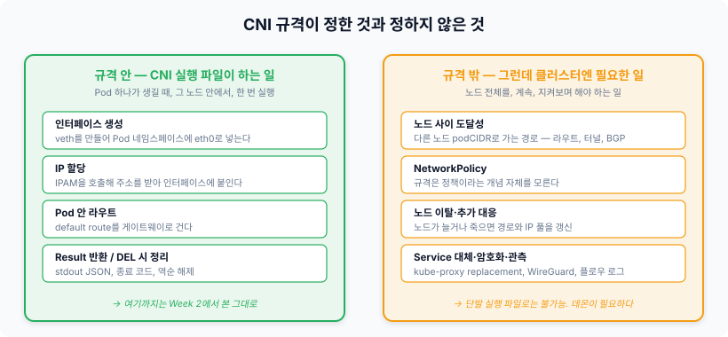
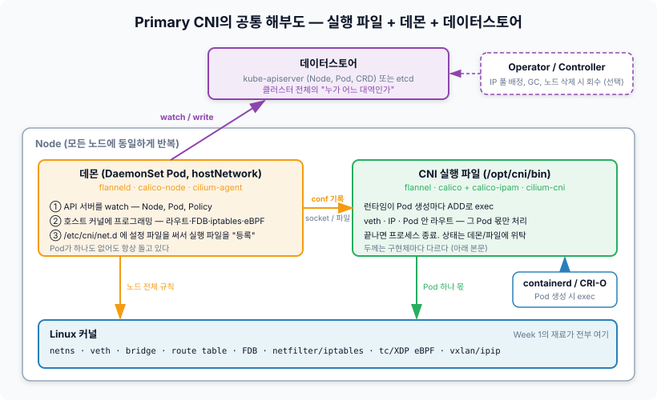
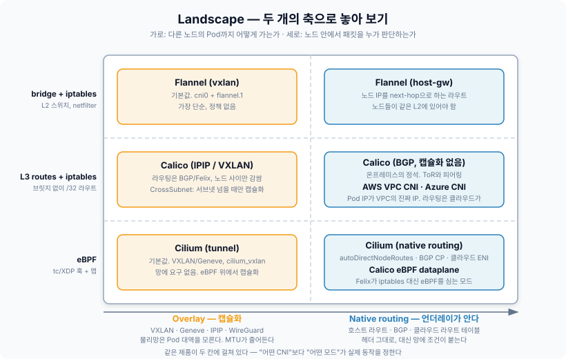
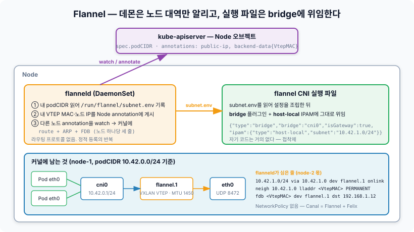
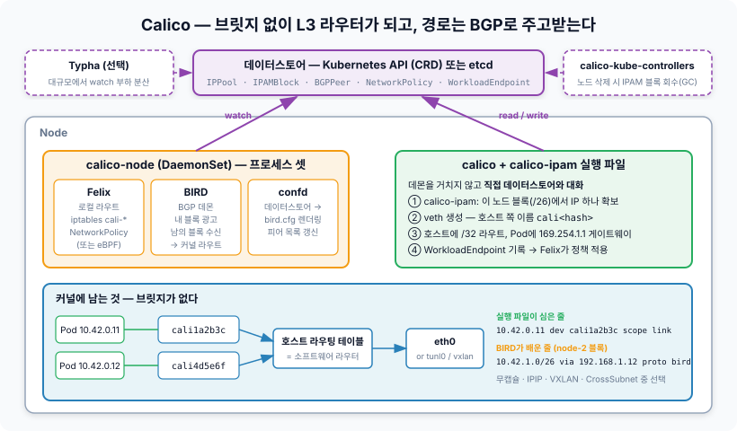
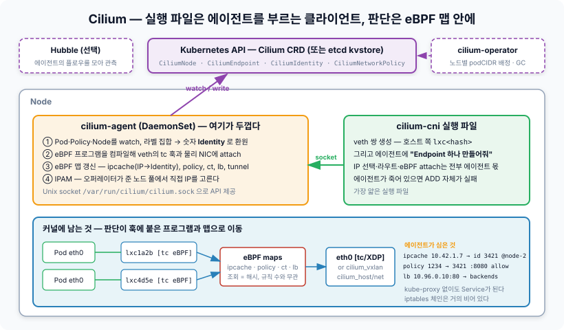

# Week 3. CNI Overview & Cloud Native Networking Landscape

노드에서 `ip route`를 치면 이런 줄이 있다.

```bash
10.42.1.0/24 via 10.42.1.0 dev flannel.1 onlink
```

다른 노드의 Pod 대역으로 가는 경로다. 그런데 지난 주에 확인한 CNI 실행 파일은 **Pod 하나가 생길 때 한 번 실행되고 끝나는 프로세스**다. 저 노드에 Pod이 하나도 없어도 이 줄은 있고, 노드가 새로 조인하면 아무 Pod도 만들지 않았는데 줄이 하나 늘어난다. 단발성 실행 파일이 심었을 리가 없다.

이번 주의 질문은 지난 주에 남긴 그 질문이다. **이 경로는 누가 심는가.** 답을 따라가면 "CNI 플러그인"이라는 말이 실제로는 두 가지 전혀 다른 것을 뭉뚱그려 부르는 이름이라는 게 드러나고, 그 두 가지를 어떻게 나눠 갖느냐가 Flannel, Calico, Cilium을 가르는 첫 번째 축이 된다.

VXLAN 헤더의 구조나 BGP 세션이 맺어지는 과정, eBPF 프로그램의 내부는 Week 4~5의 주제다. 여기서는 **각 구현체가 어떤 부품으로 이뤄져 있고 그 부품들이 어디에 서 있는지**, 지도를 그리는 데까지만 간다.

---

## 규격이 그어둔 선 — CNI가 정한 것과 정하지 않은 것

지난 주에 CNI 규격이 놀랄 만큼 얇다고 정리했다. 실행 파일, 환경변수, stdin/stdout, 종료 코드. 이번 주에 그 얇음을 반대쪽에서 다시 본다. **규격이 얇다는 건 규격 바깥에 남은 일이 많다는 뜻**이다.



그림의 왼쪽이 규격이고 오른쪽이 규격 밖이다. 그리고 우리가 "Flannel", "Calico", "Cilium"이라 부르는 것은 **규격 안의 실행 파일과 규격 밖의 데몬을 한데 묶은 제품 이름**이다. 규격을 구현한 것만으로는 그 이름을 얻지 못한다.

규격이 정한 것은 Pod 하나의 네임스페이스 안팎을 잇는 일이다. 인터페이스를 만들고, IP를 붙이고, Pod 안에 default route를 걸고, 결과를 돌려준다. **범위가 Pod 하나, 시점이 생성 순간 한 번, 장소가 그 노드 안**이다.

그런데 클러스터가 동작하려면 이것만으로는 부족하다.

| 필요한 일 | 왜 실행 파일로는 안 되는가 |
|---|---|
| 다른 노드 podCIDR로 가는 경로 | 다른 노드의 존재를 알아야 한다. 실행 파일은 자기 stdin 밖을 모른다 |
| 노드 추가·삭제 대응 | 계속 지켜봐야 한다. 실행 파일은 끝나면 사라진다 |
| NetworkPolicy | Pod이 아니라 정책 오브젝트의 변화에 반응해야 한다 |
| Service 대체, 암호화, 관측 | 전부 상태를 유지하는 장기 실행 프로세스가 필요하다 |

그래서 실제로 쓰이는 모든 Primary CNI는 **규격 안의 실행 파일과 규격 밖의 데몬을 한 세트로 배포**한다. `kubectl -n kube-system get ds`에 보이는 `kube-flannel-ds`, `calico-node`, `cilium`이 그 데몬이다. 처음의 질문에 대한 답은 여기서 나온다. **경로를 심는 것은 실행 파일이 아니라 데몬이다.**

이 구분을 잡고 나면 "CNI"라는 단어가 문맥마다 다른 것을 가리킨다는 게 보인다.

| 이렇게 쓸 때 | 실제로 가리키는 것 |
|---|---|
| "CNI 규격" | containernetworking/cni의 SPEC.md — exec 계약 |
| "CNI 플러그인" (좁은 의미) | `/opt/cni/bin`의 실행 파일 하나 — `bridge`, `host-local`, `calico` |
| "CNI" (넓은 의미, Flannel을 CNI라 부를 때) | 실행 파일 + 데몬 + 컨트롤러 + CRD를 묶은 제품 |

이번 주에 비교하는 것은 세 번째 의미다. 그리고 세 번째 의미의 CNI들은 첫 번째 규격을 거의 똑같이 구현한다. **차이는 전부 규격 밖에서 난다.**

---

## Primary CNI의 공통 해부도

구현체마다 이름은 다르지만 부품의 배치는 놀랄 만큼 닮아 있다.



| 부품 | 위치 | 하는 일 | Flannel | Calico | Cilium |
|---|---|---|---|---|---|
| 실행 파일 | `/opt/cni/bin` | Pod 생성마다 ADD. 그 Pod 몫만 | `flannel` | `calico`, `calico-ipam` | `cilium-cni` |
| 데몬 | DaemonSet, hostNetwork | Node·Pod·Policy watch → 커널 프로그래밍 | `flanneld` | `calico-node` (Felix, BIRD, confd) | `cilium-agent` |
| 컨트롤러 | Deployment | 클러스터 단위 결정, GC | 없음 | `calico-kube-controllers`, Typha | `cilium-operator` |
| 데이터스토어 | API 서버 | 누가 어느 대역인지의 원본 | Node annotation | CRD 또는 etcd | CRD 또는 etcd kvstore |

데몬이 하는 일은 셋으로 정리된다.

1. **API 서버를 watch한다.** 노드가 늘면 그 노드의 podCIDR로 가는 경로를, 정책이 바뀌면 필터 규칙을, Pod이 생기면 그 IP의 소속을 알아챈다
2. **호스트 커널에 프로그래밍한다.** 라우트, FDB, iptables 체인, eBPF 맵. 대상은 노드 전체다
3. **`/etc/cni/net.d`에 설정 파일을 쓴다.** 이게 실행 파일을 런타임에 "등록"하는 행위다

세 번째가 눈에 잘 안 띄는데 중요하다. 지난 주에 런타임이 `/etc/cni/net.d`의 사전순 첫 파일을 읽는다고 했다. 그런데 **그 파일은 누가 쓰는가.** 설치 매니페스트를 apply하면 DaemonSet의 init 컨테이너(`install-cni`)가 `/opt/cni/bin`에 실행 파일을 복사하고 `/etc/cni/net.d`에 conflist를 써넣는다. 그 전까지 노드는 이 상태다.

```
NetworkReady=false reason:NetworkPluginNotReady
message:Network plugin returns error: cni plugin not initialized
```

`kubectl get nodes`에서 `NotReady`로 보이고, hostNetwork가 아닌 Pod은 `ContainerCreating`에 멈춘다. CNI를 설치하기 전 클러스터가 이 상태인 이유이고, **CNI 데몬 Pod 자체는 hostNetwork라서 이 상태에서도 뜰 수 있는** 이유다. 데몬이 떠서 파일을 쓰면 런타임이 다음 ADD에서 그 파일을 읽고 노드가 Ready로 바뀐다.

### 실행 파일의 두께가 구현체마다 다르다

해부도에서 부품 배치는 같은데, **일을 어느 부품에 몰아두는가**가 다르다. 실행 파일 쪽만 보면 세 구현체가 셋 다 다른 선택을 했다.

| | 실행 파일이 하는 일 | 데몬과의 관계 |
|---|---|---|
| Flannel | `subnet.env`를 읽어 설정을 조립하고 `bridge` + `host-local`에 **위임**. 자기 코드가 거의 없다 | 파일로 간접 연결. 데몬이 죽어도 ADD는 된다 |
| Calico | veth 생성, 라우트, IPAM까지 **직접 수행**. 데이터스토어와 직접 대화 | 데몬을 거치지 않음. 데몬이 죽어도 ADD는 된다 (정책은 안 걸림) |
| Cilium | veth를 만들고 에이전트 소켓에 **"Endpoint 만들어줘"** 요청. 나머지는 에이전트 | 소켓으로 직접 연결. **에이전트가 죽으면 ADD가 실패**한다 |

Flannel의 실행 파일은 접착제고, Calico의 실행 파일은 독립적인 작업자고, Cilium의 실행 파일은 클라이언트다. 이 차이가 장애 양상으로 그대로 이어진다. Cilium에서 에이전트가 재시작 중이면 그 노드에 새 Pod이 안 뜨고, Calico에서 `calico-node`가 죽어 있으면 Pod은 뜨는데 NetworkPolicy가 반영되지 않는다.

---

## IPAM — 대장을 어디에 두는가

지난 주에 `host-local`이 노드 로컬 파일로 끝난다고 정리했고, 남긴 질문은 이것이었다. **IPAM이 노드 안에서 완결되지 않으면 어디까지 커지고, 노드가 죽으면 누가 회수하는가.**

세 층 구조는 그대로다. Cluster CIDR → 노드별 대역 → Pod IP. 다른 건 **두 번째 층을 누가 정하고, 세 번째 층의 할당 대장을 어디에 두는가**다.

| | 노드 대역을 정하는 주체 | 할당 대장의 위치 | 노드가 죽으면 |
|---|---|---|---|
| Flannel (`host-local`) | NodeIPAMController → `node.spec.podCIDR` | 노드 로컬 파일 `/var/lib/cni/networks/` | 대역 자체가 노드 오브젝트에 묶여 있어 노드 삭제 시 함께 반납. 파일은 노드와 함께 사라진다 |
| Calico IPAM | Calico 자체. IPPool을 `/26` 블록으로 잘라 노드에 affinity 부여 | `IPAMBlock` CRD — 클러스터 전체에서 보인다 | `calico-kube-controllers`가 노드 삭제를 감지해 블록과 할당을 GC |
| Cilium (cluster-pool) | `cilium-operator`가 노드마다 podCIDR을 잘라 `CiliumNode`에 기록 | 에이전트 메모리 + `CiliumNode`/`CiliumEndpoint` CRD | 오퍼레이터가 `CiliumNode` 삭제 시 풀을 회수 |
| AWS VPC CNI | VPC 서브넷. 노드의 ENI에 보조 IP를 붙여 확보 | 노드의 `ipamd` + ENI 상태 | 인스턴스 종료 시 ENI가 함께 삭제되며 IP가 서브넷에 반납 |

Calico의 블록 방식에는 눈여겨볼 점이 하나 있다. `/24`를 노드에 고정하는 대신 **`/26`(64개) 블록을 필요할 때 추가로 가져간다.** 한 노드에 Pod이 몰리면 블록을 더 받고, 그래도 풀이 바닥나면 **다른 노드 블록에서 IP를 빌려온다.** 이때 그 IP는 블록 단위 경로로는 도달할 수 없으므로 `/32` 경로가 따로 광고된다. 유연성의 대가로 라우팅 테이블에 예외가 늘어나는 구조다.

AWS VPC CNI는 성격이 다르다. Pod IP가 클러스터 내부 주소가 아니라 **VPC에서 그대로 라우팅되는 진짜 IP**라 오버레이가 필요 없고 노드 사이 경로도 클라우드가 안다. 대신 노드당 Pod 수가 ENI 개수 × ENI당 IP 개수로 묶이고, 서브넷이 마르면 스케줄이 실패한다. **IP 고갈이 "네트워크 문제"가 아니라 "스케줄링 문제"로 나타나는** 흔치 않은 경우다. prefix delegation으로 `/28` 단위로 받아 상한을 늘릴 수 있다.

정리하면 지난 주 질문의 답은 이렇다. IPAM은 **대장을 클러스터 단위로 올린 순간부터 컨트롤러가 필요해지고**, 회수는 그 컨트롤러의 GC가 맡는다. `host-local`이 컨트롤러 없이 되는 건 대장을 노드 안에 가두는 대가로 노드 대역을 고정했기 때문이다.

---

## 노드 사이 — 규격이 비워둔 가장 큰 자리

이제 처음 질문으로 돌아간다. node-1의 Pod이 node-2의 Pod IP로 패킷을 던졌다. Pod은 default route로 `cni0`에 넘기고, 호스트 라우팅 테이블에서 `10.42.1.0/24`에 걸린다. **그 다음이 문제다.** 물리 네트워크는 `10.42.1.0/24`가 어디 있는지 모른다. 라우터에 그 대역이 등록된 적이 없다.

이 간극을 메우는 방법은 근본적으로 두 가지뿐이다.

| | Overlay (캡슐화) | Native routing (언더레이가 안다) |
|---|---|---|
| 원리 | Pod 패킷을 노드 IP끼리의 패킷 안에 **감싸서** 보낸다 | 물리망 또는 노드에 Pod 대역 경로를 **직접 등록**한다 |
| 물리망이 보는 것 | 노드 IP 사이의 UDP(VXLAN) 또는 IP-in-IP | Pod IP가 그대로 실린 패킷 |
| 망에 요구하는 것 | 없음. 노드끼리 IP 통신만 되면 된다 | 노드가 같은 L2에 있거나, BGP 피어링, 또는 클라우드 라우트 테이블 |
| 비용 | 헤더 오버헤드 → **MTU 감소**(VXLAN 50바이트), 캡슐화 CPU | 망 설정과의 결합. 라우트 수 증가 |
| 디버깅 | `tcpdump`에 Pod IP가 안 보인다. 바깥 헤더를 벗겨야 | Pod IP가 와이어에 그대로 보인다 |

Week 1에서 "Pod의 라우팅 테이블은 두 줄"이고 판단은 전부 호스트로 밀려난다고 정리했다. 이 두 갈래도 결국 **호스트 라우팅 테이블에 `10.42.1.0/24`의 next-hop을 무엇으로 적느냐**로 환원된다.

```bash
# Overlay: next-hop이 터널 인터페이스
10.42.1.0/24 via 10.42.1.0 dev flannel.1 onlink        # Flannel VXLAN
10.42.1.0/26 via 192.168.1.12 dev tunl0 proto bird      # Calico IPIP

# Native: next-hop이 다른 노드의 실제 IP
10.42.1.0/24 via 192.168.1.12 dev eth0                  # Flannel host-gw
10.42.1.0/26 via 192.168.1.12 dev eth0 proto bird       # Calico BGP
```

한 줄 차이다. `dev`가 터널이면 커널이 패킷을 그 인터페이스에 넣는 순간 캡슐화가 일어나고, `dev`가 물리 NIC면 그대로 나간다. **데몬이 이 한 줄을 어떻게 쓰느냐가 Overlay와 Native의 전부**다. 헤더 구조와 MTU 계산은 Week 4에서 본다.

여기에 축이 하나 더 있다. 노드 사이를 어떻게 건너든, **노드 안에서 패킷을 누가 판단하는가**는 별개의 선택이다. 브릿지와 iptables가 판단하는지, 브릿지 없이 라우팅 테이블과 iptables가 판단하는지, 아니면 tc 훅에 붙은 eBPF 프로그램이 판단하는지. 두 축을 놓으면 지도가 된다.



이 지도에서 먼저 눈에 들어오는 건 **같은 제품이 두 칸에 걸쳐 있다**는 점이다. Flannel은 vxlan과 host-gw 백엔드에 따라 가로축을 옮기고, Calico는 캡슐화 여부와 eBPF 여부로 네 칸을 오간다. Cilium도 tunnel과 native routing 사이를 설정 하나로 옮긴다. **"Calico를 쓴다"는 말은 동작을 거의 특정하지 못한다.** 어느 모드인지까지 물어야 한다.

세로축은 다른 성격의 선택이다. 위로 갈수록 Week 1~2에서 본 커널 기능을 그대로 쓰고, 아래로 갈수록 그 기능들을 **우회**한다. 그래서 위쪽은 `iptables -L`과 `bridge fdb`로 디버깅이 되고, 아래쪽은 전용 도구(`cilium bpf`, `calico-bpf`)가 없으면 안 보인다.

---

## Flannel — 가장 작은 답

Flannel은 "규격 밖의 일" 중 **노드 사이 도달성 하나만** 해결한다. 정책도, Service 대체도, 암호화도 없다(WireGuard 백엔드는 예외). 그래서 구조가 가장 작다.



`flanneld`가 하는 일은 세 가지다.

1. **내 대역을 파일에 쓴다.** `node.spec.podCIDR`을 읽어 `/run/flannel/subnet.env`에 `FLANNEL_SUBNET=10.42.0.1/24`, `FLANNEL_MTU=1450` 같은 값을 적는다
2. **내 정보를 게시한다.** VXLAN 백엔드면 `flannel.1` 인터페이스의 MAC을 `flannel.alpha.coreos.com/backend-data` annotation에, 노드 IP를 `public-ip` annotation에 쓴다
3. **다른 노드를 watch해서 커널에 심는다.** 노드가 하나 보일 때마다 라우트 한 줄, ARP 한 줄, FDB 한 줄

```bash
ip route add 10.42.1.0/24 via 10.42.1.0 dev flannel.1 onlink
ip neigh add 10.42.1.0 lladdr <VtepMAC> dev flannel.1 nud permanent
bridge fdb add <VtepMAC> dev flannel.1 dst 192.168.1.12
```

세 줄이 맞물리는 방식이 흥미롭다. 라우트가 "`flannel.1`로 보내되 next-hop은 `10.42.1.0`"이라 말하고, ARP 테이블이 그 next-hop의 MAC을 미리 답해두고, FDB가 그 MAC은 `192.168.1.12`로 감싸 보내라고 알려준다. VXLAN이 원래 갖고 있는 **학습(flood-and-learn) 기능을 전부 꺼두고 정적 등록으로 대체**한 것이다. Week 1에서 브릿지가 모르는 MAC을 플러딩한다고 했는데, Flannel은 애초에 모르는 상태를 만들지 않는다. 그래서 멀티캐스트도 필요 없다.

실행 파일 쪽은 위임이다. `flannel` 플러그인은 `subnet.env`를 읽어 `bridge` + `host-local` 설정을 조립하고 넘긴다. 결과적으로 커널에 남는 모양은 **Week 1에서 그린 `cni0` 그림에 `flannel.1`이 하나 붙은 것**이다. 지난 주까지 봐온 것과 가장 가까운 CNI가 Flannel인 이유다.

| Flannel이 갖는 것 | Flannel이 갖지 않는 것 |
|---|---|
| 백엔드: vxlan(기본), host-gw, wireguard, udp(레거시) | NetworkPolicy — 필요하면 Calico Felix를 얹은 **Canal** |
| 노드 수십~수백 규모에서 충분한 단순성 | kube-proxy 대체, 암호화(WireGuard 제외), 관측 도구 |
| `subnet.env` + 세 줄로 끝나는 디버깅 | 자체 IPAM — `node.spec.podCIDR`에 전적으로 의존 |

---

## Calico — 노드를 라우터로 만든다

Calico의 출발점은 다른 발상이다. **브릿지를 쓰지 않는다.** 노드는 L2 스위치가 아니라 L3 라우터가 되고, Pod마다 호스트 라우팅 테이블에 `/32` 경로가 하나씩 생긴다.



### 브릿지 없이 Pod을 어떻게 붙이는가

Week 1에서 Pod의 default route가 `cni0`의 IP(`10.42.0.1`)를 가리켰다. 브릿지가 없으면 그 게이트웨이 IP를 가진 인터페이스가 없다. Calico는 여기서 트릭을 쓴다.

```bash
# Pod 안
$ ip route
default via 169.254.1.1 dev eth0
169.254.1.1 dev eth0 scope link

# 호스트
$ ip route | grep cali
10.42.0.11 dev cali1a2b3c4d scope link
10.42.0.12 dev cali4d5e6f7g scope link
$ cat /proc/sys/net/ipv4/conf/cali1a2b3c4d/proxy_arp
1
```

Pod은 존재하지 않는 링크로컬 주소 `169.254.1.1`을 게이트웨이로 안다. Pod이 그 주소로 ARP를 물으면 **호스트 쪽 veth가 proxy ARP로 자기 MAC을 답한다.** Pod은 그 MAC으로 프레임을 보내고, 프레임은 veth를 건너 호스트 L3 스택에 올라간다. 그 뒤는 평범한 라우팅이다. 목적지가 같은 노드 Pod이면 `/32` 경로에 걸려 그 `cali*`로, 다른 노드면 BGP가 심은 경로로 나간다.

Week 1 남은 질문 중 "노드에 Pod이 수백 개면 브릿지 플러딩이 부담이 되지 않나, Calico가 L3를 택한 게 그것과 관련 있나"가 여기서 풀린다. 관련이 있다. **L2 도메인 자체를 없애면 플러딩도 없다.** Pod끼리 ARP를 주고받을 일이 없고, 모든 전달이 라우팅 테이블 조회로 끝난다. 부수적으로 Pod이 같은 `/24`에 있어도 서로 L2로 닿지 않으므로 **정책을 우회할 L2 경로가 없다**는 보안상 이점도 따라온다.

### 세 개의 프로세스

`calico-node` 컨테이너 안에는 세 프로세스가 돈다.

| 프로세스 | 역할 | 데이터 흐름 |
|---|---|---|
| **Felix** | 로컬 데이터플레인 프로그래밍. `/32` 라우트, iptables `cali-*` 체인, NetworkPolicy, (또는 eBPF) | 데이터스토어 watch → 커널 |
| **BIRD** | BGP 데몬. 내 노드의 블록을 광고하고 남의 블록을 받아 커널 라우트로 | 다른 노드의 BIRD ↔ 커널 |
| **confd** | 데이터스토어의 피어 정보를 읽어 `bird.cfg`를 렌더링하고 BIRD를 reload | 데이터스토어 → BIRD 설정 |

Flannel과의 대비가 여기 있다. Flannel은 노드 간 경로를 **API 서버 annotation을 통해** 전파했다. Calico는 **BGP라는 진짜 라우팅 프로토콜**로 전파한다. 기본은 노드끼리 full-mesh 피어링이고, 노드가 많아지면 route reflector를 세우고, 온프레미스면 ToR 스위치와 직접 피어링해서 **물리망이 Pod 대역을 알게** 만들 수 있다. 이게 Calico가 "캡슐화 없는" 모드를 기본 선택지로 갖는 이유다. 반대로 클라우드처럼 노드가 다른 서브넷에 흩어져 있고 BGP 피어링이 안 되면 IPIP나 VXLAN으로 감싸고, `CrossSubnet` 모드로 **같은 서브넷 안에서는 감싸지 않고 넘을 때만 감싸는** 절충도 된다.

실행 파일은 데몬을 거치지 않는다. `calico`와 `calico-ipam`이 데이터스토어와 직접 대화해 블록에서 IP를 확보하고 veth와 `/32` 라우트를 만들고 `WorkloadEndpoint`를 기록한다. Felix는 그 기록을 보고 정책을 건다. 그래서 Felix가 죽어도 Pod은 뜬다. 다만 정책이 반영되지 않은 채로 뜬다.

| Calico가 갖는 것 | 대가 |
|---|---|
| 캡슐화 없는 L3 라우팅과 BGP 피어링 | 망과의 결합. 네트워크 팀과 협업이 필요해진다 |
| Kubernetes NetworkPolicy + 자체 `GlobalNetworkPolicy` | 노드당 Pod 수만큼 `/32` 라우트, 정책 수만큼 iptables 규칙 |
| iptables, nftables, eBPF 중 데이터플레인 선택 | 컴포넌트가 셋 이상 — Felix, BIRD, confd, kube-controllers, Typha |
| 블록 단위 IPAM과 borrowing | 빌린 IP마다 `/32` 예외 경로 |

---

## Cilium — 판단을 훅으로 옮긴다

Cilium은 세로축의 맨 아래다. 브릿지도, iptables 체인도, 라우팅 테이블 조회조차도 주된 경로에서 밀어내고, **veth의 tc 훅에 붙은 eBPF 프로그램이 패킷을 받는 순간 맵을 조회해 판단을 끝낸다.**



### 실행 파일은 얇고 에이전트는 두껍다

`cilium-cni`가 하는 일은 veth 쌍을 만들고 에이전트의 Unix 소켓에 "Endpoint 하나 만들어줘"라고 요청하는 것이 거의 전부다. IP 선택, 라우트, eBPF 프로그램 컴파일과 attach, 맵 갱신은 전부 `cilium-agent`가 한다. 그래서 세 구현체 중 유일하게 **에이전트가 죽어 있으면 ADD가 실패**한다. 에이전트 재시작 중 그 노드에 새 Pod이 `ContainerCreating`에 걸려 있는 게 Cilium의 흔한 장면이다.

에이전트가 두꺼운 이유는 그 안에 담긴 상태의 양이다.

| eBPF 맵 | 담는 것 | 대체하는 기존 구조 |
|---|---|---|
| `ipcache` | IP → Identity, 소속 노드, 터널 엔드포인트 | 라우팅 테이블 + FDB + ARP의 역할 일부 |
| `policy` | Identity → Identity, 포트별 허용/차단 | iptables filter 체인 |
| `ct` | 연결 추적 | conntrack |
| `lb` | ClusterIP/NodePort → 백엔드 목록 | kube-proxy의 `KUBE-SVC-*` 체인 |

지난 주에 kube-proxy iptables 모드의 문제가 **서비스 수 × 엔드포인트 수에 비례하는 선형 스캔**이라고 정리했다. eBPF 맵은 해시라 규칙이 만 개든 조회 비용이 같다. Cilium이 kube-proxy를 통째로 대체할 수 있는 근거가 이 자료구조 차이다. 그리고 Pod에서 나가는 ClusterIP 트래픽은 **`connect()` 시점에 cgroup eBPF가 목적지를 Pod IP로 바꿔버려서** 패킷이 만들어질 때 이미 DNAT가 끝나 있다. 와이어는커녕 Pod의 `eth0`에도 ClusterIP가 실리지 않는다.

### Identity — IP 대신 라벨로 판단한다

Calico를 포함한 iptables 계열 정책은 결국 **IP 주소의 집합**을 규칙에 적는다. Pod이 뜨고 죽을 때마다 집합이 바뀌고 규칙을 다시 써야 한다. Cilium은 라벨 집합에 숫자 하나를 붙인다. `{app=frontend, ns=prod}` → Identity `1234`. 같은 라벨의 Pod은 몇 개가 뜨든 같은 번호다.

정책은 Identity 사이의 관계로 저장되고, 패킷이 들어오면 `ipcache`로 출발지 IP를 Identity로 바꿔 `policy` 맵을 조회한다. **Pod이 스케일 아웃해도 정책 맵은 바뀌지 않고 `ipcache`에 한 줄만 는다.** 규칙의 크기가 Pod 수가 아니라 라벨 조합 수에 비례하는 구조다. Identity는 `CiliumIdentity` CRD로 클러스터 전체에 공유되므로 다른 노드에서 온 패킷도 같은 번호로 읽힌다.

### 노드 사이는 두 모드

Cilium도 가로축을 오간다. 기본은 **tunnel**(VXLAN 또는 Geneve)이라 망에 요구하는 것이 없다. `ipcache`에 목적지 IP의 소속 노드가 적혀 있으니 그 노드 IP로 감싸서 `cilium_vxlan`에 넣으면 된다. **native routing**으로 바꾸면 감싸지 않고 보내는데, 그러면 Pod 대역 경로를 누가 심을지 정해야 한다. 노드가 같은 L2면 `autoDirectNodeRoutes`로 에이전트가 직접 심고, 아니면 Cilium 자체 BGP 컨트롤 플레인이나 클라우드의 ENI 모드를 쓴다.

| Cilium이 갖는 것 | 대가 |
|---|---|
| eBPF 데이터플레인, kube-proxy 대체, Identity 기반 정책 | **커널 버전 요구** — 최신 기능은 5.x대 커널 전제 |
| L7 정책(HTTP, gRPC, DNS), Hubble 관측, ClusterMesh, WireGuard/IPsec | `iptables -L`로는 아무것도 안 보인다. `cilium` CLI와 `hubble`을 배워야 |
| 규칙 수와 무관한 조회 비용 | 에이전트가 단일 실패점. 에이전트 문제 = 그 노드 Pod 생성 불가 |
| 가장 많은 기능 | 가장 많은 부품과 가장 긴 문서 |

---

## 한 표로 놓아 보기

| | Flannel | Calico | Cilium |
|---|---|---|---|
| 노드 안 datapath | bridge(`cni0`) + iptables | `/32` 라우트 + iptables (또는 eBPF) | eBPF (tc/XDP) |
| 노드 사이 | VXLAN(기본) / host-gw / WireGuard | BGP 무캡슐(기본) / IPIP / VXLAN / CrossSubnet | VXLAN·Geneve(기본) / native routing |
| 경로 전파 방식 | Node annotation을 데몬이 watch | BGP (BIRD) 또는 Felix가 데이터스토어 watch | `CiliumNode` CRD를 에이전트가 watch |
| IPAM | `host-local`, `node.spec.podCIDR` 고정 | IPPool → `/26` 블록, CRD 대장, borrowing | cluster-pool(오퍼레이터 배정), kubernetes, ENI 등 |
| 실행 파일 두께 | 얇음 — `bridge`에 위임 | 두꺼움 — 직접 수행 | 가장 얇음 — 에이전트 클라이언트 |
| NetworkPolicy | 없음 (Canal로 보완) | 있음 + `GlobalNetworkPolicy`, L3/L4 | 있음 + `CiliumNetworkPolicy`, L3/L4/**L7**, Identity 기반 |
| kube-proxy 대체 | 불가 | eBPF 모드에서 가능 | 가능 (기본 권장) |
| 암호화 | WireGuard 백엔드 | WireGuard | WireGuard, IPsec |
| 관측 | 없음 | 플로우 로그(Enterprise 중심) | Hubble |
| 커널 요구 | 낮음 | 낮음 (eBPF 모드는 높음) | 높음 |
| 디버깅 도구 | `ip route`, `bridge fdb`, `iptables` | 위와 같음 + `calicoctl`, `birdcl` | `cilium bpf *`, `cilium monitor`, `hubble observe` |
| 잘 맞는 자리 | 소규모, 학습, 정책 불필요 | 온프레미스 BGP, 정책 중심, 검증된 안정성 | 대규모 Service, L7 정책, 관측이 필요한 곳 |

지도 밖에도 이름들이 있다. **Canal**은 Flannel의 도달성과 Calico의 정책을 붙인 것이고, **kube-router**는 BGP + IPVS를 데몬 하나에 담은 것, **Antrea**와 **Kube-OVN**은 OVS를 데이터플레인으로 쓴다. **Weave**는 아카이브됐다. 클라우드 관리형(AWS VPC CNI, Azure CNI, GKE Dataplane V2)은 Pod IP를 VPC에 직접 두는 대신 IPAM을 클라우드 API에 묶는다. GKE Dataplane V2가 실제로는 Cilium이라는 점도 기억할 만하다. **Multus**는 이 표의 어디에도 없다. Primary CNI가 아니라 이들 위에 두 번째 인터페이스를 얹는 메타 플러그인이고, Week 6의 주제다.

---

## 지난 주에 남긴 질문 세 개

> **"다른 노드의 podCIDR로 가는 경로"는 누가 언제 심는가. CNI 바이너리는 단발성인데.**

데몬이 심는다. Pod 생성과 무관하게 **노드가 클러스터에 보이는 순간** 심고, 노드가 사라지면 지운다. Flannel은 `flanneld`가 annotation을 보고 라우트·ARP·FDB 세 줄을, Calico는 BIRD가 BGP로 받아 커널에 넣거나 Felix가 VXLAN 경로를, Cilium은 에이전트가 `CiliumNode`를 보고 `ipcache`와 라우트를 갱신한다. 실행 파일과 데몬의 분업은 정확히 **"이 Pod 하나"와 "노드 전체"의 경계**에서 갈린다.

> **IPAM은 어디까지 커지고, 노드가 갑자기 죽었을 때 IP는 누가 회수하는가.**

대장을 노드 밖으로 올린 순간 컨트롤러가 필요해진다. Calico는 `calico-kube-controllers`, Cilium은 `cilium-operator`가 노드 삭제를 감지해 회수한다. AWS VPC CNI는 인스턴스 종료와 함께 ENI가 삭제되면서 반납된다. `host-local`은 대장이 노드와 함께 사라지고 대역은 `node.spec.podCIDR`이 반납되므로 컨트롤러가 필요 없지만, 노드가 죽지 않고 런타임만 크래시한 경우의 누수는 지난 주에 본 대로 남는다.

> **NetworkPolicy는 DNAT 전의 ClusterIP인가, 후의 Pod IP인가.**

**Pod IP다.** iptables 계열(Calico)에서 정책은 filter 테이블의 FORWARD 계열 체인에 걸리고, DNAT는 nat 테이블의 PREROUTING에서 먼저 끝난다. 훅 순서상 정책은 이미 바뀐 목적지를 본다. Cilium은 아예 `connect()` 시점에 목적지를 바꾸므로 tc 훅의 정책 프로그램이 보는 것도 Pod IP다. 그래서 NetworkPolicy 규격에 Service를 지정하는 필드가 없다. **정책이 평가되는 자리에 Service라는 개념이 남아 있지 않다.**

---

## 이번 주에 확인한 것

| 쿠버네티스에서 이렇게 보이는 것 | 실제로는 |
|---|---|
| "Flannel을 CNI로 쓴다" | 규격 안 실행 파일 + 규격 밖 데몬 + 설정 파일을 한 세트로 배포한 것 |
| 다른 노드 podCIDR로 가는 경로가 있다 | Pod과 무관하게 데몬이 노드를 watch해서 심은 줄 |
| CNI 설치 전 노드가 NotReady다 | `/etc/cni/net.d`가 비어 있어 런타임이 플러그인을 못 찾는 상태 |
| Overlay vs Native | 호스트 라우팅 테이블에서 `dev`가 터널인가 물리 NIC인가 |
| Calico에는 `cni0`가 없다 | 브릿지 대신 Pod마다 `/32` 라우트 + proxy ARP |
| Cilium에서 `iptables -L`이 비어 있다 | 판단이 tc 훅의 eBPF 프로그램과 맵으로 옮겨감 |
| Pod이 늘어도 Cilium 정책이 안 바뀐다 | 정책이 IP가 아니라 Identity 사이의 관계로 저장됨 |
| 노드가 죽어도 Calico IP가 회수된다 | 대장이 CRD에 있고 kube-controllers가 GC |

가장 인상 깊었던 대비는 **실행 파일의 두께**였다. 규격은 같은데 Flannel은 거기에 거의 아무것도 두지 않았고, Calico는 거기서 일을 끝냈고, Cilium은 거기서 데몬을 부르기만 했다. 세 선택 모두 합리적인데, 각각 "데몬이 죽었을 때 무엇이 되고 무엇이 안 되는가"라는 다른 장애 양상을 만든다. 아키텍처 그림에서 화살표 하나가 어디로 향하는지가 운영 중에 마주칠 증상을 미리 말해준다는 걸 확인한 주였다.

---

## 확인용 명령어

```bash
# 어느 CNI가 깔려 있는가
ls /etc/cni/net.d/ && cat /etc/cni/net.d/*.conflist | head -30
ls /opt/cni/bin/
kubectl -n kube-system get ds | grep -E 'flannel|calico|cilium'
kubectl -n kube-system get deploy | grep -E 'calico-kube|cilium-operator|typha'

# 노드 사이 경로 — 누가 심었나
ip route show                              # proto bird / onlink / dev flannel.1 로 구분
ip -d link show flannel.1                  # VXLAN VTEP, port 8472
ip -d link show tunl0 vxlan.calico cilium_vxlan 2>/dev/null

# Flannel
cat /run/flannel/subnet.env
kubectl get node <node> -o jsonpath='{.metadata.annotations}' | tr ',' '\n' | grep flannel
bridge fdb show dev flannel.1
ip neigh show dev flannel.1

# Calico
kubectl get ippools -o yaml
kubectl get ipamblocks                      # /26 블록과 노드 affinity
ip route | grep cali                        # /32 per pod
cat /proc/sys/net/ipv4/conf/cali*/proxy_arp
kubectl -n calico-system exec <calico-node> -- birdcl show protocols   # BGP 피어 상태
iptables -L -n | grep cali- | head

# Cilium
kubectl -n kube-system exec <cilium-pod> -- cilium status
kubectl -n kube-system exec <cilium-pod> -- cilium endpoint list       # Identity 확인
kubectl -n kube-system exec <cilium-pod> -- cilium bpf ipcache list
kubectl -n kube-system exec <cilium-pod> -- cilium bpf lb list
kubectl -n kube-system exec <cilium-pod> -- cilium bpf policy get --all
kubectl get ciliumnodes -o yaml | grep -A3 podCIDRs
hubble observe --pod <pod>                  # 플로우 관찰

# 데몬을 죽였을 때 무슨 일이 생기나 (테스트 클러스터에서)
kubectl -n kube-system delete pod -l k8s-app=cilium --wait=false && kubectl run t --image=busybox -- sleep 1h
kubectl describe pod t | tail -5            # ADD 실패 메시지 확인

# MTU — 모드가 바뀌면 여기가 바뀐다
kubectl exec <pod> -- ip link show eth0 | grep mtu   # 1500 / 1450 / 1480 / 1420
```

---

## 남은 질문

1. Flannel VXLAN은 라우트·ARP·FDB 세 줄을 정적으로 심어 학습을 껐다. 그렇다면 **VXLAN 헤더에 실리는 VNI와 바깥 UDP 포트는 실제로 어떤 역할을 남겨두고 있는가.** 노드 하나에 Pod 대역이 여러 개면 VNI가 늘어나는가, 아니면 Flannel은 VNI 하나로 끝내는가.
2. Calico가 BGP로 ToR 스위치와 피어링하면 물리망이 Pod 대역을 안다. 그런데 **노드가 죽어 BGP 세션이 끊길 때까지의 hold time 동안 그 대역으로 향한 패킷은 어디로 가는가.** Flannel의 annotation 방식과 비교해 수렴 시간에서 어느 쪽이 유리한가.
3. Cilium은 `connect()` 시점에 DNAT를 끝내 Pod의 `eth0`에도 ClusterIP가 실리지 않는다. 그렇다면 **Pod 안에서 `tcpdump`를 떠도 ClusterIP가 안 보인다는 뜻인데, 애플리케이션 로그에 찍히는 peer 주소는 어느 쪽인가.** `getpeername()`이 돌려주는 값이 어떻게 처리되는가.
4. 세 구현체 모두 `hostNetwork` 데몬이 커널을 프로그래밍한다. **두 개의 CNI 데몬이 한 노드에 동시에 돌면 정확히 무엇이 충돌하는가.** 라우트인가, iptables 체인인가, `/etc/cni/net.d`의 사전순인가. Multus는 어떻게 이 충돌을 피하는가.

---

## 마치며

지난 주 마지막에 "CNI 규격이 얇아서 Cilium 같은 구현이 가능했다"고 썼다. 이번 주에 그 문장의 뒷면을 봤다. **규격이 얇다는 건 규격 밖의 일이 많다는 것**이고, 그 일을 어떤 부품에 어떻게 나눠 담느냐가 곧 각 CNI의 정체였다. Flannel, Calico, Cilium은 같은 규격을 구현한 세 제품이 아니라, **규격이 비워둔 자리를 세 가지 다른 철학으로 채운 시스템**에 가까웠다.

그리고 그 철학이 커널의 어느 층을 쓰느냐로 드러난다는 점이 가장 흥미로웠다. Flannel은 Week 1의 브릿지 그림에 터널 하나를 붙였고, Calico는 브릿지를 빼고 노드를 라우터로 만들었고, Cilium은 라우팅 테이블과 iptables까지 밀어내고 훅에 프로그램을 걸었다. 위로 갈수록 이미 아는 도구로 읽을 수 있고 아래로 갈수록 새 도구가 필요하다. **어떤 CNI를 고르느냐는 결국 어떤 디버깅 도구를 들고 다닐 것이냐를 고르는 일**이기도 했다.

다음 주에는 지도에서 칸 하나하나로 내려간다. Flannel의 VXLAN 헤더가 실제로 어떻게 생겼는지, Calico의 BGP 세션이 어떻게 맺어지고 경로가 어떻게 흐르는지, 그리고 같은 Pod-to-Pod 패킷이 두 구현체에서 어떻게 다르게 여행하는지를 따라갈 예정이다.

---

## 참고 자료

- [containernetworking/cni — SPEC.md](https://github.com/containernetworking/cni/blob/main/SPEC.md)
- [containernetworking/plugins — reference plugins](https://github.com/containernetworking/plugins)
- [Kubernetes — Network Plugins](https://kubernetes.io/docs/concepts/extend-kubernetes/compute-storage-net/network-plugins/)
- [Flannel — Backends](https://github.com/flannel-io/flannel/blob/master/Documentation/backends.md), [Flannel — Configuration](https://github.com/flannel-io/flannel/blob/master/Documentation/configuration.md)
- [Calico — Component architecture](https://docs.tigera.io/calico/latest/reference/architecture/overview), [Calico — IPAM](https://docs.tigera.io/calico/latest/networking/ipam/get-started-ip-addresses), [Calico — Overlay networking](https://docs.tigera.io/calico/latest/networking/configuring/vxlan-ipip)
- [Cilium — Component Overview](https://docs.cilium.io/en/stable/overview/component-overview/), [Cilium — Routing](https://docs.cilium.io/en/stable/network/concepts/routing/), [Cilium — IPAM](https://docs.cilium.io/en/stable/network/concepts/ipam/), [Cilium — Identity-based security](https://docs.cilium.io/en/stable/security/network/identity/)
- [AWS VPC CNI — How it works](https://github.com/aws/amazon-vpc-cni-k8s/blob/master/docs/cni-proposal.md)
- 직접 정리한 글 — [쿠버네티스 네트워크의 본질: CNI, VXLAN, 그리고 Pod는 어떻게 통신하는가](https://marsboy02.github.io/ko/posts/kubernetes-cni-networking/)
