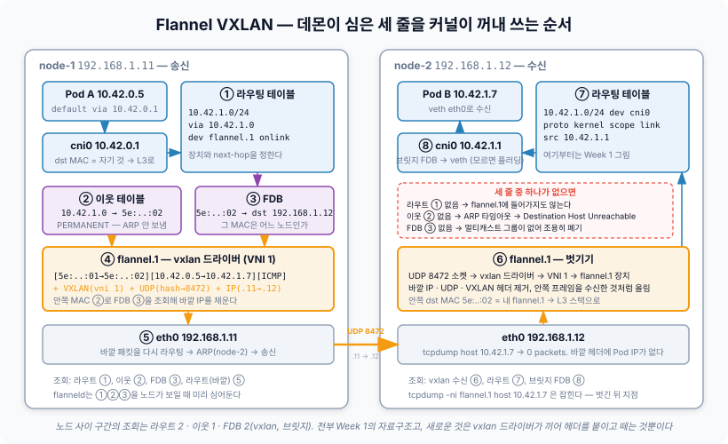
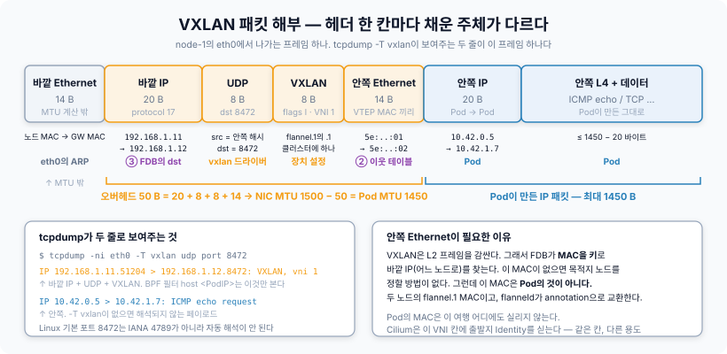
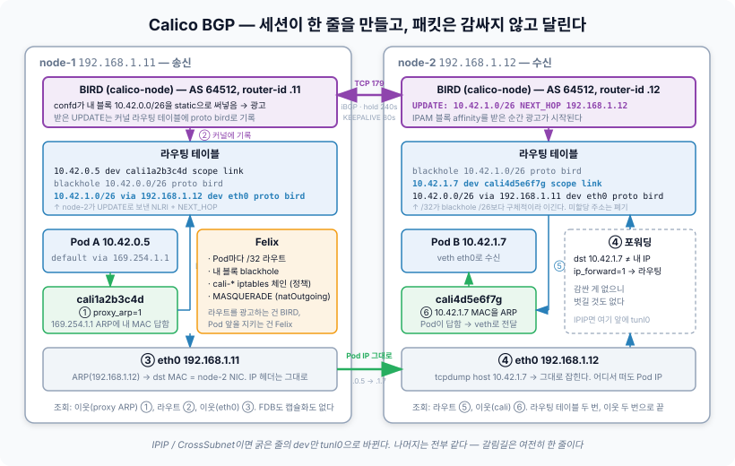
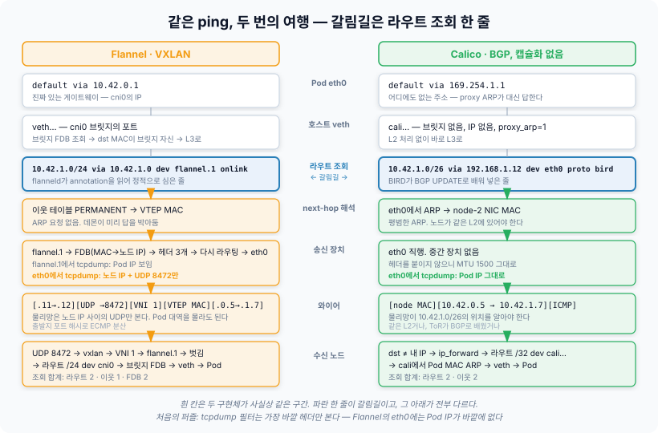
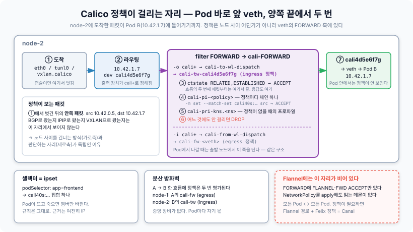

# Week 4. Primary CNI

Flannel을 쓰는 클러스터에서 node-1의 Pod(`10.42.0.5`)이 node-2의 Pod(`10.42.1.7`)으로 ping을 보내는 동안, node-1의 물리 NIC에서 그 Pod IP를 잡아봤다.

```bash
$ tcpdump -ni eth0 host 10.42.1.7
tcpdump: listening on eth0, link-type EN10MB (Ethernet)
^C
0 packets captured
```

ping은 계속 응답을 받고 있다. 그런데 와이어에는 그 주소가 없다. 필터를 바꾸면 보인다.

```bash
$ tcpdump -ni eth0 -T vxlan udp port 8472
IP 192.168.1.11.51204 > 192.168.1.12.8472: VXLAN, flags [I] (0x08), vni 1
IP 10.42.0.5 > 10.42.1.7: ICMP echo request, id 12, seq 1, length 64
```

같은 실험을 Calico(BGP, 캡슐화 없음) 클러스터에서 하면 첫 번째 명령이 그대로 잡힌다.

```bash
$ tcpdump -ni eth0 host 10.42.1.7
IP 10.42.0.5 > 10.42.1.7: ICMP echo request, id 12, seq 1, length 64
```

같은 ping이다. Pod 안에서 보면 두 클러스터는 구별되지 않는다. 지난 주에 이 차이가 호스트 라우팅 테이블의 **한 줄, `dev`가 터널인가 물리 NIC인가**로 환원된다고 정리했다. 이번 주는 그 줄 아래로 내려간다. 커널이 그 줄에 걸린 패킷을 실제로 어떻게 처리하는지, 그 줄은 어떤 대화를 거쳐 만들어지는지, 그리고 그 위에 NetworkPolicy와 IPAM이 어디에 걸리는지를 Flannel VXLAN과 Calico BGP 두 경로에서 끝까지 따라간다.

Cilium과 eBPF는 Week 5로 미룬다. 여기서는 **라우팅 테이블과 iptables로 읽을 수 있는 두 구현체**만 다룬다.

---

## 갈라지기 전 — Pod을 떠나 호스트 라우팅 테이블까지

출발은 같다. Week 1에서 본 대로 Pod의 라우팅 테이블은 두 줄이고, `10.42.1.7`은 default route에 걸려 게이트웨이의 MAC을 물은 뒤 `eth0`(veth)로 나간다. 다른 건 **게이트웨이가 무엇이고 누가 ARP에 답하는가**다.

| | Flannel | Calico |
|---|---|---|
| Pod의 게이트웨이 | `10.42.0.1` — `cni0` 브릿지의 실제 IP | `169.254.1.1` — 어디에도 없는 링크로컬 주소 |
| ARP에 답하는 것 | `cni0` 자신 | 호스트 쪽 veth `cali*`의 proxy ARP |
| 프레임이 호스트 L3에 오르는 경로 | veth → 브릿지 → 목적지 MAC이 브릿지 자신이므로 위로 | veth → 바로 호스트 L3 |

어느 쪽이든 프레임은 호스트 L3 스택에 올라와 라우팅 테이블 조회를 받는다. 그리고 여기서 갈라진다.

```bash
# Flannel
10.42.1.0/24 via 10.42.1.0 dev flannel.1 onlink

# Calico
10.42.1.0/26 via 192.168.1.12 dev eth0 proto bird
```

지난 주에 본 그 한 줄이다. 이 아래에서 커널이 무엇을 하는지가 이번 주의 첫 번째 절반이다.

---

## Flannel VXLAN — 커널이 패킷을 감싸는 순서

### 세 줄이 헤더 세 칸을 채운다

지난 주에 `flanneld`가 노드 하나당 라우트·ARP·FDB 세 줄을 심는다고 정리했다. 이번 주에 그 세 줄을 다시 보면 **각각이 캡슐화된 패킷의 헤더 한 칸씩을 미리 채워두는 것**임이 보인다.

```bash
ip route add 10.42.1.0/24 via 10.42.1.0 dev flannel.1 onlink        # ① 어느 장치로, next-hop은 누구
ip neigh add 10.42.1.0 lladdr 5e:4c:...:02 dev flannel.1 nud permanent   # ② next-hop의 MAC → 안쪽 Ethernet 목적지
bridge fdb add 5e:4c:...:02 dev flannel.1 dst 192.168.1.12               # ③ 그 MAC은 어느 노드로 → 바깥 IP 목적지
```



패킷이 라우팅 테이블에 걸린 뒤 커널이 하는 일을 순서대로 놓으면 이렇다.

1. **라우트 조회.** `10.42.1.7`은 `10.42.1.0/24`에 걸린다. 장치는 `flannel.1`, next-hop은 `10.42.1.0`. `onlink`는 "이 next-hop으로 가는 경로가 따로 없어도 이 장치에 직접 붙어 있다고 치라"는 뜻이다. `10.42.1.0`은 node-2의 `flannel.1`에 붙은 `/32` 주소다
2. **이웃 조회.** next-hop `10.42.1.0`의 MAC이 필요하다. `flanneld`가 `permanent`로 박아둔 항목이 있으니 ARP 요청 없이 즉시 node-2의 VTEP MAC이 나온다. 커널은 이 MAC을 목적지로 하는 **안쪽 Ethernet 프레임**을 만든다
3. **FDB 조회.** 프레임이 `flannel.1`에 들어가면 vxlan 드라이버가 받는다. 드라이버는 안쪽 프레임의 목적지 MAC으로 FDB를 뒤진다. 역시 `flanneld`가 박아둔 항목이 있고, 그 답이 `dst 192.168.1.12`다
4. **캡슐화.** 안쪽 프레임 앞에 VXLAN 헤더(VNI 1), UDP 헤더(목적지 8472), 바깥 IP 헤더(`192.168.1.11 → 192.168.1.12`)를 붙인다
5. **다시 라우팅.** 바깥 패킷은 평범한 UDP 패킷이다. 호스트 라우팅 테이블에서 `192.168.1.12`를 찾으면 `eth0`이고, 같은 L2면 node-2의 MAC을, 아니면 게이트웨이의 MAC을 ARP로 얻어 바깥 Ethernet 헤더를 붙여 내보낸다

세 줄이 없으면 어떻게 되는지를 뒤집어 보면 각 줄의 역할이 명확해진다. 라우트가 없으면 패킷이 `flannel.1`에 들어가지도 않는다. ARP 항목이 없으면 커널은 `flannel.1`로 ARP 요청을 보내는데, 받을 상대가 없어 타임아웃 뒤 `Destination Host Unreachable`이 난다. FDB 항목이 없으면 vxlan 드라이버는 원래 규격대로 **멀티캐스트 그룹으로 플러딩**하려 하는데 Flannel은 그룹을 설정하지 않으므로 그냥 버린다. Week 1에서 브릿지가 모르는 MAC을 플러딩한다고 했던 그 동작을 VXLAN도 갖고 있고, Flannel은 **그 동작에 도달할 일이 없게 미리 전부 채워둔다.**

### 헤더를 뜯어보면



| 층 | 크기 | 값을 정한 것 | 실제 값 |
|---|---|---|---|
| 바깥 Ethernet | 14 | `eth0`의 ARP | 노드 MAC → 노드(또는 게이트웨이) MAC |
| 바깥 IP | 20 | FDB의 `dst` | `192.168.1.11 → 192.168.1.12`, protocol 17 |
| UDP | 8 | vxlan 드라이버 | 출발지 포트 = 안쪽 헤더의 해시, 목적지 8472 |
| VXLAN | 8 | `flannel.1` 장치 설정 | flags `I`, VNI 1 |
| 안쪽 Ethernet | 14 | 이웃 테이블(`permanent`) | VTEP MAC → VTEP MAC |
| 안쪽 IP | 20 | Pod | `10.42.0.5 → 10.42.1.7` |
| 안쪽 L4 + 데이터 | | Pod | ICMP echo |

바깥 IP 20 + UDP 8 + VXLAN 8 + 안쪽 Ethernet 14 = **50바이트**. 바깥 Ethernet 14바이트는 MTU 계산에 들어가지 않으므로(MTU는 L3 페이로드 크기다) 물리 NIC MTU가 1500이면 안쪽 IP 패킷은 1450까지만 실을 수 있다. `flanneld`가 `subnet.env`에 `FLANNEL_MTU=1450`을 적고 `flannel` 플러그인이 그 값을 `bridge`에 넘겨 Pod `eth0`의 MTU가 1450이 되는 경위다. IPIP는 바깥 IP 20바이트만 붙어 1480, WireGuard는 1420이다. **Pod의 MTU를 보면 어떤 터널 위에 있는지 역산할 수 있다.**

안쪽 Ethernet 헤더가 왜 필요한가도 이 표에서 보인다. VXLAN은 L2 프레임을 L3 위에 싣는 기술이라 프레임 단위로 감싼다. 그리고 FDB가 MAC을 키로 바깥 IP를 찾으니, **안쪽 MAC이 없으면 어느 노드로 보낼지 찾을 방법이 없다.** Flannel이 노드끼리 VTEP MAC을 annotation으로 교환하는 이유가 여기 있다. Pod의 MAC은 이 여행에서 아무 역할이 없다. 안쪽 프레임의 MAC은 Pod이 아니라 두 노드의 `flannel.1` 것이다.

### VNI와 UDP 포트는 무엇을 남겨두었나

지난 주 첫 번째 질문이었다. 학습을 껐는데 VXLAN 헤더의 두 값은 무슨 역할을 남겨두었는가.

**VNI**는 원래 한 물리망 위에 논리 L2 세그먼트 1600만 개를 겹쳐 놓기 위한 식별자다. Flannel은 이 값을 **클러스터 전체에 1 하나로 고정**한다. `flannel.1`이라는 장치 이름의 `.1`이 그 VNI다. 수신 측에서 커널은 UDP 8472로 들어온 패킷의 VNI를 보고 어느 vxlan 장치에 넘길지 정하는데, 장치가 하나뿐이니 역할이 "이 패킷은 Flannel 것"이라는 표식 정도로 축소된다. 노드에 Pod 대역이 여럿이라고 VNI가 늘어나는 것도 아니다. 옛 Flannel이 지원했던 multi-network는 네트워크마다 별도 장치와 VNI를 만들었지만 제거됐다.

| | 장치 | VNI | UDP 목적지 포트 | Pod MTU (NIC 1500 기준) |
|---|---|---|---|---|
| Flannel vxlan | `flannel.1` | 1, 고정 | 8472 | 1450 |
| Calico VXLAN | `vxlan.calico` | 4096, 고정 | 4789 | 1450 |
| Cilium tunnel | `cilium_vxlan` | **출발지 Pod의 Identity** — 패킷마다 다름 | 8472 | 1450 |
| Calico IPIP | `tunl0` | 없음 — IP protocol 4 | 없음 | 1480 |

같은 VXLAN이라도 세 구현체가 VNI를 다르게 쓴다. Flannel과 Calico는 상수로 두고, **Cilium은 이 24비트에 출발지 Pod의 Identity 번호를 실어 보낸다.** 수신 노드가 `ipcache`를 뒤지지 않고도 헤더에서 바로 "누가 보냈는가"를 읽을 수 있게 한 것이다. 규격이 세그먼트 식별용으로 비워둔 칸을 정책 전달용으로 쓴 셈이다. 포트도 다르다. Linux vxlan 드라이버는 IANA 등록 이전에 만들어져 기본 포트가 8472였고, Flannel과 Cilium은 그 기본을 그대로 쓴다. Calico는 IANA 표준인 4789를 쓴다. **`tcpdump`가 8472를 VXLAN으로 자동 해석하지 않아 `-T vxlan`이 필요한 이유**가 이것이다.

**UDP 출발지 포트**는 더 실용적인 역할을 남겨두었다. vxlan 드라이버는 안쪽 헤더(MAC, IP, 포트)를 해시해 출발지 포트를 정한다. 그래서 두 노드 사이의 모든 Pod 트래픽이 바깥에서는 `192.168.1.11 → 192.168.1.12`로 똑같이 보여도, **출발지 포트가 흐름마다 달라 물리망의 ECMP나 LACP 해시가 링크를 분산**할 수 있다. IPIP에는 L4 헤더가 없어 이 분산이 안 된다. 두 노드 사이 트래픽이 전부 한 링크로 몰린다. VXLAN이 IPIP보다 헤더가 28바이트 더 크지만 굳이 UDP를 끼운 이유다.

### 반대편 — 벗기는 순서

node-2의 `eth0`에 UDP 8472 패킷이 도착한다. 커널은 이 포트에 바인딩된 소켓이 vxlan 드라이버의 것임을 알고 넘긴다. 드라이버는 VNI 1을 보고 `flannel.1`을 고르고, 바깥 헤더 세 개를 벗겨 안쪽 프레임을 `flannel.1`이 수신한 것처럼 스택에 올린다. 안쪽 프레임의 목적지 MAC이 `flannel.1` 자신의 MAC이므로 L3로 올라가고, 라우팅 테이블에서 `10.42.1.0/24 dev cni0 proto kernel scope link`에 걸린다. 그 뒤는 Week 1이다. `cni0`가 FDB에서 `10.42.1.7`의 MAC을 찾아(모르면 플러딩) veth로 넘기고 Pod이 받는다.

정리하면 Flannel VXLAN의 노드 사이 구간은 **라우팅 테이블 두 번, 이웃 테이블 한 번, FDB 두 번(vxlan, 브릿지)**의 조회로 이뤄진다. 전부 Week 1에서 본 자료구조다. 새로운 것은 vxlan 드라이버가 그 사이에 끼어 헤더를 붙이고 떼는 것뿐이다.

### host-gw — 같은 데몬, 감싸지 않는 백엔드

Flannel도 감싸지 않을 수 있다. 백엔드를 `host-gw`로 바꾸면 `flanneld`가 심는 줄이 세 줄에서 한 줄로 준다.

```bash
10.42.1.0/24 via 192.168.1.12 dev eth0
```

next-hop이 노드의 실제 IP다. 커널은 `192.168.1.12`의 MAC을 ARP로 물어 Pod IP가 그대로 실린 프레임을 내보낸다. 오버헤드가 없고 MTU도 1500이다. 대신 **모든 노드가 같은 L2에 있어야 한다.** next-hop은 ARP로 닿을 수 있는 주소여야 하니 라우터 너머의 노드에는 이 줄을 쓸 수 없다. 중간 라우터가 `10.42.1.0/24`를 모르기 때문에 감싸지 않은 패킷은 라우터에서 버려진다. `DirectRouting: true`를 켜면 같은 서브넷의 노드에는 host-gw 줄을, 다른 서브넷에는 VXLAN 세 줄을 섞어 심는다. Calico의 CrossSubnet과 같은 절충이다.

---

## Calico BGP — 경로가 만들어지는 과정

Flannel의 경로는 `flanneld`가 API 서버 annotation을 읽어 **정적으로** 심은 것이었다. Calico는 그 자리에 BGP를 둔다. 인터넷 백본에서 AS 사이의 경로를 교환하는 그 프로토콜을 그대로 노드 사이에 쓴다. "노드가 라우터가 된다"는 말이 비유가 아니다.



### 광고할 것을 정한다 — IPAM 블록이 곧 경로다

BGP로 무엇을 광고하는가. 지난 주에 본 IPAM 블록이다. node-2가 `10.42.1.0/26` 블록의 affinity를 받으면 `confd`가 데이터스토어에서 그 사실을 읽어 BIRD 설정에 블록을 정적 경로로 써넣고, BIRD가 그것을 피어에게 광고한다. 노드 자신의 커널에는 이 블록이 `blackhole`로 들어간다.

```bash
# node-2의 라우팅 테이블
blackhole 10.42.1.0/26 proto bird              # 내 블록. 할당 안 된 주소로 온 패킷은 여기서 버린다
10.42.1.7 dev cali4d5e6f7g scope link           # 할당된 Pod. /32가 blackhole보다 구체적이라 이긴다
10.42.0.0/26 via 192.168.1.11 dev eth0 proto bird   # node-1의 블록. BGP로 받은 것
```

`blackhole` 줄의 역할이 눈에 띈다. 블록 안에서 아직 Pod에 할당되지 않은 주소로 패킷이 오면, 이 줄이 없으면 default route를 타고 다시 밖으로 나가 루프를 돈다. 블록을 통째로 blackhole에 걸고 할당된 `/32`만 그 위에 얹어두면 **할당된 주소는 Pod으로, 안 된 주소는 즉시 폐기**된다. IPAM이 만든 구조가 라우팅 테이블에 그대로 비친다.

지난 주에 다른 노드 블록에서 IP를 빌려오면 `/32`가 따로 광고된다고 했다. 이 구조에서 왜 그래야 하는지가 명확하다. `/26` 광고만으로는 빌린 주소로 향한 패킷이 블록 주인 노드로 가서 blackhole에 떨어진다. 그래서 빌린 노드가 그 `/32`를 BGP로 광고해 더 구체적인 경로로 덮어써야 한다. **IPAM의 예외가 라우팅 테이블의 예외로 정확히 1:1 대응**한다.

### 세션 — TCP 179 위의 대화

BGP는 TCP 179 위에서 돈다. 두 노드의 BIRD가 세션을 맺는 과정은 인터넷의 BGP와 같다.

| 메시지 | 하는 일 | Calico에서의 값 |
|---|---|---|
| OPEN | 내 AS 번호, router-id, hold time을 제안하고 낮은 쪽으로 합의 | AS 64512(기본, 전 노드 동일), router-id = 노드 IP |
| KEEPALIVE | hold time의 1/3 간격으로 살아 있음을 알림 | BIRD 기본 hold 240초, keepalive 80초 |
| UPDATE | 경로 추가(NLRI + NEXT_HOP) 또는 철회 | `10.42.1.0/26`, next-hop `192.168.1.12` |
| NOTIFICATION | 오류와 세션 종료 | |

전 노드가 같은 AS 번호를 쓰니 iBGP다. iBGP에는 "iBGP로 받은 경로를 다른 iBGP 피어에게 다시 광고하지 않는다"는 규칙이 있어서 **모든 노드가 서로 직접 세션을 맺어야** 한다. 노드가 n개면 세션이 n(n-1)/2개다. 50노드면 1225개, 200노드면 19900개. Calico 기본값인 node-to-node mesh가 이것이고, 그래서 규모가 커지면 **route reflector**를 둔다. 몇 노드(또는 별도 장비)를 RR로 지정하면 모든 노드가 RR과만 세션을 맺고 RR이 경로를 되쏘아준다. 세션 수가 n에 비례하게 줄어든다.

온프레미스에서 진짜 이점은 그 다음이다. **ToR 스위치와 피어링**하면 물리 라우터가 Pod 블록을 배운다. 그러면 클러스터 밖에서도 Pod IP로 직접 패킷을 보낼 수 있고, 노드가 다른 서브넷에 있어도 캡슐화 없이 통한다. Flannel host-gw가 못 넘던 라우터를 Calico는 라우터에게 경로를 가르쳐서 넘는다. 대가는 네트워크 팀과의 결합이다. 스위치 설정에 클러스터의 AS 번호와 노드 IP가 들어간다.

### 받은 경로를 커널에 넣고, 패킷이 그 위를 달린다

BIRD는 UPDATE로 받은 경로를 커널 라우팅 테이블에 `proto bird` 표식을 달아 넣는다. `ip route`에서 `proto bird`가 붙은 줄은 전부 BGP로 배운 것이라는 뜻이다. 이제 패킷을 따라간다.

1. Pod이 `169.254.1.1`의 MAC을 묻고 `cali1a2b3c4d`의 proxy ARP가 답한다. 프레임이 veth를 건너 호스트 L3에 오른다
2. 라우트 조회. `10.42.1.7`은 `10.42.1.0/26 via 192.168.1.12 dev eth0 proto bird`에 걸린다
3. next-hop `192.168.1.12`의 MAC을 `eth0`에서 ARP로 얻는다. 프레임의 목적지 MAC은 node-2의 NIC, **IP 헤더는 `10.42.0.5 → 10.42.1.7` 그대로**다. 감싸는 것이 없다
4. node-2의 `eth0`이 받는다. 목적지 IP가 자기 것이 아니지만 `ip_forward=1`이므로 포워딩한다. 라우트 조회에서 `10.42.1.7 dev cali4d5e6f7g scope link`에 걸린다
5. `cali4d5e6f7g`로 Pod의 MAC을 ARP로 묻고(Pod이 답한다) veth로 넘긴다. Pod이 받는다

Flannel과 대비하면 조회 횟수가 준다. 라우팅 테이블 두 번, 이웃 테이블 두 번. FDB도, 캡슐화도, 두 번째 라우팅도 없다. 대신 **물리망이 `10.42.1.0/26`이 `192.168.1.12`에 있음을 알아야 한다는 조건**이 붙는다. 같은 L2면 노드끼리만 알아도 되고, 라우터를 넘으면 라우터가 알아야 한다.

### 망이 Pod 대역을 모르면 — IPIP와 CrossSubnet

클라우드처럼 노드가 여러 서브넷에 흩어져 있고 라우터와 피어링할 수 없는 환경이면 Calico도 감싼다. IPIP 모드에서 BIRD가 심는 줄은 이렇게 바뀐다.

```bash
10.42.1.0/26 via 192.168.1.12 dev tunl0 proto bird onlink
```

`dev`만 `tunl0`으로 바뀌었다. 커널이 `tunl0`에 패킷을 넣으면 바깥 IP 헤더 20바이트만 붙는다(protocol 4). VXLAN보다 가볍지만 앞서 본 대로 UDP 포트가 없어 ECMP 분산이 안 되고, 일부 클라우드는 protocol 4를 막는다. 그럴 때는 VXLAN 모드(`vxlan.calico`, VNI 4096, 4789)로 바꾼다.

`CrossSubnet`은 두 세계의 절충이다. BIRD의 export 필터가 **피어의 IP가 내 서브넷 안이면 `dev eth0`, 밖이면 `dev tunl0`**으로 next-hop을 다르게 써넣는다. 같은 랙 안에서는 감싸지 않고, 라우터를 넘을 때만 감싼다. 이 결정은 라우트 한 줄마다 따로 내려지므로, 한 노드의 라우팅 테이블에 `dev eth0`인 블록과 `dev tunl0`인 블록이 섞여 있는 것이 정상이다.

설치 방식에 따라 기본값이 다르다는 점은 주의할 만하다. 매니페스트 설치(`calico.yaml`)는 오랫동안 `IPIP: Always`가 기본이었고, 오퍼레이터의 quickstart 매니페스트는 `VXLANCrossSubnet`을 쓴다. "Calico를 쓴다"는 말만으로는 지난 주 지도의 어느 칸인지 알 수 없다고 했는데, **기본 설치 자체가 감싸는 모드일 수 있다**는 뜻이다. `kubectl get ippool -o yaml`로 `ipipMode`, `vxlanMode`를 직접 봐야 한다.

### 노드가 죽으면 — hold time과 실제 수렴

지난 주 두 번째 질문이다. 노드가 갑자기 죽어 BGP 세션이 끊길 때까지의 hold time 동안 그 대역으로 향한 패킷은 어디로 가는가.

정직하게 말하면 **블랙홀로 간다.** node-1의 라우팅 테이블에는 여전히 `10.42.1.0/26 via 192.168.1.12`가 있고, 커널은 그 주소로 프레임을 보낸다. 같은 L2면 ARP 캐시가 만료된 뒤 응답 없는 ARP 요청이 반복되고, 라우터 너머면 라우터가 죽은 노드 방향으로 계속 전달한다. BIRD는 KEEPALIVE가 hold time(기본 240초, Calico 템플릿이 따로 지정하지 않으면 BIRD 기본값이 적용된다) 동안 오지 않아야 세션을 끊고 경로를 철회한다. 4분이다.

그런데 Flannel과 비교하면 이 질문의 초점이 바뀐다. Flannel의 경로는 **노드 오브젝트가 API 서버에서 사라질 때** 지워진다. 노드가 죽어도 노드 오브젝트는 자동으로 삭제되지 않는다. `NotReady`로 바뀌기만 하고, 클라우드 컨트롤러가 인스턴스 소멸을 확인해 지워주지 않는 온프레미스에서는 누군가 `kubectl delete node`를 하기 전까지 영원히 남는다. **Flannel의 hold time은 무한대**다.

그런데도 두 클러스터 모두 실제로는 1분 안에 복구된다. 경로가 아니라 **쿠버네티스 쪽이 수렴하기 때문**이다. kubelet의 heartbeat가 끊기면 node-monitor-grace-period(기본 40초) 뒤 노드가 `NotReady`가 되고, 노드 라이프사이클 컨트롤러가 그 노드 Pod들의 Ready 조건을 false로 내린다. 그 순간 EndpointSlice에서 그 Pod들이 빠지고, kube-proxy가 Service의 DNAT 후보에서 제외한다. 이후로는 그 대역으로 향하는 패킷 자체가 만들어지지 않는다. 죽은 Pod IP를 직접 찍어 보내는 클라이언트만 남은 경로의 영향을 받는데, Service를 거치는 정상적인 트래픽은 거기 해당하지 않는다.

그러니 노드 간 트래픽에 한해 두 방식의 수렴 시간은 "240초 vs 무한대"가 아니라 **"둘 다 쿠버네티스의 40초에 묻힌다"**가 정확하다. hold time이 진짜 문제가 되는 곳은 따로 있다. **ToR과 피어링해서 클러스터 밖으로 경로를 광고한 경우**다. 외부 클라이언트는 EndpointSlice를 모르므로, 스위치가 죽은 노드로의 경로를 철회하기 전까지 그쪽으로 트래픽이 흘러간다. 이때는 hold time을 줄이거나 BFD 같은 빠른 장애 감지를 스위치 쪽에서 붙이는 것이 유효하고, Flannel에는 이 문제가 애초에 생기지 않는다. Flannel은 밖에 아무것도 광고하지 않기 때문이다.

---

## 같은 패킷, 두 번의 여행

두 경로를 나란히 놓는다.



| 구간 | Flannel VXLAN | Calico BGP | 여기서 `tcpdump`에 보이는 것 |
|---|---|---|---|
| Pod `eth0` | default via `10.42.0.1` | default via `169.254.1.1` | Pod IP, 양쪽 동일 |
| 호스트 veth | 브릿지 포트 `veth…` | `cali…`, proxy ARP | Pod IP, 양쪽 동일 |
| L2 처리 | `cni0` FDB 조회 → 브릿지 자신 → L3 | 없음. 바로 L3 | |
| 라우트 조회 | `/24 via 10.42.1.0 dev flannel.1 onlink` | `/26 via 192.168.1.12 dev eth0 proto bird` | |
| next-hop 해석 | 이웃 테이블 `permanent` → VTEP MAC | `eth0` ARP → 노드 MAC | |
| 장치 | `flannel.1` → FDB → 캡슐화 → 다시 라우팅 → `eth0` | `eth0` 직행 | Flannel: `flannel.1`에서는 Pod IP, `eth0`에서는 노드 IP + UDP 8472 |
| 와이어 | 노드 IP 사이의 UDP, 안에 Pod IP | Pod IP 그대로 | **처음의 퍼즐** |
| 수신 노드 | UDP 8472 → vxlan → VNI → `flannel.1` → 라우트 → `cni0` → FDB → veth | `ip_forward` → `/32 dev cali…` → ARP → veth | |
| 조회 횟수 | 라우트 2, 이웃 1, FDB 2 | 라우트 2, 이웃 2 | |
| MTU | 1450 | 1500 | |

처음의 퍼즐이 여기서 풀린다. `tcpdump`의 필터는 BPF 프로그램이고, **패킷의 가장 바깥 헤더만 본다.** Flannel의 `eth0`에서 `host 10.42.1.7`은 바깥 IP 헤더의 `192.168.1.11`, `192.168.1.12`와 비교되니 절대 맞지 않는다. `-T vxlan udp port 8472`로 바깥을 잡은 뒤 해석기에게 안쪽을 풀라고 시켜야 Pod IP가 보인다. 더 간단한 방법은 **캡슐화 전 지점에서 잡는 것**이다. `tcpdump -ni flannel.1 host 10.42.1.7`은 그대로 잡힌다. 안쪽 프레임이 `flannel.1`을 통과하는 순간은 아직 감싸지기 전이니까. Calico BGP에서는 어디서 잡아도 Pod IP다. 감싸는 지점이 없다.

이 표에서 두 구현체가 **공유하는 것**도 보인다. 양쪽 다 Pod을 나와 호스트 L3에 오르고, 라우팅 테이블 한 줄로 갈림길을 결정하고, 수신 측에서 라우팅 테이블로 veth를 찾는다. 다른 것은 그 한 줄이 가리키는 `dev` 이후의 처리뿐이다. 지난 주 정리가 이번 주에 검증됐다. **Overlay와 Native의 차이는 그 한 줄이고, 그 한 줄이 커널의 어느 드라이버를 부르는지가 전부**다.

---

## Overlay와 Underlay — 무엇을 사고 무엇을 파는가

두 단어의 뜻을 먼저 잡아둘 필요가 있다. **Underlay**는 원래 오버레이 아래에 깔린 물리망을 가리키는 말이다. Flannel VXLAN 클러스터에도 언더레이는 있다. 노드 IP끼리 통하는 그 망이다. 그런데 CNI 문맥에서 "언더레이 모드"라고 하면 **Pod 대역을 물리망이 직접 라우팅하는 방식**, 즉 지난 주 표의 Native routing을 뜻한다. 이 글에서도 그 뜻으로 쓴다.

두 방식을 가르는 실제 질문은 **"Pod 대역을 누가 아는가"**다.

| Pod 대역을 아는 범위 | 방식 | 구현 | 망에 요구하는 것 |
|---|---|---|---|
| 각 노드만 | Overlay | Flannel vxlan, Calico IPIP/VXLAN, Cilium tunnel | 노드 IP 사이 통신. 그 이상 없음 |
| 같은 L2의 노드들 | Native, L2 한정 | Flannel host-gw, Calico BGP(mesh만), Cilium `autoDirectNodeRoutes` | 모든 노드가 한 서브넷 |
| 물리 라우터까지 | Native, L3 | Calico BGP + ToR 피어링, Cilium BGP 컨트롤 플레인 | 스위치 BGP 설정, AS 번호 협의 |
| 클라우드 라우트 테이블 | Native, 클라우드 위임 | AWS VPC CNI, Cilium ENI, GKE | 클라우드 API 권한, 라우트 테이블 한도 |

위에서 아래로 갈수록 망이 더 많이 알고, 그만큼 망에 손을 대야 한다. 그 대신 얻는 것이 있다.

| | Overlay가 파는 것 | Overlay가 사는 것 |
|---|---|---|
| MTU | 50바이트(VXLAN) 또는 20바이트(IPIP). Pod MTU 1450 | |
| CPU | 캡슐화·역캡슐화. NIC 오프로드가 없으면 대역폭 상한이 눈에 띄게 내려간다 | |
| 가시성 | `eth0`의 `tcpdump`에 Pod IP가 없다. 망 장비의 플로우 로그도 노드 IP만 본다 | |
| ECMP | VXLAN은 UDP 포트 해시로 분산. IPIP는 분산 불가 | |
| 망 독립성 | | 노드끼리 IP만 통하면 어디서든 동작. 클라우드 리전 넘어도, 서브넷 달라도 |
| 운영 분리 | | 네트워크 팀의 스위치 설정을 건드리지 않는다 |
| 대역 충돌 | | Pod 대역이 물리망 대역과 겹쳐도 상관없다 |

Native routing은 이 표를 뒤집은 것이다. MTU를 잃지 않고, 와이어에 Pod IP가 그대로 보이고, 캡슐화 비용이 없다. 대신 **Pod 대역이 물리망의 주소 공간에 편입**되므로 겹치면 안 되고, 라우터의 라우팅 테이블 크기에 상한이 걸리고, 클러스터 하나 만들 때마다 네트워크 팀과 대화해야 한다.

어느 쪽이 맞는지는 환경이 정한다. 클라우드 관리형 VM 위에서 스위치를 만질 수 없으면 Overlay 또는 클라우드 라우트 테이블 위임밖에 없다. 온프레미스에 BGP를 말하는 스위치가 있으면 Native의 이점이 크고, 그게 Calico가 온프레미스에서 강한 이유다. **CrossSubnet은 두 답을 라우트 한 줄 단위로 섞는 것**이고, 그래서 대부분의 실제 클러스터가 순수한 어느 한쪽이 아니다.

---

## NetworkPolicy — 정책이 걸리는 자리

Flannel에는 NetworkPolicy가 없다. `kubectl apply`는 되지만 아무 일도 일어나지 않는다. 정책 오브젝트를 읽어 커널에 규칙을 심을 데몬이 없기 때문이다. 그래서 Flannel 클러스터에서는 모든 Pod이 모든 Pod에 닿는다. 정책이 필요하면 Flannel의 경로 위에 Calico의 Felix를 얹은 Canal을 쓴다.

Calico에서 정책을 심는 것은 Felix고, 기본 데이터플레인에서 그 자리는 iptables다. 어디에 걸리는지가 이번 주에 확인하고 싶었던 것이다.



### Pod 바로 앞, 양쪽 끝에서 두 번

Felix는 `filter` 테이블의 `FORWARD` 체인에 `cali-FORWARD`를 걸고, 거기서 **인터페이스 이름**으로 분기한다. `cali+`에서 들어온 패킷은 `cali-from-wl-dispatch`로, `cali+`로 나가는 패킷은 `cali-to-wl-dispatch`로 보내고, dispatch 체인이 인터페이스별 체인으로 다시 보낸다.

```
FORWARD
 └─ cali-FORWARD
     ├─ -i cali+  → cali-from-wl-dispatch → cali-fw-cali1a2b3c4d   # Pod에서 나오는 것: egress 정책
     └─ -o cali+  → cali-to-wl-dispatch   → cali-tw-cali4d5e6f7g   # Pod으로 들어가는 것: ingress 정책
                                                 ├─ cali-pi-<policy>   # 정책 규칙
                                                 └─ cali-pri-kns.default  # 프로파일 (정책 없을 때 네임스페이스 기본)
```

`fw`는 from-workload, `tw`는 to-workload다. 이 구조가 말하는 것은 **정책이 Pod의 veth에서, 즉 Pod 바로 앞에서 평가된다**는 것이다. node-1의 Pod A가 node-2의 Pod B에 보내면, node-1에서 A의 `cali-fw-` 체인이 egress 정책을, node-2에서 B의 `cali-tw-` 체인이 ingress 정책을 본다. 노드 사이 어딘가에 방화벽이 있는 게 아니라 **모든 Pod에 자기 몫의 방화벽이 붙어 있는** 분산 구조다.

여기서 지난 주 정리 하나가 정교해진다. 지난 주에 "iptables 계열 정책은 IP 집합을 규칙에 적어 Pod이 바뀌면 규칙을 다시 쓴다"고 했다. 정확히는 Felix는 셀렉터를 **ipset**으로 만든다. `podSelector: app=frontend`는 `cali40s:...` 같은 ipset이 되고, 규칙은 `-m set --match-set cali40s:... src`로 그 집합을 참조한다. Pod이 뜨고 죽으면 **ipset의 멤버가 바뀌고 규칙 자체는 그대로**다. 규칙을 다시 쓰는 비용은 없다. 다만 판단 근거가 여전히 IP라는 점은 변하지 않는다. 노드마다 그 IP가 어느 Pod인지 아는 상태를 유지해야 하고, 그 상태가 ipset이다.

### 캡슐화와 무관하다

정책이 veth에 걸린다는 사실에서 따라오는 것이 하나 있다. IPIP나 VXLAN 모드에서도 정책은 똑같이 동작한다. 수신 노드에서 패킷은 `tunl0`이나 `vxlan.calico`에서 **먼저 벗겨진 뒤** 라우팅되어 `cali+`로 향하고, `cali-tw-` 체인은 그 시점의 패킷, 즉 Pod IP가 드러난 안쪽 패킷을 본다. 정책 입장에서 노드 사이를 어떻게 건너왔는지는 보이지 않는다. 지난 주 지도의 가로축(어떻게 건너는가)과 세로축(어디서 판단하는가)이 독립이라고 했던 것이 여기서 다시 확인된다.

### 정책은 첫 패킷만 본다

`cali-fw-`, `cali-tw-` 체인의 첫 규칙은 정책이 아니다.

```
-A cali-tw-cali4d5e6f7g -m conntrack --ctstate RELATED,ESTABLISHED -j ACCEPT
-A cali-tw-cali4d5e6f7g -m conntrack --ctstate INVALID -j DROP
```

Week 1에서 본 conntrack이다. 흐름의 첫 패킷만 정책 체인까지 내려가고, 허용되어 conntrack에 등록된 뒤로는 그 흐름의 모든 패킷이 첫 줄에서 통과한다. 응답 패킷도 같은 흐름이므로 통과한다. NetworkPolicy가 "허용된 연결의 응답은 자동으로 허용된다"고 규격에 적어둔 것을 Calico는 conntrack 한 줄로 구현한다. 정책 규칙이 수백 개여도 흐름당 한 번만 비용을 낸다.

### 쿠버네티스 규격과 Calico의 확장

쿠버네티스 NetworkPolicy는 **허용만** 적는다. 어떤 정책의 `podSelector`에 잡힌 Pod은 그 방향(`policyTypes`)에 대해 격리되고, 잡힌 모든 정책의 허용 규칙을 합친 것만 통과한다. 거부 규칙은 없고 순서도 없다. Felix는 이것을 이렇게 옮긴다. Pod을 잡는 정책이 하나라도 있으면 `cali-tw-` 체인이 그 정책들의 `cali-pi-` 체인을 순서대로 호출하고, 어느 것에도 허용되지 않으면 끝에서 DROP한다. 정책이 하나도 없으면 프로파일 `cali-pri-kns.<namespace>`로 떨어지고 그 프로파일은 전부 허용한다.

Calico 자체 정책(`NetworkPolicy`의 `projectcalico.org/v3` 버전과 `GlobalNetworkPolicy`)은 여기에 **`order`로 순서를, `action: Deny`로 거부를, 네임스페이스 무관 전역 범위를, `HostEndpoint`로 노드 자신의 인터페이스를** 추가한다. 쿠버네티스 정책은 이 체계 안에서 order 1000의 정책으로 취급된다. 그래서 Calico 전역 정책으로 "order 500에서 특정 대역을 거부"를 걸면 쿠버네티스 정책이 뭐라고 허용하든 먼저 막힌다. 두 종류의 정책을 섞어 쓸 때 헷갈리기 쉬운 지점이다.

---

## IPAM — 블록이 경로가 되고, 풀이 모드를 정한다

지난 주에 IPAM 대장의 위치를 비교했다. 이번 주에 확인한 것은 **Calico에서 IPAM 오브젝트가 라우팅과 캡슐화까지 결정한다**는 점이다.

```yaml
apiVersion: projectcalico.org/v3
kind: IPPool
metadata:
  name: default-ipv4-ippool
spec:
  cidr: 10.42.0.0/16
  blockSize: 26              # 노드가 받아가는 블록 크기 → BGP 광고 단위
  ipipMode: CrossSubnet      # Always / CrossSubnet / Never
  vxlanMode: Never
  natOutgoing: true          # 클러스터 밖으로 나갈 때 노드 IP로 SNAT
  nodeSelector: all()        # 어느 노드가 이 풀에서 받아가는가
```

`blockSize`가 BGP로 광고되는 경로의 프리픽스 길이다. 26이면 노드당 64개씩 받아가고 라우팅 테이블에는 `/26`이 쌓인다. 노드당 Pod 상한(기본 110)을 넘기려면 블록을 여러 개 받거나 블록을 키운다. 블록이 커지면 경로 수가 줄고 낭비가 늘고, 작아지면 반대다.

`ipipMode`와 `vxlanMode`가 **풀의 속성**이라는 점이 눈여겨볼 지점이다. 캡슐화 모드는 클러스터 설정이 아니라 IPPool 설정이다. 그래서 풀을 두 개 만들어 한 풀은 캡슐화 없이, 다른 풀은 VXLAN으로 둘 수 있고, `nodeSelector`로 어느 노드가 어느 풀을 쓸지 나눌 수도 있다. 온프레미스 노드는 BGP로, 클라우드에 붙인 노드는 VXLAN으로 같은 클러스터 안에서 운영하는 구성이 이 필드들로 가능하다. **지난 주 지도에서 Calico가 여러 칸에 걸쳐 있다고 했는데, 한 클러스터가 동시에 여러 칸에 있을 수도 있다.**

`natOutgoing`은 지난 주에 짚지 않은 것이다. Pod이 클러스터 밖(인터넷, 클러스터 밖 서버)으로 나갈 때 Pod IP 그대로 나가면 응답이 돌아올 수 없다. 밖에서는 `10.42.0.0/16`을 모른다. 그래서 Felix가 `nat` 테이블 `POSTROUTING`에 "출발지가 풀 안이고 목적지가 풀 밖이면 MASQUERADE" 규칙을 심는다. Flannel도 같은 일을 `flanneld`가 한다(`--ip-masq`). 두 구현체가 정확히 같은 iptables 규칙을 다른 데몬이 심는 지점이고, ToR 피어링으로 물리망이 Pod 대역을 아는 환경에서는 이걸 꺼서 Pod IP가 밖까지 그대로 나가게 할 수 있다.

Flannel 쪽은 이번 주에 더할 것이 적다. `host-local`이 `/var/lib/cni/networks/cbr0/`(conflist의 `name`이 디렉터리명이다)에 IP마다 파일 하나로 대장을 두고, 노드 대역은 `node.spec.podCIDR`에 고정이다. 블록도, 빌려오기도, 풀도 없다. **정해진 `/24` 하나가 노드에 묶이고 그게 곧 라우트 한 줄**이다. 단순한 만큼 유연성이 없고, 노드당 Pod 상한도 사실상 그 `/24`가 정한다.

---

## 지난 주에 남긴 질문 네 개

> **VXLAN 헤더의 VNI와 바깥 UDP 포트는 실제로 어떤 역할을 남겨두고 있는가. Pod 대역이 여러 개면 VNI가 늘어나는가.**

Flannel에서 VNI는 1로 고정이고 늘어나지 않는다. 수신 커널이 어느 vxlan 장치에 넘길지 정하는 표식 이상의 역할이 없다. 반면 Cilium은 같은 칸에 출발지 Identity를 실어 정책 전달용으로 쓴다. 규격이 비워둔 칸을 구현체가 다르게 채운 예다. UDP 목적지 포트는 그 표식의 L4 버전(8472 또는 4789)이고, **UDP 출발지 포트는 안쪽 흐름의 해시라 물리망 ECMP 분산의 유일한 근거**가 된다. IPIP에는 이 포트가 없어 두 노드 사이 트래픽이 한 링크로 몰린다. UDP 8바이트를 굳이 끼운 이유다.

> **BGP 세션이 끊길 때까지의 hold time 동안 죽은 노드 대역으로 향한 패킷은 어디로 가는가. Flannel과 비교해 수렴이 어느 쪽이 유리한가.**

블랙홀로 간다. BIRD 기본값이면 240초 뒤 철회된다. Flannel은 노드 오브젝트가 지워질 때까지 경로가 남으니 사실상 무한대다. 그런데 노드 간 Pod 트래픽에서는 둘 다 **쿠버네티스가 40초 뒤 노드를 NotReady로 바꾸고 EndpointSlice에서 그 Pod들을 빼는 것**으로 먹혀 버린다. 경로가 남아 있어도 그 경로로 갈 패킷이 생기지 않는다. hold time이 진짜 문제가 되는 건 ToR 피어링으로 밖에 광고한 경로다. 외부 클라이언트는 EndpointSlice를 모른다. 그 경우 Calico는 hold time을 조정하거나 스위치 쪽 장애 감지에 의존해야 하고, Flannel은 밖에 광고하는 것이 없어 문제 자체가 없다.

> **Cilium이 `connect()` 시점에 DNAT를 끝내면 애플리케이션 로그의 peer 주소는 어느 쪽인가. `getpeername()`은 어떻게 처리되는가.**

Cilium은 `connect()`만 가로채는 게 아니라 **`getpeername()`도 가로채서 역변환**한다. 커널 5.8에 `cgroup/getpeername` 훅이 추가된 것이 정확히 이 용도였다. 그래서 클라이언트 애플리케이션이 peer를 물으면 실제 소켓은 Pod IP에 연결돼 있어도 ClusterIP가 돌아온다. 애플리케이션은 자기가 Service에 붙어 있다고 믿고, 커널의 소켓과 와이어는 Pod IP만 안다. Week 5에서 이 훅들을 직접 볼 때 확인할 항목으로 남긴다.

> **두 CNI 데몬이 한 노드에 동시에 돌면 무엇이 충돌하는가. Multus는 어떻게 피하는가.**

세 층에서 각각 다른 일이 벌어진다. **`/etc/cni/net.d`의 사전순**이 Pod 생성을 결정한다. `10-calico.conflist`와 `10-flannel.conflist`가 함께 있으면 Calico가 ADD를 받는다. 그런데 **데몬은 둘 다 돈다.** `flanneld`는 `flannel.1`을 만들고 `10.42.1.0/24 dev flannel.1`을 심고, BIRD는 `10.42.1.0/26 via … dev eth0`를 심는다. `/26`이 `/24`보다 구체적이라 Calico 경로가 이기지만, Calico 풀이 podCIDR과 다른 대역(기본 `192.168.0.0/16`)이면 두 대역이 따로 놀아 충돌조차 안 나고 그냥 혼란스럽다. **iptables**는 각자 자기 체인(`FLANNEL-*`, `cali-*`)을 쓰고 `FORWARD`에 ACCEPT를 얹으므로 충돌보다 중복이다. Canal은 이 조합을 의도적으로 한 것이고, 그래서 Canal에는 데몬이 `flanneld`와 Felix 둘이지만 **라우트는 `flanneld`만 심고 Felix는 정책만 심도록** 역할을 나눠 놓았다.

Multus는 두 가지로 피한다. 첫째, `00-multus.conf`를 써서 **사전순 첫 자리를 자기가 차지**하고 원래 Primary CNI의 conflist를 위임 대상으로 읽는다. 둘째, 두 번째 인터페이스용 플러그인(macvlan, ipvlan, SR-IOV)은 **노드 라우트를 심는 데몬이 없는 순수 실행 파일**이다. 데몬을 가진 Primary는 하나만 두고, 나머지는 데몬 없이 Pod 하나 몫만 하는 구조라 규격 밖의 일이 겹치지 않는다. Week 6의 주제다.

---

## 이번 주에 확인한 것

| 쿠버네티스에서 이렇게 보이는 것 | 실제로는 |
|---|---|
| Flannel `eth0`에서 `tcpdump host <PodIP>`가 안 잡힌다 | BPF 필터는 바깥 헤더만 본다. `flannel.1`에서 잡거나 `-T vxlan` |
| Pod MTU가 1450이다 | 바깥 IP 20 + UDP 8 + VXLAN 8 + 안쪽 Ethernet 14 = 50바이트를 뺀 값 |
| `flanneld`가 노드마다 세 줄을 심는다 | 라우트 → 장치와 next-hop, 이웃 → 안쪽 MAC, FDB → 바깥 IP. 헤더 한 칸씩 |
| `flannel.1`의 `.1` | VNI. 클러스터 전체에 하나. Cilium은 이 칸에 Identity를 싣는다 |
| Calico `ip route`에 `proto bird` | BGP UPDATE로 받아 BIRD가 커널에 넣은 경로 |
| Calico 노드에 `blackhole /26` | 내 블록 중 미할당 주소를 즉시 폐기. 할당된 `/32`가 그 위에 얹힘 |
| 빌려온 IP가 `/32`로 광고된다 | `/26` 광고만으로는 블록 주인의 blackhole에 떨어지기 때문 |
| Calico `CrossSubnet`에서 `dev`가 섞여 있다 | BIRD 필터가 피어가 같은 서브넷인지에 따라 라우트마다 `eth0`/`tunl0`을 고른다 |
| 노드가 죽어도 1분이면 트래픽이 정상화된다 | 경로가 아니라 EndpointSlice가 수렴한 것. BGP hold time과 무관 |
| NetworkPolicy가 IPIP에서도 똑같이 동작한다 | 정책이 벗긴 뒤의 veth에 걸린다. 건너온 방식은 보이지 않는다 |
| Pod이 스케일 아웃해도 `iptables -S`가 안 바뀐다 | Felix는 셀렉터를 ipset으로 만든다. 멤버만 바뀐다 |
| Calico에서 캡슐화 모드를 바꾸려면 IPPool을 고친다 | 캡슐화는 클러스터가 아니라 풀의 속성. 풀마다 다를 수 있다 |

이번 주 가장 인상 깊었던 것은 **Flannel의 세 줄이 헤더 세 칸에 대응한다**는 발견이었다. 지난 주까지는 "데몬이 세 줄을 심는다"까지만 알았는데, 그 세 줄이 각각 라우팅·이웃·FDB라는 서로 다른 커널 테이블에 들어가는 이유가 캡슐화된 패킷의 서로 다른 헤더를 하나씩 채우기 위한 것임을 보고 나서야 VXLAN이 실제로 무엇을 하는지 이해했다. 그리고 그 대비로 Calico가 세 줄을 라우트 한 줄로 줄이는 대신 그 한 줄을 만드는 데 BGP 세션 전체를 동원한다는 점이, 두 구현체가 어디서 비용을 내는지를 정확히 보여줬다.

---

## 확인용 명령어

```bash
# ── 처음의 퍼즐 재현 ──
tcpdump -ni eth0 host <PodIP>                       # Flannel VXLAN: 0 packets / Calico BGP: 잡힘
tcpdump -ni eth0 -T vxlan udp port 8472             # Flannel: 바깥 + 안쪽 모두 해석
tcpdump -ni flannel.1 host <PodIP>                  # 캡슐화 전 지점에서 잡기
tcpdump -ni eth0 -T vxlan udp port 4789             # Calico VXLAN 모드
tcpdump -ni eth0 ip proto 4                         # Calico IPIP 모드

# ── Flannel: 세 줄과 헤더 ──
ip route show | grep flannel.1                      # ① 라우트 (onlink)
ip neigh show dev flannel.1                         # ② 이웃 — PERMANENT
bridge fdb show dev flannel.1                       # ③ FDB — dst <노드 IP>
ip -d link show flannel.1                           # vxlan id 1 local <IP> dev eth0 port 8472, srcport 범위
cat /run/flannel/subnet.env                         # FLANNEL_MTU=1450
kubectl exec <pod> -- ip link show eth0 | grep mtu  # 1450 / 1480 / 1420 / 1500 으로 모드 역산
kubectl get node <node> -o jsonpath='{.metadata.annotations.flannel\.alpha\.coreos\.com/backend-data}'  # VtepMAC

# 세 줄 중 하나를 지우면 무슨 일이 (테스트 클러스터에서)
ip neigh del 10.42.1.0 dev flannel.1 && ping -c1 -W1 10.42.1.7   # Destination Host Unreachable
bridge fdb del <VtepMAC> dev flannel.1 && ping -c1 -W1 10.42.1.7 # 조용히 버려짐

# ── Calico: BGP와 경로 ──
ip route show proto bird                            # BGP로 받은 경로 + blackhole
ip route show | grep -E 'tunl0|vxlan.calico'        # 캡슐화 여부 (dev로 판단)
kubectl get ippool -o yaml | grep -E 'cidr|blockSize|ipipMode|vxlanMode|natOutgoing'
kubectl get ipamblocks -o custom-columns=CIDR:.spec.cidr,NODE:.spec.affinity
calicoctl node status                               # BGP 피어 상태, Established 여부
kubectl -n calico-system exec <calico-node> -- birdcl show protocols all Mesh_192_168_1_12 | grep -iE 'hold|keepalive|state'
kubectl -n calico-system exec <calico-node> -- birdcl show route all   # 광고 중 / 수신한 경로
ss -tnp | grep :179                                 # 세션 수 = 피어 수
cat /proc/sys/net/ipv4/ip_forward                   # 1 이어야 함
cat /proc/sys/net/ipv4/conf/cali*/proxy_arp

# ── NetworkPolicy가 걸리는 자리 ──
iptables -S FORWARD | head -3                       # cali-FORWARD 진입
iptables -S cali-FORWARD
iptables -S cali-to-wl-dispatch                     # 인터페이스별 분기
iptables -S cali-tw-<caliXXXX>                      # 첫 줄 conntrack, 그 다음 cali-pi-*, 마지막 DROP/프로파일
ipset list | grep -A5 cali40s                       # 셀렉터가 ipset으로
iptables -t nat -S POSTROUTING | grep -iE 'cali|flannel'   # natOutgoing / --ip-masq

# ── 노드가 죽으면 ──
kubectl get node -w                                 # ~40초 뒤 NotReady
kubectl get endpointslice -w                        # Pod 제거 시점
ip route show proto bird | grep <dead-node-ip>      # BGP 철회 시점 (hold time)
ip route show | grep flannel.1                      # Flannel: 노드 오브젝트 삭제 전까지 유지
```

---

## 남은 질문

1. Calico의 정책은 veth의 iptables에서 conntrack으로 "첫 패킷만" 봤다. Cilium은 iptables를 밀어냈으니 conntrack도 없다. **tc 훅의 eBPF 프로그램은 응답 패킷을 어떻게 허용하는가.** 자기만의 연결 추적 맵을 갖는가, 그렇다면 커널 conntrack과 어떻게 공존하는가.
2. Calico도 eBPF 모드가 있고 Cilium도 VXLAN을 쓴다. 지난 주 지도에서 같은 칸에 놓이는 이 두 조합은 **실제로 무엇이 다른가.** Identity 하나로 설명되는가, 아니면 데이터플레인 설계가 근본적으로 다른가.
3. Cilium은 `connect()`에서 DNAT를 끝내지만 그 훅은 **cgroup에 붙는다.** 그러면 `hostNetwork` Pod이나 노드 자신의 프로세스, 그리고 클러스터 밖에서 NodePort로 들어오는 패킷은 소켓 훅을 거치지 않는다. 그 경로의 Service 처리는 어디서 하는가.
4. Cilium이 VNI에 Identity를 싣는다면 **캡슐화 없는 native routing 모드에서는 Identity를 어떻게 전달하는가.** 수신 노드가 `ipcache`로 출발지 IP를 다시 찍는 것뿐인가, 그러면 Identity를 헤더에 싣는 이점은 무엇인가.

---

## 마치며

지난 주에 "Overlay와 Native의 차이는 라우팅 테이블 한 줄"이라고 정리했고, 이번 주에 그 한 줄 아래로 내려갔다. 내려가 보니 그 한 줄은 정말로 갈림길이었다. `dev flannel.1`이면 커널이 vxlan 드라이버를 부르고, 드라이버는 이웃 테이블과 FDB에서 데몬이 미리 채워둔 값을 꺼내 헤더 세 개를 붙인다. `dev eth0`이면 아무것도 부르지 않는다. **차이는 한 줄이지만 그 한 줄을 만들기 위해 두 구현체가 동원하는 것은 전혀 다르다.** Flannel은 API 서버의 annotation을 읽어 세 줄을 정적으로 심고, Calico는 노드끼리 BGP 세션을 맺어 한 줄을 동적으로 배운다.

그리고 그 위에 얹힌 것들이 그 한 줄과 독립이라는 점도 확인했다. 정책은 veth에 걸려 어떻게 건너왔는지 모르고, IPAM 블록은 BGP 광고 단위가 되고 IPPool은 캡슐화 모드를 들고 있다. **노드 사이를 어떻게 건너는가, 노드 안에서 누가 판단하는가, IP를 누가 어떻게 나누는가**가 세 개의 독립된 결정이고, "Flannel"이나 "Calico"라는 이름은 그 세 결정의 특정 조합에 붙은 상표에 가까웠다.

이번 주 도구는 전부 Week 1의 것이었다. `ip route`, `ip neigh`, `bridge fdb`, `iptables`, `tcpdump`. 지난 주에 "어떤 CNI를 고르느냐는 어떤 디버깅 도구를 들고 다닐 것이냐"라고 썼는데, Flannel과 Calico는 같은 도구로 끝까지 읽을 수 있는 쪽이었다. 다음 주에는 그 도구가 통하지 않는 곳으로 간다. Cilium이 veth의 tc 훅에서 패킷을 받아 라우팅 테이블도 iptables도 거치지 않고 판단을 끝낼 때, 그 판단을 무엇으로 들여다볼 수 있는지 따라갈 예정이다.

---

## 참고 자료

- [RFC 7348 — Virtual eXtensible Local Area Network (VXLAN)](https://www.rfc-editor.org/rfc/rfc7348)
- [Linux kernel — VXLAN documentation](https://www.kernel.org/doc/Documentation/networking/vxlan.txt)
- [Flannel — Backends (vxlan, host-gw, DirectRouting)](https://github.com/flannel-io/flannel/blob/master/Documentation/backends.md), [Flannel — Troubleshooting](https://github.com/flannel-io/flannel/blob/master/Documentation/troubleshooting.md)
- [Calico — Configure BGP peering](https://docs.tigera.io/calico/latest/networking/configuring/bgp), [Calico — Overlay networking (IPIP / VXLAN / CrossSubnet)](https://docs.tigera.io/calico/latest/networking/configuring/vxlan-ipip), [Calico — Determine best networking option](https://docs.tigera.io/calico/latest/networking/determine-best-networking)
- [Calico — IP pool resource](https://docs.tigera.io/calico/latest/reference/resources/ippool), [Calico — IPAM blocks and borrowing](https://docs.tigera.io/calico/latest/networking/ipam/get-started-ip-addresses)
- [Calico — iptables dataplane, chains and marks](https://docs.tigera.io/calico/latest/reference/felix/configuration), [Calico — Network policy tutorial](https://docs.tigera.io/calico/latest/network-policy/get-started/calico-policy/calico-network-policy)
- [BIRD — BGP protocol reference (hold time, keepalive)](https://bird.network.cz/?get_doc&v=20&f=bird-6.html)
- [RFC 4271 — A Border Gateway Protocol 4 (BGP-4)](https://www.rfc-editor.org/rfc/rfc4271)
- [Kubernetes — Network Policies](https://kubernetes.io/docs/concepts/services-networking/network-policies/), [Kubernetes — Node status and heartbeats](https://kubernetes.io/docs/reference/node/node-status/)
- [Cilium — Encapsulation and the VNI field](https://docs.cilium.io/en/stable/network/concepts/routing/#encapsulation), [Cilium — Socket-based load balancing](https://docs.cilium.io/en/stable/network/kubernetes/kubeproxy-free/#socket-loadbalancer-bypass-in-pod-namespace)
- [tcpdump(1) — `-T vxlan`](https://www.tcpdump.org/manpages/tcpdump.1.html)
- 발표에서 함께 언급한 비교 대상 — [MetalLB의 L2 모드와 BGP 모드 (KANS 5주차)](https://hackjsp.tistory.com/65#BGP%20Mode-1): Flannel host-gw/VXLAN과 Calico BGP의 대비가 MetalLB의 L2 모드와 BGP 모드의 대비와 같은 구조다. [HAProxy 개념 및 구성 가이드](https://somaz.tistory.com/298)
- 직접 정리한 글 — [쿠버네티스 네트워크의 본질: CNI, VXLAN, 그리고 Pod는 어떻게 통신하는가](https://marsboy02.github.io/ko/posts/kubernetes-cni-networking/)
