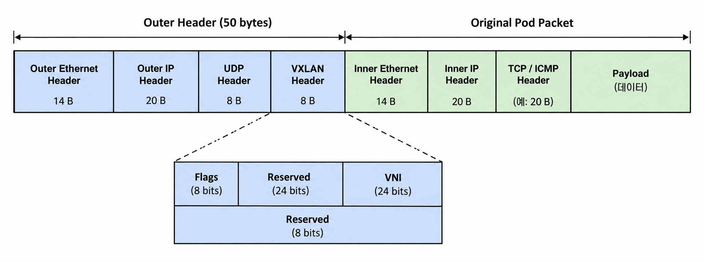
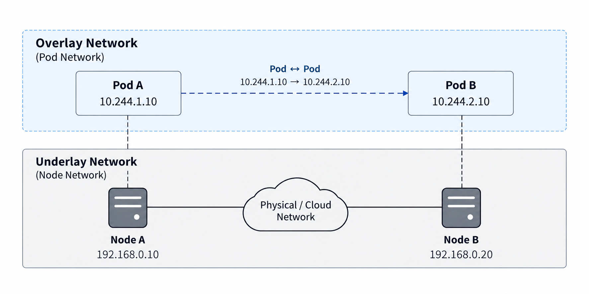
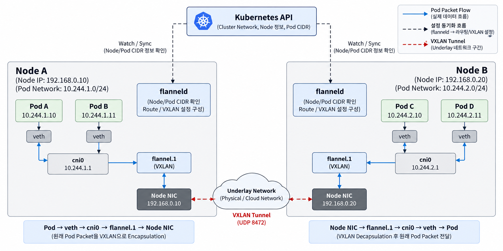
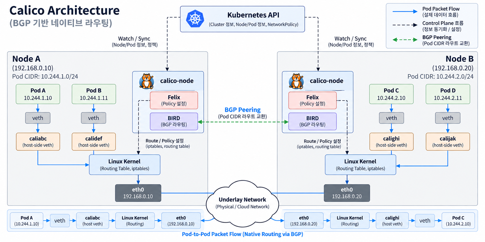
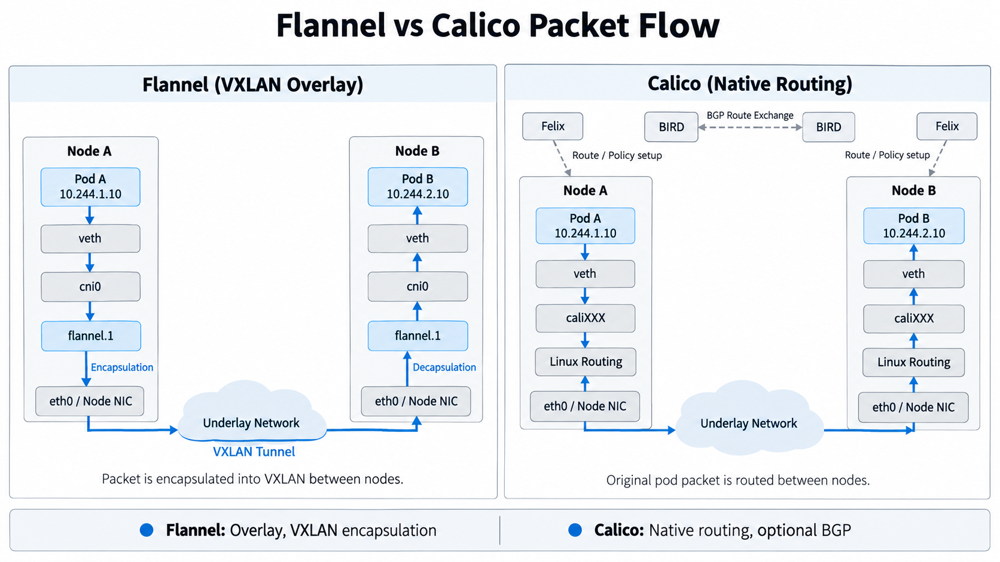

# Week 4. Primary CNI

CNI(Container Network Interface)는 Container Runtime이 Network Plugin을 호출하여 Container의 Network Interface, IP, Route 등을 구성하기 위한 표준 규격이다.

그중 **Primary CNI**는 CNI 규격을 기반으로 Pod가 기본적으로 사용하는 Network Interface와 Pod Network를 구성하는 주 Network Plugin 또는 Network Solution이다.

Kubernetes에서는 여러 Node에 Pod가 분산되기 때문에, 서로 다른 Node의 Pod까지 어떻게 연결할 것인지가 중요하다.

대표적인 Primary CNI인 **Flannel과 Calico**는 이 문제를 서로 다른 방식으로 해결한다.

---

## 1. Flannel

Flannel은 **여러 Node에 흩어진 Pod Network 사이의 기본적인 L3 연결성을 제공하는 데 집중한 Network Solution**이다.

다음과 같은 Pod Network를 가정해보자.

```text
Cluster Pod Network
10.244.0.0/16

Node A
Node IP     : 192.168.0.10
Pod Network : 10.244.1.0/24

Node B
Node IP     : 192.168.0.20
Pod Network : 10.244.2.0/24
```

Node A의 Pod가 `10.244.2.10`으로 Packet을 보내려면, `10.244.2.0/24` Network가 Node B에 있다는 사실과 Node B까지 Packet을 전달하는 방법을 알아야 한다.

Flannel에서 이 문제를 해결하는 대표적인 방식이 **VXLAN**이다.

---

### 1.1 VXLAN Encapsulation과 Packet 구조

**VXLAN(Virtual Extensible LAN)** 은 원래 Packet을 다른 Packet 안에 Encapsulation하여 전달하는 Tunnel 기술이다.

Flannel에서 VXLAN을 사용하면 원래 Pod Packet 바깥에 새로운 Header를 추가하고, Node IP를 이용해 다른 Node까지 전달한다.



IPv4 기반 VXLAN에서는 캡슐화로 인해 약 50 byte의 Overhead가 추가된다.

#### VXLAN과 MTU

MTU(Maximum Transmission Unit)는 Network Interface가 한 번에 전송할 수 있는 최대 Packet 크기다.

Underlay Network의 MTU가 1500 byte라면, VXLAN Overhead를 고려해 Pod Network에서는 약 1450 byte의 MTU를 사용하는 경우가 많다.

```text
Underlay MTU    1500 byte
VXLAN Overhead -  50 byte
──────────────────────────
Pod MTU         1450 byte
```
MTU 설정이 맞지 않으면 Fragmentation이나 Packet Drop이 발생할 수 있다.

---

### 1.2 Overlay와 Underlay Network

VXLAN으로 Encapsulation된 Packet의 바깥쪽에는 Node IP가 들어간다.

따라서 기존 Network가 Pod Network의 경로를 모르더라도, **Node IP를 기준으로 Packet을 목적지 Node까지 전달할 수 있다.**

이 구조를 이해하려면 Overlay Network와 Underlay Network를 구분할 필요가 있다.

- **Underlay Network**: 실제 Packet을 운반하는 기반 Network
- **Overlay Network**: Underlay 위에 논리적으로 구성한 별도의 Network



Flannel의 VXLAN 방식에서는 Pod Network가 Overlay를 구성하고, 실제 Node 간 Packet은 Underlay Network를 통해 전달된다.

Overlay와 Underlay는 Kubernetes 전용 용어가 아니라 Network Architecture 전반에서 사용하는 개념이다.

---

### 1.3 Flannel Architecture

지금까지 본 VXLAN Overlay를 실제 Node에서 구성하는 주요 Component는 다음과 같다.



| 구성요소 | 역할 |
| --- | --- |
| **Flannel CNI Plugin** | Pod 생성 시 Network Interface를 구성하고 Flannel Network에 연결 |
| **IPAM** | Node에 할당된 Pod Network 범위에서 Pod IP를 할당·관리 |
| **cni0** | Pod의 veth가 연결되는 Linux Bridge |
| **flanneld** | Node / Pod Network 정보를 확인하고 Route와 VXLAN 상태를 구성 |
| **flannel.1** | VXLAN Encapsulation / Decapsulation에 사용되는 가상 Network Interface |
| **Node NIC** | Encapsulation된 Packet을 Underlay Network로 전달 |

#### flanneld

`flanneld`는 각 Node에서 실행되는 Flannel Agent다.

Kubernetes API 등을 통해 각 Node의 Pod Network와 Node IP 정보를 확인하고, 다른 Node의 Pod Network까지 Packet을 전달할 수 있도록 **Route와 VXLAN 관련 상태를 Linux Kernel에 구성한다.**

`flanneld`가 실제 Packet을 직접 전달하는 것은 아니다.

> **flanneld는 Packet이 이동할 경로를 구성하고, 실제 Packet 처리는 Linux Kernel이 수행한다.**

#### flannel.1

`flannel.1`은 VXLAN Backend를 사용할 때 생성되는 **VXLAN 가상 Network Interface**다.

VXLAN Tunnel의 양 끝을 **VTEP(VXLAN Tunnel Endpoint)** 라고 하며, `flannel.1`이 이 역할을 담당한다.

송신 Node에서는 Linux Kernel이 `flannel.1`을 이용해 Pod Packet을 VXLAN Packet으로 Encapsulation하고, 수신 Node에서는 Decapsulation한다.

> **flanneld는 VXLAN 상태를 구성하고, flannel.1과 Linux Kernel이 실제 VXLAN Packet을 처리한다.**

---

## 2. Calico

Calico는 Pod Network 연결뿐 아니라 **Routing과 NetworkPolicy까지 함께 관리할 수 있는 Network Solution**이다.

대표적인 Native Routing 구성에서는 VXLAN처럼 Packet을 다른 Packet 안에 Encapsulation하지 않고, Linux Routing을 이용해 Pod Packet을 전달한다.

---

### 2.1 Calico Architecture

Calico의 주요 구성은 다음과 같다.



| 구성요소 | 역할 |
| --- | --- |
| **Calico CNI Plugin** | Pod의 Network Interface를 구성하고 Calico Network에 연결 |
| **Calico IPAM** | IPPool을 기반으로 Pod IP를 할당·회수 |
| **caliXXX** | Pod별 veth pair의 Host 측 Interface |
| **Felix** | Linux에 Route와 NetworkPolicy Rule을 구성 |
| **BIRD** | BGP Peer와 Pod Network의 Route 정보를 교환 |
| **Linux Kernel** | 설정된 Route와 Policy에 따라 실제 Packet을 전달·제어 |

#### Felix

Felix는 각 Node에서 실행되는 Calico Agent다.

Kubernetes와 Calico의 Network 상태를 확인하고 Linux Kernel에 필요한 설정을 반영한다.

대표적으로 다음 역할을 수행한다.

- Pod로 향하는 Route 구성
- Network Interface 관리
- NetworkPolicy를 적용하기 위한 Rule 구성

Felix가 실제 Packet을 전달하는 것은 아니다.

> **Felix는 Route와 Policy를 구성하고, 실제 Packet 처리는 Linux Kernel이 수행한다.**

#### BIRD

BGP를 사용하는 Calico 구성에서는 **BIRD**가 BGP Daemon 역할을 한다.

BIRD는 각 Node가 담당하는 Pod Network의 Route 정보를 다른 BGP Peer와 교환한다.

이를 통해 각 Node는 다른 Node의 Pod Network까지 가는 경로를 학습할 수 있다.

> **BIRD는 Route 정보를 교환하고, 실제 Packet 전달은 Linux Routing이 담당한다.**

---

### 2.2 Calico Routing과 BGP

다음과 같은 Pod Network가 있다고 가정해보자.

```text
Node A
Pod Network : 10.244.1.0/24

Node B
Pod Network : 10.244.2.0/24
```

Node A의 Routing Table에 다음과 같은 경로가 있다면,

```text
10.244.2.0/24
→ Node B
```

`10.244.2.10`으로 향하는 Packet을 Node B 방향으로 전달할 수 있다.

Calico의 Native Routing에서는 Flannel VXLAN처럼 원래 Pod Packet을 별도의 Tunnel Packet으로 Encapsulation하지 않는다.

```text
Src = 10.244.1.10
Dst = 10.244.2.10
```

원래 Pod Packet을 유지한 채 Linux Routing을 이용해 목적지 Node까지 전달한다.

Node가 많아지면 이러한 Route를 수동으로 관리하기 어렵기 때문에, BGP를 사용하는 구성에서는 **BGP(Border Gateway Protocol)** 로 Pod Network의 Route 정보를 서로 공유한다.

```text
Node A
"10.244.1.0/24는 나를 통해 접근 가능"

        ↕ BGP

Node B
"10.244.2.0/24는 나를 통해 접근 가능"
```

중요한 점은 **BGP와 실제 Packet 전달의 역할이 다르다는 것**이다.

```text
BGP
→ Route 정보 교환

Linux Routing
→ 실제 Packet 전달
```

즉 BGP는 경로를 알려주고, 실제 Packet은 Linux Kernel이 Routing Table을 보고 전달한다.

---

## 3. Flannel vs Calico Packet Flow

Flannel과 Calico는 모두 다른 Node의 Pod까지 Packet을 전달하지만, **Node 사이를 연결하는 방식**에 차이가 있다.



Flannel의 VXLAN 방식은 Pod Packet을 `flannel.1`에서 VXLAN Packet으로 Encapsulation하여 Underlay Network를 통해 전달한다.

Calico의 Native Routing 방식은 별도의 Tunnel Packet으로 Encapsulation하지 않고, Linux Routing Table의 경로를 따라 원래 Pod Packet을 전달한다.

BGP를 사용하는 구성에서는 Node 간에 이러한 Route 정보를 동적으로 공유할 수 있다.

- **Flannel VXLAN**: Overlay Network + Encapsulation / Decapsulation
- **Calico Native Routing**: Route 공유 + Linux Routing

---

## 4. IPAM과 NetworkPolicy

Flannel과 Calico를 비교할 때는 Packet을 **어떻게 전달하는가**뿐 아니라, **Pod에 어떤 IP를 할당하고 어떤 통신을 허용할 것인가**도 함께 볼 필요가 있다.

### 4.1 IPAM

IPAM은 Pod가 사용할 Network 주소를 할당하고 관리하는 기능이다.

```text
사용 가능한 IP 확인
        ↓
Pod에 IP 할당
        ↓
할당 상태 관리
        ↓
Pod 삭제 시 IP 회수
```

Flannel에서는 일반적으로 Node별 Pod Network와 `host-local` 같은 IPAM Plugin을 함께 사용한다.

Calico는 자체 IPAM을 제공하며 IPPool을 기반으로 Pod IP를 관리한다.

---

### 4.2 NetworkPolicy

Pod Network가 구성되면 Pod 간 Packet을 전달할 수 있지만, 실제 Cluster에서는 통신 범위를 제한해야 할 수 있다.

```text
Frontend → Backend   허용
Backend  → Database  허용
Frontend → Database  차단
```

**NetworkPolicy**는 이러한 Pod 간 통신 규칙을 정의하는 Kubernetes Resource다.

Flannel은 기본적으로 Pod Network 연결에 집중하기 때문에, NetworkPolicy를 실제 Packet에 적용하려면 별도의 Policy 기능이 필요하다.

Calico에서는 Felix가 NetworkPolicy에 필요한 Rule을 Linux Kernel에 반영하고, Linux Kernel이 해당 Rule을 기준으로 통신을 허용하거나 차단한다.

---

## 5. Flannel과 Calico 비교

| 항목 | Flannel | Calico |
| --- | --- | --- |
| 주요 방향 | Pod Network 연결 | Routing + NetworkPolicy |
| 대표적인 Node 간 전달 | VXLAN Overlay | Native Routing |
| Route 관리 | flanneld가 Route / VXLAN 상태 구성 | BGP로 Route 공유 가능 |
| Packet 처리 | VXLAN Encapsulation / Decapsulation | Linux Routing |
| IPAM | 별도 IPAM과 조합 | Calico IPAM |
| NetworkPolicy | 별도 Policy 기능 필요 | 지원 |
| Network 구조 | 비교적 단순 | 구성요소와 제어 범위가 넓음 |
| Network 제어 | 기본 연결성 중심 | Routing과 Policy까지 관리 |

`Flannel = VXLAN`, `Calico = BGP`로만 구분할 수는 없다.

두 Solution 모두 환경에 따라 여러 Network 방식을 사용할 수 있으며, 차이는 **Pod Network를 어떤 방식으로 구성하고 어느 범위까지 관리하는가**에서 더 분명하게 나타난다.

---

## 6. 어떤 환경에 어울릴까

### Flannel

Flannel은 Pod 간 기본 연결성을 비교적 단순하게 구성하고 싶은 환경에 적합하다.

- Network 구성을 단순하게 유지하고 싶은 환경
- 복잡한 NetworkPolicy 요구가 크지 않은 환경
- Underlay Routing을 직접 변경하기 어려운 환경
- VXLAN Overlay로 Node 간 Pod Network를 구성하려는 환경

Flannel의 강점은 **비교적 단순한 구조로 Pod Network를 구성할 수 있다는 점**이다.

### Calico

Calico는 Routing과 NetworkPolicy를 함께 관리해야 하는 환경에서 강점을 가진다.

- Pod 간 접근 제어가 중요한 환경
- NetworkPolicy를 적극적으로 사용하는 환경
- Routing을 세밀하게 관리해야 하는 환경
- 기존 Network와 BGP Routing을 연동하려는 환경
- 환경에 따라 Native Routing과 Overlay 방식을 선택해야 하는 환경

Calico의 강점은 **Routing과 Policy를 함께 관리할 수 있는 유연성**이다.

---

## 7. 정리

Flannel과 Calico는 모두 여러 Node에 분산된 Pod가 서로 통신할 수 있는 Network를 구성한다.

Flannel의 대표적인 VXLAN 구성에서는 Pod Packet을 Encapsulation하여 Overlay Network를 통해 전달한다.

Calico의 BGP 기반 Native Routing 구성에서는 BGP로 Pod Network의 Route를 공유하고, 실제 Packet은 Linux Routing을 통해 전달한다.

결국 두 Solution의 차이는 단순히 사용하는 기술 하나의 차이라기보다,

> **Pod Network를 기존 Network와 어떻게 연결하고, 그 Network를 어느 범위까지 관리할 것인가**

에 대한 설계 방향의 차이라고 볼 수 있다.

---

## 질문

### Q1. Calico는 왜 `host-local` 같은 별도 IPAM Plugin 대신 자체 IPAM을 사용할까?

- `host-local`은 각 Node 안에서 자신에게 주어진 IP 범위의 사용 여부를 관리하는 단순한 IPAM Plugin이다.
- 반면 Calico는 Cluster 전체의 IPPool을 관리하고, 이를 Node별 Block으로 나눠 Pod IP를 할당한다.
- 이렇게 IP 할당 정보를 Calico가 직접 관리하면, **어떤 Node가 어떤 Pod IP 대역을 사용하는지 Routing 정보와 연결해서 관리할 수 있다.**

  → 즉 Calico는 **IP 주소 관리와 Node 간 Routing을 함께 제어하기 위해 자체 IPAM을 사용한다.**

---

### Q2. VXLAN은 Encapsulation이 추가되는데 Native Routing보다 항상 느릴까?

- 동일한 환경이라면 일반적으로 **VXLAN이 Native Routing보다 추가적인 Overhead가 있다.**
- VXLAN은 Header 추가와 Encapsulation / Decapsulation 과정이 필요하고, MTU도 줄어든다.
- 따라서 같은 Network와 Hardware 조건이라면 **Native Routing이 구조적으로 더 단순하고 Packet 처리 비용도 적다.**
- 다만 실제 성능 차이는 항상 크게 나타나는 것은 아니며, 고대역폭이나 저지연이 중요한 환경일수록 차이가 더 두드러질 수 있다.

---

### Q3. Calico도 VXLAN을 지원하는데, 언제 Native Routing 대신 VXLAN을 사용할까?

- **Native Routing**
  - 기존 Network에서 Pod Network의 Route를 직접 처리할 수 있을 때 적합하다.
  - 예: BGP를 사용할 수 있고, Network 장비가 Pod CIDR Route를 받아 처리할 수 있는 환경

- **VXLAN**
  - 기존 Network에서 Pod CIDR을 직접 Routing하기 어렵거나 BGP 구성을 적용하기 어려울 때 사용한다.
  - 예: Cloud VPC처럼 기존 Network 설정을 크게 변경하기 어려운 환경

  → 즉 **기존 Network와 직접 Routing할 수 있으면 Native Routing, 기존 Network를 크게 건드리기 어렵다면 VXLAN**을 선택할 수 있다.

---

## 참고 자료

- CNI Specification  
  https://www.cni.dev/docs/spec/

- Flannel  
  https://github.com/flannel-io/flannel

- Calico Documentation  
  https://docs.tigera.io/calico/latest/

- 참고 블로그  
  https://www.jaenung.net/tree/4966  
  https://themapisto.tistory.com/267  
  https://www.linkedin.com/pulse/understanding-vxlan-its-role-kubernetes-networking-reza-khaloakbari-imtvf/  
  https://konkukcodekat.tistory.com/381  
  https://isn-t.tistory.com/41