# Week 5. Cilium & eBPF

Cilium을 쓰는 클러스터에서 Pod 안에 들어가 ClusterIP `10.96.45.10`으로 curl을 보내면서, 같은 Pod의 `eth0`에서 그 주소를 잡아봤다.

```bash
$ kubectl exec -it client -- sh
/ # curl -s http://10.96.45.10/ | head -1
<!DOCTYPE html>
/ # tcpdump -ni eth0 host 10.96.45.10
tcpdump: listening on eth0, link-type EN10MB (Ethernet)
^C
0 packets captured
```

curl은 성공했다. 그런데 **그 Pod 자신의 인터페이스에조차** ClusterIP가 없다. Week 2에서 본 kube-proxy iptables 클러스터라면 Pod의 `eth0`에는 ClusterIP가 그대로 실리고, 호스트의 `PREROUTING`에서 DNAT가 걸린 뒤에야 Pod IP로 바뀌었다. 노드에서 늘 보던 체인을 찾아봐도 없다.

```bash
$ iptables -t nat -S | grep KUBE-SVC
$ conntrack -L | grep 10.96.45.10
conntrack v1.4.7: 0 flow entries have been shown.
```

DNAT 규칙도 없고, conntrack에도 그 연결이 없다. 그런데 패킷은 간다. 지난 주까지 들고 다닌 `ip route`, `iptables`, `conntrack`, `tcpdump`가 **전부 아무것도 못 보는** 상황이다. 지난 주 마지막에 "그 도구가 통하지 않는 곳으로 간다"고 썼는데 정확히 이 장면이다.

이번 주는 이 패킷이 어디서 처리되는지를 따라간다. 순서는 README의 학습 포인트대로다. eBPF가 무엇이고 커널의 어느 지점에 끼어드는지, Cilium이 어떤 부품으로 이뤄져 있는지, 그 위에서 패킷이 어떤 길을 가는지, kube-proxy를 어떻게 대체하는지, 정책이 IP 대신 무엇으로 판단되는지, 그리고 커널 안에서 끝나는 판단을 Hubble이 어떻게 밖으로 꺼내는지.

---

## eBPF — 커널 안에 프로그램을 꽂는다

이 절의 그림은 전부 [ebpf.io 공식 문서 "eBPF란?"](https://ebpf.io/ko-kr/what-is-ebpf/)에서 가져왔다. 문서가 그림을 놓은 순서대로 따라간다.

### eBPF 이전의 커널 — 설정만 넘길 수 있었다

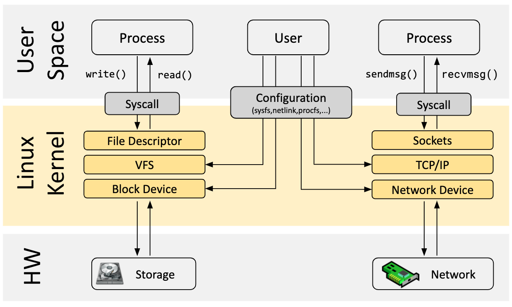

eBPF를 빼고 그린 커널이다. 프로세스는 시스템콜로만 커널에 들어가고, 패킷은 Sockets → TCP/IP → Network Device를 순서대로 내려간다. 가운데의 **Configuration(sysfs, netlink, procfs)** 상자가 유저가 커널에 영향을 줄 수 있는 유일한 통로다.

Week 1~4에서 쓴 도구가 전부 이 상자에 들어간다. `ip route`, `bridge fdb`, `iptables`는 netlink로 커널 자료구조에 **데이터**를 넣는 것이고, `flanneld`도 Felix도 BIRD도 이 통로로 커널을 프로그래밍했다. 공통점은 **커널 코드는 그대로 두고 그 코드가 읽을 데이터만 바꾼다**는 것이다. 라우팅 테이블을 찾는 코드, iptables 체인을 위에서 아래로 훑는 코드는 커널 안에 고정돼 있다.

### 훅 — 커널의 길목마다 프로그램을 붙일 자리

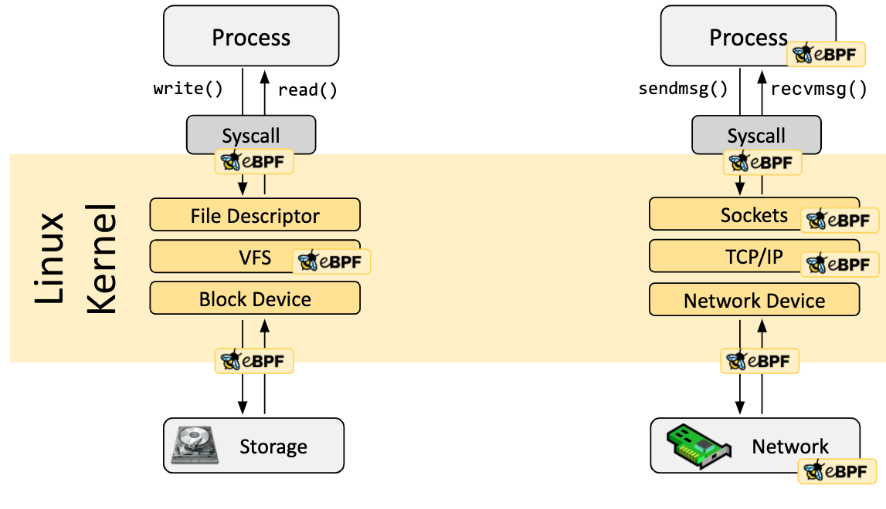

같은 그림에 eBPF 아이콘이 붙었다. **아이콘 하나가 훅 하나**다. 시스템콜 진입, 소켓, TCP/IP, 네트워크 장치, NIC까지. 왼쪽 파일 경로의 아이콘은 추적·보안 도구의 영역이고, 이번 주 관심은 오른쪽 열이다.

| 그림의 아이콘 | 커널의 훅 | Cilium이 쓰는 용도 |
|---|---|---|
| Syscall 옆 | cgroup socket 훅 (`connect`, `sendmsg`, `getpeername`) | Service 처리(소켓 LB) |
| TCP/IP | **tc** (traffic control) ingress / egress | Pod 트래픽 전부. 정책, 전달, 캡슐화 |
| Network Device | **XDP** | NodePort 가속 |

### 이벤트가 프로그램을 깨운다

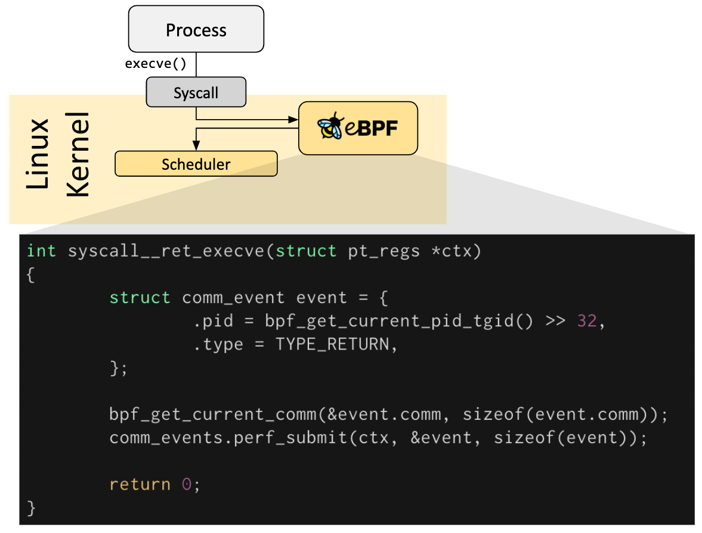

프로그램이 실제로 어떻게 생겼는지 보여주는 그림이다. 프로세스가 `execve()`를 부르면 커널이 스케줄러로 가기 전에 훅의 프로그램을 **먼저** 실행한다. 프로그램은 짧다. 컨텍스트를 받고, 헬퍼 함수로 PID와 프로세스 이름을 꺼내고, `perf_submit`으로 **유저스페이스에 이벤트를 올리고**, 0을 반환한다.

세 가지가 이번 주와 이어진다. 프로그램은 **이벤트가 일어날 때만 돈다**(패킷이 veth에 도착, `connect()` 호출). 프로그램은 **반환값으로 커널에 지시**한다(tc에서는 통과·드롭·리다이렉트). 그리고 `perf_submit`이 **Hubble의 원형**이다. 데이터패스가 패킷을 판단할 때마다 그 판단을 같은 방식으로 내보낸다.

### 프로그램은 C로 쓰고 바이트코드로 컴파일한다


문서는 먼저 "대부분은 eBPF를 직접 쓰지 않고 Cilium, bcc, bpftrace 같은 프로젝트를 통해 간접적으로 쓴다"고 적어둔다. 우리가 그 경우다. 그 프로젝트 안에서는 C의 부분집합으로 쓴 소스를 LLVM이 x86도 ARM도 아닌 **eBPF 바이트코드**로 컴파일한다. Cilium에서 C source는 저장소의 `bpf/` 디렉터리이고, 에이전트 이미지에 든 clang이 **노드 위에서** 컴파일한다.

### 로더 — bpf() 시스템콜로 커널에 올린다

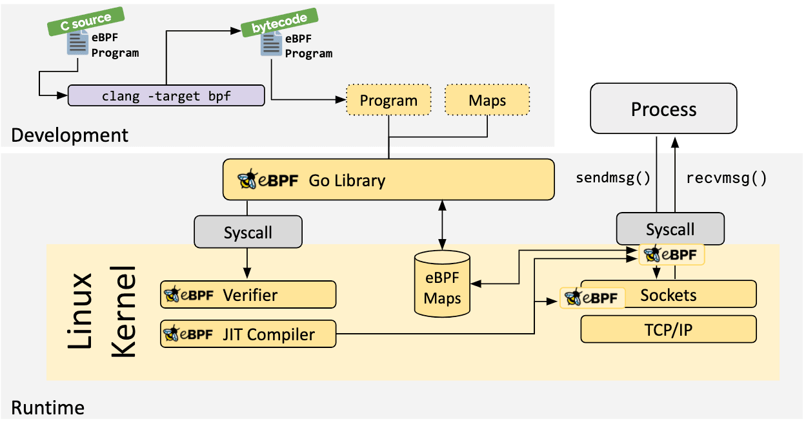

전체 그림이다. 바이트코드와 맵 정의가 **Go Library**로 들어가고, 라이브러리가 `bpf()` 시스템콜로 커널에 넘긴다. 커널 안에서 Verifier와 JIT를 거친 프로그램이 훅에 꽂히고, eBPF Maps에는 라이브러리와 프로그램 양쪽에서 화살표가 들어온다.

이 그림의 Go Library가 비유가 아니다. `cilium-agent`는 Go로 짜여 있고 `cilium/ebpf` 라이브러리로 `bpf()`를 부른다. Week 1에서 iptables를 "커널 Netfilter에 규칙을 등록하는 유저스페이스 도구"라고 정리했는데, 에이전트는 그 자리에 선 **프로그램과 맵을 등록하는 유저스페이스 도구**다. 등록이 끝나면 에이전트는 패킷 경로에서 빠진다.

### 검증기와 JIT — 올라가기 전 두 관문

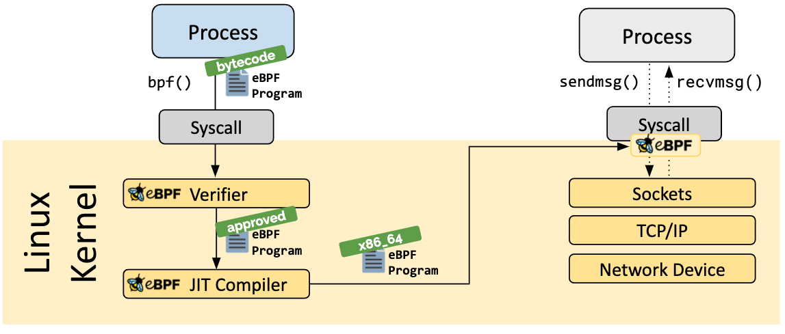

초록 꼬리표가 상태 변화다. **bytecode → approved → x86_64.**

**Verifier**는 실행 전에 모든 경로를 정적으로 검사한다. 반드시 종료해야 하고(무한 루프 금지), 범위 밖 메모리를 건드리면 안 되고, 크기·복잡도 상한이 있고, 로드하려면 root 또는 `CAP_BPF`가 있어야 한다. 이 관문이 커널 모듈과의 결정적 차이다. 모듈은 아무 코드나 올릴 수 있어 커널을 죽일 수 있고, eBPF는 **커널이 안전하다고 증명한 것만** 들어간다. Cilium이 커널 버전을 따지는 이유도 여기 있다. 오래된 검증기는 Cilium의 프로그램 크기를 받아주지 않는다.

**JIT**는 통과한 바이트코드를 그 머신의 네이티브 명령어로 바꾼다. 커널에 원래 있던 코드와 같은 속도로 돈다.

### 맵 — 커널과 유저스페이스가 같이 쓰는 저장소

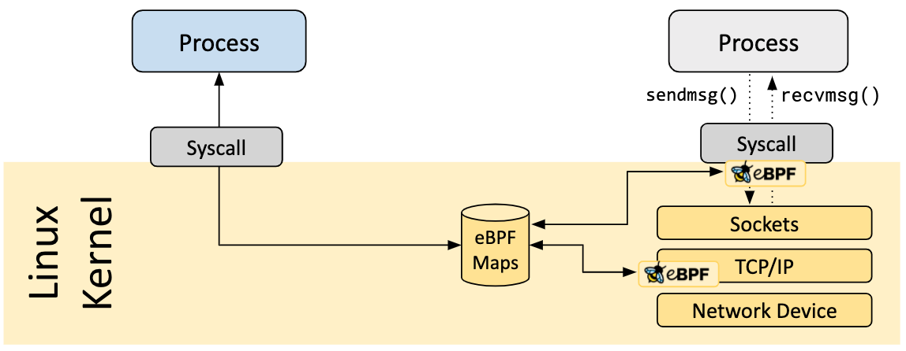

프로그램은 호출이 끝나면 스택이 사라진다. 상태는 맵에 둔다. 그림에서 원통에 화살표 셋이 들어온다. 유저스페이스에서 하나, 서로 다른 훅의 프로그램에서 둘. **에이전트와 커널 프로그램, 그리고 프로그램끼리 같은 맵을 읽고 쓴다.**

문서가 나열하는 맵 유형이 Cilium의 맵과 대응한다. 해시 테이블은 정책·Service 맵, LRU 해시는 연결 추적 맵, LPM(가장 긴 프리픽스) 트라이는 IP → Identity 맵, perf 버퍼는 Hubble 이벤트 맵이다. 라우팅 테이블이 하던 LPM 조회가 **같은 자료구조로 맵 안에 옮겨 간 것**이다.

### 헬퍼와 꼬리 호출

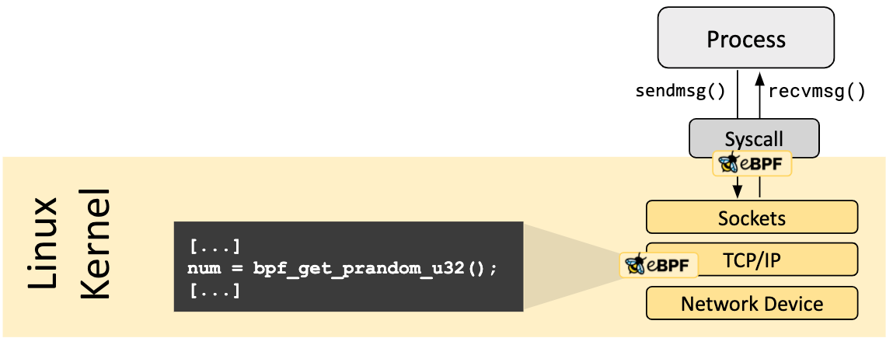

프로그램은 임의의 커널 함수를 부를 수 없고, 커널이 **안정적인 API로 약속한 헬퍼 함수**만 부른다. 난수 하나를 얻는 데도 그림처럼 `bpf_get_prandom_u32()`를 쓴다. Cilium이 패킷을 다른 인터페이스로 넘기는 `bpf_redirect`, 헤더를 고치는 `bpf_skb_store_bytes` 같은 것이 전부 헬퍼다.

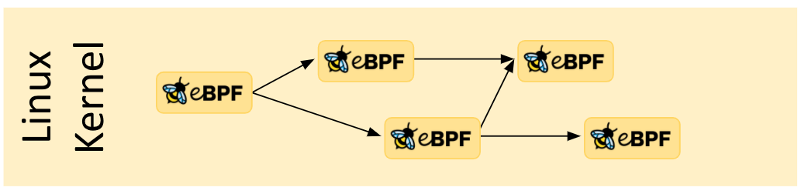

프로그램은 다른 프로그램으로 **돌아오지 않고 점프**할 수도 있다. 검증기의 크기 상한 때문에 Cilium은 Pod 하나의 처리를 여러 프로그램으로 쪼개 꼬리 호출로 잇는다.

### 정리

| 요소 | 역할 | Cilium에서 |
|---|---|---|
| **프로그램** | 훅에서 실행되는 코드. 패킷을 읽고, 고치고, 보내거나 버리는 판단 | `bpf_lxc.c`, `bpf_host.c`, `bpf_overlay.c`, `bpf_sock.c` |
| **맵** | 커널에 사는 키-값 저장소. 프로그램끼리, 그리고 유저스페이스와 공유 | `ipcache`, `policy`, `ct`, `lb` |
| **훅** | 프로그램이 붙는 커널의 지점 | tc, cgroup socket, XDP |

한 문장으로 줄이면 이렇다. **커널을 다시 빌드하거나 모듈을 올리지 않고, 검증기가 안전을 증명한 작은 프로그램을 커널의 정해진 길목에 붙여 이벤트마다 실행하고, 그 프로그램과 유저스페이스가 맵으로 상태를 나누는 기능.** 첫 그림의 Configuration 상자가 "데이터를 넘기는 통로"였다면 eBPF는 **코드를 넘기는 통로**다.

### 훅 — Netfilter 다섯 개 옆에 세 가지가 더 있다

Week 1의 그림에 Netfilter 훅 다섯 개를 그렸다. eBPF 훅은 그 다섯 개와 이렇게 놓인다.

| 훅 | 위치 | Netfilter와의 순서 |
|---|---|---|
| **XDP** | NIC 드라이버가 패킷을 받은 직후 | `PREROUTING`보다 훨씬 앞. 물리 NIC 수신 전용 |
| **tc ingress / egress** | 인터페이스마다. 수신은 스택에 올라가기 직전, 송신은 드라이버에 넘기기 직전 | ingress는 `PREROUTING` **전**, egress는 `POSTROUTING` **후** |
| **cgroup socket** | `connect()`, `sendmsg()`, `getpeername()` 시스템콜 안 | 패킷이 **아직 없다** |

tc ingress의 위치가 핵심이다. 호스트 쪽 veth의 tc ingress는 **Pod에서 나온 프레임이 호스트 스택에 오르기 전**, 즉 브릿지 조회도 라우팅 조회도 Netfilter도 아직 하나도 일어나지 않은 지점이다. 여기서 프로그램이 패킷을 다른 인터페이스로 바로 넘겨버리면 **그 뒤의 모든 것이 건너뛰어진다.** Cilium 공식 문서의 데이터패스 그림이 이것을 그대로 보여준다.

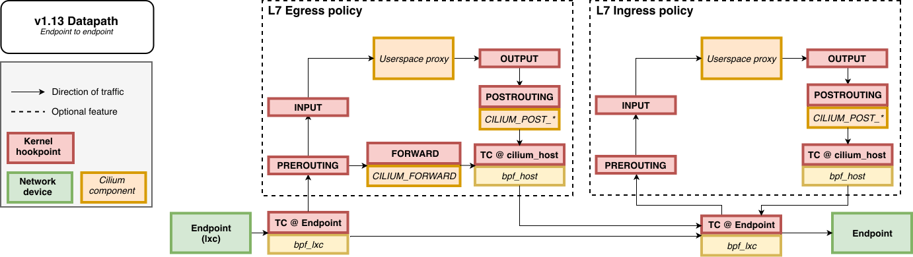

*출처: [Cilium — Life of a Packet](https://docs.cilium.io/en/stable/network/ebpf/lifeofapacket/)*

같은 노드의 두 Pod 사이다. 왼쪽 Endpoint를 나온 패킷은 **TC @ Endpoint**(`bpf_lxc`)에 잡히고, 아래의 실선을 따라 **오른쪽 Endpoint의 `bpf_lxc`로 바로** 간다. 그림에서 `PREROUTING`, `FORWARD`, `POSTROUTING`은 전부 **점선 상자 안**, 즉 L7 정책을 켰을 때만 지나는 선택 경로에 있다. Netfilter가 기본 경로에서 빠져 있다는 뜻이다. 처음 퍼즐에서 `conntrack -L`이 비어 있던 이유의 절반이 여기 있다. 패킷이 Netfilter를 지나지 않았으니 커널 conntrack이 볼 기회가 없었다.

---

## Cilium Architecture — 부품과 역할

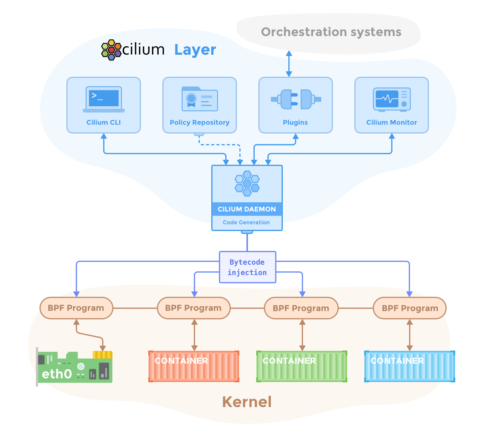

*출처: [Cilium — Component Overview](https://docs.cilium.io/en/stable/overview/component-overview/)*

공식 그림은 두 층이다. 위의 Cilium Layer에 데몬(에이전트)과 그 주변 도구가 있고, 데몬이 **Code Generation → Bytecode injection**으로 아래 Kernel 층의 BPF Program들을 만들어 꽂는다. 커널 층을 보면 프로그램이 **컨테이너마다 하나, 그리고 `eth0`에 하나** 붙어 있다. 앞 절의 eBPF 그림을 Cilium에 맞게 다시 그린 것이다.

공식 문서의 컴포넌트 설명을 따라가면 이렇다.

| 컴포넌트 | 배포 형태 | 하는 일 |
|---|---|---|
| **Agent** (`cilium-agent`) | DaemonSet, 노드마다 | 쿠버네티스에서 Pod·Service·정책 이벤트를 받아 **그 노드의 eBPF 프로그램과 맵을 관리**한다. 그림의 CILIUM DAEMON |
| **CNI Plugin** (`cilium-cni`) | 실행 파일, Pod 생성·삭제 때 | 런타임이 부르면 노드의 에이전트 API에 "이 Pod의 데이터패스를 구성해 달라"고 요청한다. 그림의 Plugins |
| **Operator** (`cilium-operator`) | Deployment, 클러스터에 하나 | 노드마다가 아니라 **클러스터에 한 번이면 되는 일**. IPAM으로 노드에 Pod 대역을 나눠주고, Identity 등 CRD를 정리한다. **전달·정책 결정 경로에 없다.** 잠시 죽어도 트래픽은 흐르고, 새 Pod의 IP 배정이 늦어질 뿐이다 |
| **Debug CLI** (`cilium-dbg`) | 에이전트 Pod 안 | 로컬 에이전트의 REST API와 **eBPF 맵을 직접** 들여다본다. 그림의 Cilium CLI. 클러스터 설치용 `cilium` CLI와는 다른 도구다 |
| **Hubble Server** | 에이전트에 내장 | 그 노드의 플로우를 gRPC로 제공. 그림의 Cilium Monitor 자리 |
| **Hubble Relay** (`hubble-relay`) | Deployment | 모든 노드의 Hubble Server에 붙어 클러스터 단위 뷰 |
| **Hubble CLI / UI** | 밖 | Relay나 로컬 서버에 붙어 플로우 조회, 서비스 맵 |
| **Data Store** | CRD(기본) 또는 etcd | 에이전트끼리 상태를 전파하는 곳. 그림의 Policy Repository와 Orchestration systems |

Week 3에서 본 "실행 파일은 얇고 에이전트는 두껍다"가 이 표에서 확인된다. `cilium-cni`는 에이전트에 요청만 하므로 **에이전트가 죽어 있으면 그 노드에 새 Pod이 못 뜬다.** 반대로 오퍼레이터는 전달 경로에 없어 죽어도 당장은 아무 일도 없다. 공식 문서가 "the operator is not in the critical path"라고 못 박아 둔 부분이다.

노드에서 실제로 보이는 것은 이렇다.

```bash
$ ip -br link | grep -E 'cilium|lxc'
cilium_net@cilium_host   UP          # 호스트 스택과 eBPF 사이의 veth 쌍
cilium_host@cilium_net   UP          # Pod의 게이트웨이 IP가 여기 붙는다
cilium_vxlan             UNKNOWN     # 터널 모드일 때
lxc1a2b3c4d5e6f@if12     UP          # Pod의 호스트 쪽 veth — Flannel의 veth…, Calico의 cali… 자리

$ tc filter show dev lxc1a2b3c4d5e6f ingress
filter ... bpf ... cil_from_container direct-action ...   # 그림의 "BPF Program ↔ CONTAINER"
$ tc filter show dev eth0 ingress
filter ... bpf ... cil_from_netdev direct-action ...      # 그림의 "BPF Program ↔ eth0"
```

---

## Cilium Datapath — 패킷이 가는 길

node-1의 Pod A(`10.42.0.5`)가 node-2의 Pod B(`10.42.1.7`)로 보내는 패킷. Week 4와 같은 패킷이다. 공식 문서는 이 여행을 **나가는 쪽**과 **들어오는 쪽** 두 장으로 그린다.

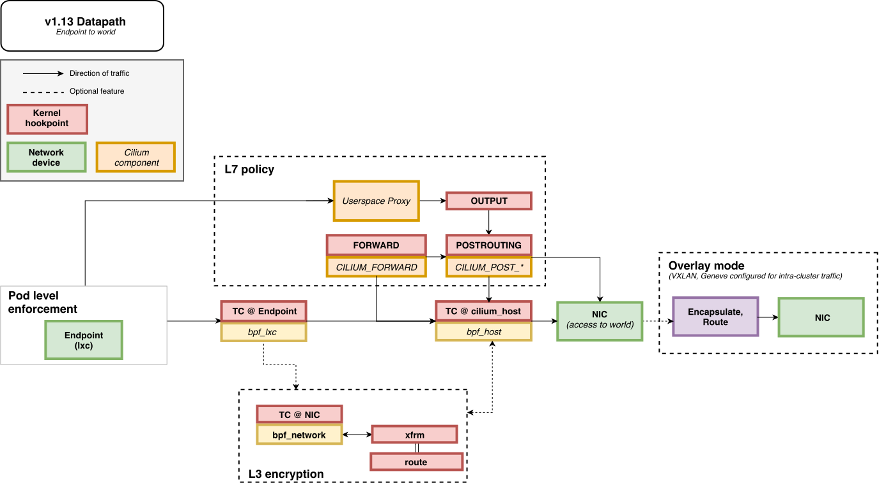

나가는 쪽이다. 왼쪽 Pod level enforcement에서 `bpf_lxc`가 egress 정책을 보고, 패킷은 **TC @ cilium_host**(`bpf_host`)를 거쳐 NIC으로 간다. 오른쪽 점선 상자 Overlay mode가 터널 모드다. 켜져 있으면 NIC 직전에 **Encapsulate, Route**가 끼어들어 VXLAN으로 감싼다. 꺼져 있으면(native routing) 그대로 NIC으로 나간다. Week 4의 Flannel 자리와 Calico 자리가 **점선 상자 하나의 유무**로 그려져 있다. 위의 L7 policy와 아래의 L3 encryption도 전부 점선, 즉 켰을 때만 지나는 길이다.

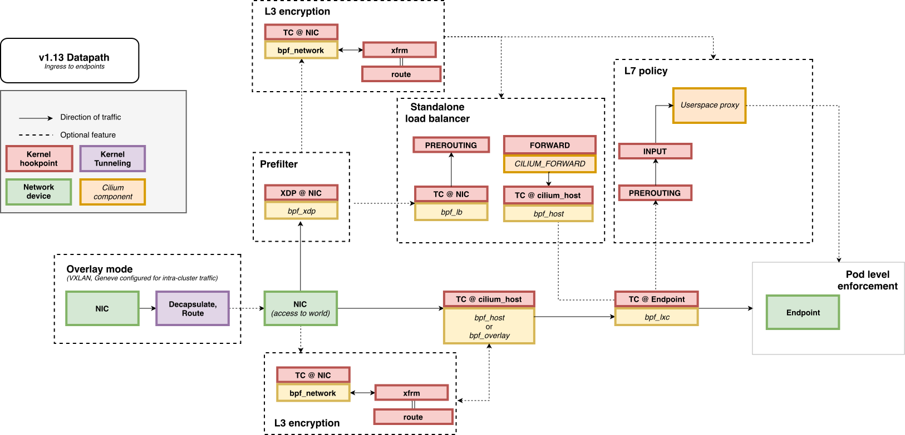

들어오는 쪽이다. NIC에 도착한 패킷이 터널이면 Overlay mode 상자에서 **Decapsulate, Route**로 벗겨지고, `bpf_host`가 받아 목적지 Endpoint의 `bpf_lxc`로 넘기며 ingress 정책을 본다. XDP @ NIC의 Prefilter와 Standalone load balancer가 점선으로 붙어 있는데, 이게 뒤에서 볼 NodePort 처리 자리다.

두 그림에서 Cilium 컴포넌트(노란 상자)에 적힌 이름은 `bpf_lxc`, `bpf_host`, `bpf_network` 셋뿐이다. 앞 절의 eBPF 그림에서 C source라고 했던 그 파일들이다. 그 프로그램들이 하는 일을 큰 흐름으로 잡으면 다섯 단계다.

1. **Pod을 나온 프레임이 `lxc`의 tc ingress에서 `bpf_lxc`에 잡힌다.** 브릿지도, 라우팅 테이블도, iptables도 아직 안 봤다
2. **맵 세 개를 조회한다.** `ct`(이미 아는 연결인가), `ipcache`(목적지 IP는 어느 Identity·어느 노드인가), `policy`(그 Identity로 보내도 되는가). 전부 해시 조회라 규칙이 수천 개여도 비용이 같다
3. **노드 사이를 건넌다.** 터널 모드면 VXLAN으로 감싸고, native routing이면 호스트 라우팅 테이블에 맡긴다
4. **수신 노드의 `bpf_host`가 받아 목적지 Endpoint를 찾고, 그 Endpoint의 ingress 정책을 본다.** 역시 `ipcache`와 `policy` 조회다
5. **목적지 Pod의 veth로 바로 넣는다.** 호스트 라우팅도 `FORWARD` 체인도 거치지 않는다

native routing 모드를 공식 문서는 이렇게 그린다.

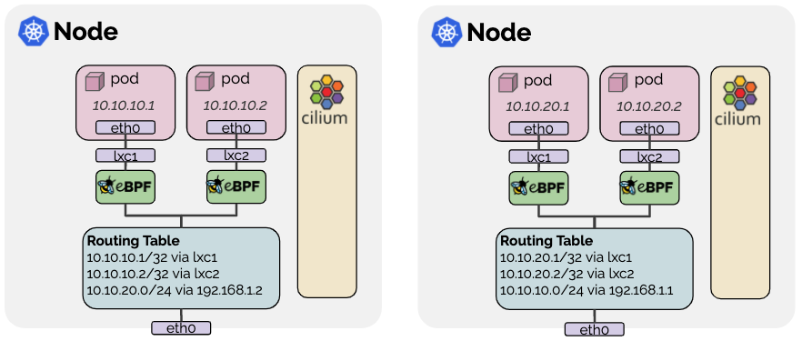

*출처: [Cilium — Routing](https://docs.cilium.io/en/stable/network/concepts/routing/)*

노드마다 Pod의 veth(`lxc1`, `lxc2`)에 eBPF가 붙어 있고, 그 아래 Routing Table에 Pod마다 `/32 via lxc`, 그리고 **다른 노드 대역은 `via 192.168.1.2`** 한 줄이 있다. Week 4의 Calico 라우팅 테이블과 같은 모양이다. 이 줄을 누가 심느냐가 Cilium에서는 `autoDirectNodeRoutes`(같은 L2일 때 에이전트가 직접) 또는 BGP의 몫이다. Week 4에서 Flannel은 라우트·이웃·FDB 세 줄, Calico는 BGP가 배운 라우트 한 줄이 노드 사이 경로를 정했다. Cilium 터널 모드에서는 그 역할이 **`ipcache` 맵의 한 항목**으로 옮겨 가고, native routing에서는 이 그림처럼 라우팅 테이블이 다시 등장한다.

연결 추적도 자기 것을 갖는다. 첫 패킷이 정책을 통과하면 `ct` 맵에 기록되고, 같은 연결의 뒤 패킷과 응답은 정책을 다시 보지 않는다. Week 4에서 Calico가 `--ctstate ESTABLISHED -j ACCEPT` 한 줄로 하던 일을 같은 구조로 다른 저장소에서 한다. 처음 퍼즐의 `conntrack -L`이 비어 있던 이유가 여기서 완성된다. Cilium의 연결은 **`cilium bpf ct list`에 있다.**

---

## kube-proxy Replacement — 패킷이 생기기 전에 끝낸다

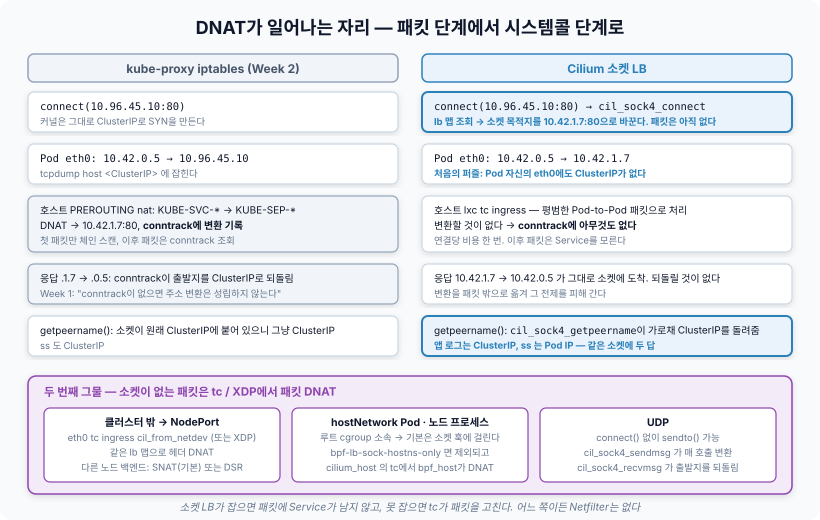

Pod 안의 curl이 `connect(10.96.45.10:80)`을 부른다. 시스템콜이 커널에 들어가면 **패킷이 만들어지기 전에** 루트 cgroup에 붙은 프로그램이 실행된다. 프로그램은 `lb` 맵에서 Service를 찾고 백엔드 하나를 골라 **소켓의 목적지 주소 자체를 `10.42.1.7:80`으로 바꿔 쓴다.** 그 뒤 커널은 평범하게 Pod IP로 SYN을 만든다. Pod의 `eth0`에도, 어느 와이어에도 ClusterIP는 존재한 적이 없다.

Week 2의 kube-proxy는 `PREROUTING`에서 **패킷 헤더**를 DNAT하고 conntrack이 응답을 되돌렸다. 그 변환이 **패킷 단계에서 시스템콜 단계로** 올라간 것이다.

| | kube-proxy iptables | Cilium 소켓 LB |
|---|---|---|
| 변환 시점 | 첫 패킷이 `PREROUTING`에 왔을 때 | `connect()` 안 |
| 변환 대상 | 패킷 헤더. 응답은 conntrack이 되돌림 | 소켓의 목적지. 응답은 그냥 Pod IP로 돌아온다 |
| 패킷마다 비용 | 첫 패킷 체인 스캔, 이후 conntrack 조회 | **0.** 연결당 한 번 |
| `iptables -t nat` | `KUBE-SVC-*` 체인 | 없음. `cilium bpf lb list` |

처음 퍼즐이 여기서 풀린다. `KUBE-SVC-*`가 없는 건 kube-proxy가 없으니 당연하고, `conntrack`이 비어 있는 건 DNAT가 소켓 단계에서 끝나 Netfilter가 변환할 것이 없었기 때문이다. **변환이 없으니 되돌릴 것도 없고, 되돌릴 것이 없으니 conntrack도 필요 없다.**

애플리케이션은 이 사실을 모른다. `getpeername()`을 부르면 같은 cgroup 훅의 프로그램이 가로채 원래 ClusterIP를 돌려준다. 그래서 앱 로그에는 ClusterIP가, `ss`에는 Pod IP가 찍힌다. Week 3의 남은 질문이었다.

소켓이 없는 패킷도 있다. 클러스터 밖에서 NodePort로 들어오는 패킷에는 `connect()`를 부른 프로세스가 없으므로, `eth0`의 tc 프로그램(또는 XDP)이 **패킷 헤더에 DNAT**를 건다. 소켓 LB가 첫 번째 그물이고 tc가 두 번째 그물이다.

---

## NetworkPolicy / Identity — IP 대신 라벨로 판단한다

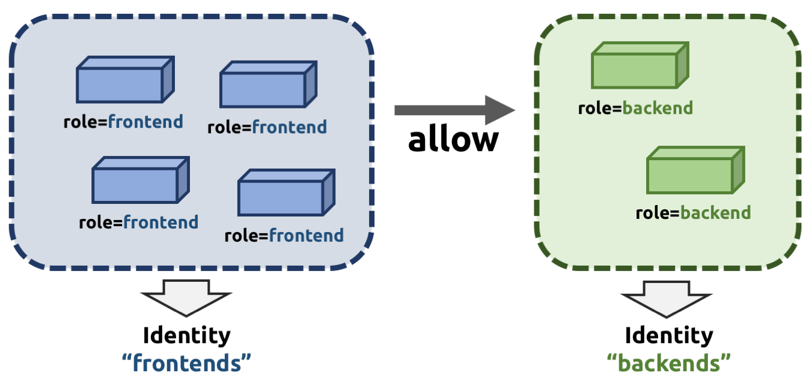

*출처: [Cilium — Identity-Based Security](https://docs.cilium.io/en/stable/security/network/identity/)*

공식 그림이 핵심을 다 말한다. `role=frontend` Pod 넷은 몇 개든 **Identity "frontends" 하나**로 묶이고, 정책은 frontends → backends 사이의 **allow 화살표 하나**다. Pod이 늘어도 화살표는 그대로다.

Pod이 뜨면 에이전트가 보안에 의미 있는 라벨(`app=frontend`, 네임스페이스 등)을 모아 정렬한다. 그 집합이 `CiliumIdentity` CRD에 있으면 그 번호를 쓰고, 없으면 새 번호를 만든다. CRD라서 **모든 노드가 같은 번호를 본다.** 같은 라벨의 Pod은 몇 개가 뜨든 어느 노드든 같은 번호다.

```bash
$ kubectl get ciliumidentity 1234 -o yaml | grep -A3 security-labels
security-labels:
  k8s:app: frontend
  k8s:io.kubernetes.pod.namespace: prod
```

정책은 이 번호 사이의 관계로 저장된다. `frontend → backend 80/TCP 허용`은 backend의 `policy` 맵에 `(1234, 80, TCP) → allow` 한 줄이다. 패킷이 오면 `ipcache`로 출발지 IP를 번호로 바꿔 이 맵을 찾는다.

| 맵 | 키 → 값 | Pod이 늘면 |
|---|---|---|
| `ipcache` | IP → Identity, 소속 노드 | 줄이 는다 |
| `policy` (Endpoint마다) | (Identity, 포트, 프로토콜) → 허용/거부 | **그대로** |

Week 4에서 Calico가 셀렉터를 ipset으로 만들어 "규칙은 그대로, 멤버만 바뀐다"고 했다. 구조는 닮았지만 Calico의 ipset은 노드마다 따로 유지되는 **IP 목록**이고 판단 근거가 IP다. Cilium의 Identity는 클러스터에 하나뿐인 **번호**이고 판단 근거가 번호다. 그래서 터널 모드에서는 VXLAN 헤더의 VNI 칸에 출발지 Identity를 실어 보내고, 수신 노드가 헤더에서 바로 읽는다. Week 4 표에 적어둔 "Cilium은 VNI에 Identity를 싣는다"가 이것이다.

L7 정책(HTTP 경로, DNS 이름)도 있다. eBPF는 패킷 하나를 보지 HTTP를 읽지 못하므로, 그 트래픽은 노드의 Envoy 프록시로 넘겨 판단한다. **eBPF로 되는 것까지 커널에서, 나머지는 프록시에서.**

---

## Hubble Overview — 커널 안의 판단을 밖으로 꺼낸다

처음 퍼즐의 가장 불편한 점은 `tcpdump`도 `conntrack`도 아무것도 못 본다는 것이었다. 판단이 전부 eBPF 프로그램 안에서 끝나니 **그 프로그램이 스스로 말해주지 않으면 알 길이 없다.** Hubble이 그 통로다.

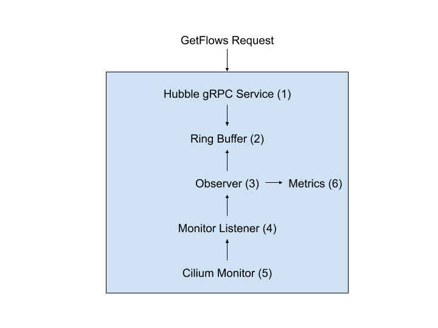

*출처: [Cilium — Hubble Internals](https://docs.cilium.io/en/stable/internals/hubble/)*

공식 그림은 에이전트 안의 Hubble 서버를 아래에서 위로 읽는다. **Cilium Monitor**(5)가 데이터패스의 perf 버퍼를 읽고, Monitor Listener(4)가 그것을 Observer(3)에 넘기고, Observer가 플로우로 가공해 Ring Buffer(2)에 쌓고 Metrics(6)도 뽑는다. 밖에서 `GetFlows` 요청이 오면 gRPC Service(1)가 링 버퍼를 읽어 돌려준다. Relay는 이 gRPC를 모든 노드에 대해 묶는 것이다.

데이터패스 프로그램은 패킷을 처리하는 요소요소에서 이벤트를 perf 버퍼에 쓴다. 앞의 ebpf.io 그림에서 본 `perf_submit`이다. 어느 Identity에서 어느 Identity로 가는 패킷을 어느 지점에서 봤는지, 정책 판정이 무엇이었는지, 드롭했다면 이유가 무엇인지. 에이전트에 내장된 Hubble Server가 이 버퍼를 읽어 플로우로 만들고, Relay가 모든 노드를 묶고, CLI와 UI가 거기 붙는다.

```bash
$ hubble observe --pod prod/frontend-7d9f --to-pod prod/backend-5c4a
prod/frontend-7d9f:41822 (ID:1234) -> prod/backend-5c4a:80 (ID:5678) to-overlay FORWARDED (TCP Flags: SYN)
prod/frontend-7d9f:41830 (ID:1234) -> prod/backend-5c4a:9090 (ID:5678) Policy denied DROPPED (TCP Flags: SYN)
```

출력에 Pod 이름과 Identity 번호가 그대로 찍힌다. 데이터패스가 이미 Identity로 판단하고 있으니 이벤트에 Identity가 공짜로 따라 나온다. `tcpdump`는 IP를 보여주고 그 IP가 어느 Pod인지는 사람이 찾아야 했다. Hubble은 **판단한 주체가 판단에 쓴 정보를 그대로 보여준다.** NetworkPolicy가 왜 막았는지 iptables 계열에서 알아내려면 `-j LOG`를 끼워 넣어야 했는데, 여기서는 `hubble observe --verdict DROPPED` 한 줄이다.

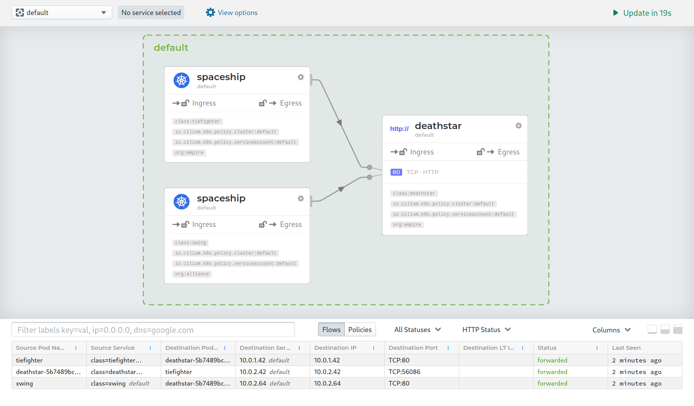

*출처: [Cilium — Hubble UI](https://docs.cilium.io/en/stable/observability/hubble/hubble-ui/)*

Hubble UI는 같은 플로우를 **서비스 맵**으로 그린다. 공식 문서의 예제 화면인데, 노드 상자 안에 적힌 것이 IP가 아니라 `class=tiefighter`, `org=empire` 같은 **라벨**이라는 점을 보면 된다. Identity의 재료가 그대로 화면에 올라온 것이다. 아래 표의 각 줄이 `hubble observe` 한 줄이다.

---

## 지난 주에 남긴 질문 네 개

> **tc 훅의 eBPF 프로그램은 응답 패킷을 어떻게 허용하는가. 자기만의 연결 추적 맵을 갖는가.**

갖는다. `ct` 맵에 연결과 정책 판정을 기록하고, 응답 패킷은 ct 조회에서 통과한다. Calico의 `--ctstate ESTABLISHED` 한 줄과 같은 구조를 다른 저장소에서 한다. 커널 conntrack과는 보는 패킷이 다르다. tc에서 리다이렉트로 끝난 패킷은 Netfilter를 안 지나니 커널 conntrack에 없다.

> **Calico eBPF와 Cilium은 실제로 무엇이 다른가.**

데이터패스 뼈대(tc 훅, 자체 ct 맵, kube-proxy 대체)는 둘 다 있다. 다른 것은 그 위의 모델이다. Calico eBPF는 **IP 기반 정책 모델을 그대로 두고 데이터플레인만 바꾼 것**이라 iptables 모드로 돌아갈 수 있고, Cilium은 **Identity를 전제로 설계돼 iptables 모드가 없다.** Identity 하나가 VNI 사용법, L7, Hubble 출력까지 갈라놓는다.

> **cgroup 소켓 훅은 `hostNetwork` Pod이나 클러스터 밖에서 들어오는 NodePort를 어떻게 처리하는가.**

`hostNetwork` Pod과 노드 프로세스는 루트 cgroup 소속이라 소켓 훅에 걸린다. 밖에서 오는 NodePort는 소켓이 없으니 `eth0`의 tc 프로그램이 패킷 DNAT로 처리한다. 소켓 LB가 첫 번째 그물, tc가 두 번째 그물이다.

> **native routing 모드에서는 Identity를 어떻게 전달하는가.**

VNI가 없으니 수신 노드가 출발지 IP로 `ipcache`를 찾아 복원한다. 헤더에 싣는 이점은 `ipcache` 전파가 늦어도 송신 노드가 적은 번호를 그대로 믿을 수 있다는 것이다. 캡슐화를 포기하면 그 내성도 함께 포기한다.

---

## 이번 주에 확인한 것

| 쿠버네티스에서 이렇게 보이는 것 | 실제로는 |
|---|---|
| Pod 안 `tcpdump`에도 ClusterIP가 없다 | `connect()` 안에서 cgroup eBPF가 소켓 목적지를 바꿨다. 패킷은 처음부터 Pod IP |
| `conntrack -L`에 Pod 연결이 없다 | tc ingress에서 리다이렉트로 끝나 Netfilter를 안 지났다. 연결은 `cilium bpf ct list`에 |
| `iptables -t nat`에 `KUBE-SVC-*`가 없다 | kube-proxy가 없다. Service는 `cilium bpf lb list` |
| 앱 로그에는 ClusterIP, `ss`에는 Pod IP | `getpeername()`을 eBPF가 가로채 되돌린다 |
| `ip route`에 Pod 대역 경로가 있는데 Pod 트래픽이 안 읽는다 | 노드 사이 경로는 `ipcache` 맵의 항목. 라우팅 테이블은 호스트 스택용 |
| 오퍼레이터가 죽어도 트래픽이 흐른다 | 오퍼레이터는 전달 경로에 없다. 에이전트가 죽으면 새 Pod이 못 뜬다 |
| frontend가 스케일 아웃해도 backend의 정책 맵이 안 바뀐다 | 정책은 Identity 번호 사이의 관계. `ipcache`에만 줄이 는다 |
| `hubble observe`에 Pod 이름과 Identity가 찍힌다 | 데이터패스가 Identity로 판단하고 그 판단을 perf 버퍼로 내보낸다 |

이번 주 가장 인상 깊었던 것은 **DNAT가 패킷에서 시스템콜로 올라간 것**이었다. Week 1~2에서 conntrack을 주소 변환의 전제로 받아들였는데, 변환을 패킷이 생기기 전에 끝내면 conntrack이 할 일이 아예 없어진다. 자료구조를 바꾼 게 아니라 **문제가 생기는 층을 바꿔서 문제를 없앤 것**이고, 그래서 `conntrack -L`이 비어 있는 게 결함이 아니라 설계였다.

---

## 확인용 명령어

```bash
# ── 처음의 퍼즐 재현 ──
kubectl exec <pod> -- tcpdump -ni eth0 host <ClusterIP>     # 0 packets
iptables -t nat -S | grep -c KUBE-SVC                        # 0
conntrack -L 2>/dev/null | grep -c <PodIP>                   # 0

# ── 아키텍처: 부품 확인 ──
kubectl -n kube-system get ds cilium; kubectl -n kube-system get deploy cilium-operator hubble-relay
ip -br link | grep -E 'cilium|lxc'
tc filter show dev lxc<id> ingress                           # cil_from_container
tc filter show dev eth0 ingress                              # cil_from_netdev
bpftool cgroup tree /sys/fs/cgroup | grep cil_sock           # connect4 / getpeername4

# ── 맵 조회 — 패킷이 보는 것과 같은 것을 본다 ──
C="kubectl -n kube-system exec ds/cilium --"
$C cilium status --verbose | grep -E 'KubeProxyReplacement|Routing'
$C cilium endpoint list                                       # Endpoint ↔ Identity ↔ IP
$C cilium identity list
$C cilium bpf ipcache list                                    # IP → Identity, 소속 노드
$C cilium bpf policy get <endpoint-id>
$C cilium bpf ct list global | head                           # 자체 conntrack
$C cilium bpf lb list                                         # Service → 백엔드

# ── Hubble ──
hubble observe --pod <ns>/<pod> -f
hubble observe --verdict DROPPED --last 50
$C cilium monitor --type drop                                 # perf 버퍼 원본

# ── 터널 모드에서 VNI = Identity 확인 ──
tcpdump -ni eth0 -T vxlan udp port 8472 -c 3                 # vni 값 = 출발지 Identity
```

---

## 남은 질문

1. Cilium은 Pod의 **첫 번째 인터페이스 `lxc`에만** 프로그램을 붙인다. Multus로 macvlan 두 번째 인터페이스를 붙인 Pod은 그 인터페이스의 트래픽이 `bpf_lxc`를 거치지 않을 텐데, **그러면 NetworkPolicy도 Hubble도 그 트래픽을 전혀 못 보는가.**
2. Cilium은 **CNI chaining 모드**로 AWS VPC CNI 위에 정책·관측만 얹을 수 있다. veth를 다른 플러그인이 만드는데 Cilium은 **어느 시점에 그 veth를 찾아 tc 프로그램을 붙이는가.** Week 2의 `prevResult`가 여기서 쓰이는가.
3. SR-IOV VF를 Pod에 직접 넣으면 호스트 쪽 veth가 없고 tc 훅을 붙일 인터페이스도 없다. **하드웨어 직결 인터페이스와 eBPF 정책은 양립 불가능한가.**

---

## 마치며

지난 주 마지막에 "Flannel과 Calico는 같은 도구로 끝까지 읽을 수 있는 쪽이었고, 다음 주에는 그 도구가 통하지 않는 곳으로 간다"고 썼다. 가 보니 정말로 통하지 않았다. `ip route`는 있지만 읽히지 않았고, `iptables`는 비어 있었고, `conntrack`은 패킷을 본 적이 없었다. 네 도구가 전부 **커널 스택의 특정 층을 보는 도구**였고, Cilium은 판단을 그 층들보다 앞(tc)과 위(소켓)로 옮겨 놓았다.

그런데 옮겨진 판단의 구조 자체는 낯설지 않았다. `ct` 맵은 conntrack이었고, `ipcache`는 라우팅 테이블과 FDB를 합친 것이었고, `policy` 맵은 Calico의 체인이었고, `lb` 맵은 `KUBE-SVC-*` 체인이었다. **Week 1~4에서 본 자료구조 하나하나에 맵 하나씩이 대응**했다. 달라진 것은 세 가지였다. 조회가 전부 해시라 규모에 무관하다는 것, 판단 근거가 IP에서 클러스터 전역 번호로 바뀌었다는 것, 그리고 판단한 주체가 그 판단을 이벤트로 내보내 Hubble이 받는다는 것.

다음 주는 Multus다. 남은 질문이 전부 "Pod에 인터페이스가 둘이면"으로 모였는데, Cilium의 모든 판단이 `lxc` 하나에 붙어 있다는 사실이 두 번째 인터페이스 앞에서 어떤 한계가 되는지를 따라갈 예정이다.

---

## 참고 자료

- [ebpf.io — eBPF란? (eBPF 절 그림 출처)](https://ebpf.io/ko-kr/what-is-ebpf/)
- [Cilium — Component Overview (아키텍처 그림 출처)](https://docs.cilium.io/en/stable/overview/component-overview/)
- [Cilium — Life of a Packet (데이터패스 그림 출처)](https://docs.cilium.io/en/stable/network/ebpf/lifeofapacket/), [Cilium — eBPF Datapath](https://docs.cilium.io/en/stable/network/ebpf/)
- [Cilium — Kubernetes Without kube-proxy](https://docs.cilium.io/en/stable/network/kubernetes/kubeproxy-free/)
- [Cilium — Identity-Based Security (Identity 그림 출처)](https://docs.cilium.io/en/stable/security/network/identity/)
- [Cilium — Routing (native routing 그림 출처)](https://docs.cilium.io/en/stable/network/concepts/routing/)
- [Cilium — Hubble Internals (Hubble 그림 출처)](https://docs.cilium.io/en/stable/internals/hubble/), [Cilium — Hubble UI](https://docs.cilium.io/en/stable/observability/hubble/hubble-ui/)
- [cilium/ebpf — Go eBPF 라이브러리](https://github.com/cilium/ebpf), [Linux kernel — BPF documentation](https://docs.kernel.org/bpf/)
- [Calico — eBPF dataplane](https://docs.tigera.io/calico/latest/operations/ebpf/)
- 직접 정리한 글 — [쿠버네티스 네트워크의 본질: CNI, VXLAN, 그리고 Pod는 어떻게 통신하는가](https://marsboy02.github.io/ko/posts/kubernetes-cni-networking/)
