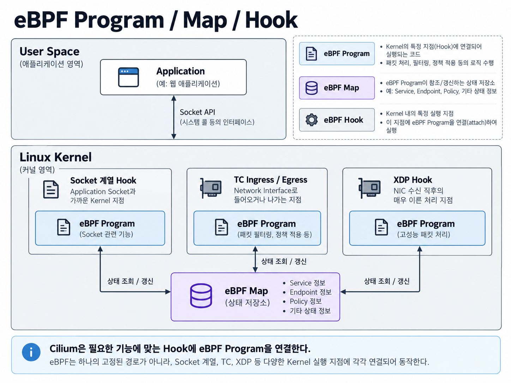
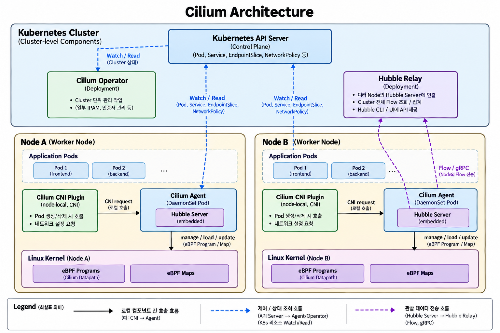
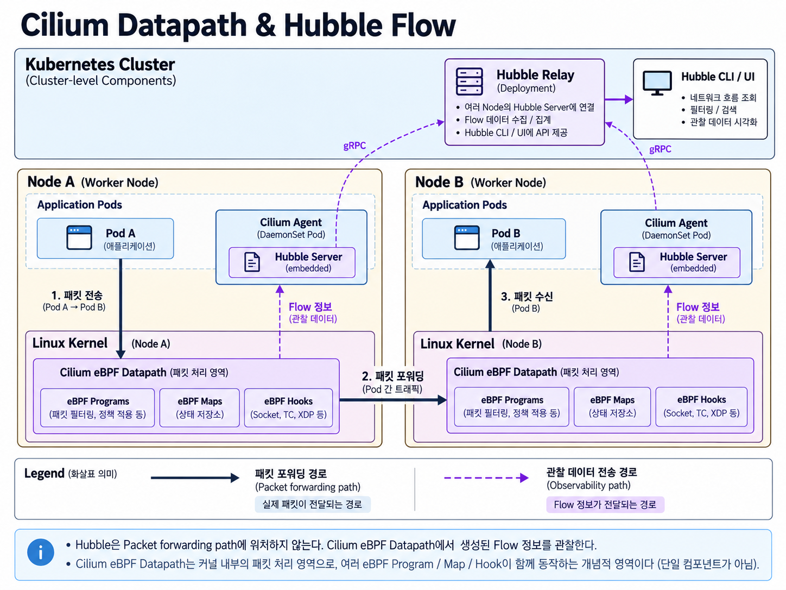

# Week 5. Cilium & eBPF

## 1. 이번 주 학습 목표

Week 4에서는 Flannel과 Calico를 통해 Pod Network를 **VXLAN Overlay 또는 Routing** 방식으로 구성하는 방법을 살펴봤다.

이번 주에는 **Cilium이 eBPF를 이용해 Kubernetes Network Datapath를 어떻게 구성하는지** 알아본다.

특히 다음 흐름을 중심으로 살펴본다.

```text
Cilium
  ↓
eBPF Program / Map / Hook
  ↓
Cilium Agent가 eBPF Datapath 관리
  ↓
Linux Kernel에서 실제 Packet 처리
  ↓
Hubble을 통한 Flow 관찰
```

---

## 2. Cilium

Cilium은 **eBPF를 기반으로 Kubernetes의 Network, Security, Service 처리, Observability 기능을 제공하는 Network Solution**이다.

Week 4에서 살펴본 Flannel과 Calico에서도 Agent가 Linux Kernel의 Network 상태를 구성하고, 실제 Packet은 Kernel이 처리했다.

Cilium도 기본적인 역할 구분은 비슷하다.

```text
Cilium Agent
      ↓
eBPF Datapath 구성 / 관리
      ↓
Linux Kernel
      ↓
실제 Packet 처리
```

차이는 Cilium이 Linux Kernel의 **eBPF Program과 Map을 Datapath의 핵심 요소로 사용한다는 점**이다.

Cilium은 이를 이용해 Pod Network뿐 아니라 Service 처리, NetworkPolicy, Observability 등의 기능을 하나의 eBPF 기반 Datapath와 연결할 수 있다.

이번 주에는 그중 **eBPF Datapath가 어떻게 구성되고 Hubble이 이를 어떻게 관찰하는지**에 집중한다.

---

## 3. eBPF 기본 개념

eBPF는 **Linux Kernel의 특정 지점에서 Program을 실행할 수 있도록 하는 기술**이다.

Network Packet이 Kernel을 지나가는 특정 지점에 eBPF Program을 연결하면 Packet 정보를 확인하거나 전달 방식을 결정하는 등의 Network Logic을 실행할 수 있다.

Cilium은 이러한 eBPF 기능을 이용하여 Kubernetes Network Datapath를 구성한다.

### 3.1 eBPF Program / Map / Hook

eBPF Network를 이해하려면 **Program, Map, Hook** 세 가지를 구분하면 된다.

| 구성요소 | 역할 |
| --- | --- |
| **Program** | Hook에서 실행되어 Network 처리 Logic 수행 |
| **Map** | Program이 참조하거나 갱신하는 상태 저장소 |
| **Hook** | eBPF Program이 연결되어 실행되는 Kernel의 지점 |

관계를 단순화하면 다음과 같다.

```text
Packet
   ↓
Kernel Hook
   ↓
eBPF Program
   ↕
eBPF Map
```

**Program**은 Hook에서 실행되어 Network 처리 Logic을 수행하는 코드다.

**Map**은 Program이 Packet을 처리할 때 필요한 정보를 저장한다. Cilium에서는 Endpoint, Service, 연결 상태 등 Datapath에 필요한 여러 정보를 Map으로 관리할 수 있다.

**Hook**은 Program이 실행되는 위치다. Packet이나 Network 관련 Event가 해당 Kernel 지점에 도달하면 연결되어 있는 eBPF Program이 실행된다.



---

### 3.2 eBPF Hook

Linux Network Stack에는 eBPF Program을 연결할 수 있는 여러 Hook이 존재한다.

Cilium을 이해하기 위해서는 대표적으로 **XDP, TC, Socket 계열 Hook** 정도를 구분하면 된다.

| Hook | 위치 |
| --- | --- |
| **XDP** | NIC가 Packet을 수신한 직후의 매우 이른 단계 |
| **TC Ingress / Egress** | Network Interface로 Packet이 들어오거나 나가는 지점 |
| **Socket 계열** | Application의 Socket 동작과 가까운 Kernel 지점 |

예를 들어 veth를 사용하는 구성에서는 Pod Traffic을 처리하기 위해 Host 측 veth Interface의 TC Hook에 eBPF Program을 연결할 수 있다.

중요한 점은 이 Hook들이 하나의 고정된 Packet Flow를 의미하지 않는다는 것이다.

```text
Socket
  ↓
 TC
  ↓
 XDP
```

와 같이 모든 Packet이 세 Hook을 순서대로 통과한다고 이해하면 안 된다.

XDP, TC, Socket 계열 Hook은 **서로 다른 Packet 처리 지점**이며, Cilium은 필요한 기능에 따라 적절한 Hook에 eBPF Program을 연결한다.

---

## 4. Cilium Architecture

Kubernetes에 Cilium을 설치하면 CNI Plugin 하나만 동작하는 것이 아니라 여러 Component가 역할을 나누어 Network를 관리한다.

주요 Component는 다음과 같다.

| Component | 역할 |
| --- | --- |
| **Cilium CNI Plugin** | Pod 생성·삭제 시 Pod Network 구성 |
| **Cilium Agent** | 각 Node에서 eBPF Program과 Map 관리 |
| **Cilium Operator** | Cluster 단위 관리 작업 수행 |
| **eBPF Program / Map** | Linux Kernel에서 실제 Packet 처리와 상태 저장 |
| **Hubble Server** | 해당 Node에서 발생하는 Flow 관찰 |
| **Hubble Relay** | 여러 Node의 Hubble Server를 연결하여 Cluster 단위 Flow 제공 |



### Cilium CNI Plugin

`cilium-cni`는 Pod Network를 구성할 때 호출되는 **CNI Plugin**이다.

Pod가 생성되거나 삭제될 때 CNI 호출 과정에서 실행되어 Cilium Agent와 통신하고 해당 Pod에 필요한 Network 구성이 이루어지도록 한다.

```text
Container Runtime
      ↓ CNI
 cilium-cni
      ↓
 Cilium Agent
```

Cilium CNI Plugin은 작업이 필요할 때 실행되는 Plugin이며 **계속 실행되는 Daemon이 아니다.**

---

### Cilium Agent

`cilium-agent`는 일반적으로 **DaemonSet으로 배포되어 각 Node에서 실행**된다.

Kubernetes에서 발생하는 Pod, Service 등의 상태 변화를 확인하고 해당 Node에 필요한 eBPF Datapath를 관리한다.

```text
Kubernetes 상태
      ↓
 Cilium Agent
      ↓
eBPF Program / Map
```

여기서 중요한 점은 **Cilium Agent가 Packet을 직접 전달하지 않는다는 것**이다.

Agent는 Linux Kernel에 필요한 eBPF Program을 구성하고 Map의 상태를 관리한다.

실제 Packet이 들어왔을 때 Packet을 처리하는 것은 **Linux Kernel에 연결된 eBPF Program**이다.

> **Cilium Agent는 Datapath를 구성하고, Linux Kernel의 eBPF Program이 실제 Packet을 처리한다.**

---

### Cilium Operator

Cilium Operator는 일반적으로 **Deployment로 배포**되며 Cluster 전체에서 한 번 처리하면 되는 관리 작업을 담당한다.

Node마다 필요한 Datapath를 관리하는 Cilium Agent와 달리 여러 Node에 걸친 **Cluster 단위 상태와 자원 관리**를 담당한다.

예를 들어 Cluster에서 사용하는 IP 주소 자원을 관리하거나, Cilium이 사용하는 Cluster 단위 Resource를 관리하는 작업을 수행할 수 있다.

Cilium Operator는 **실제 Packet Forwarding Path에 직접 참여하지 않는다.**

---

### eBPF Program / Map

eBPF Program과 Map은 **Linux Kernel 내부**에서 Datapath를 구성한다.

Cilium Agent가 Kubernetes의 Network 상태를 바탕으로 Program과 Map을 관리하면, 실제 Packet은 Kernel에 연결된 Program에서 처리된다.

```text
User Space

Kubernetes
     ↓
Cilium Agent
     ↓ 관리

────────────────────────

Kernel Space

eBPF Program
     ↕
eBPF Map
     ↓
Packet 처리
```

---

## 5. Cilium Datapath

Cilium Datapath를 이해할 때는 **Datapath를 관리하는 영역과 실제 Packet을 처리하는 영역**을 구분하는 것이 중요하다.

### 5.1 Datapath 구성

Pod나 Service와 같은 Kubernetes Resource의 상태가 변경되면 Cilium Agent가 이를 확인한다.

Agent는 변경된 상태를 바탕으로 해당 Node에서 필요한 eBPF Program이나 Map을 갱신한다.

```text
Kubernetes
     ↓
Cilium Agent
     ↓
eBPF Program / Map 관리
```

이 과정은 **Packet이 어떻게 처리될지 준비하는 과정**이다.

---

### 5.2 실제 Packet 처리

실제 Packet이 발생했을 때 Packet을 Cilium Agent로 보내 처리하는 것은 아니다.

Packet이 eBPF Program이 연결된 Kernel Hook에 도달하면 해당 Program이 실행된다.

```text
Packet
   ↓
eBPF Hook
   ↓
eBPF Program
   ↕
eBPF Map
   ↓
Packet 처리
```

Program은 필요한 경우 eBPF Map의 상태를 조회하여 Packet을 어떻게 처리할지 결정한다.

예를 들어 Service 정보, Endpoint 정보 또는 Policy와 관련된 상태를 Map에서 확인하여 필요한 Network 처리를 수행할 수 있다.

> **Agent는 Packet 처리 환경을 구성하고, 실제 Packet은 Kernel의 eBPF Datapath에서 처리된다.**

이 구조는 Week 4에서 살펴본 Flannel의 `flanneld`나 Calico의 `Felix`와도 비슷한 관점으로 볼 수 있다.

```text
Flannel
flanneld → VXLAN / Route 상태 구성 → Linux Kernel이 Packet 처리

Calico
Felix → Route / Policy 구성 → Linux Kernel이 Packet 처리

Cilium
Cilium Agent → eBPF Program / Map 구성 → eBPF Datapath가 Packet 처리
```

---

## 6. Hubble

Hubble은 Cilium의 **Network Observability 기능**이다.

Cilium의 eBPF Datapath에서 발생하는 Network Flow 정보를 이용하여 Pod와 Service 사이의 통신 상태를 관찰할 수 있도록 한다.

Cilium이 이미 Packet 처리 과정에 eBPF Datapath를 사용하고 있기 때문에 Hubble은 이 Datapath에서 얻을 수 있는 Network 정보를 이용한다.

```text
Packet
   ↓
Cilium eBPF Datapath
   ↓
Flow 정보
   ↓
Hubble
```

### Hubble Server

Hubble Server는 각 Node의 **Cilium Agent에 Embedded되어 동작**한다.

해당 Node에서 발생하는 Network Flow를 제공한다.

```text
Node A

Cilium Agent
└─ Hubble Server
       ↑
   Flow 정보
       ↑
 eBPF Datapath
```

즉 각 Node는 자신의 Network Flow를 확인할 수 있는 Hubble Server를 가진다.

---

### Hubble Relay

Kubernetes Cluster에는 여러 Node가 존재한다.

각 Node의 Hubble Server만 개별적으로 조회하면 Cluster 전체 Flow를 한 번에 확인하기 어렵다.

Hubble Relay는 여러 Node의 Hubble Server와 연결하여 **Cluster 전체의 Flow를 조회할 수 있도록 한다.**

이때 Hubble Relay와 Hubble Server는 **gRPC**를 이용해 통신한다.

gRPC는 서로 다른 Process가 Network를 통해 기능을 호출하고 데이터를 주고받을 수 있도록 하는 통신 방식이다.

이번 구조에서는 **Hubble Relay가 각 Node의 Hubble Server가 제공하는 API에 연결하여 Flow를 조회하는 통신 방식** 정도로 이해하면 충분하다.

```text
Node A
Hubble Server ──┐
                │
Node B          │
Hubble Server ──┼── gRPC ── Hubble Relay
                │
Node C          │
Hubble Server ──┘
                         ↓
                 Hubble CLI / UI
```

Hubble CLI는 Flow를 Command Line에서 조회할 수 있고, Hubble UI는 Service 간 통신 관계 등을 시각적으로 확인할 수 있다.



전체 흐름을 단순화하면 다음과 같다.

```text
Cilium eBPF Datapath
        ↓
     Flow 정보
        ↓
  Hubble Server
        ↕ gRPC
   Hubble Relay
        ↓
 Hubble CLI / UI
```

여기서 Hubble은 Packet을 대신 전달하는 Component가 아니다.

**Packet은 Cilium의 eBPF Datapath에서 처리되고, Hubble은 그 과정에서 발생하는 Flow를 관찰한다.**

---

## 7. 기존 CNI와 Cilium 비교

Week 4에서 살펴본 Flannel과 Calico, 이번 주의 Cilium을 Packet 처리 관점에서 비교하면 다음과 같다.

| 구분 | Flannel VXLAN | Calico Native Routing | Cilium |
| --- | --- | --- | --- |
| 주요 방식 | VXLAN Overlay | Linux Routing | eBPF Datapath |
| Node Agent | flanneld | Felix | cilium-agent |
| Agent 역할 | VXLAN / Route 상태 구성 | Route / Policy 구성 | eBPF Program / Map 관리 |
| 실제 Packet 처리 | Linux Kernel + VXLAN Interface | Linux Kernel Routing | Linux Kernel의 eBPF Program |
| Observability | 별도 도구와 조합 | 별도 기능 / 도구 활용 | Hubble과 통합 |

세 Solution 모두 Agent 프로세스가 Packet을 하나씩 직접 전달하는 구조는 아니다.

각 Agent가 Linux Kernel에 필요한 Network 상태를 구성하고, 실제 Packet은 Kernel의 Datapath에서 처리된다.

차이는 **어떤 Datapath를 중심으로 Network를 구성하는가**에 있다.

```text
Flannel
→ VXLAN / Routing 상태

Calico
→ Routing / Policy 상태

Cilium
→ eBPF Program / Map
```

Cilium은 eBPF를 Datapath의 중심에 두기 때문에 Network 처리와 Observability를 같은 Datapath와 연결할 수 있다는 특징이 있다.

단, 각 Network Solution은 설정에 따라 여러 Datapath를 사용할 수 있으므로 `Flannel = VXLAN`, `Calico = BGP`처럼 하나의 기술로만 고정해서 볼 필요는 없다.

---

## 8. 정리

Cilium은 **eBPF를 기반으로 Kubernetes Network Datapath를 구성하는 Network Solution**이다.

eBPF에서는 세 가지 요소를 구분하는 것이 중요하다.

```text
Program
→ Hook에서 실행되는 코드

Map
→ Program이 사용하는 상태 저장소

Hook
→ Program이 연결되어 실행되는 Kernel 지점
```

Cilium Agent는 Kubernetes의 상태를 확인하고 각 Node의 eBPF Program과 Map을 관리한다.

```text
Kubernetes
     ↓
Cilium Agent
     ↓
eBPF Program / Map
```

실제 Packet은 Agent가 아니라 Linux Kernel의 eBPF Datapath에서 처리된다.

```text
Packet
   ↓
Kernel Hook
   ↓
eBPF Program
   ↕
eBPF Map
   ↓
Destination
```

Hubble은 이러한 Cilium Datapath에서 발생하는 Flow 정보를 관찰한다.

```text
eBPF Datapath
      ↓
   Flow 정보
      ↓
Hubble Server
      ↕ gRPC
Hubble Relay
      ↓
Hubble CLI / UI
```

결국 이번 주의 핵심 흐름은 다음과 같이 정리할 수 있다.

> **Cilium Agent가 eBPF Datapath를 관리하고, Linux Kernel의 eBPF Program이 실제 Packet을 처리하며, Hubble이 그 Datapath에서 발생하는 Flow를 관찰한다.**

---

## 질문

### Q1. eBPF Program을 연결할 수 있는 여러 Hook은 누가 만들고 제공하는 것일까?

eBPF Hook은 Cilium이 만드는 것이 아니라 **Linux Kernel에서 정의하고 제공하는 실행 지점**이다.

Linux Kernel의 Network, Socket, cgroup 등 여러 Subsystem에는 eBPF Program을 연결할 수 있는 지점이 존재한다.

대표적으로 Network 영역에서는 XDP, TC, Socket 계열 Hook 등이 있으며, 이외에도 목적에 따라 다양한 eBPF Hook이 존재한다.

```text
Linux Kernel
→ 여러 eBPF Hook 제공

Cilium
→ 필요한 Hook 선택

Cilium Agent
→ eBPF Program을 해당 Hook에 Load / Attach
```

즉 Cilium은 새로운 Hook을 생성하는 것이 아니라 **Linux Kernel이 제공하는 여러 Hook 중 필요한 위치에 자신의 eBPF Program을 연결하여 Datapath를 구성한다.**

---

### Q2. Cilium은 왜 eBPF를 사용할까? eBPF를 사용하면 어떤 이점이 있을까?

eBPF를 이용하면 **Linux Kernel의 여러 Network 처리 지점에서 필요한 Logic을 실행할 수 있다.**

대표적인 이점은 다음과 같다.

- **Kernel 내부에서 Network Logic 실행**
  - Packet을 처리하기 위해 별도의 User Space Process를 반드시 거칠 필요 없이 Kernel의 Datapath에서 처리할 수 있다.

- **필요한 위치에 Program 연결**
  - XDP, TC, Socket 계열 등 기능에 맞는 Kernel Hook에서 Program을 실행할 수 있다.

- **eBPF Map을 통한 상태 관리**
  - Service, Endpoint, Policy, 연결 상태 등 Datapath에 필요한 정보를 Program이 참조하거나 갱신할 수 있다.

- **Network 처리와 Observability 연결**
  - Cilium이 Traffic을 처리하는 eBPF Datapath에서 Flow 정보를 얻어 Hubble과 연결할 수 있다.

따라서 Cilium은 eBPF를 이용해 **Network, Policy, Service 처리, Observability 등의 기능을 하나의 Programmable Datapath와 연결**할 수 있다.

다만 eBPF를 사용한다고 해서 모든 환경에서 항상 다른 방식보다 빠르다고 단정할 수는 없다. 실제 성능은 사용하는 Hook, 기능, Network 구성 등에 따라 달라질 수 있다.

---

## 참고 자료

- Cilium Component Overview  
  https://docs.cilium.io/en/stable/overview/component-overview/

- Cilium eBPF Introduction  
  https://docs.cilium.io/en/stable/network/ebpf/intro/

- Cilium Operator  
  https://docs.cilium.io/en/stable/internals/cilium_operator/

- Hubble Internals  
  https://docs.cilium.io/en/stable/internals/hubble/

- 참고 블로그  
  https://ygtoken.tistory.com/387  
  https://labhub.hopto.org/blog/cilium/cilium_architecture_internals