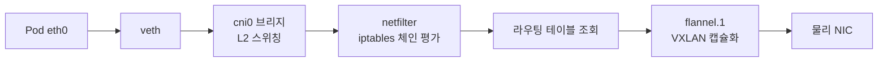
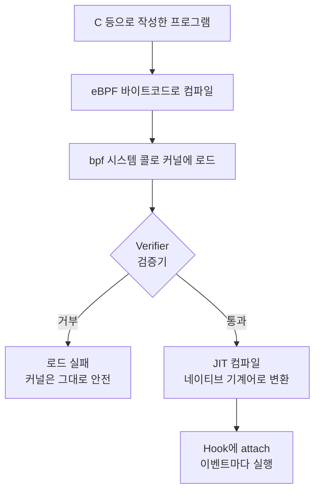
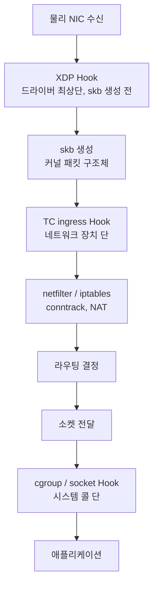
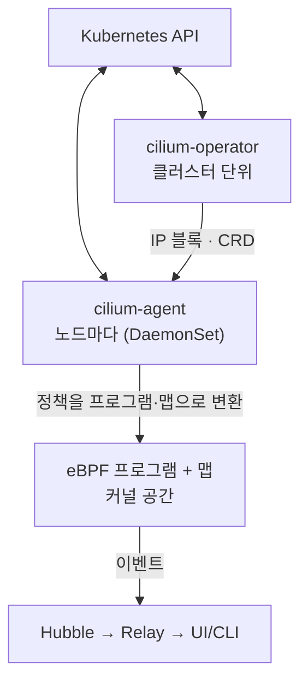
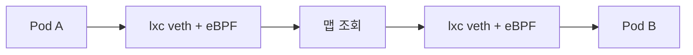

# Week 5. Cilium & eBPF

## 1. 왜 eBPF인가

각 단계가 커널의 서로 다른 서브시스템이고, 그 사이를 패킷이 복사·이동하며 지나갑니다.

### 1.1 세 가지 구조적 한계

| 한계 | 내용 |
| --- | --- |
| **경로가 길다** | 브리지 → netfilter → 라우팅 → 터널 장치를 모두 통과. 각 지점마다 조회와 처리 비용 발생 |
| **규칙이 선형적이다** | kube-proxy의 iptables 모드는 Service가 늘수록 규칙이 비례해 늘고, 패킷마다 체인을 **순차 평가**. 규칙 갱신 시 룰셋 전체를 다시 씀 |
| **IP 기반이다** | 정책이 IP/CIDR로 표현되므로 Pod가 재생성되어 IP가 바뀌면 규칙도 갱신해야 함. Pod 수가 많을수록 규칙 수가 폭증 |

### 1.2 해결 방향

커널 코드를 고치거나 커널 모듈을 올리면 위 문제를 해결할 수 있지만, 커널 수정은 배포가 불가능하고 모듈은 잘못되면 시스템 전체가 죽습니다. **안전하게 커널 동작을 바꾸는 방법**이 필요했고, 그게 eBPF입니다.

---

## 2. eBPF 기본 개념

### 2.1 정의

eBPF는 **커널을 다시 컴파일하거나 모듈을 올리지 않고, 커널 안의 특정 지점(Hook)에 작은 프로그램을 붙여 실행하는 기술**입니다. 원래 패킷 필터링(BPF, tcpdump의 그 BPF)에서 출발했지만, 지금은 네트워킹·보안·관측 전반에 쓰입니다.

### 2.2 프로그램이 커널에 올라가는 과정

### 2.3 네 가지 핵심 구성요소

| 구성요소 | 역할 |
| --- | --- |
| **Verifier (검증기)** | 로드 시점에 프로그램을 정적 분석. 무한 루프가 없는지, 메모리 접근이 범위 안인지, 종료가 보장되는지 검사. **통과하지 못하면 아예 로드되지 않으므로** 커널이 죽지 않음 |
| **JIT 컴파일** | 바이트코드를 CPU 네이티브 코드로 변환. 인터프리터가 아니라 네이티브 속도로 실행 |
| **Map (맵)** | 커널에 상주하는 키-값 저장소. 해시/배열/LRU 등 종류가 있고, **프로그램 간, 그리고 커널과 사용자 공간 사이의 상태 공유**에 사용. Cilium의 정책·서비스·엔드포인트 정보가 전부 여기 들어감 |
| **Helper 함수** | 프로그램이 호출할 수 있도록 커널이 제공하는 제한된 함수 집합. 패킷 수정, 맵 조회, 리다이렉트 등 |

### 2.4 왜 이 구조가 중요한가

- **안전성**: 검증기가 막기 때문에, 잘못 짠 프로그램이 커널 패닉을 내지 못합니다. 모듈과 결정적으로 다른 점입니다.
- **동적**: 재부팅 없이 붙이고 뗄 수 있습니다. Cilium이 정책을 바꿀 때 맵 항목만 갱신하면 되는 이유입니다.
- **위치 선택 가능**: 패킷 경로의 어느 지점에 붙일지 고를 수 있습니다. 다음 장의 핵심입니다.

---

## 3. eBPF Hook — 네트워크 처리에 들어가는 위치

### 3.1 패킷 경로와 Hook 지점

들어오는 패킷 기준으로, 커널을 지나는 순서와 Hook 위치는 이렇습니다.

### 3.2 Hook별 특성

| Hook | 위치 | 특징 | Cilium에서의 쓰임 |
| --- | --- | --- | --- |
| **XDP** | NIC 드라이버 최상단, skb 생성 전 | 가장 빠름. 패킷 구조체도 만들기 전이라 할 수 있는 일은 제한적 | DDoS 차단, 고속 L4 로드밸런싱 |
| **TC (tc ingress/egress)** | 네트워크 장치(`lxc*`, 물리 NIC)의 송수신 지점 | skb가 있어 거의 모든 처리 가능. Cilium 데이터 경로의 주력 | Pod별 정책 집행, 포워딩, NAT, 캡슐화 |
| **cgroup / socket** (`connect`, `sendmsg`) | 소켓 시스템 콜 호출 시점 | 패킷이 만들어지기도 전, 애플리케이션 단에서 개입 | Service 주소 변환(소켓 로드밸런싱) |
| **kprobe / tracepoint** | 임의의 커널 함수·이벤트 | 패킷을 바꾸지 않고 관찰 | 가시성, 이벤트 수집 |

### 3.3 핵심

**위로 갈수록 패킷이 커널 스택을 덜 지난 상태에서 처리됩니다.** 기존 방식이 "패킷을 netfilter까지 끌고 가서 거기서 판단"했다면, eBPF는 "장치에 도착하자마자, 혹은 아예 소켓을 만들 때 판단"할 수 있습니다. 같은 일을 하더라도 **얼마나 일찍 개입하느냐**가 성능과 구조의 차이를 만듭니다.

---

## 4. Cilium Architecture

### 4.1 두 개의 플레인

**정하는 층(컨트롤 플레인)과 실제로 처리하는 층(데이터 플레인)이 분리**되어 있고, 여기에 관찰을 담당하는 Hubble이 붙습니다.

### 4.2 구성요소

| 구성요소 | 위치 | 역할 |
| --- | --- | --- |
| **cilium-agent** | 노드마다 (사용자 공간) | Kubernetes의 선언을 eBPF 프로그램·맵으로 번역. 엔드포인트·정책·서비스·IPAM 관리 |
| **cilium-operator** | 클러스터 1개 (리더 선출) | IP 풀 관리, 노드 등록, CRD 검증, 클러스터 메시, 가비지 컬렉션 |
| **eBPF 프로그램·맵** | 커널 공간 | 실제 패킷 처리와 정책 집행 |
| **Hubble** | agent 내장 + relay | 데이터 경로가 낸 이벤트 수집·조회 |

### 4.3 동작 흐름

| 흐름 | 순서 |
| --- | --- |
| **설정·정책** | API에 정책 생성 → Operator(클러스터 범위) → Agent(노드) → eBPF 프로그램·맵으로 반영 |
| **패킷 처리** | 패킷 도착 → eBPF가 맵 조회 → 필터링·로드밸런싱·변환 → 허용된 것만 전달 |
| **관찰** | 처리 중 이벤트 생성 → Hubble Server → Relay → CLI·UI |

### 4.4 주요 eBPF 맵

| 맵 | 쓰임 |
| --- | --- |
| 엔드포인트 맵 | 목적지 Pod 식별 |
| 정책 맵 | (출발 Identity, 도착 Identity, 포트) → 허용/거부 |
| 연결 추적 맵 | 활성 연결 상태, 응답 패킷 자동 허용 |
| 서비스 맵 | Service → 백엔드 목록 (로드밸런싱) |

정책이 바뀌면 프로그램을 다시 만드는 게 아니라 **맵 항목만 갱신**합니다.

### 4.5 CRD(Custom Resource Definition)

`CiliumNetworkPolicy`(L7·FQDN 확장), `CiliumClusterwideNetworkPolicy`(클러스터 전역), `CiliumEndpoint`(Pod별 상태, 자동 생성), `CiliumIdentity`(레이블 ↔ 숫자, 자동 생성), `CiliumNode`(노드·IPAM 정보) 등을 사용합니다.

### 4.6 분리의 의미

Agent가 죽어도 **커널에 올라간 프로그램과 맵은 계속 패킷을 처리**합니다. 컨트롤 플레인 장애는 "새 설정이 반영되지 않는 것"이지 "통신이 끊기는 것"이 아닙니다. 덕분에 장애 진단에서도 정책 반영 문제와 패킷 처리 문제를 분리해 볼 수 있습니다.

---

## 5. Cilium Datapath

- **노드 안**: 브리지(`cni0`)가 없습니다. Pod마다 `lxc*` veth가 호스트에 직접 붙고, 그 인터페이스의 eBPF가 맵을 조회해 상대 Pod의 veth로 바로 리다이렉트합니다.
- **노드 간**: 터널 모드(VXLAN·Geneve)와 네이티브 라우팅(캡슐화 없음) 중 선택합니다. Flannel은 터널 고정, Calico는 BGP 라우팅이 기본 — Cilium은 둘 다 가능합니다.
- **eBPF host routing**: 들어온 패킷을 netfilter·라우팅 스택에 올리지 않고 목적지 Pod로 바로 전달해 경로를 줄입니다.

---

## 6. kube-proxy Replacement

|  | kube-proxy (iptables) | Cilium (eBPF) |
| --- | --- | --- |
| 규칙 형태 | 체인·룰 목록, 순차 평가 | 해시 맵, 상수 시간 조회 |
| 변환 시점 | 패킷 생성 후 netfilter에서 DNAT | `connect()` 시점, 소켓에서 |
| 패킷에 보이는 목적지 | ClusterIP → Pod IP | 처음부터 Pod IP |

기본 설치에서는 kube-proxy가 그대로 남아 있고, `kubeProxyReplacement`를 켜야 전환됩니다.

---

## 7. Identity

- 정책을 IP가 아니라 **레이블 집합에 부여한 숫자 Identity**로 다룹니다.
- Pod가 재생성되어 IP가 바뀌어도 레이블이 같으면 Identity는 그대로입니다.
- 규칙 수가 **Pod 수가 아니라 레이블 조합 수**에 비례합니다.
- 클러스터 밖 대상은 `world`, CIDR, FQDN 같은 특수 Identity로 표현합니다.

---

## 8. NetworkPolicy

- 집행 위치는 **각 노드 커널, Pod의 `lxc` 인터페이스 앞**입니다.
- L3/L4는 eBPF가 바로 판정하고, L7(HTTP·gRPC·Kafka)은 해당 트래픽만 Envoy로 넘깁니다.
- 거부는 거절 응답 없이 폐기되므로 클라이언트에서는 타임아웃으로 보입니다.
- 같은 YAML이라도 **Flannel은 무효, Calico는 iptables로 차단, Cilium은 Identity로 차단 + 사유 기록**입니다.

---

## 9. Hubble

- 흐름 이벤트를 만드는 주체가 **정책을 집행하는 그 eBPF 프로그램**입니다.
- 각 노드 Agent의 Hubble Server → hubble-relay → CLI·UI 순으로 올라옵니다.
- 기록에 verdict(`FORWARDED`/`DROPPED`)와 드롭 사유, Identity가 함께 남습니다.
- 4주차의 Kubeshark가 데이터 경로 **바깥의 관찰자**였다면, Hubble은 데이터 경로 **자신의 기록**입니다.

---

## 10. 세 CNI 비교

| 항목 | Flannel | Calico | Cilium |
| --- | --- | --- | --- |
| 노드 내 | `cni0` 브리지 | `cali*` + 라우팅 | `lxc*` + eBPF |
| 노드 간 | VXLAN 고정 | BGP/IPIP/VXLAN | 터널 또는 네이티브 라우팅 |
| 집행 계층 | 커널 네트워크 스택 | iptables (Felix) | eBPF 프로그램·맵 |
| 정책 단위 | 없음 | IP/레이블 | Identity |
| Service | kube-proxy | kube-proxy | 대체 가능 |
| 관찰 | 외부 도구 | 흐름 로그 | Hubble 내장 |

---

## 11. 정리

**eBPF가 들어가는 위치** — Pod의 `lxc` TC Hook(정책·포워딩), 소켓 Hook(Service 변환), 물리 NIC의 TC/XDP(외부 트래픽). 기존보다 **더 일찍, 때로는 패킷이 만들어지기 전에** 판단합니다.

**기존 CNI와 다른 점** — 커널 기능을 설정하는 대신 커널에 프로그램을 심습니다. 그 결과 브리지 대신 직접 리다이렉트, 선형 룰 대신 해시 맵, IP 대신 Identity, kube-proxy까지 대체가 가능해집니다.

**관찰과 정책의 연결** — 같은 프로그램이 판정하고 기록합니다. 그래서 "왜 막혔는지"를 추론하지 않고 Hubble에서 그대로 읽을 수 있습니다.
