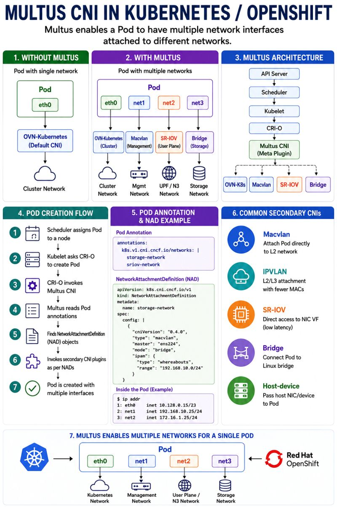
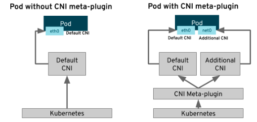
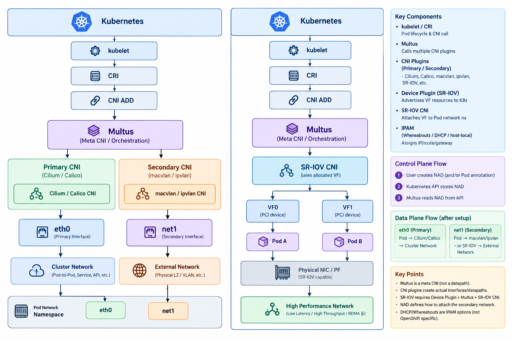

# 1. 왜 하나의 Pod에 여러 네트워크가 필요한가?

Kubernetes의 일반적인 Pod는 하나의 기본 네트워크 인터페이스를 사용함.

```text
Pod
└── eth0
      │
      ▼
  Primary CNI
      │
      ▼
Kubernetes Cluster Network
```

일반적인 애플리케이션에서는 이것으로 충분하지만, 네트워크 요구사항이 복잡해지면 하나의 네트워크로 모든 트래픽을 처리하기 어려움.

대표적인 경우:

* Kubernetes 관리/Service/Pod 간 통신과 Application Data Traffic을 분리해야 함
* Control Plane Traffic과 User/Data Plane Traffic을 분리해야 함
* 외부 물리 네트워크에 Pod를 직접 연결해야 함
* 특정 Pod에 고성능 NIC를 직접 할당해야 함
* SR-IOV, DPDK, RDMA와 같은 고성능 네트워크 기능이 필요함
* 여러 개의 물리 네트워크 또는 VLAN을 하나의 Pod에서 사용해야 함

Amazon EKS의 Multus 소개(https://docs.aws.amazon.com/eks/latest/userguide/pod-multus.html)에서도 Network Function의 control/management traffic과 data/user plane traffic을 분리하거나, SR-IOV/DPDK 기반의 고성능 네트워크를 연결하는 사례를 대표적인 Multus 사용 사례로 설명함.

따라서 Multi-Networking의 핵심은 단순히 **“NIC를 여러 개 붙이는 것”**&#xC774; 아니라,

> **하나의 Pod가 서로 다른 Networking Datapath를 동시에 사용할 수 있도록 하는 것**

---

# 2. Primary Network와 Secondary Network

## 2.1 Primary Network

Pod가 생성될 때 기본적으로 연결되는 네트워크임.

```text
Pod
└── eth0
      │
      ▼
Primary CNI
      │
      ├── Calico
      ├── Cilium
      ├── Flannel
      ├── OVN-Kubernetes
      └── AWS VPC CNI
```

주로 다음 통신에 사용함.

* Pod-to-Pod
* Pod-to-Service
* Kubernetes API / DNS 등 Cluster Traffic
* 기본적인 Pod Networking

Multus 프로젝트에서도 이 네트워크를 `default network`, `primary CNI`, `cluster network` 등으로 표현하며, 모든 Pod가 기본적으로 갖는 네트워크로 정의함.

---

## 2.2 Secondary Network

Primary Network와 별개로 Pod에 추가되는 네트워크임.

```text
Pod Network Namespace
├── eth0
│    └── Primary Network
│
├── net1
│    └── Secondary Network
│
└── net2
     └── Secondary Network
```

예를 들어:

```text
eth0 → Cilium → Kubernetes Cluster Network

net1 → macvlan → Physical Network

net2 → SR-IOV → High Performance Network
```

따라서 Secondary Network는 반드시 특정한 하나의 CNI를 의미하는 것이 아님.

**“Pod에 추가로 연결된 네트워크”라는 논리적 개념**이며, 실제 인터페이스를 만드는 것은 macvlan, ipvlan, SR-IOV 등의 delegate CNI임.

---

# 3. Multus CNI란?

Multus는 **Meta CNI Plugin**임.

중요한 점은:

> **Multus가 직접 네트워크 datapath를 구현하는 것이 아님.**

Multus는 다른 CNI Plugin을 호출하여 하나의 Pod에 여러 네트워크를 연결하는 역할을 수행함. Red Hat과 Multus 공식 문서 모두 Multus를 다른 CNI plugin을 호출하는 meta-plugin으로 설명함.



```text
                     Kubernetes
                         │
                       kubelet
                         │
                        CRI
                         │
                    CNI ADD 요청
                         │
                         ▼
                      Multus
                    /        \
                   /          \
                  ▼            ▼
           Primary CNI     Secondary CNI
             Cilium         macvlan
             Calico         ipvlan
             Flannel        SR-IOV
                  │            │
                  ▼            ▼
                eth0          net1
```

즉,

```text
Multus
  = 여러 CNI를 조정

Cilium / Calico
  = 실제 Primary Network를 구현

macvlan / ipvlan / SR-IOV
  = 실제 Secondary Network를 구현
```

---

# 4. Multus에서 실제로 CNI가 호출되는 과정

Pod 생성 과정에서 중요한 부분은 **누가 누구를 호출하는가**임.

```text
1. Pod 생성
      │
      ▼
2. kubelet
      │
      ▼
3. CRI Runtime
      │
      ▼
4. CNI ADD
      │
      ▼
5. Multus
      │
      ├───────────────┐
      ▼               ▼
6. Primary CNI     Secondary CNI
      │               │
      ▼               ▼
    eth0             net1
```

예를 들어 `Cilium + SR-IOV`라면:

```text
Pod 생성
   │
   ▼
Multus CNI ADD
   │
   ├── Cilium CNI ADD
   │       └── eth0 생성
   │
   └── SR-IOV CNI ADD
           └── VF를 Pod netns에 연결
               └── net1 생성
```

여기서 **Multus는 `eth0`, `net1`의 datapath 자체를 만드는 것이 아니라 각각의 CNI를 순서대로 호출하는 역할**을 수행함.

---

# 5. NetworkAttachmentDefinition(NAD)

Multus가 어떤 Secondary Network를 연결할 것인지를 정의하는 Kubernetes CRD임.

```text
NetworkAttachmentDefinition
          │
          ▼
Secondary Network Configuration
          │
          ├── CNI type
          ├── master interface
          ├── mode
          ├── IPAM
          ├── routes
          └── 기타 옵션
```

예:

```yaml
apiVersion: k8s.cni.cncf.io/v1
kind: NetworkAttachmentDefinition
metadata:
  name: macvlan-net # 이 Pod이 어떤 network configuration을 사용할지 지정하는 이름으로 사용
spec:
  config: |
    {
      "cniVersion": "0.3.1",
      "type": "macvlan",
      "master": "eth1", 
      "mode": "bridge",
      "ipam": {
        "type": "whereabouts",
        "range": "10.10.0.0/24"
      }
    }
```

Pod에서는 NAD의 이름을 annotation으로 요청함.

"master": "eth1" -> pod의 eth1이 아님!!
Node의 host interface임
=> node의 eth1을 기반으로 macvlan interface를 만들어라 하는 의미

"mode": "bridge" -> macvlan의 동작모드

```yaml
metadata:
  annotations:
    k8s.v1.cni.cncf.io/networks: macvlan-net
```

흐름은:

```text
Pod Annotation
      │
      ▼
   NAD 이름
      │
      ▼
    Multus
      │
      ▼
 NAD의 CNI Config 확인
      │
      ▼
 macvlan CNI 호출
```

==> macvlan-net이라는 이름의 Secondary Network를 만들고, Node의 eth1을 기반으로 macvlan interface를 생성하며, Whereabouts를 사용해서 10.10.0.0/24에서 Pod의 Secondary IP를 할당한다.

즉:

```text
NAD
= "어떤 Secondary Network를 사용할지 정의"

Multus
= "그 정의를 보고 해당 CNI를 호출"

Secondary CNI
= "실제로 인터페이스/datapath를 생성"
```

Multus가 secondary network를 활용한다고 해서 꼭 NAD가 필수인가?
-> NAD가 multus의 유일한 configuration방법은 아니기 때문에 아님
-> NAD 없이 Node에 Configuration file을 미리 배치하는 방식도 있음 (/etc/cni/multus/net.d/macvlan2.conf)

근데 이러면 각 node의 파일을 관리해야 하는 부담이 생겨서
NAD로 관리하는게 사실상 표준적인 선택이다~

---

# 6. Multus와 CNI Chaining은 같은 것이 아님

둘을 구분해야 함.

## Multi-Networking

**하나의 Pod에 여러 개의 네트워크 인터페이스를 연결하는 것**

```text
Pod
├── eth0 → Primary CNI
├── net1 → macvlan
└── net2 → SR-IOV
```

Multus의 대표적인 역할임.

---

## CNI Chaining

하나의 네트워크 인터페이스에 대해 여러 CNI Plugin이 연속적으로 동작하는 구조임.

예:

```text
Primary CNI
     │
     ▼
  eth0 생성
     │
     ▼
   tuning
     │
     ▼
   portmap
     │
     ▼
 bandwidth
```

각 plugin이 같은 네트워크 구성 과정에 연속적으로 참여할 수 있음.

Multus 공식 설정에도 별도의 `auxiliaryCNIChainName`을 통해 chained plugin을 구성하는 기능이 존재함.

따라서:

```text
Multus Multi-Network
= 여러 interface

CNI Chaining
= 하나의 network configuration에 여러 plugin을 연속 적용
```

> CNI CHaning은 어떤 아키텍처에서 수행되는지? 그리고 meta plugin 처럼 네트워크 환경이 다른 경우에서 여러 개 쓰는 건 이해가 가는데, 기능별로만 뽑아서 chaining 쓴다고 하는 경우는 리소스 낭비가... install 되어있을 때 심하진 않을지...
> 
> -> Network topology 자체를 바꾸는 게 아니라, 하나의 Pod network에 부가적인 networking behavior를 붙이는게 필요할 때, Pod마다 bandwidth 제한이 필요한 환경이라거나
> 
> -> CNI plugin binary를 설치해 놓는 것 자체가 큰 runtime resource를 계속 먹는 구조는 아님.
> 예를 들어 tuning CNI는 daemon이나 계속 실행되는 프로세스가 아니라 CNI ADD 시 호출되는 plugin binary임. 실제로 tuning plugin은 interface를 생성하지도 않고, 기존 interface의 sysctl/attribute를 변경하는 역할만 함.

---

# 7. Secondary CNI ① macvlan

macvlan은 Linux Kernel의 네트워크 인터페이스 가상화 기능을 사용하는 방식임.

하나의 물리 NIC를 parent로 하고 여러 개의 macvlan interface를 생성할 수 있음.

```text
Physical NIC
    eth1
      │
      ├── macvlan A → Pod A net1
      │
      ├── macvlan B → Pod B net1
      │
      └── macvlan C → Pod C net1
```

각 macvlan interface는 별도의 MAC address를 가질 수 있음.

따라서 외부 네트워크 입장에서는 여러 개의 L2 endpoint처럼 보일 수 있음.

### Packet Flow

```text
Pod net1
   │
   ▼
macvlan interface
   │
   ▼
Parent NIC
   │
   ▼
Physical Network
   │
   ▼
Switch
   │
   ▼
External Network
```

Red Hat의 설명에서도 macvlan을 이용하면 Pod에 별도의 MAC 주소를 가진 인터페이스를 구성하여 외부 네트워크와 직접 연결할 수 있음을 보여줌.

### Layer 관점

```text
Ethernet
   │
   ▼
MAC Address
   │
   ▼
macvlan
```

따라서 macvlan은 **L2 관점에서 이해하는 것이 핵심**임.

### 적합한 환경

* Bare Metal
* 기존 물리 L2 Network에 Pod를 직접 연결해야 하는 경우
* 외부 장비가 Pod의 MAC Address를 직접 인식해야 하는 경우
* 간단한 Secondary Network 구성

---

# 8. Secondary CNI ② ipvlan

ipvlan 역시 Linux Kernel의 interface virtualization 기능을 사용하지만 macvlan과 MAC 관리 방식이 다름.

일반적으로:

```text
Parent NIC MAC
      │
      ├── ipvlan A → IP A
      ├── ipvlan B → IP B
      └── ipvlan C → IP C
```

와 같이 여러 endpoint가 parent NIC의 MAC을 공유할 수 있음.

따라서 물리 스위치에서 하나의 NIC에 많은 MAC address가 나타나는 문제를 줄이는 데 유리함.

Red Hat 역시 switch port의 MAC address 제한이나 일부 Cloud/VPC 환경에서 macvlan보다 ipvlan이 적합할 수 있는 상황을 설명함. ipvlan은 L2와 L3 mode를 모두 지원하므로 “ipvlan = L3”로 외우면 안 됨.

### Mode

```text
ipvlan L2
   └── L2 관점에서 parent를 공유

ipvlan L3
   └── parent가 Routing 역할까지 수행
```

### 적합한 환경

* MAC address 제한이 있는 네트워크
* 많은 Secondary Endpoint가 필요한 경우
* Cloud Network
* L2/L3 routing 요구에 따라 ipvlan mode를 선택해야 하는 환경

---

# 9. Secondary CNI ③ SR-IOV

SR-IOV는 macvlan/ipvlan과 성격이 다름.

macvlan/ipvlan:

```text
Linux Kernel
    │
    └── Virtual Interface
```

SR-IOV:

```text
Node
│
├── CPU
├── Memory
│
└── Network Device
      ├── VF0
      ├── VF1
      ├── VF2
      └── VF3
            │
            ▼
    SR-IOV Device Plugin
            │
            │ "VF 4개를 Kubernetes resource로 제공"
            ▼
    Node.status.allocatable
            │
            └── intel.com/sriov_netdevice: 4
```

SR-IOV는 하나의 Physical Function(PF)을 여러 개의 Virtual Function(VF)으로 나누어 NIC 하드웨어에서 독립적인 기능 단위를 제공함.
SR-IOV Device Plugin의 핵심 역할은 "NIC 장비를 Kubernetes가 스케줄링할 수 있는 Resource로 바꾸는 것"
Pod에는 VF를 네트워크 인터페이스로 연결할 수 있음.

> • PF (Physical Function): SR-IOV를 지원하는 원본 물리 장치입니다. VF를 생성, 설정, 관리하는 권한을 가집니다.
• VF (Virtual Function): PF로부터 분할되어 나오는 자식 장치입니다. 각 VF는 자신만의 독립적인 PCIe 구성 공간과 입출력(I/O) 큐를 가집니다.
• 직접 할당 (Pass-through): 생성된 VF는 가상머신(VM)이나 컨테이너에 직접(Pass-through) 할당됩니다.
-> 이건 완전 k8s 초점은 아니라... 흐린눈 해도 괜찮을 것 같다...

---

# 10. SR-IOV Packet Flow

일반적인 Pod Networking:

```text
Pod
 │
 ▼
veth
 │
 ▼
Host Kernel
 │
 ▼
CNI Datapath
 │
 ▼
Physical NIC
```

SR-IOV:

```text
Pod
 │
 ▼
net1
 │
 ▼
VF
 │
 ▼
NIC Hardware
 │
 ▼
Physical Network
```

따라서 SR-IOV는 일반적인 veth 기반 네트워크보다 **NIC Hardware에 가까운 Datapath**를 사용할 수 있음.

특히 다음 환경에서 유리함.

* Bare Metal
* NFV
* Telecom / 5G
* DPDK
* RDMA / RoCE
* 고성능 GPU / HPC
* 고 packet rate / low latency workload

단, **SR-IOV 자체가 곧 DPDK 또는 RDMA인 것은 아님.**

```text
SR-IOV
= NIC Virtualization

DPDK
= User-space packet processing framework

RDMA
= Remote Direct Memory Access

RoCE
= Ethernet 기반 RDMA transport
```

이 기술들은 서로 조합될 수 있지만 서로 같은 개념은 아님.

---

# 11. Multus + Calico 구조

Calico를 Primary CNI로 사용하는 경우:

```text
                         Kubernetes
                              │
                             CRI
                              │
                           Multus
                         /        \
                        /          \
                       ▼            ▼
                  Calico CNI     macvlan CNI
                       │              │
                       ▼              ▼
                     eth0           net1
                       │              │
                       ▼              ▼
               Calico Datapath    Physical L2
```

Pod 내부에서는:

```text
Pod Network Namespace

eth0
 │
 └── Calico
      └── Cluster Network

net1
 │
 └── macvlan / ipvlan
      └── External Network
```

즉 Calico가 Primary Network를 담당하면서도 Multus를 통해 별도의 Secondary CNI를 연결할 수 있음.

---

# 12. Multus + Cilium 구조

Cilium을 Primary CNI로 사용하는 경우도 같은 방식으로 볼 수 있음.

```text
Pod
├── eth0
│     │
│     ▼
│   Cilium CNI
│     │
│     ▼
│   Cilium eBPF Datapath
│
└── net1
      │
      ▼
    SR-IOV CNI
      │
      ▼
      VF
      │
      ▼
 Physical NIC
```

여기서 역할을 분리해서 이해해야 함.

```text
eth0
= Cilium이 관리하는 Kubernetes Network

net1
= SR-IOV가 제공하는 High Performance Network
```

따라서:

```text
Cilium
    → Kubernetes cluster connectivity
    → Service / Policy / eBPF datapath

SR-IOV
    → Specialized Data Network
    → VF / hardware-oriented path
```

Cilium + SR-IOV + Multus 사례(https://velog.io/@_gyullbb/Cilium-SR-IOV-Multus)도 이러한 구조를 사용하며, `eth0`을 기본 Kubernetes 네트워크로 두고 `net1`을 SR-IOV 기반 RoCE/RDMA 데이터 네트워크로 사용하는 형태를 보여줌.

다만 이 사례는 **GPU/온프레미스 환경의 구성 예시**로 보는 것이 적절함. 특정 Cilium + Multus + SR-IOV 조합의 세부 설정은 Cilium, Multus, NIC, kernel 및 배포 환경에 따라 달라짐.

---

# 13. 5G / Telecom에서는 왜 Multi-Networking이 중요한가?

5G CNF를 단순화하면:

```text
                  5G CNF Pod
              ┌───────────────┐
              │               │
              │ eth0          │
              │   │           │
              │   ▼           │
              │ Cilium/Calico │
              │               │
              │ Control       │
              │ / Management  │
              │               │
              │ net1          │
              │   │           │
              │   ▼           │
              │ SR-IOV VF     │
              │               │
              │ User/Data     │
              │ Plane         │
              └───────────────┘
                      │
                      ▼
                  Physical NIC
                      │
                      ▼
                  5G Network
```

이 구조의 핵심은:

```text
Kubernetes Traffic
       ≠
Telco Data Traffic
```

로 분리하는 것임.

예를 들어:

```text
eth0 → Kubernetes API / DNS / Service / Control

net1 → User Plane / Data Plane / Telecom Network
```

이렇게 네트워크를 분리하면 특정 데이터 트래픽에 별도의 성능·routing·hardware 특성을 부여할 수 있음.

AWS의 Multus 소개에서도 Communication Service Provider의 Network Function에서 Control/Management와 User/Data Plane을 분리하는 사례를 대표적인 Multi-Networking use case로 설명함.

---

# 14. macvlan vs ipvlan vs SR-IOV

| 구분        | macvlan                    | ipvlan                         | SR-IOV                        |
| --------- | -------------------------- | ------------------------------ | ----------------------------- |
| 핵심 개념     | Linux L2 virtual interface | Linux interface virtualization | NIC hardware virtualization   |
| MAC       | 별도 MAC 사용 가능               | parent MAC 공유 가능               | VF별 hardware identity         |
| 주요 관점     | L2                         | L2 / L3                        | NIC / PCIe / L2/L3            |
| 실제 경로     | Kernel 기반                  | Kernel 기반                      | VF / NIC hardware             |
| 성능        | 일반적                        | 일반적~높음                         | 높음                            |
| 구성 난이도    | 낮음                         | 중간                             | 높음                            |
| 물리 NIC 필요 | Parent NIC                 | Parent NIC                     | SR-IOV 지원 NIC                 |
| 대표 환경     | Bare Metal / L2            | Cloud / 대규모 L2/L3              | 5G / NFV / GPU / HPC          |
| 대표 용도     | 외부 L2 연결                   | MAC 제한 대응                      | Low latency / High throughput |

중요한 것은 단순 성능 순위가 아니라 **네트워크 계층과 요구사항이 다르다는 것**임.

```text
macvlan
→ "Pod를 L2 Network endpoint처럼 보이게 하고 싶다"

ipvlan
→ "MAC을 많이 만들지 않고 여러 IP endpoint를 만들고 싶다"

SR-IOV
→ "NIC hardware의 VF를 Pod에 직접 제공하고 싶다"
```

---

# 15. IPAM은 어디에 들어가는가?

Secondary CNI가 인터페이스를 만들었다고 끝나는 것이 아님.

```text
Secondary CNI
      │
      ├── Interface 생성
      │
      └── IPAM
            │
            ├── IP
            ├── Gateway
            └── Route
```

예:

```text
macvlan
   │
   ▼
Whereabouts
   │
   ├── 10.10.0.21
   ├── Gateway
   └── Route
```

대표적인 Secondary Network IPAM:

```text
host-local
dhcp
static
whereabouts
```

특히 Whereabouts는 Kubernetes Resource를 이용해 여러 Node에 걸쳐 IP allocation 상태를 관리할 수 있어 Multus Secondary Network에서 자주 사용됨. Red Hat의 Multus 예제에서도 `whereabouts`를 secondary network IPAM으로 사용함.

---

# 16. Multi-NIC에서 Routing이 중요한 이유

인터페이스가 여러 개 생겼다고 자동으로 모든 트래픽이 적절한 인터페이스를 사용하는 것은 아님.

예:

```text
Pod
├── eth0 → Cluster Network
└── net1 → External Network
```

Pod의 기본 route가:

```text
default via ... dev eth0
```

라면 일반적인 외부 traffic은 eth0으로 나갈 수 있음.

Secondary Network를 기본 경로로 사용하려면 별도의 route configuration이 필요할 수 있음.

Multus는 특정 attachment에 `default-route`를 지정하는 기능도 제공함. 다만 이 경우 Kubernetes Cluster Network로 가는 traffic까지 영향을 받을 수 있으므로 routing 설계를 함께 고려해야 함.

---

# 17. Multi-NIC Packet Flow를 직접 보는 방법

예를 들어:

```text
eth0 → Cilium
net1 → SR-IOV
```

라면 traffic 종류에 따라 서로 다른 datapath를 탈 수 있음.

### Cluster Traffic

```text
Pod
 │
eth0
 │
 ▼
Cilium
 │
 ▼
eBPF Datapath
 │
 ▼
Cluster Network
```

### Data Plane Traffic

```text
Pod
 │
net1
 │
 ▼
SR-IOV VF
 │
 ▼
NIC
 │
 ▼
Physical Network
```

따라서 같은 Pod에서:

```text
ping <cluster destination>
```

과

```text
ping <secondary network destination>
```

의 Packet Flow가 완전히 다를 수 있음.

이것이 Multi-Networking을 단순히 `ip addr`로 끝내면 안 되는 이유임.

---

# 18. Multus 자체의 최신 변화

최근에는 Kubernetes `1.36` 계열 의존성 업데이트와 함께 **DRA(Dynamic Resource Allocation) 기반 resource integration**이 추가되었음. 또한 Multus의 Device ID ordering, thick plugin lifecycle, CNI config 처리 등 운영 관련 개선이 이루어짐.

따라서 최신 동향까지 본다면:

```text
기존 
- Device Plugin 기반 resource handling

현재
- 기존 Device Plugin 기반
- DRA 기반 resource integration
```

---
# 19. 최종 Architecture



---

# 20. 이번 주에 반드시 가져가야 할 개념

```text
1. Primary Network
   = Pod의 기본 Kubernetes Network

2. Secondary Network
   = Pod에 추가되는 별도 Network

3. Multus
   = 여러 CNI를 호출하는 Meta CNI

4. NAD
   = Secondary Network 설정을 정의하는 Kubernetes CRD

5. macvlan
   = Linux L2 virtual interface
   = 별도 MAC 기반

6. ipvlan
   = Linux interface virtualization
   = L2/L3 mode 지원
   = MAC 공유 가능

7. SR-IOV
   = Physical NIC → PF → VF
   = Hardware-oriented network virtualization

8. Device Plugin
   = VF Resource를 Kubernetes에 광고/할당

9. SR-IOV CNI
   = 할당된 VF를 Pod에 연결

10. Cilium / Calico
   = Multus와 함께 Primary CNI로 사용할 수 있음

11. Multi-Networking
   = 단순히 interface가 여러 개라는 의미가 아니라
     서로 다른 Network Datapath를 하나의 Pod에서 사용하는 구조

12. Packet Flow
   = 반드시 eth0/net1별로 따로 추적해야 함
```
