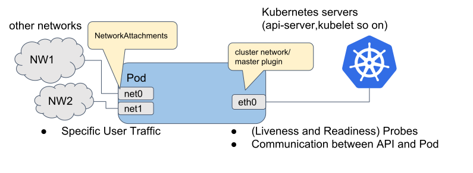
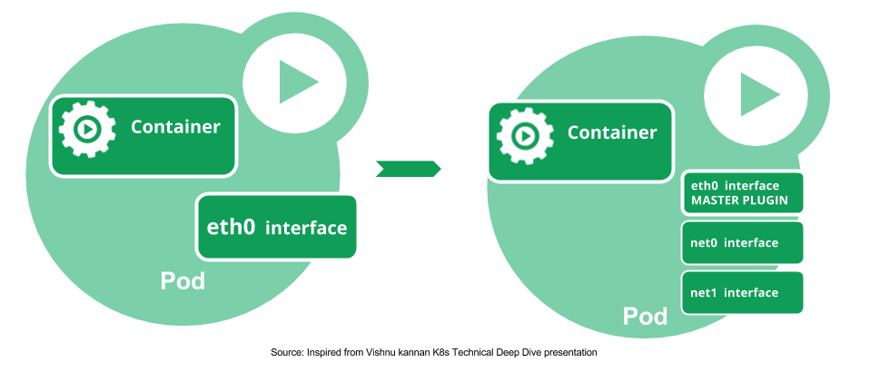
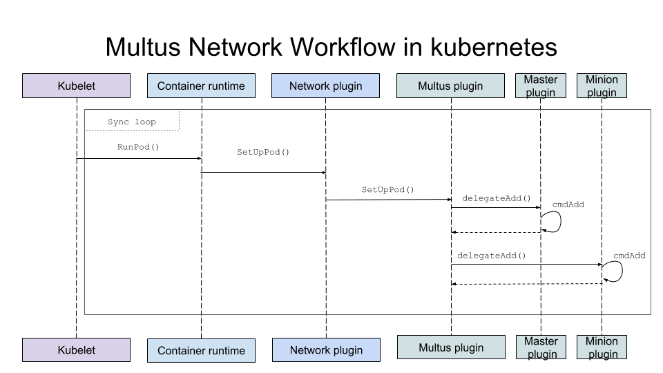
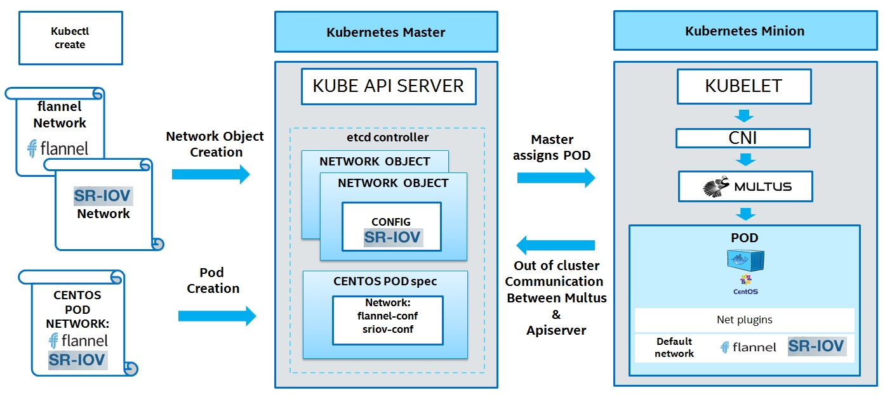
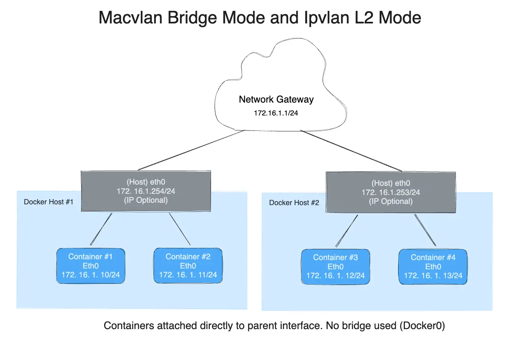
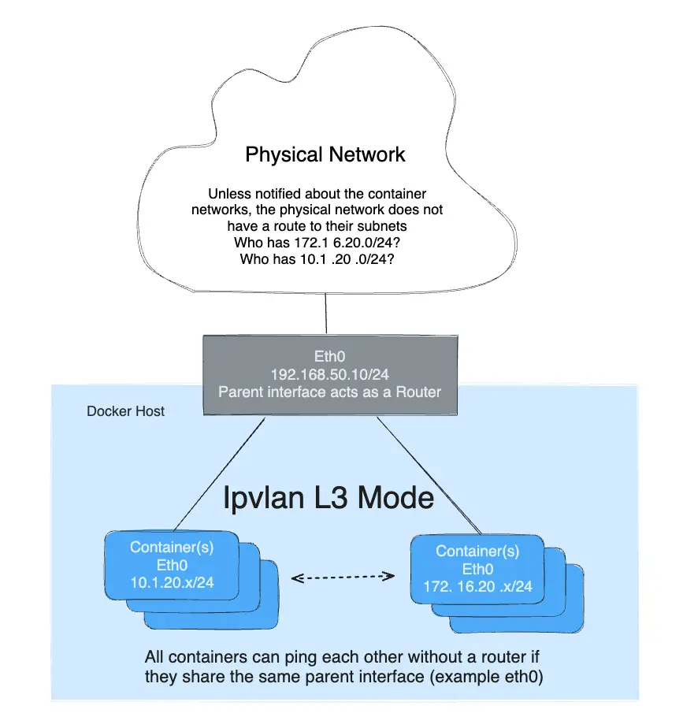
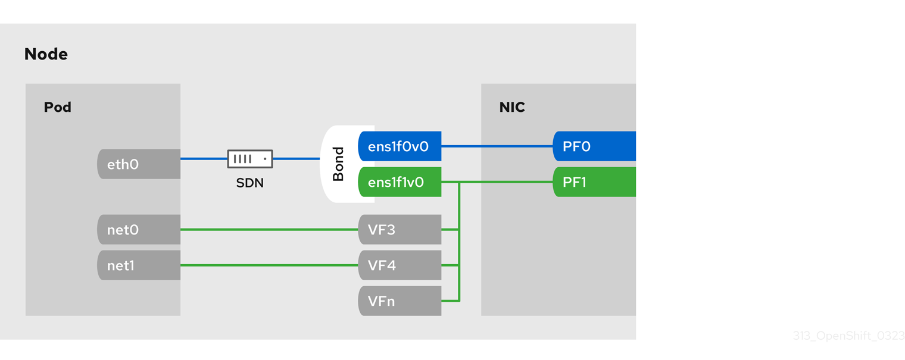

# Week 6. Multi-Networking & Secondary Networking

지난 주까지의 Pod은 전부 인터페이스가 하나였다. `eth0` 하나에 IP 하나, 그 IP로 다른 Pod도 Service도 클러스터 밖도 전부 간다. Week 2의 쿠버네티스 네트워크 모델이 애초에 그렇게 생겼다. **Pod 하나에 IP 하나, 그 IP로 모든 Pod과 NAT 없이 통신.**

그런데 이런 요구가 있다.

- 스토리지 트래픽은 서비스 트래픽과 **다른 NIC, 다른 대역**으로 보내고 싶다
- 5G 코어나 방화벽 같은 CNF(Cloud-native Network Function)는 **데이터 평면 트래픽을 오버레이 없이 물리망에 바로** 내보내야 한다
- 레거시 장비가 Pod을 **같은 L2 대역의 장비 하나**처럼 보고 싶어 한다

`eth0` 하나로는 셋 다 안 된다. Pod에 인터페이스를 **하나 더** 붙여야 한다. 이번 주는 그 "하나 더"를 누가, 어떻게 붙이는지를 README의 학습 포인트 순서대로 따라간다.

---

## Primary / Secondary Network



*출처: [Multus CNI — README](https://github.com/k8snetworkplumbingwg/multus-cni)*

Multus 공식 README의 첫 그림이 이번 주 전체를 요약한다. Pod 하나에 인터페이스가 셋이다.

| 인터페이스 | 그림의 이름 | 연결된 곳 | 용도 |
|---|---|---|---|
| `eth0` | cluster network / master plugin | 쿠버네티스 클러스터 네트워크 | Probe, API 서버 ↔ Pod, Service, 일반 Pod 간 통신 |
| `net1`, `net2` … | NetworkAttachments | NW1, NW2 같은 별도 네트워크 | 특정 용도의 사용자 트래픽 |

- **Primary network**는 Week 2~5에서 본 그 네트워크다. Flannel, Calico, Cilium이 만든다. **모든 Pod이 반드시 하나** 갖고, 쿠버네티스가 아는 IP(`status.podIP`)는 이것뿐이다.
- **Secondary network**는 필요한 Pod만 **추가로** 갖는다. 쿠버네티스는 이 인터페이스를 모른다. Service도, kube-proxy도, NetworkPolicy도 `eth0`만 본다.



*출처: [Multus CNI — docs](https://github.com/k8snetworkplumbingwg/multus-cni/tree/master/docs)*

왼쪽이 지금까지의 Pod, 오른쪽이 이번 주의 Pod이다. `eth0`은 여전히 **MASTER PLUGIN**(= primary CNI)이 만들고, 그 아래 `net0`, `net1`이 추가된다. (실제 Multus의 기본 이름은 `net1`부터 붙는다.)

---

## Multus Architecture / CNI Chaining

### 문제 — kubelet은 CNI를 하나만 부른다

Week 2에서 본 흐름을 다시 떠올리면, 런타임은 `/etc/cni/net.d/`에서 **사전순으로 첫 번째 설정 파일 하나**만 읽고 그 플러그인을 부른다. 플러그인 둘을 각각 불러 인터페이스를 둘 만드는 방법이 CNI 스펙에는 없다.

Multus는 이 자리에 **자기 자신을 끼워 넣는다.** 설치하면 `00-multus.conf`를 만들어 사전순 첫 자리를 차지하고, 런타임이 부르면 진짜 CNI들을 **대신 차례로 불러준다.** 이런 플러그인을 **메타 플러그인**이라 부른다.



*출처: [Multus CNI — docs](https://github.com/k8snetworkplumbingwg/multus-cni/tree/master/docs)*

그림을 왼쪽에서 오른쪽으로 읽는다.

1. kubelet이 `RunPod()` → 런타임이 `SetUpPod()` → 런타임 입장에서 "네트워크 플러그인"을 부른다
2. 그 플러그인이 사실 **Multus**다
3. Multus가 **Master plugin**(primary CNI, 예: Calico)에 `delegateAdd()` → `cmdAdd`가 돌아 `eth0`이 생긴다
4. Multus가 **Minion plugin**(secondary CNI, 예: macvlan)에 `delegateAdd()` → `net1`이 생긴다
5. 결과를 모아 런타임에 돌려준다

Multus 자신은 인터페이스를 하나도 만들지 않는다. **누구를 어떤 순서로 부를지 정하고 결과를 합칠 뿐**이다.

### 배포 형태 — thin과 thick

| | thin plugin | thick plugin (v4.0+ 기본) |
|---|---|---|
| 구성 | 노드에 `multus` 바이너리 하나 | 노드에 `multus-shim`(얇은 실행 파일) + DaemonSet의 `multus-daemon` |
| API 서버 조회 | 바이너리가 매번 kubeconfig로 직접 | 데몬이 대신. shim은 데몬에 요청만 |
| 비고 | 단순 | 메트릭, 리소스 효율 |

Week 3에서 Cilium을 보며 "실행 파일은 얇고 에이전트는 두껍다"고 했던 구조가 Multus thick plugin에도 그대로 있다.

### "CNI Chaining"과 Multus의 위임은 다르다

이름이 비슷해서 헷갈리기 쉬운 두 가지다.

| | CNI Chaining (CNI 스펙) | Multus 위임 (delegation) |
|---|---|---|
| 설정 | `.conflist`의 `plugins` 배열 | NetworkAttachmentDefinition 여러 개 |
| 실행 | 순서대로 부르며 앞 결과를 `prevResult`로 넘긴다 | 플러그인마다 **독립적으로** 부른다 |
| 결과 | **인터페이스 하나**를 여러 플러그인이 차례로 손본다 | **인터페이스가 여러 개** 생긴다 |
| 예 | `calico` → `portmap` → `bandwidth` | `eth0`(calico) + `net1`(macvlan) + `net2`(sriov) |

둘은 같이 쓸 수 있다. NetworkAttachmentDefinition 하나의 설정 자체를 `.conflist`로 써서 `macvlan` → `tuning`처럼 체인을 걸면, `net1` 하나를 두 플러그인이 차례로 만든다.

---

## NetworkAttachmentDefinition

Multus가 "누구를 부를지"를 알아내는 곳이 **NetworkAttachmentDefinition**(NAD) CRD다. 쿠버네티스 Network Plumbing Working Group의 [멀티 네트워크 스펙](https://github.com/k8snetworkplumbingwg/multi-net-spec)이 정한 표준이다.



*출처: [Multus CNI — docs](https://github.com/k8snetworkplumbingwg/multus-cni/tree/master/docs)*

그림은 세 단계다. 왼쪽에서 **네트워크 객체**(flannel, SR-IOV)를 먼저 만들어 API 서버에 저장하고, Pod 스펙에서 그 이름을 참조한다. Pod이 노드에 배정되면 kubelet → CNI → Multus 순으로 불리고, Multus가 **API 서버에 다시 물어** 네트워크 객체의 설정을 가져와 Default network(flannel)와 SR-IOV를 둘 다 붙인다.

실제 객체는 이렇다. `spec.config` 안이 **그냥 CNI 설정 JSON**이다. Week 2에서 `/etc/cni/net.d/`에 파일로 있던 것이 쿠버네티스 객체로 들어왔을 뿐이다.

```yaml
apiVersion: k8s.cni.cncf.io/v1
kind: NetworkAttachmentDefinition
metadata:
  name: macvlan-conf
  namespace: default
spec:
  config: |
    {
      "cniVersion": "0.3.1",
      "type": "macvlan",
      "master": "eth1",
      "mode": "bridge",
      "ipam": {
        "type": "whereabouts",
        "range": "192.168.100.0/24"
      }
    }
```

Pod은 어노테이션으로 이 이름을 부른다.

```yaml
apiVersion: v1
kind: Pod
metadata:
  name: app
  annotations:
    k8s.v1.cni.cncf.io/networks: macvlan-conf          # 여러 개면 "a, b" 또는 JSON 배열
spec:
  containers:
  - name: app
    image: nicolaka/netshoot
    command: ["sleep", "infinity"]
```

Pod이 뜨면 Multus가 결과를 **상태 어노테이션**으로 써 준다. 쿠버네티스가 `status.podIP`로는 알려주지 않는 secondary IP를 여기서 확인한다.

```bash
$ kubectl get pod app -o jsonpath='{.metadata.annotations.k8s\.v1\.cni\.cncf\.io/network-status}'
[{
  "name": "k8s-pod-network", "interface": "eth0",
  "ips": ["10.42.0.5"], "default": true
},{
  "name": "default/macvlan-conf", "interface": "net1",
  "ips": ["192.168.100.20"], "mac": "6a:1f:0c:aa:31:02"
}]
```

IPAM은 한 가지 주의할 점이 있다. Week 2의 `host-local`은 **노드 안에서만** 겹치지 않게 IP를 준다. primary network는 노드마다 Pod CIDR이 달라 문제가 없지만, secondary network는 여러 노드가 **같은 대역 하나**(`192.168.100.0/24`)를 나눠 쓰므로 노드끼리 IP가 겹친다. 그래서 클러스터 전체에서 할당을 관리하는 **whereabouts**를 많이 쓴다.

---

## macvlan / ipvlan / SR-IOV

NAD의 `"type"` 자리에 들어가는 secondary CNI 중 대표적인 셋이다. Week 1의 veth + bridge 구조와 비교하면 차이가 잘 보인다. veth는 **호스트 스택을 한 번 거치는** 연결이고, 이 셋은 **호스트 스택을 건너뛰고 물리 NIC에 바로 붙는** 연결이다.

### macvlan / ipvlan L2 — 물리 NIC를 쪼개 쓴다



*출처: [Docker Docs — Macvlan network driver](https://docs.docker.com/engine/network/drivers/macvlan/), [IPvlan network driver](https://docs.docker.com/engine/network/drivers/ipvlan/)*

Docker 문서 그림이지만 쿠버네티스에서도 구조가 같다. Container 자리에 Pod의 `net1`을 넣으면 된다. 그림 아래 문장이 핵심이다. **"Containers attached directly to parent interface. No bridge used."** 호스트의 `eth0`(parent)에 컨테이너 인터페이스가 직접 매달리고, 컨테이너는 Network Gateway와 **같은 대역**(`172.16.1.0/24`)의 IP를 받는다. 물리망 입장에서는 장비가 하나 더 꽂힌 것처럼 보인다.

macvlan과 ipvlan L2는 그림 모양은 같고 **MAC 주소**에서 갈린다.

| | macvlan | ipvlan L2 |
|---|---|---|
| 하위 인터페이스의 MAC | **각자 고유한 MAC** | **parent의 MAC을 공유**. IP로만 구분 |
| 스위치가 보는 것 | 포트 하나에 MAC 여러 개 | 포트 하나에 MAC 하나 |
| 걸림돌 | 스위치의 포트당 MAC 수 제한, 클라우드 VPC는 모르는 MAC을 드롭 | MAC이 같아서 DHCP 등 MAC 기반 기능에 주의 |
| 공통 제약 | 호스트(parent) 자신과 하위 인터페이스는 기본적으로 **서로 통신이 안 된다** | 같음 |

마지막 줄이 실습에서 자주 막히는 지점이다. macvlan/ipvlan의 패킷은 parent에서 바로 나가버려 호스트 스택으로 되돌아오지 않는다. 노드에서 Pod의 `net1` IP로 ping이 안 되는 건 설정 오류가 아니라 구조다.

### ipvlan L3 — parent가 라우터가 된다



*출처: [Docker Docs — IPvlan network driver](https://docs.docker.com/engine/network/drivers/ipvlan/)*

L3 모드에서는 parent가 **라우터처럼** 동작한다. 컨테이너들은 parent와 다른 대역(`10.1.20.x`, `172.16.20.x`)이어도 되고, 같은 parent에 붙은 것끼리는 라우터 없이 통신한다. 대신 그림 위 구름의 문장처럼 **물리망은 이 대역을 모른다.** "Who has 10.1.20.0/24?" 바깥에 라우트를 따로 알려줘야 한다. Week 4의 Calico BGP가 풀던 문제가 여기 다시 나온다. 브로드캐스트·멀티캐스트도 L3 모드에서는 지나가지 않는다.

### SR-IOV — NIC 하드웨어가 직접 쪼갠다



*출처: [OpenShift Docs — About SR-IOV hardware networks](https://docs.openshift.com/container-platform/latest/networking/hardware_networks/about-sriov.html), 이미지 원본은 [openshift-docs 저장소](https://github.com/openshift/openshift-docs/tree/main/images)*

macvlan/ipvlan은 **커널 소프트웨어**가 NIC를 나눈다. SR-IOV(Single Root I/O Virtualization)는 **NIC 하드웨어**가 나눈다.

- **PF**(Physical Function): 실제 NIC 포트. 그림 오른쪽의 `PF0`, `PF1`
- **VF**(Virtual Function): PF가 만들어내는 가벼운 가상 PCIe 장치. 그림의 `VF3`, `VF4`, `VFn`. 각자 PCI 주소, MAC, 큐를 갖는다

그림에서 Pod의 `eth0`은 **SDN**(primary CNI)을 거쳐 나가고, `net0`, `net1`은 **VF에 직접** 연결된다. 중간에 SDN 상자도 veth도 없다. sriov-cni가 VF 장치를 **통째로 Pod의 네트워크 네임스페이스로 옮기기** 때문이다. 패킷은 호스트 커널의 브릿지·라우팅·iptables를 하나도 거치지 않고 NIC의 하드웨어 스위치에서 바로 처리된다.

VF는 노드마다 개수가 정해진 **하드웨어 자원**이라 쿠버네티스 스케줄러가 알아야 한다. 그래서 부품이 둘 더 붙는다.

| 부품 | 역할 |
|---|---|
| **SR-IOV Network Device Plugin** | 노드의 VF를 찾아 `intel.com/sriov_netdevice` 같은 **확장 리소스**로 kubelet에 등록 |
| **SR-IOV CNI** | Multus가 부르면 배정된 VF를 Pod 네임스페이스로 옮기고 IP·VLAN 설정 |

Pod은 CPU·메모리처럼 VF를 `resources`로 요청하고, NAD는 어노테이션으로 어느 리소스와 짝인지 적는다.

```yaml
# NAD
metadata:
  name: sriov-net
  annotations:
    k8s.v1.cni.cncf.io/resourceName: intel.com/sriov_netdevice
spec:
  config: '{ "type": "sriov", "vlan": 100, "ipam": { "type": "whereabouts", "range": "10.56.217.0/24" } }'
---
# Pod
metadata:
  annotations:
    k8s.v1.cni.cncf.io/networks: sriov-net
spec:
  containers:
  - resources:
      requests: { intel.com/sriov_netdevice: "1" }
      limits:   { intel.com/sriov_netdevice: "1" }
```

### 비교 — 어떤 상황에 무엇을

| | macvlan | ipvlan | SR-IOV |
|---|---|---|---|
| 나누는 주체 | 커널 (소프트웨어) | 커널 (소프트웨어) | NIC (하드웨어) |
| MAC | 인터페이스마다 고유 | parent와 공유 | VF마다 고유 |
| 호스트 커널 스택 | 일부 거침 (parent 드라이버) | 일부 거침 | **거의 안 거침** |
| 특수 하드웨어 | 불필요 | 불필요 | SR-IOV 지원 NIC, BIOS/IOMMU 설정 |
| 성능 | 좋음 | 좋음 | 가장 좋음 (라인 레이트, DPDK 가능) |
| 잘 맞는 상황 | Pod을 물리 L2 대역의 장비처럼 보이게 할 때, 온프레미스 | MAC 수가 제한된 스위치·클라우드 환경, L3로 나누고 싶을 때 | 통신사 CNF, 저지연·고대역 데이터 평면, NFV |

---

## Multi-NIC Pod 구성 및 Packet Flow

인터페이스가 둘이면 패킷은 **어느 쪽으로 나갈지 누가 정하는가.** 답은 Week 1부터 봐 온 그것, **Pod 안의 라우팅 테이블**이다.

```bash
$ kubectl exec app -- ip -br addr
lo               UNKNOWN        127.0.0.1/8
eth0@if12        UP             10.42.0.5/24
net1@if3         UP             192.168.100.20/24

$ kubectl exec app -- ip route
default via 10.42.0.1 dev eth0                                   # primary CNI가 넣은 기본 경로
10.42.0.0/24 dev eth0 proto kernel scope link src 10.42.0.5
192.168.100.0/24 dev net1 proto kernel scope link src 192.168.100.20   # net1 대역의 연결 경로
```

Week 1의 longest prefix match 그대로다.

| 목적지 | 매칭되는 경로 | 나가는 인터페이스 | 그 뒤의 길 |
|---|---|---|---|
| 다른 Pod `10.42.1.7` | `default` | `eth0` | veth → primary CNI (Week 4·5의 경로) |
| Service `10.96.45.10` | `default` | `eth0` | kube-proxy 또는 Cilium 소켓 LB |
| 스토리지 `192.168.100.50` | `192.168.100.0/24` | `net1` | macvlan → parent `eth1` → 물리망 (호스트 스택 우회) |
| 인터넷 `8.8.8.8` | `default` | `eth0` | 노드의 SNAT |

secondary network의 다른 대역(예: `192.168.200.0/24`)으로 가야 하면 기본 경로가 `eth0`이라 엉뚱한 쪽으로 나간다. 이럴 때는 NAD의 IPAM에 `routes`를 넣어 `net1`로 가는 경로를 Pod 안에 추가한다.

```json
"ipam": { "type": "whereabouts", "range": "192.168.100.0/24",
          "routes": [ { "dst": "192.168.200.0/24", "gw": "192.168.100.1" } ] }
```

### net1로 나간 트래픽이 놓치는 것

`net1`은 쿠버네티스 네트워크 모델 **밖**이다. 그래서 primary network에서 당연하던 것들이 적용되지 않는다.

| 기능 | `eth0` | `net1` |
|---|---|---|
| Service / kube-proxy | 적용 | **안 됨.** Endpoints에 secondary IP가 안 들어간다 |
| NetworkPolicy | 적용 | **안 됨.** 별도의 `MultiNetworkPolicy` CRD와 구현체가 필요 |
| Probe, API 서버 통신 | 이쪽으로 | 안 씀 |
| primary CNI의 eBPF/iptables | 거침 | **안 거침** |

---

## 지난 주에 남긴 질문 세 개

> **Multus로 macvlan 두 번째 인터페이스를 붙인 Pod은 그 트래픽이 `bpf_lxc`를 거치지 않을 텐데, 그러면 NetworkPolicy도 Hubble도 전혀 못 보는가.**

못 본다. Cilium의 프로그램은 primary CNI로서 만든 `lxc` veth에 붙어 있고, macvlan `net1`의 패킷은 parent에서 바로 물리망으로 나간다. 위 표의 마지막 줄 그대로다. secondary network의 정책은 `MultiNetworkPolicy`(iptables 기반 구현체 등)로 따로 다뤄야 한다.

> **Cilium chaining 모드에서는 어느 시점에 veth를 찾아 tc 프로그램을 붙이는가.**

`.conflist`에서 Cilium을 앞 플러그인 **뒤에** 두면, 런타임이 앞 플러그인의 결과를 `prevResult`로 넘긴다. Cilium은 거기 적힌 인터페이스 이름으로 veth를 찾아 프로그램을 붙인다. 이번 주 표에서 말한 **CNI 스펙의 체이닝**이 이것이고, Multus의 위임과는 다른 경로다.

> **SR-IOV VF를 Pod에 직접 넣으면 tc 훅을 붙일 호스트 쪽 인터페이스가 없다. 하드웨어 직결 인터페이스와 eBPF 정책은 양립 불가능한가.**

호스트 쪽 veth가 없으니 호스트에서 패킷을 가로채는 방식은 성립하지 않는다. SR-IOV를 쓰는 이유 자체가 **호스트 커널을 거치지 않는 것**이라 의도된 트레이드오프다. 정책이 필요하면 NIC 하드웨어(VF의 VLAN, spoof check, 스위치 오프로드)나 Pod 안에서 처리하는 쪽으로 옮겨 간다.

---

## 이번 주에 확인한 것

| 쿠버네티스에서 이렇게 보이는 것 | 실제로는 |
|---|---|
| `/etc/cni/net.d/`의 첫 파일이 `00-multus.conf`다 | Multus가 사전순 첫 자리를 차지해 런타임의 유일한 호출 대상이 된다 |
| Pod에 `eth0`, `net1`이 있다 | Multus가 primary CNI와 secondary CNI를 각각 위임 호출했다 |
| `kubectl get pod -o wide`에 `net1` IP가 없다 | 쿠버네티스는 `eth0`만 안다. secondary IP는 `network-status` 어노테이션에 |
| 노드에서 Pod의 macvlan IP로 ping이 안 된다 | macvlan/ipvlan은 parent와 하위 인터페이스 사이 통신을 막는다 |
| `net1`로 가는 트래픽에 NetworkPolicy가 안 먹는다 | NetworkPolicy는 primary network 전용. `MultiNetworkPolicy`가 따로 있다 |
| SR-IOV Pod은 `resources`에 NIC를 요청한다 | VF는 노드마다 개수가 정해진 하드웨어 자원이라 디바이스 플러그인이 스케줄러에 알린다 |

---

## 확인용 명령어

```bash
# ── Multus 설치 확인 ──
kubectl -n kube-system get ds | grep multus
ls /etc/cni/net.d/                                   # 00-multus.conf 가 맨 앞
kubectl get crd network-attachment-definitions.k8s.cni.cncf.io

# ── NAD / Pod ──
kubectl get net-attach-def -A
kubectl get pod <pod> -o jsonpath='{.metadata.annotations.k8s\.v1\.cni\.cncf\.io/network-status}'
kubectl exec <pod> -- ip -br addr
kubectl exec <pod> -- ip route

# ── macvlan / ipvlan (노드) ──
ip -d link show | grep -E 'macvlan|ipvlan'

# ── SR-IOV (노드) ──
cat /sys/class/net/<pf>/device/sriov_numvfs         # 만들어진 VF 수
ip link show <pf>                                    # vf 0 MAC ..., vlan ...
kubectl get node <node> -o jsonpath='{.status.allocatable}' | tr ',' '\n' | grep sriov
```

---

## 질문

1. secondary network의 IP를 `whereabouts`로 클러스터 전체에서 나눠 줄 때, 노드가 갑자기 죽으면 그 노드의 Pod이 쓰던 IP는 **누가, 언제** 회수하는가.
2. `MultiNetworkPolicy`는 `net1`에 정책을 거는데, macvlan 패킷은 호스트 iptables를 안 지난다. 그러면 구현체는 **어디에** 규칙을 거는가. (Pod 네트워크 네임스페이스 안?)
3. 다음 주 주제와 이어지는 질문. Calico·Cilium 같은 primary CNI의 "고성능 모드"(BGP native routing, eBPF)와 SR-IOV secondary network는 **같은 문제를 다른 층에서 푸는 것**인가, 아니면 애초에 다른 문제인가.

---

## 마치며

Week 2에서 "kubelet은 CNI를 하나만 부른다"고 정리했는데, Multus는 그 규칙을 깨지 않고 **그 하나의 자리에 자기를 앉히는** 방식으로 우회했다. 새 기능을 만든 게 아니라 위임자 하나를 끼운 것이다.

그리고 secondary network로 붙는 인터페이스들은 공통점이 있었다. macvlan, ipvlan, SR-IOV 전부 **호스트 스택을 덜 거치려고** 만든 것이고, 그만큼 Week 1~5에서 쌓아 온 도구(브릿지, iptables, kube-proxy, eBPF 정책, Hubble)의 손이 닿지 않는다. 성능과 가시성·정책을 맞바꾸는 구조다. 다음 주에는 이 트레이드오프를 Primary CNI들과 나란히 놓고 비교할 예정이다.

---

## 참고 자료

- [Multus CNI — GitHub (Multus 그림 출처)](https://github.com/k8snetworkplumbingwg/multus-cni), [Quickstart](https://github.com/k8snetworkplumbingwg/multus-cni/blob/master/docs/quickstart.md), [How to use](https://github.com/k8snetworkplumbingwg/multus-cni/blob/master/docs/how-to-use.md), [Thick plugin](https://github.com/k8snetworkplumbingwg/multus-cni/blob/master/docs/thick-plugin.md)
- [Kubernetes Network Plumbing WG — Multi-Network Spec (NetworkAttachmentDefinition)](https://github.com/k8snetworkplumbingwg/multi-net-spec)
- [CNI Spec — Network configuration lists (chaining)](https://www.cni.dev/docs/spec/#network-configuration-lists)
- [CNI Plugins — macvlan](https://www.cni.dev/plugins/current/main/macvlan/), [ipvlan](https://www.cni.dev/plugins/current/main/ipvlan/)
- [Docker Docs — Macvlan network driver (macvlan/ipvlan L2 그림 출처)](https://docs.docker.com/engine/network/drivers/macvlan/), [IPvlan network driver (ipvlan L3 그림 출처)](https://docs.docker.com/engine/network/drivers/ipvlan/)
- [OpenShift Docs — About SR-IOV hardware networks (SR-IOV 그림 출처)](https://docs.openshift.com/container-platform/latest/networking/hardware_networks/about-sriov.html)
- [SR-IOV Network Device Plugin](https://github.com/k8snetworkplumbingwg/sriov-network-device-plugin), [SR-IOV CNI](https://github.com/k8snetworkplumbingwg/sriov-cni)
- [Whereabouts — cluster-wide IPAM](https://github.com/k8snetworkplumbingwg/whereabouts), [Multi-Networkpolicy](https://github.com/k8snetworkplumbingwg/multi-networkpolicy)
- [Red Hat Developer — Introduction to Linux interfaces for virtual networking](https://developers.redhat.com/blog/2018/10/22/introduction-to-linux-interfaces-for-virtual-networking)
