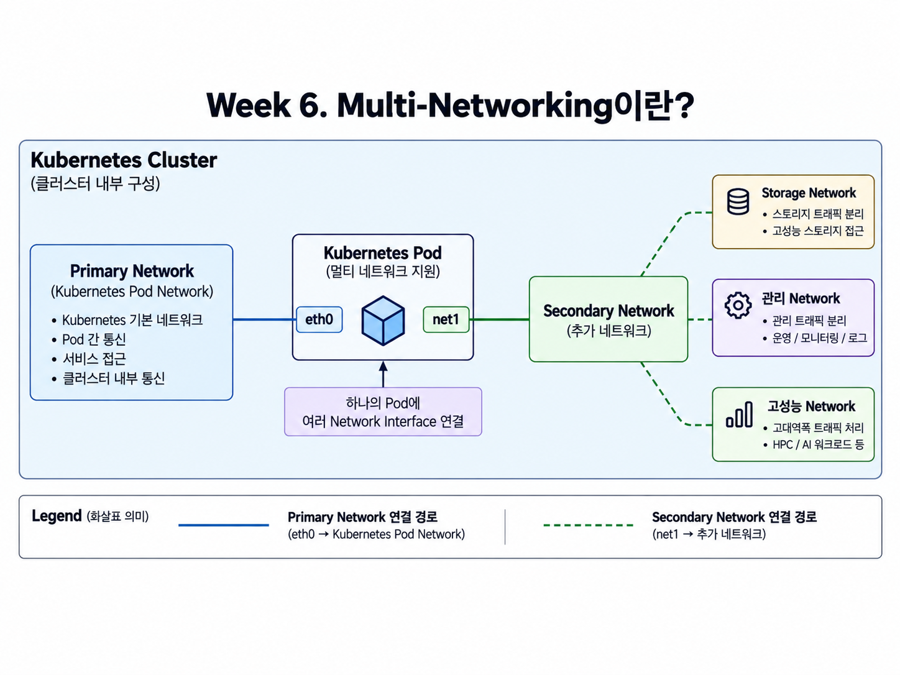
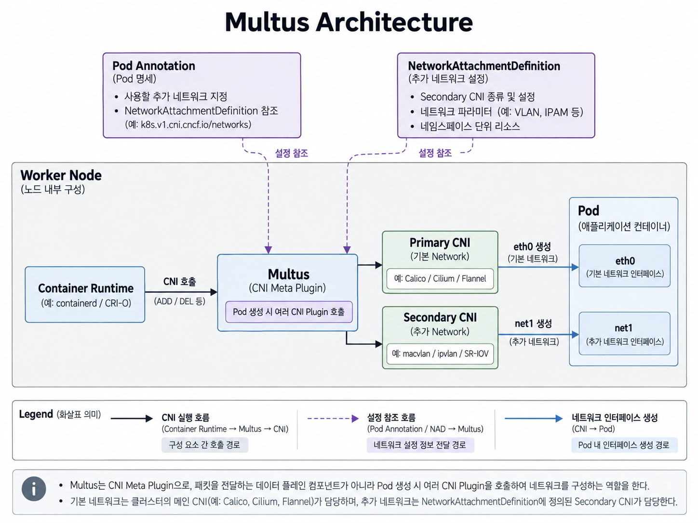
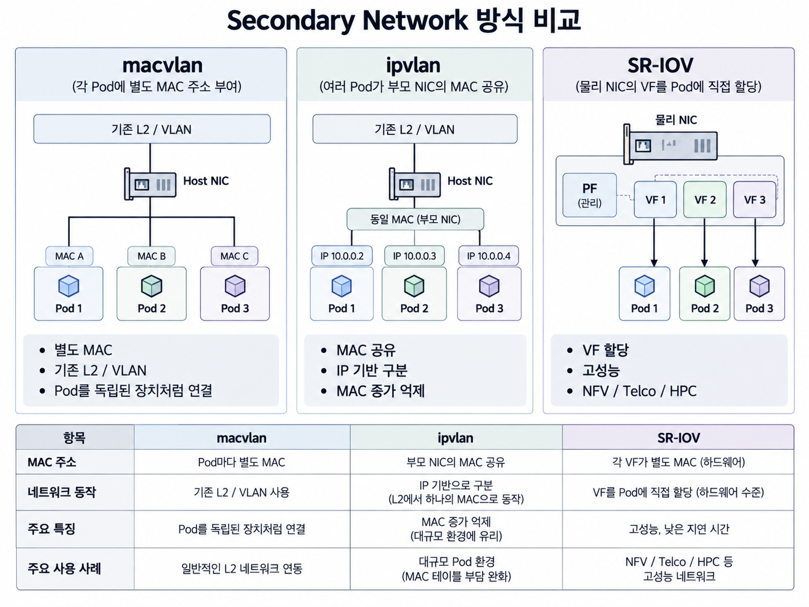
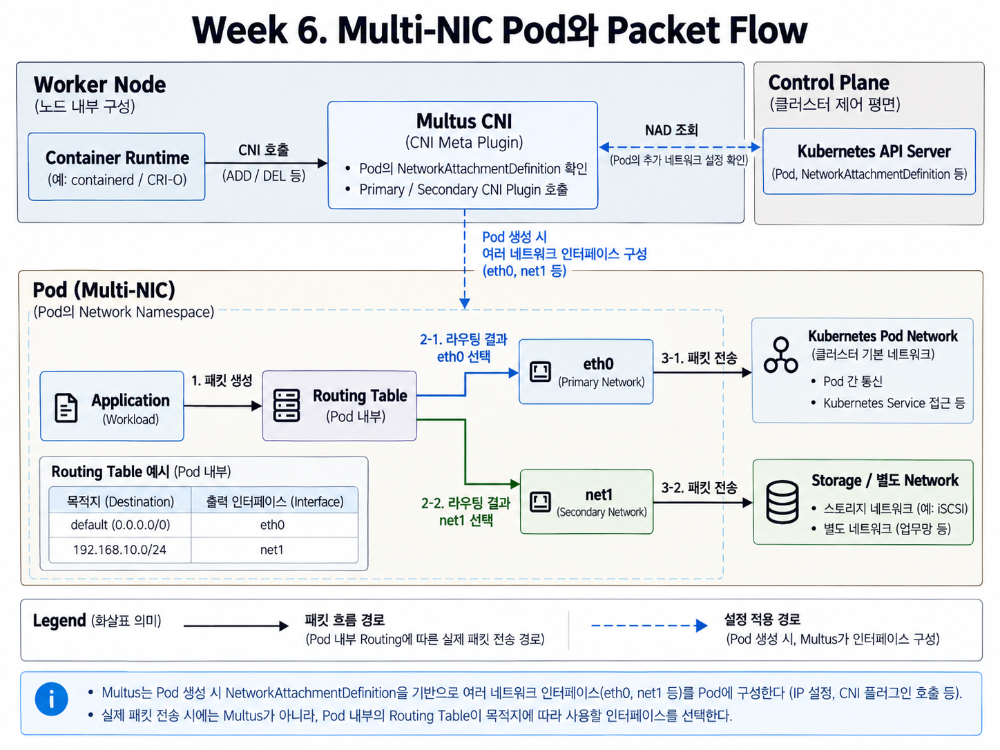

# Week 6. Multi-Networking & Secondary Networking

## 1. 이번 주 학습 목표

일반적인 Kubernetes Pod는 기본적으로 하나의 Network Interface를 이용해 Cluster Network에 연결된다.

하지만 일부 환경에서는 하나의 Pod가 Kubernetes 기본 Network뿐 아니라 별도의 Storage Network, 관리 Network, 고성능 Network 등에 동시에 연결되어야 할 수 있다.

이번 주에는 이러한 **Multi-Networking 구조**를 이해하고, Multus를 이용해 하나의 Pod에 여러 Network Interface를 구성하는 방법을 알아본다.

특히 다음 흐름을 중심으로 살펴본다.

```text
Multi-Networking이란?
        ↓
왜 여러 Network가 필요한가
        ↓
Primary / Secondary Network
        ↓
Multus로 추가 Network 구성
        ↓
macvlan / ipvlan / SR-IOV
        ↓
Secondary Network 방식 비교
        ↓
Pod의 eth0 / net1
        ↓
Routing Table을 통한 Packet 전달
```

---

## 2. Multi-Networking이란?

**Multi-Networking**은 하나의 Pod가 여러 Network Interface를 가지고 여러 Network에 연결될 수 있도록 구성하는 방식이다.

일반적인 Pod는 Kubernetes 기본 Network에 연결되는 `eth0`을 사용한다. Multi-Networking을 적용하면 `net1`, `net2`와 같은 추가 Interface를 구성할 수 있다.

예를 들어 `eth0`은 Kubernetes 기본 통신에 사용하고, `net1`은 Storage나 별도의 외부 Network에 연결하는 용도로 사용할 수 있다.



---

## 3. 멀티 네트워크가 필요한 상황

대부분의 일반적인 Application은 Kubernetes 기본 Network 하나로 충분하다.

하지만 Network의 역할을 분리하거나 특정 Network에 직접 연결해야 하는 환경에서는 여러 Network Interface가 필요할 수 있다.

### 3.1 Network 역할 분리

일반 Service Traffic과 Storage, 관리 Traffic을 서로 다른 Network로 분리할 수 있다.

예를 들어 Kubernetes 내부 통신은 `eth0`, 대용량 Storage Traffic은 `net1`을 사용하도록 구성할 수 있다.

### 3.2 별도 Network Segment 연결

Pod가 Kubernetes Network 외부의 특정 Network에 직접 연결되어야 할 수도 있다.

예를 들어 기존 사내 VLAN이나 DB Network에 Secondary Interface를 연결할 수 있다.

### 3.3 고성능 Network

NFV, Telco, HPC처럼 높은 Throughput과 낮은 Latency가 필요한 환경에서는 SR-IOV 등을 이용하여 NIC의 Network 자원을 Pod에 직접 제공할 수 있다.

---

## 4. Multi-Network는 어떻게 구성하는가

### 4.1 Primary / Secondary Network

Multi-Network 환경에서는 Pod의 Network를 크게 **Primary Network와 Secondary Network**로 구분할 수 있다.

#### Primary Network

Primary Network는 Pod가 기본적으로 사용하는 Kubernetes Network이다.

일반적으로 `eth0`에 연결되며 Pod 간 기본 통신이나 Kubernetes Service 접근 등에 사용된다.

Multus 문서에서는 이를 **Default Network**라고도 표현한다.

#### Secondary Network

Secondary Network는 Pod에 추가로 연결되는 Network이다.

일반적으로 `net1`, `net2`와 같은 추가 Interface로 구성되며 Storage, Management, VLAN, 고성능 Network 등 특정 목적에 사용할 수 있다.

하나의 Pod에 여러 Secondary Network를 연결하는 것도 가능하다.

---

### 4.2 Multus Architecture

**Multus는 하나의 Pod에 여러 Network Interface를 연결할 수 있도록 여러 CNI Plugin을 호출하는 CNI Meta Plugin**이다.

Multus 자체가 Packet을 전달하는 Network 구현체는 아니다. Pod가 생성될 때 Primary CNI와 필요한 Secondary CNI를 호출하여 Network Interface가 구성되도록 한다.

Primary Network는 기존 Cluster의 CNI가 담당할 수 있다.

- Calico
- Cilium
- Flannel

Secondary Network에는 목적에 따라 다른 CNI Plugin을 사용할 수 있다.

- macvlan
- ipvlan
- SR-IOV



핵심은 다음과 같다.

> **Multus는 여러 Network를 직접 구현하는 것이 아니라, 여러 CNI Plugin에 Network 구성을 위임하여 하나의 Pod에 여러 Interface를 구성한다.**

---

### 4.3 NetworkAttachmentDefinition

Pod에 Secondary Network를 추가하려면 **어떤 Network를 사용할 것인지 정의할 방법**이 필요하다.

Multus에서는 이를 위해 `NetworkAttachmentDefinition`을 사용한다.

NetworkAttachmentDefinition은 추가 Network에서 사용할 **CNI Plugin과 Network 설정을 정의하는 Kubernetes Resource**이다.

예를 들어 macvlan Network를 다음과 같이 정의할 수 있다.

```yaml
apiVersion: k8s.cni.cncf.io/v1
kind: NetworkAttachmentDefinition
metadata:
  name: macvlan-network
spec:
  config: '{
    "cniVersion": "1.0.0",
    "type": "macvlan",
    "master": "eth1"
  }'
```

여기서는 다음과 같은 정보를 정의한다.

```text
Network 이름
→ macvlan-network

사용 CNI
→ macvlan

기준 Host Interface
→ eth1
```

이후 Pod Annotation에서 사용할 Secondary Network를 지정한다.

```yaml
metadata:
  annotations:
    k8s.v1.cni.cncf.io/networks: macvlan-network
```

Pod가 생성되면 Multus는 Annotation에서 사용할 Network를 확인하고, 해당 NetworkAttachmentDefinition에 정의된 Secondary CNI를 호출한다.

```text
Pod Annotation
      ↓
Multus
      ↓
NetworkAttachmentDefinition
      ↓
Secondary CNI
      ↓
net1 구성
```

---

## 5. 각 네트워크 방식이 적합한 사용 사례

Secondary Network는 목적에 따라 여러 방식으로 구성할 수 있다.

이번 주에는 대표적으로 **macvlan, ipvlan, SR-IOV**를 살펴본다.

### 5.1 macvlan

macvlan은 하나의 Physical Interface를 기반으로 여러 Virtual Interface를 만들고, 각 Interface에 **별도의 MAC Address**를 사용할 수 있도록 하는 Linux Network 기능이다.

외부 Network에서는 각 Pod가 별도의 Network 장비처럼 보일 수 있다.

**적합한 환경**

- 기존 L2 Network 또는 VLAN과 직접 연결해야 하는 경우
- Pod마다 별도의 MAC Address가 필요한 경우
- 기존 L2 기반 Network Infrastructure를 활용하려는 경우

Network 장비가 많은 MAC Address를 관리해야 할 수 있으며, 일반적인 macvlan 구성에서는 Host와 macvlan Interface 사이의 직접 통신에 제약이 있을 수 있다.

---

### 5.2 ipvlan

ipvlan도 하나의 Physical Interface를 기반으로 여러 Virtual Interface를 만든다.

macvlan과의 주요 차이는 **각 Interface가 새로운 MAC Address를 사용하는 대신 Parent Interface의 MAC Address를 공유한다는 점**이다.

Traffic은 주로 IP Address를 기준으로 구분한다.

**적합한 환경**

- 많은 MAC Address를 사용하는 것이 부담되는 경우
- IP 기반으로 Pod Traffic을 구분하려는 경우
- 하나의 Physical Interface를 여러 Pod가 공유해야 하는 경우

핵심 차이는 다음과 같다.

```text
macvlan
→ Pod별 별도 MAC Address

ipvlan
→ Parent Interface의 MAC Address 공유
```

---

### 5.3 SR-IOV

**SR-IOV(Single Root I/O Virtualization)** 는 하나의 Physical NIC를 여러 Virtual Function으로 나누어 사용할 수 있도록 하는 Hardware Virtualization 기술이다.

SR-IOV에서는 Physical NIC를 관리하는 **PF(Physical Function)** 와 Pod 등에 할당할 수 있는 **VF(Virtual Function)** 를 구분한다.

SR-IOV CNI는 할당된 VF를 Pod의 Network Namespace에 연결하며, Kubernetes에서는 Device Plugin과 함께 사용 가능한 VF를 관리할 수 있다.

**적합한 환경**

- 높은 Network Throughput이 필요한 환경
- 낮은 Latency가 중요한 환경
- NFV / Telco
- HPC
- Packet 처리 성능이 중요한 Workload

NIC의 VF를 Pod에 직접 연결할 수 있어 높은 성능에 유리하지만, SR-IOV를 지원하는 NIC와 추가적인 Device 관리가 필요하다.

---

## 6. 방식 비교

macvlan, ipvlan, SR-IOV는 모두 Secondary Network를 구성하는 데 사용할 수 있지만 Network를 제공하는 방식과 적합한 환경이 다르다.



핵심 차이는 다음과 같다.

```text
macvlan
→ Pod마다 별도의 MAC을 가진 Virtual Interface

ipvlan
→ Parent MAC을 공유하고 IP를 기준으로 구분

SR-IOV
→ NIC의 Hardware VF를 Pod에 할당
```

따라서 기존 L2 Network와 자연스럽게 연결해야 한다면 macvlan, MAC Address 증가를 줄이고 싶다면 ipvlan, 높은 성능과 낮은 Latency가 중요하다면 SR-IOV가 적합할 수 있다.

---

## 7. Pod 내부에 Network Interface가 여러 개일 때의 흐름

Multus를 통해 하나의 Pod Network Namespace 안에 여러 Network Interface가 구성되었다고 가정한다.

```text
Pod Network Namespace

├─ eth0
│  IP: 10.244.1.10
│  → Kubernetes Network
│
└─ net1
   IP: 192.168.10.10
   → Secondary Network
```

여기서 중요한 점은 **Packet이 발생할 때마다 Multus가 사용할 Interface를 결정하는 것이 아니라는 점**이다.

Multus는 주로 Pod가 생성될 때 여러 CNI Plugin을 호출하여 Network Interface를 구성한다.

Network 구성이 끝난 이후 실제 Packet은 Pod의 Linux Network Stack을 통해 처리된다.

---

### 7.1 Routing Table

Pod는 하나의 Network Namespace를 가지며, 그 안에 여러 Network Interface와 Routing Table이 존재할 수 있다.

Application에서 Packet이 발생하면 Pod 내부의 Linux Routing Table이 목적지에 따라 사용할 Interface를 결정한다.

예를 들어 다음과 같은 Route가 있다고 가정한다.

```text
default
→ eth0

192.168.10.0/24
→ net1
```

일반적인 목적지는 `eth0`을 사용하고, `192.168.10.0/24` Network로 향하는 Traffic은 `net1`을 사용하게 된다.

> **Multi-NIC Pod에서도 목적지 IP와 Pod 내부 Routing Table을 기준으로 사용할 Network Interface가 결정된다.**

---

### 7.2 전체 Packet Flow



Pod의 Application에서 Packet이 발생하면 먼저 Pod 내부 Routing Table을 확인한다.

Routing 결과에 따라 `eth0` 또는 `net1` 중 하나가 선택되고, Packet은 해당 Interface가 연결된 Network로 전달된다.

예를 들어:

```text
Kubernetes 내부 통신
→ eth0
→ Kubernetes Pod Network

Storage Network 통신
→ net1
→ Storage / Secondary Network
```

따라서 여러 Interface가 있다고 해서 하나의 Packet이 여러 Interface를 순서대로 거치는 것은 아니다.

필요한 경우 Policy Routing 등을 이용해 Source IP나 다른 조건을 기준으로 Traffic 경로를 더 세밀하게 제어할 수도 있다.

---

## 8. 정리

Multi-Networking은 **하나의 Pod Network Namespace에 여러 Network Interface를 연결하여 여러 Network를 사용할 수 있도록 하는 구조**이다.

일반적으로 Primary Network는 Kubernetes의 기본 Pod Network를 담당하고, Secondary Network는 Storage, 관리, 고성능 Network와 같은 추가 목적의 Network를 담당한다.

Multus는 여러 CNI Plugin을 호출하는 **CNI Meta Plugin**이다.

```text
Container Runtime
      ↓
    Multus
   ↙      ↘
Primary   Secondary
 CNI         CNI
  ↓           ↓
eth0         net1
```

Secondary Network의 설정은 NetworkAttachmentDefinition으로 정의하고, Pod Annotation을 통해 사용할 Network를 지정할 수 있다.

Secondary Network를 구성하는 대표적인 방식은 다음과 같다.

```text
macvlan
→ 별도 MAC을 가진 Virtual Interface

ipvlan
→ Parent MAC 공유

SR-IOV
→ NIC의 VF를 Pod에 할당
```

Interface 구성이 끝난 이후 실제 Packet 전달에 Multus가 직접 참여하지 않는다.

```text
Application
     ↓
Pod Routing Table
     ↓
eth0 또는 net1 선택
     ↓
해당 Network로 Packet 전달
```

결국 이번 주의 핵심은 다음과 같이 정리할 수 있다.

> **Multus가 여러 CNI Plugin을 이용해 하나의 Pod Network Namespace에 여러 Network Interface를 구성하고, 실제 Packet은 Pod 내부 Routing Table에 따라 적절한 Interface를 통해 전달된다.**

---

## 참고 자료

- Multus CNI  
  https://github.com/k8snetworkplumbingwg/multus-cni

- SR-IOV CNI  
  https://github.com/k8snetworkplumbingwg/sriov-cni